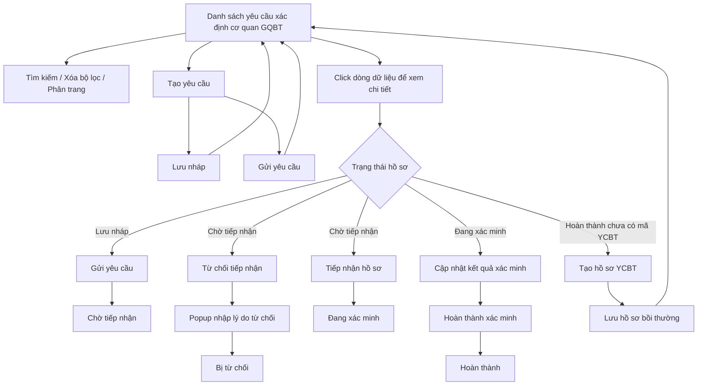

### 4.3.3. Dành cho Cán bộ nghiệp vụ bồi thường nhà nước

#### 4.3.3.1. Nhóm tính năng Xác định cơ quan giải quyết bồi thường

##### 4.3.3.1.1. Mục đích

\- Cho phép người dùng trên Website quản trị quản lý danh sách yêu cầu xác định cơ quan giải quyết bồi thường.

\- Cho phép tạo mới, lưu nháp, gửi yêu cầu, xem chi tiết, tiếp nhận, từ chối tiếp nhận, cập nhật kết quả xác định cơ quan giải quyết bồi thường.

\- Cho phép khởi tạo hồ sơ yêu cầu bồi thường liên thông từ hồ sơ xác định cơ quan đã hoàn thành và chưa có mã hồ sơ yêu cầu bồi thường.

*a. Phân quyền*

\- Cán bộ nghiệp vụ bồi thường nhà nước được giao quyền quản lý và xử lý hồ sơ yêu cầu xác định cơ quan giải quyết bồi thường.

*b. Điều kiện thực hiện*

\- Người dùng truy cập màn hình `Xác định cơ quan giải quyết bồi thường` trên Website quản trị.

\- Danh sách dữ liệu được nạp từ nguồn dữ liệu nghiệp vụ hiện hành của hệ thống.

\- Trạng thái hồ sơ sử dụng trong nhóm tính năng gồm: "Lưu nháp", "Chờ tiếp nhận", "Đang xác minh", "Bị từ chối", "Hoàn thành".

---

##### 4.3.3.1.2. Sơ đồ luồng nghiệp vụ theo giao diện

---

##### 4.3.3.1.3. MH01 - Màn hình Danh sách yêu cầu xác định cơ quan giải quyết bồi thường

###### 4.3.3.1.3.1. Màn hình

###### 4.3.3.1.3.2. Mô tả thông tin trên màn hình

| Trường thông tin | Kiểu dữ liệu | Bắt buộc | Mặc định | Mô tả |
| :--- | :--- | :--- | :--- | :--- |
| **Khối bộ lọc tìm kiếm** | String(255) | - | - | Control UI: Filter panel. - Hiển thị phía trên bảng danh sách. - Các tiêu chí có dữ liệu được kết hợp theo điều kiện AND. |
| Mã yêu cầu | String(50) | Không | Trống | Control UI: Input text. - Placeholder: `Nhập mã yêu cầu...`. - Tìm kiếm gần đúng theo mã yêu cầu xác định cơ quan, không phân biệt hoa thường, có trim khoảng trắng. |
| Mã YCBT | String(50) | Không | Trống | Control UI: Input text. - Placeholder: `Nhập mã YCBT...`. - Tìm kiếm gần đúng theo mã hồ sơ yêu cầu bồi thường đã được khởi tạo liên thông từ hồ sơ xác định cơ quan. - Nếu hồ sơ chưa có mã YCBT, dữ liệu trên lưới hiển thị `-`. |
| Tên vụ việc | String(255) | Không | Trống | Control UI: Input text. - Placeholder: `Nhập tên vụ việc...`. - Tìm kiếm gần đúng theo tên vụ việc, không phân biệt hoa thường, có trim khoảng trắng. |
| Tên người yêu cầu | String(100) | Không | Trống | Control UI: Input text. - Placeholder: `Nhập tên người yêu cầu...`. - Tìm kiếm gần đúng theo tên người yêu cầu, không phân biệt hoa thường, có trim khoảng trắng. |
| Lĩnh vực phát sinh thiệt hại | Enum(String(100)) | Không | `Tất cả lĩnh vực` | Control UI: Combobox. - Tham chiếu danh mục Lĩnh vực phát sinh thiệt hại [DM_22]. - Cho phép lọc theo một lĩnh vực cụ thể hoặc tất cả lĩnh vực. |
| Trạng thái | Enum(String(50)) | Không | `Tất cả trạng thái` | Control UI: Combobox. - Lọc theo trạng thái xử lý của hồ sơ. - Cho phép lọc theo một trạng thái cụ thể hoặc tất cả trạng thái. |
| Từ ngày | Date | Không | Ngày hiện tại trừ 03 tháng | Control UI: Datepicker. - Định dạng hiển thị `dd/mm/yyyy`. - Có icon lịch. - Lọc theo ngày tiếp nhận từ ngày. |
| Đến ngày | Date | Không | Ngày hiện tại | Control UI: Datepicker. - Định dạng hiển thị `dd/mm/yyyy`. - Có icon lịch. - Lọc theo ngày tiếp nhận đến ngày. |
| **Bảng danh sách yêu cầu xác định cơ quan giải quyết bồi thường** | Text(4000) | - | Dữ liệu sau khi lọc | Control UI: Data grid. - Cho phép click trực tiếp vào dòng dữ liệu để mở màn hình chi tiết, trừ khi click vào icon thao tác. - Trạng thái có dữ liệu: Hiển thị danh sách các bản ghi kết quả theo cấu trúc các cột quy định. - Trạng thái không có dữ liệu (Empty State): Khi không tìm thấy kết quả phù hợp với điều kiện tìm kiếm, bảng hiển thị duy nhất 01 dòng căn giữa trên toàn bộ chiều rộng bảng (`colspan`), in nghiêng với nội dung: *"Không tìm thấy dữ liệu phù hợp với điều kiện tìm kiếm."* |
| STT | Integer(10) | - | Tự tăng | Control UI: Text hiển thị (Read-only). - Căn giữa. - Hiển thị số thứ tự theo trang hiện tại. |
| Mã yêu cầu | String(50) | - | Theo dữ liệu | Control UI: Text hiển thị (Read-only). - Căn giữa. - Hiển thị mã yêu cầu xác định cơ quan giải quyết bồi thường. |
| Tên vụ việc | String(255) | - | Theo dữ liệu | Control UI: Text hiển thị (Read-only). - Hiển thị tên vụ việc đã nhập tại màn hình tạo mới/chỉnh sửa. |
| Tên người yêu cầu | String(100) | - | Theo dữ liệu | Control UI: Text hiển thị (Read-only). - Hiển thị tên người yêu cầu. - Nếu chưa có dữ liệu, để trống. |
| Số điện thoại | String(20) | - | Theo dữ liệu | Control UI: Text hiển thị (Read-only). - Căn giữa. - Nếu chưa có dữ liệu, để trống. |
| Lĩnh vực thiệt hại | Enum(String(50)) | - | Theo dữ liệu | Control UI: Text hiển thị (Read-only). - Hiển thị lĩnh vực phát sinh thiệt hại theo danh mục [DM_22]. |
| Hành vi gây thiệt hại | String(255) | - | Theo dữ liệu | Control UI: Text hiển thị (Read-only). - Hiển thị tóm tắt hành vi gây thiệt hại. - Nếu nội dung dài hơn giới hạn hiển thị của ô, hệ thống rút gọn và cho phép xem đầy đủ khi rê chuột vào nội dung. |
| Ngày tiếp nhận | Date | - | Theo dữ liệu | Control UI: Text hiển thị (Read-only). - Căn giữa. - Định dạng `dd/mm/yyyy`. |
| Mã hồ sơ YCBT | String(50) | - | Theo dữ liệu | Control UI: Text hiển thị (Read-only). - Căn giữa. - Hiển thị mã hồ sơ yêu cầu bồi thường đã khởi tạo liên thông. - Nếu chưa có mã hồ sơ YCBT, hiển thị `-`. |
| Trạng thái | Enum(String(50)) | - | Theo dữ liệu | Control UI: Badge trạng thái. - Hiển thị badge theo trạng thái hồ sơ. |
| Thao tác | String(255) | - | Theo trạng thái | Control UI: Icon button group. - Gồm các icon thao tác theo trạng thái hồ sơ: + `Tiếp nhận hồ sơ` + `Chỉnh sửa thông tin` hoặc `Cập nhật kết quả xác minh` + `Tạo yêu cầu bồi thường` + `Xóa yêu cầu` |
| Số dòng hiển thị | Enum(String(50)) | Không | `10` | Control UI: Dropdown. - Cho phép chọn số bản ghi hiển thị trên một trang. - Giá trị gồm `10`, `30`, `50`. |
| Thông tin số lượng bản ghi | String(255) | - | Theo dữ liệu | Control UI: Text hiển thị (Read-only). - Hiển thị khoảng bản ghi đang xem và tổng số bản ghi theo kết quả lọc hiện tại. - Khi không có dữ liệu, hiển thị tổng số bản ghi bằng 0. |
| Thanh phân trang | String(255) | - | Trang 1 | Control UI: Pagination. - Hiển thị các nút điều hướng trang đầu, trang trước, số trang, trang sau và trang cuối. - Các nút không còn trang tương ứng ở trạng thái không khả dụng. |

###### 4.3.3.1.3.3. Chức năng trên màn hình

| STT | Tên chức năng | Định dạng | Mô tả |
| :--- | :--- | :--- | :--- |
| 1 | Tìm kiếm | Button | Khi người dùng click nút, hệ thống kiểm tra dữ liệu và xử lý theo các trường hợp bên dưới. |
|  |  |  | **TH1 - Có dữ liệu phù hợp**: Hệ thống lọc danh sách theo `Mã yêu cầu`, `Mã YCBT`, `Tên vụ việc`, `Tên người yêu cầu`, `Lĩnh vực phát sinh thiệt hại`, `Trạng thái`, `Từ ngày`, `Đến ngày`; kết quả lọc được hiển thị lên bảng danh sách và đưa về trang 1. |
|  |  |  | **TH2 - Không có dữ liệu trả về**: Bảng kết quả hiển thị dòng thông báo rỗng *"Không tìm thấy dữ liệu phù hợp với điều kiện tìm kiếm."* ở giữa bảng; thanh phân trang hiển thị *"Hiển thị 0-0 của 0 bản ghi"* và các nút điều hướng trang ở trạng thái không khả dụng; nếu màn hình có nút `Kết xuất Excel` thì nút ở trạng thái khóa mờ kèm tooltip `Không có dữ liệu để kết xuất Excel`. |
| 2 | Xóa bộ lọc | Button | Hệ thống xóa `Mã yêu cầu`, `Mã YCBT`, `Tên vụ việc`, `Tên người yêu cầu`, `Lĩnh vực phát sinh thiệt hại`, `Trạng thái`; đặt lại `Từ ngày` là ngày hiện tại trừ 03 tháng và `Đến ngày` là ngày hiện tại; tải lại danh sách theo bộ lọc mặc định. |
| 3 | Tạo yêu cầu | Button | Hệ thống mở màn hình **MH02 - Thêm mới/Chỉnh sửa yêu cầu xác định cơ quan giải quyết bồi thường** ở chế độ thêm mới. |
| 4 | Click dòng dữ liệu | Row click | Khi người dùng click vào dòng dữ liệu, hệ thống xử lý theo các trường hợp bên dưới. |
|  |  |  | **TH1 - Click vào dòng dữ liệu**: Hệ thống mở màn hình **MH04 - Chi tiết yêu cầu xác định cơ quan giải quyết bồi thường** của bản ghi được chọn. |
|  |  |  | **TH2 - Click vào icon thao tác trong cột Thao tác**: Không thực hiện row click; thực hiện đúng chức năng của icon được click. |
| 5 | Tiếp nhận hồ sơ | Icon button | Hệ thống cập nhật trạng thái hồ sơ sang "Đang xác minh", hiển thị thông báo thành công [MSG-SUC-BTNN-XDCQ-001]. |
| 6 | Chỉnh sửa thông tin | Icon button | Hệ thống mở màn hình **MH02 - Thêm mới/Chỉnh sửa yêu cầu xác định cơ quan giải quyết bồi thường** ở chế độ chỉnh sửa và tự động điền dữ liệu của bản ghi. |
| 7 | Cập nhật kết quả xác minh | Icon button | Hệ thống mở màn hình **MH03 - Cập nhật kết quả xác định cơ quan giải quyết bồi thường**. |
| 8 | Tạo yêu cầu bồi thường | Icon button | Hệ thống mở màn hình **MH05 - Khởi tạo hồ sơ yêu cầu bồi thường liên thông**. |
| 9 | Xóa yêu cầu | Icon button | Khi người dùng click icon, hệ thống xử lý theo các trường hợp bên dưới. |
|  |  |  | **TH1 - Người dùng xác nhận xóa**: Hệ thống mở popup xác nhận [MSG-CFM-BTNN-XDCQ-001]. Nếu người dùng chọn `Đồng ý`, hệ thống xóa bản ghi khỏi danh sách và hiển thị thông báo thành công [MSG-SUC-BTNN-XDCQ-003]. |
|  |  |  | **TH2 - Người dùng hủy thao tác**: Hệ thống đóng popup, không xóa bản ghi. |
| 10 | Số dòng hiển thị | Dropdown | Khi người dùng chọn `10`, `30` hoặc `50`, hệ thống cập nhật số bản ghi hiển thị trên mỗi trang và render lại bảng danh sách. |
| 11 | Phân trang | Pagination | Cho phép chuyển về trang đầu `<<`, trang trước `<`, chọn số trang, trang sau `>`, trang cuối `>>`. Nút phân trang không khả dụng khi không còn trang tương ứng. |

---

##### 4.3.3.1.4. MH02 - Màn hình Thêm mới/Chỉnh sửa yêu cầu xác định cơ quan giải quyết bồi thường

###### 4.3.3.1.4.1. Màn hình

###### 4.3.3.1.4.2. Mô tả thông tin trên màn hình

| Trường thông tin | Kiểu dữ liệu | Bắt buộc | Mặc định | Mô tả |
| :--- | :--- | :--- | :--- | :--- |
| Tiêu đề màn hình | String(255) | - | Theo ngữ cảnh | Control UI: Text heading (Read-only). - Khi thêm mới hiển thị `THÊM MỚI YÊU CẦU XÁC ĐỊNH CƠ QUAN GIẢI QUYẾT BỒI THƯỜNG`. - Khi chỉnh sửa hiển thị `CHỈNH SỬA YÊU CẦU XÁC ĐỊNH CƠ QUAN GIẢI QUYẾT BỒI THƯỜNG`. |
| **I. THÔNG TIN CHUNG** | String(255) | - | - | Control UI: Section header. - Khối thông tin chung của yêu cầu. |
| Hình thức tiếp nhận hồ sơ | Enum(String(50)) | Có | `Trực tiếp` | Control UI: Combobox. - Cho phép chọn hình thức tiếp nhận hồ sơ yêu cầu xác định cơ quan giải quyết bồi thường. |
| Lĩnh vực phát sinh thiệt hại | Enum(String(100)) | Có | `TRONG HOẠT ĐỘNG QUẢN LÝ HÀNH CHÍNH` | Control UI: Combobox. - Tham chiếu danh mục Lĩnh vực phát sinh thiệt hại [DM_22]. |
| Tên vụ việc | String(255) | Có | Trống | Control UI: Input text. - Placeholder: `Nhập tên/tóm tắt vụ việc...`. - Nhập tên/tóm tắt vụ việc để phục vụ tìm kiếm, nhận diện nhanh và liên thông sang hồ sơ YCBT. - Áp dụng [BR-VAL-001] khi người dùng gửi yêu cầu. |
| **II. THÔNG TIN CHI TIẾT NGƯỜI YÊU CẦU BỒI THƯỜNG** | String(100) | - | - | Control UI: Section header. - Khối thông tin người yêu cầu bồi thường. |
| Họ và tên người yêu cầu bồi thường | String(100) | Có | Trống | Control UI: Input text. - Placeholder: `Nhập họ và tên...`. - Nhập họ tên đầy đủ của người yêu cầu bồi thường. |
| Tư cách người yêu cầu bồi thường | Enum(String(50)) | Có | `Người bị thiệt hại` | Control UI: Combobox. - Tham chiếu Danh mục tư cách người yêu cầu bồi thường [DM_25]. - Cho phép chọn tư cách pháp lý của người yêu cầu trong hồ sơ. |
| Giới tính | Enum(String(50)) | Có | `Nam` | Control UI: Combobox. - Tham chiếu danh mục Giới tính [DM_23]. |
| Ngày tháng năm sinh | Date | Có | Trống | Control UI: Datepicker. - Placeholder: `dd/mm/yyyy`. - Có icon lịch. |
| Số điện thoại liên hệ | String(20) | Có | Trống | Control UI: Input text. - Placeholder: `Nhập số điện thoại...`. - Nhập số điện thoại liên hệ của người yêu cầu. |
| Địa chỉ Email | String(255) | Tùy điều kiện | Trống | Control UI: Input text. - Placeholder: `Nhập email...`. - Email bắt buộc khi chọn `Hình thức nhận kết quả giải quyết` là `Phương thức điện tử`. |
| Loại giấy tờ thân nhân | Enum(String(50)) | Có | `CCCD` | Control UI: Combobox. - Tham chiếu danh mục loại giấy tờ pháp lý [DM_10]. |
| Số giấy tờ thân nhân | String(50) | Có | Trống | Control UI: Input text. - Placeholder: `Nhập số giấy tờ...`. - Nhập số giấy tờ chứng minh tư cách pháp lý của người yêu cầu. |
| Ngày cấp | Date | Có | Trống | Control UI: Datepicker. - Placeholder: `dd/mm/yyyy`. - Có icon lịch. |
| Nơi cấp | String(255) | Có | Trống | Control UI: Input text. - Placeholder: `Nhập nơi cấp...`. - Nhập nơi cấp giấy tờ thân nhân. |
| Quốc gia | Enum(String(50)) | Có | `Việt Nam` | Control UI: Combobox. - Tham chiếu danh mục Quốc tịch/Quốc gia [DM_09]. |
| Tỉnh / Thành phố | String(100) | Có | Theo Quốc gia | Control UI: Combobox/Input text. - Tham chiếu danh mục Tỉnh/Thành phố [DM_13] khi `Quốc gia` là `Việt Nam`. - Nếu `Quốc gia` khác `Việt Nam`, hiển thị ô nhập văn bản để nhập tỉnh/thành phố nước ngoài. |
| Địa chỉ chi tiết | String(500) | Không | Trống | Control UI: Textarea. - Placeholder: `Nhập số nhà, tên đường, thôn/xóm/tổ dân phố...`. - Nhập địa chỉ chi tiết của người yêu cầu. |
| **III. HÀNH VI GÂY THIỆT HẠI & PHƯƠNG THỨC NHẬN KẾT QUẢ** | Text(2000) | - | - | Control UI: Section header. - Khối thông tin hành vi và cách nhận kết quả. |
| Hành vi gây thiệt hại của người thi hành công vụ gây thiệt hại | Text(2000) | Có | Trống | Control UI: Textarea. - Placeholder: `Nhập tóm tắt hành vi gây thiệt hại và cơ quan gây thiệt hại...`. - Nhập nội dung hành vi bị phản ánh gây thiệt hại. |
| Hình thức nhận kết quả giải quyết | Enum(String(50)) | Có | `Phương thức điện tử` | Control UI: Combobox. - Cho phép chọn hình thức nhận kết quả giải quyết. - Khi chọn `Phương thức điện tử`, trường `Địa chỉ Email` là bắt buộc. |
| Tài liệu đính kèm (Đơn đề nghị xác định cơ quan và chứng minh nhân thân) | File | Không | Trống | Control UI: File upload. - Cho phép đính kèm đơn đề nghị xác định cơ quan và tài liệu chứng minh nhân thân. - Sau khi đính kèm, hiển thị tên file đã chọn. - Chi tiết nghiệp vụ nút thao tác tệp đính kèm xem tại bảng Chức năng trên màn hình. |

###### 4.3.3.1.4.3. Chức năng trên màn hình

| STT | Tên chức năng | Định dạng | Mô tả |
| :--- | :--- | :--- | :--- |
| 1 | Hủy bỏ | Button | Hệ thống đóng màn hình thêm mới/chỉnh sửa và quay về màn hình **MH01 - Danh sách yêu cầu xác định cơ quan giải quyết bồi thường**. |
| 2 | Lưu nháp | Button | Khi người dùng click nút, hệ thống xử lý theo các trường hợp bên dưới. |
|  |  |  | **TH1 - Thêm mới**: Hệ thống sinh mã yêu cầu, ghi nhận ngày hiện tại, trạng thái "Lưu nháp", lưu dữ liệu đã nhập và hiển thị thông báo thành công [MSG-SUC-BTNN-XDCQ-006]. |
|  |  |  | **TH2 - Chỉnh sửa**: Hệ thống cập nhật dữ liệu bản ghi hiện tại, **giữ nguyên trạng thái hiện tại của bản ghi** và hiển thị thông báo thành công [MSG-SUC-BTNN-XDCQ-008]. |
| 3 | Gửi yêu cầu | Button | Khi người dùng click nút, hệ thống kiểm tra dữ liệu và xử lý theo các trường hợp bên dưới. |
|  |  |  | **TH1 - Bỏ trống trường bắt buộc**: Nếu bỏ trống một trong các trường bắt buộc gồm `Tên vụ việc`, `Họ và tên`, `Ngày tháng năm sinh`, `Số giấy tờ thân nhân`, `Ngày cấp`, `Nơi cấp`, `Số điện thoại liên hệ`, `Hành vi gây thiệt hại...`, hoặc `Địa chỉ Email` khi `Hình thức nhận kết quả giải quyết` là `Phương thức điện tử`, vi phạm [BR-VAL-001], hệ thống tô viền đỏ ô trống đầu tiên, hiển thị [MSG-ERR-VAL-001] và focus vào ô lỗi đầu tiên. Không cho phép gửi yêu cầu. |
|  |  |  | **TH2 - Hợp lệ, thêm mới**: Hệ thống sinh mã yêu cầu, ghi nhận ngày hiện tại, trạng thái "Chờ tiếp nhận", lưu dữ liệu và hiển thị thông báo thành công [MSG-SUC-BTNN-XDCQ-007]. |
|  |  |  | **TH3 - Hợp lệ, chỉnh sửa**: Hệ thống cập nhật dữ liệu bản ghi, chuyển trạng thái sang "Chờ tiếp nhận" và hiển thị thông báo thành công [MSG-SUC-BTNN-XDCQ-009]. |
| 4 | Chọn tệp đính kèm + | File trigger | Hệ thống mở trình chọn file cho trường tương ứng. Sau khi chọn file, hệ thống hiển thị tên file đã chọn. |
| 5 | Xem file | Link | Cho phép xem file tại một tab riêng. |
| 6 | Xóa | Link | Khi người dùng click link, hệ thống xử lý theo các trường hợp bên dưới. |
|  |  |  | **TH1 - Người dùng xác nhận xóa file**: Hệ thống mở popup xác nhận [MSG-CFM-BTNN-XDCQ-002]. Nếu người dùng chọn `Đồng ý`, hệ thống gỡ file và hiển thị thông báo thành công [MSG-SUC-BTNN-XDCQ-005]. |
|  |  |  | **TH2 - Người dùng hủy thao tác**: Hệ thống đóng popup xác nhận, giữ nguyên file đính kèm. |

---

##### 4.3.3.1.5. MH03 - Màn hình Cập nhật kết quả xác định cơ quan giải quyết bồi thường

###### 4.3.3.1.5.1. Màn hình

###### 4.3.3.1.5.2. Mô tả thông tin trên màn hình

| Trường thông tin | Kiểu dữ liệu | Bắt buộc | Mặc định | Mô tả |
| :--- | :--- | :--- | :--- | :--- |
| Tiêu đề màn hình | String(255) | - | - | Control UI: Text heading (Read-only). - Hiển thị `CẬP NHẬT KẾT QUẢ XÁC ĐỊNH CƠ QUAN GIẢI QUYẾT BỒI THƯỜNG`. |
| **Tóm tắt hồ sơ yêu cầu xác định** | String(255) | - | Theo hồ sơ | Control UI: Summary section. - Hiển thị thông tin tóm tắt của hồ sơ đang xử lý. |
| Mã yêu cầu | String(50) | - | Theo hồ sơ | Control UI: Text hiển thị (Read-only). - Hiển thị mã yêu cầu trong khối tóm tắt. |
| Tên vụ việc | String(255) | - | Theo hồ sơ | Control UI: Text hiển thị (Read-only). - Hiển thị tên vụ việc trong khối tóm tắt. - Với dữ liệu cũ chưa có trường riêng, hệ thống hiển thị theo quy tắc `Vụ việc yêu cầu bồi thường của [Tên người yêu cầu]`. |
| Họ tên người yêu cầu | String(100) | - | Theo hồ sơ | Control UI: Text hiển thị (Read-only). - Hiển thị họ tên người yêu cầu trong khối tóm tắt. |
| Lĩnh vực phát sinh thiệt hại | Enum(String(50)) | - | Theo hồ sơ | Control UI: Text hiển thị (Read-only). - Hiển thị lĩnh vực phát sinh thiệt hại trong khối tóm tắt theo danh mục [DM_22]. |
| Số điện thoại | String(20) | - | Theo hồ sơ | Control UI: Text hiển thị (Read-only). - Hiển thị số điện thoại liên hệ trong khối tóm tắt. |
| Hành vi gây thiệt hại | String(255) | - | Theo hồ sơ | Control UI: Text hiển thị (Read-only). - Hiển thị tóm tắt hành vi gây thiệt hại trong khối tóm tắt. |
| **NỘI DUNG XÁC ĐỊNH THẨM QUYỀN (ĐIỀU 40 LUẬT TNBTCNN)** | Text(2000) | - | - | Control UI: Section header. - Khối nhập kết quả xác định thẩm quyền. |
| Căn cứ pháp lý xác định thẩm quyền | Text(2000) | Có | Trống | Control UI: Textarea. - Placeholder: `Nhập căn cứ pháp lý xác định thẩm quyền...`. - Nhập căn cứ pháp lý làm cơ sở xác định cơ quan có thẩm quyền giải quyết bồi thường. |
| Chỉ định Cơ quan có thẩm quyền giải quyết bồi thường | Enum(String(255)) | Có | Trống | Control UI: Combobox có tìm kiếm. - Cho phép tìm kiếm theo Mã đơn vị hoặc Tên đơn vị trong Danh sách đơn vị trên hệ thống. - Người dùng chọn một cơ quan có thẩm quyền giải quyết bồi thường từ kết quả tìm kiếm. |
| Nhận định lý do xác định chi tiết | Text(2000) | Có | Theo hồ sơ nếu có | Control UI: Textarea. - Placeholder: `Nhập lập luận, phân tích lý do chỉ định cơ quan giải quyết này dựa trên hồ sơ xác minh...`. - Nhập nhận định, phân tích và lý do chỉ định cơ quan giải quyết bồi thường. |
| Tải lên file scan quyết định xác định cơ quan giải quyết bồi thường | File | Không | Trống | Control UI: File upload. - Cho phép đính kèm file scan quyết định xác định cơ quan giải quyết bồi thường. - Sau khi đính kèm, hiển thị tên file đã chọn. - Chi tiết nghiệp vụ nút thao tác tệp đính kèm xem tại bảng Chức năng trên màn hình. |

###### 4.3.3.1.5.3. Chức năng trên màn hình

| STT | Tên chức năng | Định dạng | Mô tả |
| :--- | :--- | :--- | :--- |
| 1 | Hủy bỏ | Button | Hệ thống đóng màn hình cập nhật kết quả xác minh và quay về màn hình **MH01 - Danh sách yêu cầu xác định cơ quan giải quyết bồi thường**. |
| 2 | Hoàn thành xác minh | Button | Khi người dùng click nút, hệ thống kiểm tra dữ liệu và xử lý theo các trường hợp bên dưới. |
|  |  |  | **TH1 - Bỏ trống trường bắt buộc**: Nếu bỏ trống các trường bắt buộc vi phạm [BR-VAL-001], hệ thống hiển thị [MSG-ERR-VAL-001]. Không cho phép hoàn thành xác minh. |
|  |  |  | **TH Hợp lệ**: Hệ thống lưu `Căn cứ pháp lý xác định thẩm quyền`, `Chỉ định Cơ quan có thẩm quyền giải quyết bồi thường`, `Nhận định lý do xác định chi tiết` và file quyết định nếu có; chuyển trạng thái hồ sơ sang "Hoàn thành"; hiển thị thông báo thành công [MSG-SUC-BTNN-XDCQ-010]; mở màn hình **MH04 - Chi tiết yêu cầu xác định cơ quan giải quyết bồi thường**. |
| 3 | Chọn tệp đính kèm + | File trigger | Hệ thống mở trình chọn file. Sau khi chọn file, hệ thống hiển thị tên file đã chọn. |
| 4 | Xem file | Link | Cho phép xem file tại một tab riêng. |
| 5 | Xóa | Link | Khi người dùng click link, hệ thống xử lý theo các trường hợp bên dưới. |
|  |  |  | **TH1 - Người dùng xác nhận xóa file**: Hệ thống mở popup xác nhận [MSG-CFM-BTNN-XDCQ-002]. Nếu người dùng chọn `Đồng ý`, hệ thống gỡ file và hiển thị thông báo thành công [MSG-SUC-BTNN-XDCQ-005]. |
|  |  |  | **TH2 - Người dùng hủy thao tác**: Hệ thống đóng popup xác nhận, giữ nguyên file đính kèm. |

---

##### 4.3.3.1.6. MH04 - Màn hình Chi tiết yêu cầu xác định cơ quan giải quyết bồi thường

###### 4.3.3.1.6.1. Màn hình

###### 4.3.3.1.6.2. Mô tả thông tin trên màn hình

| Trường thông tin | Kiểu dữ liệu | Bắt buộc | Mặc định | Mô tả |
| :--- | :--- | :--- | :--- | :--- |
| Tiêu đề màn hình | String(255) | - | - | Control UI: Text heading (Read-only). - Hiển thị `CHI TIẾT YÊU CẦU XÁC ĐỊNH CƠ QUAN GIẢI QUYẾT BỒI THƯỜNG`. |
| **THÔNG TIN TỪ CHỐI TIẾP NHẬN** | String(255) | - | Ẩn | Control UI: Section header. - Chỉ hiển thị khi trạng thái hồ sơ là "Bị từ chối". |
| Lý do bị từ chối | Text(2000) | - | Theo hồ sơ | Control UI: Text hiển thị (Read-only). - Hiển thị lý do từ chối tiếp nhận đã lưu trong hồ sơ. - Nếu không có lý do, hiển thị `Không có lý do.` |
| Văn bản đính kèm | File | - | Theo hồ sơ | Control UI: File link (Read-only). - Nếu có văn bản đính kèm, hiển thị tên file và link `Xem file`. - Nếu không có file, hiển thị `Không có tệp đính kèm`. |
| **I. THÔNG TIN TIẾP NHẬN HỒ SƠ** | String(255) | - | - | Control UI: Section header. - Khối thông tin tiếp nhận hồ sơ. |
| Mã yêu cầu | String(50) | - | Theo hồ sơ | Control UI: Text hiển thị (Read-only). - Hiển thị mã yêu cầu xác định cơ quan giải quyết bồi thường. |
| Tên vụ việc | String(255) | - | Theo hồ sơ | Control UI: Text hiển thị (Read-only). - Hiển thị tên vụ việc. - Với dữ liệu cũ chưa có trường riêng, hệ thống hiển thị theo quy tắc `Vụ việc yêu cầu bồi thường của [Tên người yêu cầu]`. |
| Trạng thái xử lý | Enum(String(50)) | - | Theo hồ sơ | Control UI: Badge trạng thái. - Hiển thị trạng thái hiện tại của hồ sơ. |
| Hình thức tiếp nhận | Enum(String(50)) | - | Theo hồ sơ | Control UI: Text hiển thị (Read-only). - Hiển thị hình thức tiếp nhận hồ sơ. |
| Lĩnh vực phát sinh thiệt hại | Enum(String(50)) | - | Theo hồ sơ | Control UI: Text hiển thị (Read-only). - Hiển thị lĩnh vực phát sinh thiệt hại theo danh mục [DM_22]. |
| **II. THÔNG TIN CHI TIẾT NGƯỜI YÊU CẦU BỒI THƯỜNG** | String(100) | - | - | Control UI: Section header. - Khối thông tin người yêu cầu bồi thường. |
| Họ và tên người yêu cầu | String(100) | - | Theo hồ sơ | Control UI: Text hiển thị (Read-only). - Hiển thị họ và tên người yêu cầu bồi thường. |
| Tư cách người yêu cầu | String(100) | - | Theo hồ sơ | Control UI: Text hiển thị (Read-only). - Hiển thị tư cách người yêu cầu. |
| Giới tính / Ngày sinh | Date | - | Theo hồ sơ | Control UI: Text hiển thị (Read-only). - Hiển thị theo dạng `[Giới tính] / [Ngày sinh]`. - Giới tính Tham chiếu Danh mục Giới tính [DM_23]. |
| Giấy tờ thân nhân | String(255) | - | Theo hồ sơ | Control UI: Text hiển thị (Read-only). - Hiển thị theo dạng `[Loại giấy tờ] - Số: [Số giấy tờ] (Cấp ngày: [Ngày cấp] tại [Nơi cấp])`. - Loại giấy tờ tham chiếu danh mục loại giấy tờ pháp lý [DM_10]. |
| Số điện thoại liên hệ | String(20) | - | Theo hồ sơ | Control UI: Text hiển thị (Read-only). - Hiển thị số điện thoại liên hệ. |
| Địa chỉ Email | String(255) | - | Theo hồ sơ | Control UI: Text hiển thị (Read-only). - Hiển thị địa chỉ email của người yêu cầu. - Nếu không có dữ liệu, hiển thị `Chưa cung cấp`. |
| Địa chỉ cư trú / liên hệ | String(500) | - | Theo hồ sơ | Control UI: Text hiển thị (Read-only). - Hiển thị theo dạng `[Địa chỉ chi tiết], [Tỉnh/Thành phố], [Quốc gia]`. |
| Đính kèm đơn đề nghị ban đầu | File | - | Theo hồ sơ | Control UI: File link (Read-only). - Nếu có file, hiển thị tên file và link `Xem file`. - Nếu không có file, hiển thị `Không có file đính kèm`. |
| **III. HÀNH VI GÂY THIỆT HẠI & PHƯƠNG THỨC NHẬN KẾT QUẢ** | Text(2000) | - | - | Control UI: Section header. - Khối hành vi và phương thức nhận kết quả. |
| Hành vi gây thiệt hại của công chức | String(255) | - | Theo hồ sơ | Control UI: Text hiển thị (Read-only). - Hiển thị nội dung hành vi gây thiệt hại. |
| Phương thức nhận kết quả | Text(2000) | - | Theo hồ sơ | Control UI: Text hiển thị (Read-only). - Hiển thị phương thức nhận kết quả. |
| **IV. KẾT QUẢ XÁC ĐỊNH CƠ QUAN GIẢI QUYẾT BỒI THƯỜNG** | String(255) | - | Ẩn | Control UI: Section header. - Chỉ hiển thị khi hồ sơ có thông tin kết quả xác định cơ quan giải quyết bồi thường. |
| Căn cứ pháp lý xác định | Text(2000) | - | Theo hồ sơ | Control UI: Text hiển thị (Read-only). - Hiển thị căn cứ pháp lý xác định thẩm quyền đã lưu trong hồ sơ. - Nếu trạng thái "Đang xác minh" nhưng chưa có căn cứ, hiển thị `Đang xác minh, chưa có căn cứ`. |
| Cơ quan được chỉ định giải quyết | String(255) | - | Theo hồ sơ | Control UI: Text hiển thị (Read-only). - Hiển thị cơ quan được chỉ định giải quyết bồi thường. - Nếu trạng thái "Đang xác minh" nhưng chưa có cơ quan, hiển thị `Đang tiến hành chỉ định`. |
| Nhận định lý do chi tiết | Text(2000) | - | Theo hồ sơ | Control UI: Text hiển thị (Read-only). - Hiển thị nhận định lý do xác định cơ quan giải quyết bồi thường. - Nếu trạng thái "Đang xác minh" nhưng chưa có nhận định, hiển thị `Đang cập nhật báo cáo kết luận...`. |
| Quyết định chuyển giao đính kèm | File | - | Theo hồ sơ | Control UI: File link (Read-only). - Nếu có file, hiển thị tên file và link `Xem file`. - Nếu chưa có file, hiển thị `Chưa đính kèm quyết định`. |
| Mã hồ sơ yêu cầu bồi thường | String(50) | - | Ẩn | Control UI: Text hiển thị (Read-only). - Chỉ hiển thị khi hồ sơ "Hoàn thành" và đã phát sinh mã hồ sơ YCBT liên thông. |

###### 4.3.3.1.6.3. Chức năng trên màn hình

| STT | Tên chức năng | Định dạng | Mô tả |
| :--- | :--- | :--- | :--- |
| 1 | Đóng | Button | Hệ thống đóng màn hình chi tiết và quay về màn hình **MH01 - Danh sách yêu cầu xác định cơ quan giải quyết bồi thường**. |
| 2 | Từ chối tiếp nhận | Button | Chỉ hiển thị khi trạng thái "Chờ tiếp nhận". Khi click, hệ thống mở **Popup Từ chối tiếp nhận hồ sơ**. |
| 3 | Tiếp nhận hồ sơ | Button | Chỉ hiển thị khi trạng thái "Chờ tiếp nhận". Khi click, hệ thống cập nhật trạng thái sang "Đang xác minh", hiển thị thông báo thành công [MSG-SUC-BTNN-XDCQ-001] và refresh lại màn hình chi tiết. |
| 4 | Cập nhật kết quả xác minh | Button | Chỉ hiển thị khi trạng thái "Đang xác minh". Khi click, hệ thống mở màn hình **MH03 - Cập nhật kết quả xác định cơ quan giải quyết bồi thường**. |
| 5 | Tạo hồ sơ YCBT | Button | Hệ thống mở màn hình **MH05 - Khởi tạo hồ sơ yêu cầu bồi thường liên thông**. |
| 6 | Gửi yêu cầu | Button | Chỉ hiển thị khi trạng thái "Lưu nháp". Khi click, hệ thống chuyển trạng thái sang "Chờ tiếp nhận", hiển thị thông báo thành công [MSG-SUC-BTNN-XDCQ-002] và refresh lại màn hình chi tiết. |
| 7 | Xem file | Link | Cho phép xem file tại một tab riêng. |

---

##### 4.3.3.1.7. MH05 - Màn hình Khởi tạo hồ sơ yêu cầu bồi thường liên thông

###### 4.3.3.1.7.1. Màn hình

###### 4.3.3.1.7.2. Mô tả thông tin trên màn hình

| Trường thông tin | Kiểu dữ liệu | Bắt buộc | Mặc định | Mô tả |
| :--- | :--- | :--- | :--- | :--- |
| Tiêu đề màn hình | String(255) | - | - | Control UI: Text heading (Read-only). - Hiển thị `KHỞI TẠO HỒ SƠ YÊU CẦU BỒI THƯỜNG LIÊN THÔNG`. |
| Khối thông báo liên thông dữ liệu | String(255) | - | Hiển thị | Control UI: Alert/Info banner. - Nội dung tham chiếu [MSG-INF-BTNN-XDCQ-002]. |
| **I. ĐƠN VỊ THỤ LÝ VÀ THÔNG TIN CHI TIẾT NGƯỜI YÊU CẦU** | String(100) | - | - | Control UI: Section header. - Khối thông tin kế thừa từ hồ sơ xác định cơ quan. |
| Đơn vị thụ lý giải quyết bồi thường (được xác định) | String(255) | - | Theo hồ sơ | Control UI: Text hiển thị (Read-only). - Hiển thị cơ quan có thẩm quyền giải quyết bồi thường đã được xác định. - Nếu chưa xác định, hiển thị `Chưa xác định`. |
| Tên người yêu cầu bồi thường | String(100) | - | Theo hồ sơ | Control UI: Text hiển thị (Read-only). - Kế thừa từ hồ sơ xác định cơ quan. |
| Tư cách người yêu cầu | String(100) | - | Theo hồ sơ | Control UI: Text hiển thị (Read-only). - Kế thừa từ hồ sơ xác định cơ quan. |
| Số điện thoại | String(20) | - | Theo hồ sơ | Control UI: Text hiển thị (Read-only). - Kế thừa từ hồ sơ xác định cơ quan. |
| Email | String(255) | - | Theo hồ sơ | Control UI: Text hiển thị (Read-only). - Hiển thị email kế thừa từ hồ sơ xác định cơ quan. - Nếu không có email, để trống. |
| Địa chỉ liên hệ | String(500) | - | Theo hồ sơ | Control UI: Text hiển thị (Read-only). - Hiển thị theo dạng `[Địa chỉ chi tiết], [Tỉnh/Thành phố], [Quốc gia]`. |
| **II. NỘI DUNG YÊU CẦU BỒI THƯỜNG** | Text(2000) | - | - | Control UI: Section header. - Khối nội dung yêu cầu bồi thường. |
| Văn bản căn cứ yêu cầu bồi thường | Text(2000) | - | Theo hồ sơ | Control UI: Text hiển thị (Read-only). - Hiển thị thông tin văn bản căn cứ được kế thừa từ hồ sơ xác định cơ quan giải quyết bồi thường. - Nếu hồ sơ có văn bản đính kèm, hiển thị tên văn bản/tệp đính kèm tương ứng. - Nếu chưa có văn bản đính kèm, hiển thị trạng thái chưa có văn bản căn cứ. |
| Hành vi phản ánh gây thiệt hại | Text(2000) | - | Theo hồ sơ | Control UI: Text hiển thị (Read-only). - Kế thừa từ hồ sơ xác định cơ quan. |
| **III. MỨC ĐỘ THIỆT HẠI & TÀI LIỆU CHỨNG MINH** | Enum(String(50)) | - | - | Control UI: Section header. - Khối nhập thông tin yêu cầu bồi thường. |
| Tổng số tiền yêu cầu bồi thường (đồng) | Decimal(18,0) | Có | Trống | Control UI: Input number. - Placeholder: `Nhập tổng số tiền yêu cầu...`. - Giá trị phải lớn hơn 0. |
| Tải lên hồ sơ yêu cầu bồi thường (Mẫu 01/BTNN kèm chứng từ thiệt hại) | File | Không | Trống | Control UI: File upload. - Cho phép đính kèm hồ sơ yêu cầu bồi thường theo Mẫu 01/BTNN kèm chứng từ thiệt hại. - Sau khi đính kèm, hiển thị tên file đã chọn. - Chi tiết nghiệp vụ nút thao tác tệp đính kèm xem tại bảng Chức năng trên màn hình. |

###### 4.3.3.1.7.3. Chức năng trên màn hình

| STT | Tên chức năng | Định dạng | Mô tả |
| :--- | :--- | :--- | :--- |
| 1 | Hủy bỏ | Button | Hệ thống quay lại màn hình **MH04 - Chi tiết yêu cầu xác định cơ quan giải quyết bồi thường**. |
| 2 | Lưu hồ sơ bồi thường | Button | Khi người dùng click nút, hệ thống kiểm tra dữ liệu và xử lý theo các trường hợp bên dưới. |
|  |  |  | **TH1 - Số tiền yêu cầu bồi thường không hợp lệ**: Nếu `Tổng số tiền yêu cầu bồi thường (đồng)` trống hoặc nhỏ hơn/bằng 0, vi phạm [BR-VAL-010], hệ thống hiển thị [MSG-ERR-VAL-012]. Không cho phép lưu hồ sơ bồi thường. |
|  |  |  | **TH Hợp lệ**: Hệ thống sinh mã hồ sơ yêu cầu bồi thường theo cấu trúc mã hồ sơ YCBT của hệ thống, gán vào hồ sơ nguồn, hiển thị thông báo thành công [MSG-SUC-BTNN-XDCQ-011] và quay về danh sách. |
| 3 | Chọn tệp đính kèm + | File trigger | Hệ thống mở trình chọn file. Sau khi chọn file, hệ thống hiển thị tên file đã chọn và hiển thị thông báo thành công [MSG-SUC-BTNN-XDCQ-004]. |
| 4 | Xem file | Link | Cho phép xem file tại một tab riêng. |
| 5 | Xóa | Link | Khi người dùng click link, hệ thống xử lý theo các trường hợp bên dưới. |
|  |  |  | **TH1 - Người dùng xác nhận xóa file**: Hệ thống mở popup xác nhận [MSG-CFM-BTNN-XDCQ-002]. Nếu người dùng chọn `Đồng ý`, hệ thống gỡ file và hiển thị thông báo thành công [MSG-SUC-BTNN-XDCQ-005]. |
|  |  |  | **TH2 - Người dùng hủy thao tác**: Hệ thống đóng popup xác nhận, giữ nguyên file đính kèm. |

---

##### 4.3.3.1.8. Popup Từ chối tiếp nhận hồ sơ

###### 4.3.3.1.8.1. Màn hình

###### 4.3.3.1.8.2. Mô tả thông tin trên màn hình

| Trường thông tin | Kiểu dữ liệu | Bắt buộc | Mặc định | Mô tả |
| :--- | :--- | :--- | :--- | :--- |
| Tiêu đề popup | String(255) | - | - | Control UI: Text heading (Read-only). - Hiển thị `Từ chối tiếp nhận hồ sơ`. |
| Lý do từ chối tiếp nhận | Text(2000) | Có | Trống | Control UI: Textarea. - Placeholder: `Nhập lý do chi tiết từ chối tiếp nhận hồ sơ...`. - Bắt buộc nhập trước khi xác nhận từ chối. |
| Văn bản thông báo từ chối đính kèm | File | Không | Trống | Control UI: File upload. - Cho phép đính kèm văn bản thông báo từ chối tiếp nhận. - Sau khi đính kèm, hiển thị icon file PDF và tên file đã chọn. - Chi tiết nghiệp vụ nút thao tác tệp đính kèm xem tại bảng Chức năng trên màn hình. |

###### 4.3.3.1.8.3. Chức năng trên màn hình

| STT | Tên chức năng | Định dạng | Mô tả |
| :--- | :--- | :--- | :--- |
| 1 | Hủy bỏ | Button | Hệ thống đóng popup, xóa validate đang hiển thị và giữ nguyên trạng thái hồ sơ. |
| 2 | Xác nhận từ chối | Button | Khi người dùng click nút, hệ thống kiểm tra dữ liệu và xử lý theo các trường hợp bên dưới. |
|  |  |  | **TH1 - Bỏ trống trường bắt buộc**: Nếu `Lý do từ chối tiếp nhận` bị bỏ trống, vi phạm [BR-VAL-001], hệ thống tô viền đỏ textarea, hiển thị [MSG-ERR-VAL-001] và focus vào trường lỗi. Không cho phép xác nhận từ chối. |
|  |  |  | **TH Hợp lệ**: Hệ thống lưu `Lý do từ chối tiếp nhận`, lưu tên file đính kèm nếu có, chuyển trạng thái hồ sơ sang "Bị từ chối", hiển thị thông báo thành công [MSG-SUC-BTNN-XDCQ-015], đóng popup và quay về danh sách. |
| 3 | Chọn tệp đính kèm... | File trigger | Hệ thống mở trình chọn file, hiển thị tên file đã chọn cùng link `Xem file` và `Xóa`. |
| 4 | Xem file | Link | Cho phép xem file đính kèm tại trình xem tài liệu. |
| 5 | Xóa | Link | Hệ thống gỡ file khỏi popup từ chối tiếp nhận. |

---

##### 4.3.3.1.9. Popup Xác nhận xóa

###### 4.3.3.1.9.1. Màn hình

###### 4.3.3.1.9.2. Mô tả thông tin trên màn hình

| Trường thông tin | Kiểu dữ liệu | Bắt buộc | Mặc định | Mô tả |
| :--- | :--- | :--- | :--- | :--- |
| Tiêu đề popup | String(255) | - | - | Control UI: Text heading (Read-only). - Hiển thị `Xác nhận xóa`. |
| Nội dung xác nhận | Text(2000) | - | Theo thao tác | Control UI: Text hiển thị (Read-only). - Nội dung thay đổi theo thao tác gọi popup. - Trường hợp xóa nháp mặc định tham chiếu [MSG-CFM-BTNN-XDCQ-001]. |

###### 4.3.3.1.9.3. Chức năng trên màn hình

| STT | Tên chức năng | Định dạng | Mô tả |
| :--- | :--- | :--- | :--- |
| 1 | Hủy bỏ | Button | Hệ thống đóng popup và không thực hiện thao tác đang chờ xác nhận. |
| 2 | Đồng ý | Button | Hệ thống đóng popup và thực hiện thao tác đã xác nhận, ví dụ xóa yêu cầu lưu nháp hoặc gỡ file đính kèm. |
