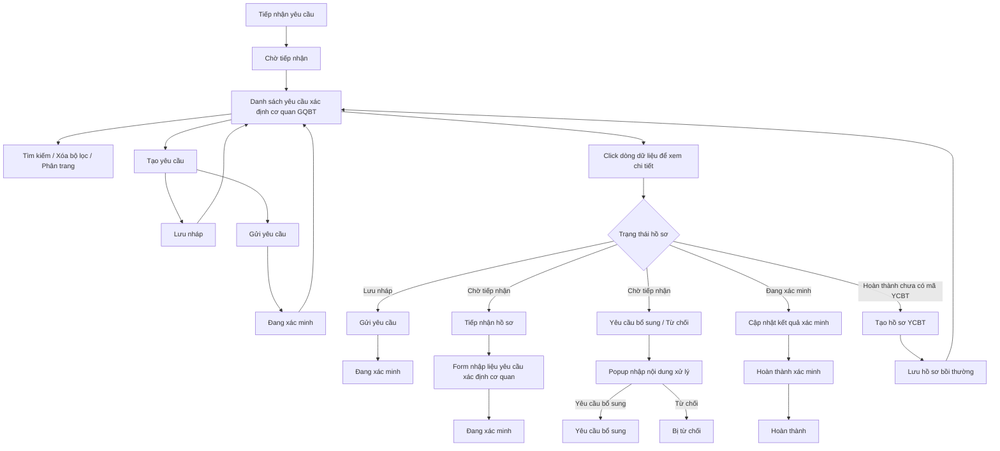

### 4.3.3. Dành cho Cán bộ nghiệp vụ bồi thường nhà nước

#### 4.3.3.1. Nhóm tính năng Xác định cơ quan giải quyết bồi thường

##### 4.3.3.1.1. Mục đích

\- Cho phép người dùng trên Website quản trị quản lý danh sách yêu cầu xác định cơ quan giải quyết bồi thường.

\- Cho phép tạo mới, lưu nháp, gửi yêu cầu, xem chi tiết, tiếp nhận, từ chối tiếp nhận, cập nhật kết quả xác định cơ quan giải quyết bồi thường.

\- Cho phép tiếp nhận và xử lý hồ sơ liên thông từ phân hệ **Tiếp nhận yêu cầu**, tự động kế thừa dữ liệu tiếp nhận ban đầu để cán bộ tiếp tục nhập liệu/xác minh.

\- Cho phép khởi tạo hồ sơ yêu cầu bồi thường liên thông từ hồ sơ xác định cơ quan đã hoàn thành và chưa có mã hồ sơ yêu cầu bồi thường.

*a. Phân quyền*

\- Cán bộ nghiệp vụ bồi thường nhà nước được giao quyền quản lý và xử lý hồ sơ yêu cầu xác định cơ quan giải quyết bồi thường.

*b. Điều kiện thực hiện*

\- Người dùng truy cập màn hình `Xác định cơ quan giải quyết bồi thường` trên Website quản trị.

\- Danh sách dữ liệu được nạp từ nguồn dữ liệu nghiệp vụ hiện hành của hệ thống.

\- Trạng thái hồ sơ sử dụng trong nhóm tính năng gồm: "Lưu nháp", "Chờ tiếp nhận", "Yêu cầu bổ sung", "Đang xác minh", "Bị từ chối", "Hoàn thành".

---

##### 4.3.3.1.2. Sơ đồ luồng nghiệp vụ theo giao diện

---

##### 4.3.3.1.3. MH01 - Màn hình Danh sách yêu cầu xác định cơ quan giải quyết bồi thường

###### 4.3.3.1.3.1. Màn hình

###### 4.3.3.1.3.2. Mô tả thông tin trên màn hình

| Trường thông tin | Kiểu dữ liệu | Bắt buộc | Mặc định | Mô tả |
| :--- | :--- | :--- | :--- | :--- |
| **Khối bộ lọc tìm kiếm** | String(255) | - | - | Control UI: Filter panel. - Hiển thị phía trên bảng danh sách. - Các tiêu chí có dữ liệu được kết hợp theo điều kiện AND. |
| Mã yêu cầu | String(50) | Không | Trống | Control UI: Input text. - Placeholder: `Nhập mã yêu cầu...`. - Tìm kiếm gần đúng theo mã yêu cầu xác định cơ quan, không phân biệt hoa thường, có trim khoảng trắng. |
| Mã YCBT | String(50) | Không | Trống | Control UI: Input text. - Placeholder: `Nhập mã YCBT...`. - Tìm kiếm gần đúng theo mã hồ sơ yêu cầu bồi thường đã được khởi tạo liên thông từ hồ sơ xác định cơ quan. - Nếu hồ sơ chưa có mã YCBT, dữ liệu trên lưới hiển thị `-`. |
| Tên vụ việc | String(255) | Không | Trống | Control UI: Input text. - Placeholder: `Nhập tên vụ việc...`. - Tìm kiếm gần đúng theo tên vụ việc, không phân biệt hoa thường, có trim khoảng trắng. |
| Tên người yêu cầu | String(100) | Không | Trống | Control UI: Input text. - Placeholder: `Nhập tên người yêu cầu...`. - Tìm kiếm gần đúng theo tên người yêu cầu, không phân biệt hoa thường, có trim khoảng trắng. |
| Lĩnh vực phát sinh thiệt hại | Enum(String(100)) | Không | `Tất cả lĩnh vực` | Control UI: Combobox. - Tham chiếu danh mục Lĩnh vực phát sinh thiệt hại [DM_22]. - Cho phép lọc theo một lĩnh vực cụ thể hoặc tất cả lĩnh vực. |
| Trạng thái | Enum(String(50)) | Không | `Tất cả trạng thái` | Control UI: Combobox. - Lọc theo trạng thái xử lý của hồ sơ. - Cho phép lọc theo một trạng thái cụ thể hoặc tất cả trạng thái. |
| Từ ngày | Date | Không | Ngày hiện tại trừ 03 tháng | Control UI: Datepicker. - Định dạng hiển thị `dd/mm/yyyy`. - Có icon lịch. - Lọc theo ngày tiếp nhận từ ngày. |
| Đến ngày | Date | Không | Ngày hiện tại | Control UI: Datepicker. - Định dạng hiển thị `dd/mm/yyyy`. - Có icon lịch. - Lọc theo ngày tiếp nhận đến ngày. |
| **Bảng danh sách yêu cầu xác định cơ quan giải quyết bồi thường** | Text(4000) | - | 20 bản ghi/trang | Control UI: Data grid. - Khi người dùng truy cập màn hình, hệ thống tự động tải trang đầu tiên (Trang 1) với số lượng mặc định 20 bản ghi. - Sắp xếp mặc định: Sắp xếp theo "Thời điểm tiếp nhận" giảm dần (mới nhất hiển thị lên đầu). - Cho phép click trực tiếp vào dòng dữ liệu để mở màn hình chi tiết, trừ khi click vào icon thao tác. - Trạng thái có dữ liệu: Hiển thị danh sách các bản ghi kết quả theo cấu trúc các cột quy định. - Trạng thái không có dữ liệu (Empty State): Khi không tìm thấy kết quả phù hợp với điều kiện tìm kiếm, bảng hiển thị duy nhất 01 dòng căn giữa trên toàn bộ chiều rộng bảng (`colspan`), in nghiêng với nội dung theo MessageList dùng chung [MSG-INF-SYS-001]. |
| STT | Integer(10) | - | Tự tăng | Control UI: Text hiển thị (Read-only). - Căn giữa. - Hiển thị số thứ tự theo trang hiện tại. |
| Mã yêu cầu | String(50) | - | Theo dữ liệu | Control UI: Text hiển thị (Read-only). - Căn giữa. - Hiển thị mã yêu cầu xác định cơ quan giải quyết bồi thường. |
| Tên vụ việc | String(255) | - | Theo dữ liệu | Control UI: Text hiển thị (Read-only). - Hiển thị tên vụ việc đã nhập tại màn hình tạo mới/chỉnh sửa. |
| Tên người yêu cầu | String(100) | - | Theo dữ liệu | Control UI: Text hiển thị (Read-only). - Hiển thị tên người yêu cầu. - Nếu chưa có dữ liệu, để trống. |
| Số điện thoại | String(20) | - | Theo dữ liệu | Control UI: Text hiển thị (Read-only). - Căn giữa. - Nếu chưa có dữ liệu, để trống. |
| Lĩnh vực thiệt hại | Enum(String(50)) | - | Theo dữ liệu | Control UI: Text hiển thị (Read-only). - Hiển thị lĩnh vực phát sinh thiệt hại theo danh mục [DM_22]. |
| Hành vi gây thiệt hại | String(255) | - | Theo dữ liệu | Control UI: Text hiển thị (Read-only). - Hiển thị tóm tắt hành vi gây thiệt hại. - Nếu nội dung dài hơn giới hạn hiển thị của ô, hệ thống rút gọn và cho phép xem đầy đủ khi rê chuột vào nội dung. - Nếu chưa có thông tin, hiển thị `-`. |
| Ngày tiếp nhận | Date | - | Theo dữ liệu | Control UI: Text hiển thị (Read-only). - Căn giữa. - Định dạng `dd/mm/yyyy`. |
| Mã hồ sơ YCBT | String(50) | - | Theo dữ liệu | Control UI: Text link (Hyperlink). - Căn giữa. - Hiển thị mã hồ sơ yêu cầu bồi thường đã khởi tạo liên thông. - Nếu chưa có mã hồ sơ YCBT: Hiển thị `-`. - Nếu đã có mã hồ sơ YCBT: Hiển thị dạng Text link màu xanh (có thể click). |
| Trạng thái | Enum(String(50)) | - | Theo dữ liệu | Control UI: Badge trạng thái. - Hiển thị badge theo trạng thái hồ sơ. |
| Thao tác | String(255) | - | Theo trạng thái | Control UI: Icon button group. - Gồm các icon thao tác theo trạng thái hồ sơ: `Tiếp nhận`, `Yêu cầu bổ sung`, `Từ chối`, nút động `Chỉnh sửa thông tin`/`Cập nhật kết quả xác minh`, `Tạo yêu cầu bồi thường`, `Xóa yêu cầu`. - Nút `Chỉnh sửa thông tin` và `Cập nhật kết quả xác minh` là cùng 01 nút tại cùng 01 vị trí (slot) trong cột Thao tác, tự động đổi nhãn/icon theo trạng thái hồ sơ. - Khi hồ sơ ở trạng thái `Lưu nháp`: nút hiển thị là `Chỉnh sửa thông tin` (icon Chỉnh sửa). - Khi hồ sơ ở trạng thái `Đang xác minh`: nút hiển thị là `Cập nhật kết quả xác minh` (icon Cập nhật kết quả). - Khi hồ sơ ở các trạng thái `Chờ tiếp nhận`, `Hoàn thành`, `Bị từ chối`: nút động ở trạng thái khóa mờ (Disabled). - `Xóa yêu cầu` chỉ hiển thị với bản ghi ở trạng thái `Lưu nháp`; không cho phép xóa hồ sơ đã gửi hoặc hồ sơ bị từ chối. |
| Số dòng hiển thị | Enum(String(50)) | Không | 20 bản ghi/trang | Control UI: Dropdown. - Cho phép chọn số bản ghi hiển thị trên mỗi trang. - Giá trị gồm: + `10` + `20` + `50` + `100`. |
| Thông tin số lượng bản ghi | String(255) | - | Theo dữ liệu | Control UI: Text hiển thị (Read-only). - Hiển thị khoảng bản ghi đang xem và tổng số bản ghi theo kết quả lọc hiện tại. - Khi không có dữ liệu, hiển thị tổng số bản ghi bằng 0. |
| Thanh phân trang | String(255) | - | 20 bản ghi/trang | Control UI: Pagination. - Cho phép chọn cấu hình số lượng bản ghi hiển thị trên mỗi trang gồm: 10, 20, 50, 100 bản ghi/trang; mặc định chọn sẵn 20 bản ghi/trang. - Đầy đủ các nút điều hướng trang: Đầu (&#124;&lt;&lt;), Trước (&lt;), các số trang, Sau (&gt;), Cuối (&gt;&gt;&#124;). - Hiển thị dải bản ghi: "Hiển thị [từ] - [đến] của [tổng số] bản ghi". |

###### 4.3.3.1.3.3. Chức năng trên màn hình

| STT | Tên chức năng | Định dạng | Mô tả |
| :--- | :--- | :--- | :--- |
| 1 | Tìm kiếm | Button | Khi người dùng click nút, hệ thống kiểm tra điều kiện dữ liệu và thực hiện tìm kiếm theo các trường hợp bên dưới: |
|  |  |  | **TH1 - Khoảng ngày không hợp lệ**: Nếu `Từ ngày` lớn hơn `Đến ngày`, vi phạm [BR-VAL-007], hệ thống hiển thị cảnh báo lỗi [MSG-ERR-VAL-007] và không thực hiện tìm kiếm. |
|  |  |  | **TH Hợp lệ (Có dữ liệu phù hợp)**: Hệ thống lọc và hiển thị danh sách các bản ghi thỏa mãn đồng thời các tiêu chí tìm kiếm/lọc đã nhập/chọn, hiển thị kết quả lên bảng và đưa về Trang 1. |
|  |  |  | **TH Không có dữ liệu trả về**: Bảng kết quả hiển thị duy nhất 01 dòng căn giữa trên toàn bộ chiều rộng bảng (`colspan`), in nghiêng với nội dung theo MessageList dùng chung [MSG-INF-SYS-001]; thanh phân trang hiển thị *"Hiển thị 0-0 của 0 bản ghi"*, các nút điều hướng trang ở trạng thái ẩn hoặc khóa mờ (Disabled); nút "Kết xuất Excel" (nếu có) ở trạng thái khóa mờ kèm tooltip *"Không có dữ liệu để kết xuất Excel"*. |
| 2 | Xóa bộ lọc | Button | Hệ thống xóa `Mã yêu cầu`, `Mã YCBT`, `Tên vụ việc`, `Tên người yêu cầu`, `Lĩnh vực phát sinh thiệt hại`, `Trạng thái`; đặt lại `Từ ngày` là ngày hiện tại trừ 03 tháng và `Đến ngày` là ngày hiện tại; tải lại danh sách theo bộ lọc mặc định. |
| 3 | Tạo yêu cầu | Button | Khi người dùng click nút, hệ thống mở **MH02 - Thêm mới/Chỉnh sửa yêu cầu xác định cơ quan giải quyết bồi thường** ở ngữ cảnh tạo mới trực tiếp tại phân hệ Xác định cơ quan; tiêu đề hiển thị `THÊM MỚI YÊU CẦU XÁC ĐỊNH CƠ QUAN GIẢI QUYẾT BỒI THƯỜNG` và toàn bộ trường thông tin trên form ở trạng thái trống/mặc định ban đầu. |
| 4 | Click dòng dữ liệu | Row click | Khi người dùng click vào dòng dữ liệu, hệ thống xử lý theo các trường hợp bên dưới. |
|  |  |  | **TH1 - Click vào dòng dữ liệu**: Hệ thống mở màn hình **MH04 - Chi tiết yêu cầu xác định cơ quan giải quyết bồi thường** của bản ghi được chọn. |
|  |  |  | **TH2 - Click vào icon thao tác trong cột Thao tác**: Không thực hiện row click; thực hiện đúng chức năng của icon được click. |
| 5 | Tiếp nhận | Icon button | Khi người dùng click icon, hệ thống mở **MH02 - Thêm mới/Chỉnh sửa yêu cầu xác định cơ quan giải quyết bồi thường** ở ngữ cảnh tiếp nhận hồ sơ liên thông từ bước **Tiếp nhận yêu cầu**; tiêu đề hiển thị `TIẾP NHẬN YÊU CẦU XÁC ĐỊNH CƠ QUAN GIẢI QUYẾT BỒI THƯỜNG`, tự động kế thừa dữ liệu tiếp nhận ban đầu và cho phép cán bộ chỉnh sửa/nhập bổ sung trước khi gửi yêu cầu. |
| 6 | Yêu cầu bổ sung | Icon button | Khi người dùng click icon, hệ thống mở **Popup Yêu cầu bổ sung / Từ chối yêu cầu** ở ngữ cảnh yêu cầu bổ sung để nhập nội dung yêu cầu bổ sung hồ sơ. |
| 7 | Từ chối | Icon button | Khi người dùng click icon, hệ thống mở **Popup Yêu cầu bổ sung / Từ chối yêu cầu** ở ngữ cảnh từ chối để nhập lý do từ chối yêu cầu; sau khi xác nhận, hồ sơ chuyển sang trạng thái "Bị từ chối". |
| 8 | Chỉnh sửa thông tin / Cập nhật kết quả xác minh | Icon button | Nút thao tác động tại cùng một vị trí, thay đổi theo trạng thái của bản ghi: |
|  |  |  | **TH1 - Hồ sơ ở trạng thái `Lưu nháp`**: Nút hiển thị là `Chỉnh sửa thông tin`. Khi click, hệ thống mở **MH02 - Thêm mới/Chỉnh sửa yêu cầu xác định cơ quan giải quyết bồi thường** ở chế độ chỉnh sửa và điền sẵn toàn bộ dữ liệu của bản ghi nháp để cán bộ cập nhật. |
|  |  |  | **TH2 - Hồ sơ ở trạng thái `Đang xác minh`**: Nút hiển thị là `Cập nhật kết quả xác minh`. Khi click, hệ thống mở **MH03 - Cập nhật kết quả xác định cơ quan giải quyết bồi thường** để cán bộ ghi nhận cơ quan có thẩm quyền giải quyết bồi thường và đính kèm văn bản kết luận xác minh. |
|  |  |  | **TH3 - Hồ sơ ở trạng thái khác**: Nút ở trạng thái khóa mờ (Disabled), không cho phép thao tác. |
| 9 | Tạo yêu cầu bồi thường | Icon button | Hệ thống mở màn hình **MH05 - Khởi tạo hồ sơ yêu cầu bồi thường liên thông**. |
| 10 | Liên kết Mã hồ sơ YCBT | Text link | Khi người dùng click vào đường link `Mã hồ sơ YCBT` trên lưới danh sách: - Hệ thống điều hướng mở màn hình **MH03 - Xem chi tiết và xử lý hồ sơ yêu cầu bồi thường** thuộc phân hệ **Giải quyết yêu cầu bồi thường** (`SRS_BTNN_GiaiQuyetBT_GiaiQuyet_YCBT.md`) tương ứng với mã hồ sơ được chọn. - Thanh Menu Sidebar bên trái tự động chuyển trạng thái active/focus vào đúng menu chức năng **`Giải quyết yêu cầu bồi thường`**. |
| 11 | Xóa yêu cầu | Icon button | Khi người dùng click icon, hệ thống xử lý theo các trường hợp bên dưới: |
|  |  |  | **TH1 - Người dùng xác nhận xóa**: Hệ thống mở popup xác nhận [MSG-CFM-BTNN-XDCQ-001]. Nếu người dùng chọn `Đồng ý`, hệ thống xóa bản ghi `Lưu nháp` khỏi danh sách và hiển thị thông báo thành công [MSG-SUC-BTNN-XDCQ-003]. |
|  |  |  | **TH2 - Người dùng hủy thao tác**: Hệ thống đóng popup, không xóa bản ghi. |
| 12 | Số dòng hiển thị | Dropdown | Khi người dùng chọn `10`, `20`, `50` hoặc `100`, hệ thống cập nhật số bản ghi hiển thị trên mỗi trang, đưa trang hiện tại về trang 1 và tải lại lưới dữ liệu; mặc định chọn sẵn `20`. |
| 13 | Phân trang | Pagination | Hệ thống chuyển đến trang đầu (&#124;&lt;&lt;), trang trước (&lt;), trang được chọn, trang sau (&gt;) hoặc trang cuối (&gt;&gt;&#124;) theo thao tác người dùng; dữ liệu hiển thị giữ nguyên tiêu chí lọc/sắp xếp hiện hành và cấu hình mặc định 20 bản ghi/trang. |

---

##### 4.3.3.1.4. MH02 - Màn hình Thêm mới/Chỉnh sửa yêu cầu xác định cơ quan giải quyết bồi thường

###### 4.3.3.1.4.1. Màn hình

###### 4.3.3.1.4.2. Mô tả thông tin trên màn hình

| Trường thông tin | Kiểu dữ liệu | Bắt buộc | Mặc định | Mô tả |
| :--- | :--- | :--- | :--- | :--- |
| Tiêu đề màn hình | String(255) | - | Theo ngữ cảnh | Control UI: Text heading (Read-only). - Khi mở form do `Tiếp nhận` hồ sơ liên thông từ bước **Tiếp nhận yêu cầu**: hiển thị `TIẾP NHẬN YÊU CẦU XÁC ĐỊNH CƠ QUAN GIẢI QUYẾT BỒI THƯỜNG`. - Khi `Tạo yêu cầu` trực tiếp tại phân hệ Xác định cơ quan: hiển thị `THÊM MỚI YÊU CẦU XÁC ĐỊNH CƠ QUAN GIẢI QUYẾT BỒI THƯỜNG`. - Khi chỉnh sửa hồ sơ ở trạng thái `Lưu nháp`: hiển thị `CHỈNH SỬA YÊU CẦU XÁC ĐỊNH CƠ QUAN GIẢI QUYẾT BỒI THƯỜNG`. |
| Ngữ cảnh mở form | Enum(String(50)) | - | Theo thao tác gọi màn hình | Control UI: Hidden/Context state. - `Tiếp nhận hồ sơ`: phát sinh khi cán bộ click icon `Tiếp nhận` tại dòng hồ sơ trạng thái `Chờ tiếp nhận` trên MH01. - `Tạo mới trực tiếp`: phát sinh khi cán bộ click nút `Tạo yêu cầu`/`Thêm mới` trên thanh công cụ MH01, không qua bước Tiếp nhận yêu cầu. - `Chỉnh sửa nháp`: phát sinh khi cán bộ click nút động `Chỉnh sửa thông tin` tại dòng hồ sơ trạng thái `Lưu nháp`. |
| Cơ chế kế thừa/khởi tạo dữ liệu | Text(2000) | - | Theo ngữ cảnh | Control UI: Quy tắc xử lý dữ liệu form. - **TH1 - Tiếp nhận hồ sơ liên thông**: Hệ thống tự động kế thừa và điền sẵn 08 nhóm thông tin từ phân hệ **Tiếp nhận yêu cầu** gồm `Tên vụ việc`, `Hình thức tiếp nhận hồ sơ`, `Lĩnh vực phát sinh thiệt hại`, `Họ và tên người yêu cầu bồi thường`, `Tỉnh/Thành phố`, `Phường/Xã`, `Địa chỉ chi tiết`, `Tài liệu đính kèm`. Cán bộ được phép chỉnh sửa các thông tin kế thừa để chuẩn hóa dữ liệu và nhập bổ sung các trường còn thiếu trên form. - **TH2 - Tạo mới trực tiếp**: Toàn bộ trường thông tin ở trạng thái trống/mặc định ban đầu; cán bộ tự nhập liệu từ đầu các khối thông tin chung, thông tin người yêu cầu, hành vi gây thiệt hại, hình thức nhận kết quả và tệp đính kèm. - **TH3 - Chỉnh sửa nháp**: Hệ thống điền sẵn toàn bộ thông tin của bản ghi `Lưu nháp` để cán bộ tiếp tục cập nhật. |
| **I. THÔNG TIN CHUNG** | String(255) | - | - | Control UI: Section header. - Khối thông tin chung của yêu cầu. |
| Trạng thái hồ sơ | Enum(String(50)) | - | Ẩn khi Thêm mới | Control UI: Badge trạng thái (Read-only). - Điều kiện hiển thị: + **Khi mở ở chế độ Thêm mới trực tiếp**: **ẨN / KHÔNG HIỂN THỊ** trường thông tin trạng thái. + **Khi mở ở chế độ Tiếp nhận hồ sơ liên thông**: Hiển thị badge trạng thái `Chờ tiếp nhận`. + **Khi mở ở chế độ Chỉnh sửa hồ sơ lưu nháp**: Hiển thị badge trạng thái `Lưu nháp`. |
| Hình thức tiếp nhận hồ sơ | Enum(String(50)) | Có | Theo ngữ cảnh | Control UI: Combobox. - Trường được điền sẵn theo dữ liệu kế thừa khi mở form từ `Tiếp nhận hồ sơ`; cán bộ được phép chỉnh sửa nếu cần chuẩn hóa. - Khi tạo mới trực tiếp, mặc định `Trực tiếp` và cho phép cán bộ chọn lại. |
| Lĩnh vực phát sinh thiệt hại | Enum(String(100)) | Có | Theo ngữ cảnh | Control UI: Combobox. - Tham chiếu danh mục Lĩnh vực phát sinh thiệt hại [DM_22]. - Trường được điền sẵn theo dữ liệu kế thừa khi mở form từ `Tiếp nhận hồ sơ`; cán bộ được phép chỉnh sửa nếu cần chuẩn hóa. - Khi tạo mới trực tiếp, mặc định `TRONG HOẠT ĐỘNG QUẢN LÝ HÀNH CHÍNH` hoặc để trống theo cấu hình màn hình. |
| Tên vụ việc | String(255) | Có | Theo ngữ cảnh | Control UI: Input text. - Placeholder: `Nhập tên/tóm tắt vụ việc...`. - Trường được điền sẵn theo dữ liệu kế thừa khi mở form từ `Tiếp nhận hồ sơ` hoặc theo bản ghi khi chỉnh sửa nháp; cán bộ được phép chỉnh sửa. - Khi tạo mới trực tiếp, trường ở trạng thái trống để cán bộ nhập từ đầu. - Áp dụng [BR-VAL-001] khi người dùng gửi yêu cầu. |
| **II. THÔNG TIN CHI TIẾT NGƯỜI YÊU CẦU BỒI THƯỜNG** | String(100) | - | - | Control UI: Section header. - Khối thông tin người yêu cầu bồi thường. |
| Họ và tên người yêu cầu bồi thường | String(100) | Có | Theo ngữ cảnh | Control UI: Input text. - Placeholder: `Nhập họ và tên...`. - Trường được điền sẵn theo dữ liệu kế thừa khi mở form từ `Tiếp nhận hồ sơ` hoặc theo bản ghi khi chỉnh sửa nháp; cán bộ được phép chỉnh sửa. - Khi tạo mới trực tiếp, trường ở trạng thái trống để cán bộ nhập từ đầu. |
| Tư cách người yêu cầu bồi thường | Enum(String(50)) | Có | `Người bị thiệt hại` | Control UI: Combobox. - Tham chiếu Danh mục tư cách người yêu cầu bồi thường [DM_25]. - Cho phép chọn tư cách pháp lý của người yêu cầu trong hồ sơ. |
| Giới tính | Enum(String(50)) | Có | `Nam` | Control UI: Combobox. - Tham chiếu danh mục Giới tính [DM_23]. |
| Ngày tháng năm sinh | Date | Có | Trống | Control UI: Datepicker. - Placeholder: `dd/mm/yyyy`. - Có icon lịch. |
| Số điện thoại liên hệ | String(20) | Có | Trống | Control UI: Input text. - Placeholder: `Nhập số điện thoại...`. - Nhập số điện thoại liên hệ của người yêu cầu. |
| Địa chỉ Email | String(255) | Tùy điều kiện | Trống | Control UI: Input text. - Placeholder: `Nhập email...`. - Email bắt buộc khi chọn `Hình thức nhận kết quả giải quyết` là `Phương thức điện tử`. |
| Loại giấy tờ thân nhân | Enum(String(50)) | Có | `CCCD` | Control UI: Combobox. - Tham chiếu danh mục loại giấy tờ pháp lý [DM_10]. |
| Số giấy tờ thân nhân | String(50) | Có | Trống | Control UI: Input text. - Placeholder: `Nhập số giấy tờ...`. - Nhập số giấy tờ chứng minh tư cách pháp lý của người yêu cầu. |
| Ngày cấp | Date | Có | Trống | Control UI: Datepicker. - Placeholder: `dd/mm/yyyy`. - Có icon lịch. |
| Nơi cấp | String(255) | Có | Trống | Control UI: Input text. - Placeholder: `Nhập nơi cấp...`. - Nhập nơi cấp giấy tờ thân nhân. |
| Quốc gia | Enum(String(50)) | Có | `Việt Nam` | Control UI: Combobox. - Tham chiếu danh mục Quốc tịch/Quốc gia [DM_09]. |
| Tỉnh/Thành phố | Enum(String(100)) / String(100) | Có | Theo ngữ cảnh | Control UI: Combobox có tìm kiếm / Input text. - Nếu `Quốc gia` = `Việt Nam`: Tham chiếu Danh mục Tỉnh/Thành phố [DM_13]. Cho phép gõ tìm kiếm theo Mã hoặc Tên. - Nếu `Quốc gia` khác `Việt Nam`: Hiển thị ô nhập văn bản để người dùng tự do nhập. - Trường được điền sẵn theo dữ liệu kế thừa khi mở form từ `Tiếp nhận hồ sơ` hoặc theo bản ghi khi chỉnh sửa nháp; cán bộ được phép chỉnh sửa. |
| Phường/Xã | Enum(String(100)) / String(100) | Có | Theo ngữ cảnh | Control UI: Combobox có tìm kiếm / Input text. - Phụ thuộc vào `Tỉnh/Thành phố` đã chọn. - Nếu `Quốc gia` = `Việt Nam`: Tham chiếu Danh mục Xã/Phường/Thị trấn [DM_15] (lọc động theo Tỉnh/Thành phố đã chọn). Cho phép gõ tìm kiếm theo Mã hoặc Tên. Nếu chưa chọn Tỉnh/Thành phố thì khóa mờ (Disabled) kèm placeholder *"Vui lòng chọn Tỉnh/Thành phố trước"*. - Nếu `Quốc gia` khác `Việt Nam`: Hiển thị ô nhập văn bản (Input text) để người dùng tự do nhập. - Trường được điền sẵn theo dữ liệu kế thừa khi mở form từ `Tiếp nhận hồ sơ` hoặc theo bản ghi khi chỉnh sửa nháp; cán bộ được phép chỉnh sửa. |
| Địa chỉ chi tiết | Text(1000) / String(500) | Có | Theo ngữ cảnh | Control UI: Textarea / Input text. - Placeholder: `Nhập số nhà, tên đường, thôn/xóm/tổ dân phố...`. - Trường được điền sẵn theo dữ liệu kế thừa khi mở form từ `Tiếp nhận hồ sơ` hoặc theo bản ghi khi chỉnh sửa nháp; cán bộ được phép chỉnh sửa. - Khi tạo mới trực tiếp, trường ở trạng thái trống để cán bộ nhập từ đầu. - Áp dụng quy tắc bắt buộc [BR-VAL-001]. |
| **III. HÀNH VI GÂY THIỆT HẠI & PHƯƠNG THỨC NHẬN KẾT QUẢ** | Text(2000) | - | - | Control UI: Section header. - Khối thông tin hành vi và cách nhận kết quả. |
| Hành vi gây thiệt hại của người thi hành công vụ gây thiệt hại | Text(2000) | Có | Trống | Control UI: Textarea. - Placeholder: `Nhập tóm tắt hành vi gây thiệt hại và cơ quan gây thiệt hại...`. - Nhập nội dung hành vi bị phản ánh gây thiệt hại. - Nếu chưa có, hiển thị `-`. |
| Hình thức nhận kết quả giải quyết | Enum(String(50)) | Có | `Phương thức điện tử` | Control UI: Combobox. - Cho phép chọn hình thức nhận kết quả giải quyết. - Khi chọn `Phương thức điện tử`, trường `Địa chỉ Email` là bắt buộc. |
| Bảng tài liệu đính kèm | List(Object) | Không | Theo hồ sơ tiếp nhận / Trống | Control UI: Data grid. - Cho phép đính kèm nhiều tài liệu liên quan đến hồ sơ yêu cầu xác định cơ quan. - **Quy tắc kế thừa**: Đối với trường hợp mở form do `Tiếp nhận hồ sơ` từ trạng thái `Chờ tiếp nhận`, hệ thống tự động kế thừa toàn bộ danh sách tài liệu đã có từ phân hệ **Tiếp nhận yêu cầu** gồm tên tài liệu và file đính kèm. - Cán bộ có thể bấm `Xem file`, `Xóa` file cũ hoặc bấm `Thêm dòng tài liệu` để đính kèm bổ sung tài liệu mới. - Khi tạo mới trực tiếp, bảng ở trạng thái trống; khi chỉnh sửa nháp, bảng hiển thị danh sách tài liệu đã lưu trong bản ghi nháp. |
| STT | Integer(10) | - | Tự tăng | Control UI: Text (Read-only). Căn giữa, tự tăng theo số dòng tài liệu. |
| Tên tài liệu | String(255) | Có khi thêm dòng | Trống | Control UI: Input text. Cán bộ nhập tên loại tài liệu đính kèm. Áp dụng quy tắc [BR-VAL-001] khi dòng tài liệu có file hoặc được lưu. |
| File đính kèm | File | Không | Trống | Control UI: File upload trigger. Cho phép chọn file tài liệu liên quan. Áp dụng quy tắc file dùng chung [BR-FILE-010]. |
| Thao tác tài liệu | String(255) | - | Theo dòng | Control UI: Icon/Text button group. - Gồm các nút/icon: `Thêm dòng tài liệu`, `Tải lên`, `Xem file`, `Xóa`. |

###### 4.3.3.1.4.3. Chức năng trên màn hình

| STT | Tên chức năng | Định dạng | Mô tả |
| :--- | :--- | :--- | :--- |
| 1 | Hủy bỏ | Button | Hệ thống đóng màn hình thêm mới/chỉnh sửa và quay về màn hình **MH01 - Danh sách yêu cầu xác định cơ quan giải quyết bồi thường**. |
| 2 | Lưu nháp | Button | Khi người dùng click nút, hệ thống lưu tạm dữ liệu đang nhập theo ngữ cảnh mở form: |
|  |  |  | **TH1 - Tiếp nhận hồ sơ liên thông từ bước Tiếp nhận yêu cầu**: Hệ thống lưu tạm các thông tin đang nhập/chỉnh sửa, giữ nguyên trạng thái `Chờ tiếp nhận` hoặc cập nhật sang `Lưu nháp` theo cấu hình quy trình tiếp nhận của hệ thống; chưa chuyển hồ sơ sang bước xác minh. |
|  |  |  | **TH2 - Tạo mới trực tiếp tại phân hệ Xác định cơ quan**: Hệ thống sinh mã yêu cầu mới nếu chưa có, ghi nhận ngày hiện tại, lưu hồ sơ ở trạng thái `Lưu nháp` và hiển thị thông báo thành công [MSG-SUC-BTNN-XDCQ-006]. |
|  |  |  | **TH3 - Chỉnh sửa hồ sơ Lưu nháp**: Hệ thống cập nhật dữ liệu bản ghi nháp hiện tại, giữ nguyên trạng thái `Lưu nháp` và hiển thị thông báo thành công [MSG-SUC-BTNN-XDCQ-008]. |
| 3 | Gửi yêu cầu | Button | Khi người dùng click nút, hệ thống kiểm tra dữ liệu và xử lý theo các trường hợp bên dưới. |
|  |  |  | **TH1 - Bỏ trống trường bắt buộc**: Nếu bỏ trống một trong các trường bắt buộc gồm `Tên vụ việc`, `Hình thức tiếp nhận hồ sơ`, `Lĩnh vực phát sinh thiệt hại`, `Họ và tên người yêu cầu bồi thường`, `Ngày tháng năm sinh`, `Số giấy tờ thân nhân`, `Ngày cấp`, `Nơi cấp`, `Số điện thoại liên hệ`, `Tỉnh/Thành phố`, `Phường/Xã`, `Địa chỉ chi tiết`, `Hành vi gây thiệt hại của người thi hành công vụ gây thiệt hại`, hoặc `Địa chỉ Email` khi `Hình thức nhận kết quả giải quyết` là `Phương thức điện tử`, vi phạm [BR-VAL-001], hệ thống tô viền đỏ ô trống đầu tiên, hiển thị [MSG-ERR-VAL-001] và focus vào ô lỗi đầu tiên. Không cho phép gửi yêu cầu. |
|  |  |  | **TH2 - Hợp lệ, tiếp nhận hồ sơ liên thông từ bước Tiếp nhận yêu cầu**: Hệ thống lưu toàn bộ thông tin đã kế thừa/chỉnh sửa/bổ sung và chuyển hồ sơ từ trạng thái `Chờ tiếp nhận` sang trạng thái `Đang xác minh`; hiển thị thông báo thành công [MSG-SUC-BTNN-XDCQ-007]. |
|  |  |  | **TH3 - Hợp lệ, tạo mới trực tiếp tại phân hệ Xác định cơ quan**: Hệ thống sinh mã yêu cầu nếu chưa có, ghi nhận ngày hiện tại, lưu toàn bộ thông tin và chuyển thẳng hồ sơ sang trạng thái `Đang xác minh` (bỏ qua trạng thái `Chờ tiếp nhận`); hiển thị thông báo thành công [MSG-SUC-BTNN-XDCQ-007]. |
|  |  |  | **TH4 - Hợp lệ, chỉnh sửa hồ sơ Lưu nháp**: Hệ thống cập nhật dữ liệu bản ghi nháp, chuyển hồ sơ sang trạng thái `Đang xác minh` và hiển thị thông báo thành công [MSG-SUC-BTNN-XDCQ-009]. |
| 4 | Thêm dòng tài liệu | Button | Khi người dùng click nút, hệ thống chèn thêm 01 dòng trống mới vào `Bảng tài liệu đính kèm` để cán bộ nhập `Tên tài liệu` và bấm `Tải lên` chọn file. |
| 5 | Tải lên | File trigger | Khi người dùng click nút tại dòng tài liệu tương ứng, hệ thống mở trình chọn file trên máy tính. Sau khi chọn file hợp lệ, hệ thống hiển thị tên file trên dòng tài liệu và hiển thị link `Xem file`. |
|  |  |  | **TH File không hợp lệ**: Nếu file vi phạm quy tắc file dùng chung [BR-FILE-010], hệ thống hiển thị cảnh báo lỗi tương ứng và không gắn file vào dòng tài liệu. |
| 6 | Xem file | Link | Khi người dùng click link, hệ thống mở xem trước nội dung file đính kèm trong một tab mới của trình duyệt. |
| 7 | Xóa | Link/Icon button | Khi người dùng click nút, hệ thống xử lý theo các trường hợp bên dưới. |
|  |  |  | **TH1 - Dòng đã có file đính kèm**: Hệ thống mở popup xác nhận [MSG-CFM-BTNN-XDCQ-002]. Nếu người dùng chọn `Đồng ý`, hệ thống gỡ file khỏi dòng tài liệu hoặc xóa dòng tài liệu tương ứng khỏi bảng và hiển thị thông báo thành công [MSG-SUC-BTNN-XDCQ-005]. |
|  |  |  | **TH2 - Dòng trống chưa lưu file**: Hệ thống xóa dòng tài liệu khỏi bảng, không yêu cầu xác nhận. |
|  |  |  | **TH3 - Người dùng hủy thao tác**: Hệ thống đóng popup xác nhận, giữ nguyên file/dòng tài liệu. |

---

##### 4.3.3.1.5. MH03 - Màn hình Cập nhật kết quả xác định cơ quan giải quyết bồi thường

###### 4.3.3.1.5.1. Màn hình

###### 4.3.3.1.5.2. Mô tả thông tin trên màn hình

| Trường thông tin | Kiểu dữ liệu | Bắt buộc | Mặc định | Mô tả |
| :--- | :--- | :--- | :--- | :--- |
| Tiêu đề màn hình | String(255) | - | - | Control UI: Text heading (Read-only). - Hiển thị `CẬP NHẬT KẾT QUẢ XÁC ĐỊNH CƠ QUAN GIẢI QUYẾT BỒI THƯỜNG`. |
| **Tóm tắt hồ sơ yêu cầu xác định** | String(255) | - | Theo hồ sơ | Control UI: Summary section. - Hiển thị thông tin tóm tắt của hồ sơ đang xử lý. |
| Mã yêu cầu | String(50) | - | Theo hồ sơ | Control UI: Text hiển thị (Read-only). - Hiển thị mã yêu cầu trong khối tóm tắt. |
| Tên vụ việc | String(255) | - | Theo hồ sơ | Control UI: Text hiển thị (Read-only). - Hiển thị tên vụ việc trong khối tóm tắt. - Với dữ liệu cũ chưa có trường riêng, hệ thống hiển thị theo quy tắc `Vụ việc yêu cầu bồi thường của [Tên người yêu cầu]`. |
| Họ tên người yêu cầu | String(100) | - | Theo hồ sơ | Control UI: Text hiển thị (Read-only). - Hiển thị họ tên người yêu cầu trong khối tóm tắt. |
| Lĩnh vực phát sinh thiệt hại | Enum(String(50)) | - | Theo hồ sơ | Control UI: Text hiển thị (Read-only). - Hiển thị lĩnh vực phát sinh thiệt hại trong khối tóm tắt theo danh mục [DM_22]. |
| Số điện thoại | String(20) | - | Theo hồ sơ | Control UI: Text hiển thị (Read-only). - Hiển thị số điện thoại liên hệ trong khối tóm tắt. |
| Hành vi gây thiệt hại | String(255) | - | Theo hồ sơ | Control UI: Text hiển thị (Read-only). - Hiển thị tóm tắt hành vi gây thiệt hại trong khối tóm tắt. |
| **NỘI DUNG XÁC ĐỊNH THẨM QUYỀN (ĐIỀU 40 LUẬT TNBTCNN)** | Text(2000) | - | - | Control UI: Section header. - Khối nhập kết quả xác định thẩm quyền. |
| Căn cứ pháp lý xác định thẩm quyền | Text(2000) | Có | Trống | Control UI: Textarea. - Placeholder: `Nhập căn cứ pháp lý xác định thẩm quyền...`. - Nhập căn cứ pháp lý làm cơ sở xác định cơ quan có thẩm quyền giải quyết bồi thường. |
| Chỉ định Cơ quan có thẩm quyền giải quyết bồi thường | Enum(String(255)) | Có | Trống | Control UI: Combobox có tìm kiếm. - Cho phép tìm kiếm theo Mã đơn vị hoặc Tên đơn vị trong Danh sách đơn vị trên hệ thống. - Người dùng chọn một cơ quan có thẩm quyền giải quyết bồi thường từ kết quả tìm kiếm. |
| Nhận định lý do xác định chi tiết | Text(2000) | Có | Theo hồ sơ nếu có | Control UI: Textarea. - Placeholder: `Nhập lập luận, phân tích lý do chỉ định cơ quan giải quyết này dựa trên hồ sơ xác minh...`. - Nhập nhận định, phân tích và lý do chỉ định cơ quan giải quyết bồi thường. |
| Tải lên file scan quyết định xác định cơ quan giải quyết bồi thường | File | Không | Trống | Control UI: File upload. - Cho phép đính kèm file scan quyết định xác định cơ quan giải quyết bồi thường. - Sau khi đính kèm, hiển thị tên file đã chọn. - Chi tiết nghiệp vụ nút thao tác tệp đính kèm xem tại bảng Chức năng trên màn hình. |

###### 4.3.3.1.5.3. Chức năng trên màn hình

| STT | Tên chức năng | Định dạng | Mô tả |
| :--- | :--- | :--- | :--- |
| 1 | Hủy bỏ | Button | Hệ thống đóng màn hình cập nhật kết quả xác minh và quay về màn hình **MH01 - Danh sách yêu cầu xác định cơ quan giải quyết bồi thường**. |
| 2 | Hoàn thành xác minh | Button | Khi người dùng click nút, hệ thống kiểm tra dữ liệu và xử lý theo các trường hợp bên dưới. |
|  |  |  | **TH1 - Bỏ trống trường bắt buộc**: Nếu bỏ trống các trường bắt buộc vi phạm [BR-VAL-001], hệ thống hiển thị [MSG-ERR-VAL-001]. Không cho phép hoàn thành xác minh. |
|  |  |  | **TH Hợp lệ**: Hệ thống lưu lại các thông tin kết quả xác minh; chuyển trạng thái hồ sơ sang "Hoàn thành"; hiển thị thông báo thành công [MSG-SUC-BTNN-XDCQ-010]; mở màn hình **MH04 - Chi tiết yêu cầu xác định cơ quan giải quyết bồi thường**. |
| 3 | Chọn tệp đính kèm + | File trigger | Hệ thống mở trình chọn file. Sau khi chọn file, hệ thống hiển thị tên file đã chọn. |
| 4 | Xem file | Link | Cho phép xem file tại một tab riêng. |
| 5 | Xóa | Link | Khi người dùng click link, hệ thống xử lý theo các trường hợp bên dưới. |
|  |  |  | **TH1 - Người dùng xác nhận xóa file**: Hệ thống mở popup xác nhận [MSG-CFM-BTNN-XDCQ-002]. Nếu người dùng chọn `Đồng ý`, hệ thống gỡ file và hiển thị thông báo thành công [MSG-SUC-BTNN-XDCQ-005]. |
|  |  |  | **TH2 - Người dùng hủy thao tác**: Hệ thống đóng popup xác nhận, giữ nguyên file đính kèm. |

---

##### 4.3.3.1.6. MH04 - Màn hình Chi tiết yêu cầu xác định cơ quan giải quyết bồi thường

###### 4.3.3.1.6.1. Màn hình

###### 4.3.3.1.6.2. Mô tả thông tin trên màn hình

| Trường thông tin | Kiểu dữ liệu | Bắt buộc | Mặc định | Mô tả |
| :--- | :--- | :--- | :--- | :--- |
| Tiêu đề màn hình | String(255) | - | - | Control UI: Text heading (Read-only). - Hiển thị `CHI TIẾT YÊU CẦU XÁC ĐỊNH CƠ QUAN GIẢI QUYẾT BỒI THƯỜNG`. |
| **THÔNG TIN TỪ CHỐI TIẾP NHẬN** | String(255) | - | Ẩn | Control UI: Section header. - Chỉ hiển thị khi trạng thái hồ sơ là "Bị từ chối". |
| Lý do bị từ chối | Text(2000) | - | Theo hồ sơ | Control UI: Text hiển thị (Read-only). - Hiển thị lý do từ chối tiếp nhận đã lưu trong hồ sơ. - Nếu không có lý do, hiển thị `Không có lý do.` |
| Văn bản đính kèm | File | - | Theo hồ sơ | Control UI: File link (Read-only). - Nếu có văn bản đính kèm, hiển thị tên file và link `Xem file`. - Nếu không có file, hiển thị `Không có tệp đính kèm`. |
| **I. THÔNG TIN TIẾP NHẬN HỒ SƠ** | String(255) | - | - | Control UI: Section header. - Khối thông tin tiếp nhận hồ sơ. |
| Mã yêu cầu | String(50) | - | Theo hồ sơ | Control UI: Text hiển thị (Read-only). - Hiển thị mã yêu cầu xác định cơ quan giải quyết bồi thường. |
| Tên vụ việc | String(255) | - | Theo hồ sơ | Control UI: Text hiển thị (Read-only). - Hiển thị tên vụ việc. - Với dữ liệu cũ chưa có trường riêng, hệ thống hiển thị theo quy tắc `Vụ việc yêu cầu bồi thường của [Tên người yêu cầu]`. |
| Trạng thái xử lý | Enum(String(50)) | - | Theo hồ sơ | Control UI: Badge trạng thái. - Hiển thị trạng thái hiện tại của hồ sơ. |
| Hình thức tiếp nhận | Enum(String(50)) | - | Theo hồ sơ | Control UI: Text hiển thị (Read-only). - Hiển thị hình thức tiếp nhận hồ sơ. |
| Thời điểm tiếp nhận | Datetime | - | Ẩn khi tạo trực tiếp | Control UI: Text hiển thị (Read-only). - Định dạng `dd/mm/yyyy HH:mm`. - **Điều kiện hiển thị**: + **Hiển thị** thời điểm tiếp nhận ban đầu nếu hồ sơ được tạo liên thông từ phân hệ **Tiếp nhận yêu cầu**. + **Ẩn/Không hiển thị** trường này nếu hồ sơ được tạo mới trực tiếp tại phân hệ Xác định cơ quan giải quyết bồi thường. |
| Cán bộ tiếp nhận | String(255) | - | Theo hồ sơ | Control UI: Text hiển thị (Read-only). - Hiển thị họ và tên cán bộ đã thực hiện tiếp nhận ban đầu từ phân hệ Tiếp nhận yêu cầu (hoặc cán bộ tạo lập hồ sơ khi tạo trực tiếp). |
| Cán bộ xử lý | String(255) | - | Ẩn khi chưa cập nhật kết quả | Control UI: Text hiển thị (Read-only). - Hiển thị họ và tên cán bộ đã thực hiện cập nhật kết quả xác minh cơ quan giải quyết bồi thường. - **Điều kiện hiển thị**: Chỉ hiển thị sau khi cán bộ đã thực hiện thao tác `Cập nhật kết quả xác minh`. - Nếu hồ sơ chưa được cập nhật kết quả xác minh, **ẩn/không hiển thị** trường này. |
| Lĩnh vực phát sinh thiệt hại | Enum(String(50)) | - | Theo hồ sơ | Control UI: Text hiển thị (Read-only). - Hiển thị lĩnh vực phát sinh thiệt hại theo danh mục [DM_22]. |
| **II. THÔNG TIN CHI TIẾT NGƯỜI YÊU CẦU BỒI THƯỜNG** | String(100) | - | - | Control UI: Section header. - Khối thông tin người yêu cầu bồi thường. |
| Họ và tên người yêu cầu | String(100) | - | Theo hồ sơ | Control UI: Text hiển thị (Read-only). - Hiển thị họ và tên người yêu cầu bồi thường. |
| Tư cách người yêu cầu | String(100) | - | Theo hồ sơ | Control UI: Text hiển thị (Read-only). - Hiển thị tư cách người yêu cầu. |
| Giới tính / Ngày sinh | Date | - | Theo hồ sơ | Control UI: Text hiển thị (Read-only). - Hiển thị theo dạng `[Giới tính] / [Ngày sinh]`. - Giới tính Tham chiếu Danh mục Giới tính [DM_23]. |
| Giấy tờ thân nhân | String(255) | - | Theo hồ sơ | Control UI: Text hiển thị (Read-only). - Hiển thị theo dạng `[Loại giấy tờ] - Số: [Số giấy tờ] (Cấp ngày: [Ngày cấp] tại [Nơi cấp])`. - Loại giấy tờ tham chiếu danh mục loại giấy tờ pháp lý [DM_10]. |
| Số điện thoại liên hệ | String(20) | - | Theo hồ sơ | Control UI: Text hiển thị (Read-only). - Hiển thị số điện thoại liên hệ. |
| Địa chỉ Email | String(255) | - | Theo hồ sơ | Control UI: Text hiển thị (Read-only). - Hiển thị địa chỉ email của người yêu cầu. - Nếu không có dữ liệu, hiển thị `Chưa cung cấp`. |
| Địa chỉ cư trú / liên hệ | String(500) | - | Theo hồ sơ | Control UI: Text hiển thị (Read-only). - Hiển thị theo dạng `[Địa chỉ chi tiết], [Phường/Xã], [Tỉnh/Thành phố], [Quốc gia]`. |
| Đính kèm đơn đề nghị ban đầu | File | - | Theo hồ sơ | Control UI: File link (Read-only). - Nếu có file, hiển thị tên file và link `Xem file`. - Nếu không có file, hiển thị `Không có file đính kèm`. |
| **III. HÀNH VI GÂY THIỆT HẠI & PHƯƠNG THỨC NHẬN KẾT QUẢ** | Text(2000) | - | - | Control UI: Section header. - Khối hành vi và phương thức nhận kết quả. |
| Hành vi gây thiệt hại của công chức | String(255) | - | Theo hồ sơ | Control UI: Text hiển thị (Read-only). - Hiển thị nội dung hành vi gây thiệt hại. |
| Phương thức nhận kết quả | Text(2000) | - | Theo hồ sơ | Control UI: Text hiển thị (Read-only). - Hiển thị phương thức nhận kết quả. |
| **IV. KẾT QUẢ XÁC ĐỊNH CƠ QUAN GIẢI QUYẾT BỒI THƯỜNG** | String(255) | - | Ẩn | Control UI: Section header. - Chỉ hiển thị khi hồ sơ có thông tin kết quả xác định cơ quan giải quyết bồi thường. |
| Căn cứ pháp lý xác định | Text(2000) | - | Theo hồ sơ | Control UI: Text hiển thị (Read-only). - Hiển thị căn cứ pháp lý xác định thẩm quyền đã lưu trong hồ sơ. - Nếu trạng thái "Đang xác minh" nhưng chưa có căn cứ, hiển thị `Đang xác minh, chưa có căn cứ`. |
| Cơ quan được chỉ định giải quyết | String(255) | - | Theo hồ sơ | Control UI: Text hiển thị (Read-only). - Hiển thị cơ quan được chỉ định giải quyết bồi thường. - Nếu trạng thái "Đang xác minh" nhưng chưa có cơ quan, hiển thị `Đang tiến hành chỉ định`. |
| Nhận định lý do chi tiết | Text(2000) | - | Theo hồ sơ | Control UI: Text hiển thị (Read-only). - Hiển thị nhận định lý do xác định cơ quan giải quyết bồi thường. - Nếu trạng thái "Đang xác minh" nhưng chưa có nhận định, hiển thị `Đang cập nhật báo cáo kết luận...`. |
| Tài liệu kèm theo | File | - | Theo hồ sơ | Control UI: File link (Read-only). - Nếu có file, hiển thị tên file và link `Xem file`. - Nếu chưa có file, hiển thị `Chưa đính kèm quyết định`. |
| Mã hồ sơ yêu cầu bồi thường | String(50) | - | Ẩn khi chưa liên thông | Control UI: Text link (Hyperlink). - **Điều kiện hiển thị**: Chỉ hiển thị khi hồ sơ ở trạng thái `Hoàn thành` và đã phát sinh mã hồ sơ YCBT liên thông. - Hiển thị mã hồ sơ dưới dạng Text link cho phép click để tra cứu trực tiếp vụ việc bồi thường gốc. |

###### 4.3.3.1.6.3. Chức năng trên màn hình

| STT | Tên chức năng | Định dạng | Mô tả |
| :--- | :--- | :--- | :--- |
| 1 | Đóng | Button | Hệ thống đóng màn hình chi tiết và quay về màn hình **MH01 - Danh sách yêu cầu xác định cơ quan giải quyết bồi thường**. |
| 2 | Tiếp nhận | Button | Chỉ hiển thị khi trạng thái `Chờ tiếp nhận`. Khi click, hệ thống mở **MH02 - Thêm mới/Chỉnh sửa yêu cầu xác định cơ quan giải quyết bồi thường** ở chế độ tiếp nhận/nhập liệu hồ sơ và kế thừa dữ liệu từ bước **Tiếp nhận yêu cầu** nếu hồ sơ được tạo liên thông. |
| 3 | Yêu cầu bổ sung | Button | Chỉ hiển thị khi trạng thái `Chờ tiếp nhận`. Khi click, hệ thống mở **Popup Yêu cầu bổ sung / Từ chối yêu cầu** ở ngữ cảnh yêu cầu bổ sung hồ sơ. |
| 4 | Từ chối | Button | Chỉ hiển thị khi trạng thái `Chờ tiếp nhận`. Khi click, hệ thống mở **Popup Yêu cầu bổ sung / Từ chối yêu cầu** ở ngữ cảnh từ chối yêu cầu. |
| 5 | Cập nhật kết quả xác minh | Button | Chỉ hiển thị khi trạng thái `Đang xác minh`. Khi click, hệ thống mở màn hình **MH03 - Cập nhật kết quả xác định cơ quan giải quyết bồi thường**. |
| 6 | Tạo hồ sơ YCBT | Button | Hệ thống mở màn hình **MH05 - Khởi tạo hồ sơ yêu cầu bồi thường liên thông**. |
| 7 | Gửi yêu cầu | Button | Chỉ hiển thị khi trạng thái `Lưu nháp`. Khi click, hệ thống chuyển trạng thái sang `Đang xác minh`, hiển thị thông báo thành công [MSG-SUC-BTNN-XDCQ-002] và refresh lại màn hình chi tiết. |
| 8 | Xem file | Link | Cho phép xem file tại một tab riêng. |
| 9 | Liên kết Mã hồ sơ yêu cầu bồi thường | Text link | Khi người dùng click vào link `Mã hồ sơ yêu cầu bồi thường`: - Hệ thống điều hướng mở màn hình **MH03 - Xem chi tiết và xử lý hồ sơ yêu cầu bồi thường** thuộc phân hệ **Giải quyết yêu cầu bồi thường** (`SRS_BTNN_GiaiQuyetBT_GiaiQuyet_YCBT.md`). - Thanh Menu Sidebar bên trái tự động chuyển trạng thái active/focus vào đúng chức năng **`Giải quyết yêu cầu bồi thường`**. |

---

##### 4.3.3.1.7. MH05 - Màn hình Khởi tạo hồ sơ yêu cầu bồi thường liên thông

###### 4.3.3.1.7.1. Màn hình

###### 4.3.3.1.7.2. Mô tả thông tin trên màn hình

| Trường thông tin | Kiểu dữ liệu | Bắt buộc | Mặc định | Mô tả |
| :--- | :--- | :--- | :--- | :--- |
| Tiêu đề màn hình | String(255) | - | - | Control UI: Text heading (Read-only). - Hiển thị `KHỞI TẠO HỒ SƠ YÊU CẦU BỒI THƯỜNG LIÊN THÔNG`. |
| Khối thông báo liên thông dữ liệu | String(255) | - | Hiển thị | Control UI: Alert/Info banner. - Nội dung tham chiếu [MSG-INF-BTNN-XDCQ-002]. |
| **I. ĐƠN VỊ THỤ LÝ VÀ THÔNG TIN CHI TIẾT NGƯỜI YÊU CẦU** | String(100) | - | - | Control UI: Section header. - Khối thông tin kế thừa từ hồ sơ xác định cơ quan. |
| Đơn vị thụ lý giải quyết bồi thường (được xác định) | String(255) | - | Theo hồ sơ | Control UI: Text hiển thị (Read-only). - Hiển thị cơ quan có thẩm quyền giải quyết bồi thường đã được xác định. - Nếu chưa xác định, hiển thị `Chưa xác định`. |
| Tên người yêu cầu bồi thường | String(100) | - | Theo hồ sơ | Control UI: Text hiển thị (Read-only). - Kế thừa từ hồ sơ xác định cơ quan. |
| Tư cách người yêu cầu | String(100) | - | Theo hồ sơ | Control UI: Text hiển thị (Read-only). - Kế thừa từ hồ sơ xác định cơ quan. |
| Số điện thoại | String(20) | - | Theo hồ sơ | Control UI: Text hiển thị (Read-only). - Kế thừa từ hồ sơ xác định cơ quan. |
| Email | String(255) | - | Theo hồ sơ | Control UI: Text hiển thị (Read-only). - Hiển thị email kế thừa từ hồ sơ xác định cơ quan. - Nếu không có email, để trống. |
| Địa chỉ liên hệ | String(500) | - | Theo hồ sơ | Control UI: Text hiển thị (Read-only). - Hiển thị theo dạng `[Địa chỉ chi tiết], [Phường/Xã], [Tỉnh/Thành phố], [Quốc gia]`. |
| **II. NỘI DUNG YÊU CẦU BỒI THƯỜNG** | Text(2000) | - | - | Control UI: Section header. - Khối nội dung yêu cầu bồi thường. |
| Văn bản căn cứ yêu cầu bồi thường | Text(2000) | - | Theo hồ sơ | Control UI: Text hiển thị (Read-only). - Hiển thị thông tin văn bản căn cứ được kế thừa từ hồ sơ xác định cơ quan giải quyết bồi thường. - Nếu hồ sơ có văn bản đính kèm, hiển thị tên văn bản/tệp đính kèm tương ứng. - Nếu chưa có văn bản đính kèm, hiển thị trạng thái chưa có văn bản căn cứ. |
| Hành vi phản ánh gây thiệt hại | Text(2000) | - | Theo hồ sơ | Control UI: Text hiển thị (Read-only). - Kế thừa từ hồ sơ xác định cơ quan. |
| **III. MỨC ĐỘ THIỆT HẠI & TÀI LIỆU CHỨNG MINH** | Enum(String(50)) | - | - | Control UI: Section header. - Khối nhập thông tin yêu cầu bồi thường. |
| Tổng số tiền yêu cầu bồi thường (đồng) | Decimal(18,0) | Có | Trống | Control UI: Input number. - Placeholder: `Nhập tổng số tiền yêu cầu...`. - Giá trị phải lớn hơn 0. |
| Tải lên hồ sơ yêu cầu bồi thường (Mẫu 01/BTNN kèm chứng từ thiệt hại) | File | Không | Trống | Control UI: File upload. - Cho phép đính kèm hồ sơ yêu cầu bồi thường theo Mẫu 01/BTNN kèm chứng từ thiệt hại. - Sau khi đính kèm, hiển thị tên file đã chọn. - Chi tiết nghiệp vụ nút thao tác tệp đính kèm xem tại bảng Chức năng trên màn hình. |

###### 4.3.3.1.7.3. Chức năng trên màn hình

| STT | Tên chức năng | Định dạng | Mô tả |
| :--- | :--- | :--- | :--- |
| 1 | Hủy bỏ | Button | Hệ thống quay lại màn hình **MH04 - Chi tiết yêu cầu xác định cơ quan giải quyết bồi thường**. |
| 2 | Lưu hồ sơ bồi thường | Button | Khi người dùng click nút, hệ thống kiểm tra dữ liệu và xử lý theo các trường hợp bên dưới. |
|  |  |  | **TH1 - Số tiền yêu cầu bồi thường không hợp lệ**: Nếu `Tổng số tiền yêu cầu bồi thường (đồng)` trống hoặc nhỏ hơn/bằng 0, vi phạm [BR-VAL-010], hệ thống hiển thị [MSG-ERR-VAL-012]. Không cho phép lưu hồ sơ bồi thường. |
|  |  |  | **TH Hợp lệ**: Hệ thống sinh mã hồ sơ yêu cầu bồi thường theo cấu trúc mã hồ sơ YCBT của hệ thống, gán vào hồ sơ nguồn, hiển thị thông báo thành công [MSG-SUC-BTNN-XDCQ-011] và quay về danh sách. |
| 3 | Chọn tệp đính kèm + | File trigger | Hệ thống mở trình chọn file. Sau khi chọn file, hệ thống hiển thị tên file đã chọn và hiển thị thông báo thành công [MSG-SUC-BTNN-XDCQ-004]. |
| 4 | Xem file | Link | Cho phép xem file tại một tab riêng. |
| 5 | Xóa | Link | Khi người dùng click link, hệ thống xử lý theo các trường hợp bên dưới. |
|  |  |  | **TH1 - Người dùng xác nhận xóa file**: Hệ thống mở popup xác nhận [MSG-CFM-BTNN-XDCQ-002]. Nếu người dùng chọn `Đồng ý`, hệ thống gỡ file và hiển thị thông báo thành công [MSG-SUC-BTNN-XDCQ-005]. |
|  |  |  | **TH2 - Người dùng hủy thao tác**: Hệ thống đóng popup xác nhận, giữ nguyên file đính kèm. |

---

##### 4.3.3.1.8. Popup Yêu cầu bổ sung / Từ chối yêu cầu

###### 4.3.3.1.8.1. Màn hình

###### 4.3.3.1.8.2. Mô tả thông tin trên màn hình

| Trường thông tin | Kiểu dữ liệu | Bắt buộc | Mặc định | Mô tả |
| :--- | :--- | :--- | :--- | :--- |
| Tiêu đề popup | String(255) | - | Theo thao tác | Control UI: Text heading (Read-only). - Khi thao tác là `Yêu cầu bổ sung`, hiển thị `Yêu cầu bổ sung hồ sơ`. - Khi thao tác là `Từ chối`, hiển thị `Từ chối yêu cầu xác định cơ quan giải quyết bồi thường`. |
| Nội dung xử lý | Text(2000) | Có | Trống | Control UI: Textarea. - Khi thao tác là `Yêu cầu bổ sung`, placeholder hiển thị `Nhập nội dung yêu cầu bổ sung hồ sơ...`. - Khi thao tác là `Từ chối`, placeholder hiển thị `Nhập lý do chi tiết từ chối yêu cầu...`. - Bắt buộc nhập trước khi xác nhận. |
| Văn bản đính kèm | File | Không | Trống | Control UI: File upload. - Cho phép đính kèm văn bản yêu cầu bổ sung hoặc văn bản thông báo từ chối. - Sau khi đính kèm, hiển thị icon file PDF và tên file đã chọn. - Chi tiết nghiệp vụ nút thao tác tệp đính kèm xem tại bảng Chức năng trên màn hình. |

###### 4.3.3.1.8.3. Chức năng trên màn hình

| STT | Tên chức năng | Định dạng | Mô tả |
| :--- | :--- | :--- | :--- |
| 1 | Hủy bỏ | Button | Hệ thống đóng popup, xóa validate đang hiển thị và giữ nguyên trạng thái hồ sơ. |
| 2 | Xác nhận | Button | Khi người dùng click nút, hệ thống kiểm tra dữ liệu và xử lý theo các trường hợp bên dưới. |
|  |  |  | **TH1 - Bỏ trống trường bắt buộc**: Nếu `Nội dung xử lý` bị bỏ trống, vi phạm [BR-VAL-001], hệ thống tô viền đỏ textarea, hiển thị [MSG-ERR-VAL-001] và focus vào trường lỗi. Không cho phép xác nhận. |
|  |  |  | **TH2 - Hợp lệ, yêu cầu bổ sung**: Hệ thống lưu nội dung yêu cầu bổ sung, lưu tên file đính kèm nếu có, chuyển trạng thái hồ sơ sang `Yêu cầu bổ sung`, cập nhật timeline, hiển thị thông báo thành công [MSG-SUC-BTNN-XDCQ-015], đóng popup và quay về danh sách. |
|  |  |  | **TH3 - Hợp lệ, từ chối**: Hệ thống lưu lý do từ chối, lưu tên file đính kèm nếu có, chuyển trạng thái hồ sơ sang `Bị từ chối`, cập nhật timeline, hiển thị thông báo thành công [MSG-SUC-BTNN-XDCQ-015], đóng popup và quay về danh sách. |
| 3 | Chọn tệp đính kèm... | File trigger | Hệ thống mở trình chọn file, hiển thị tên file đã chọn cùng link `Xem file` và `Xóa`. |
| 4 | Xem file | Link | Cho phép xem file đính kèm tại trình xem tài liệu. |
| 5 | Xóa | Link | Hệ thống gỡ file khỏi popup từ chối tiếp nhận. |

---

##### 4.3.3.1.9. Popup Xác nhận xóa

###### 4.3.3.1.9.1. Màn hình

###### 4.3.3.1.9.2. Mô tả thông tin trên màn hình

| Trường thông tin | Kiểu dữ liệu | Bắt buộc | Mặc định | Mô tả |
| :--- | :--- | :--- | :--- | :--- |
| Tiêu đề popup | String(255) | - | - | Control UI: Text heading (Read-only). - Hiển thị `Xác nhận xóa`. |
| Nội dung xác nhận | Text(2000) | - | Theo thao tác | Control UI: Text hiển thị (Read-only). - Nội dung thay đổi theo thao tác gọi popup. - Trường hợp xóa nháp mặc định tham chiếu [MSG-CFM-BTNN-XDCQ-001]. |

###### 4.3.3.1.9.3. Chức năng trên màn hình

| STT | Tên chức năng | Định dạng | Mô tả |
| :--- | :--- | :--- | :--- |
| 1 | Hủy bỏ | Button | Hệ thống đóng popup và không thực hiện thao tác đang chờ xác nhận. |
| 2 | Đồng ý | Button | Hệ thống đóng popup và thực hiện thao tác đã xác nhận, ví dụ xóa yêu cầu lưu nháp hoặc gỡ file đính kèm. |
