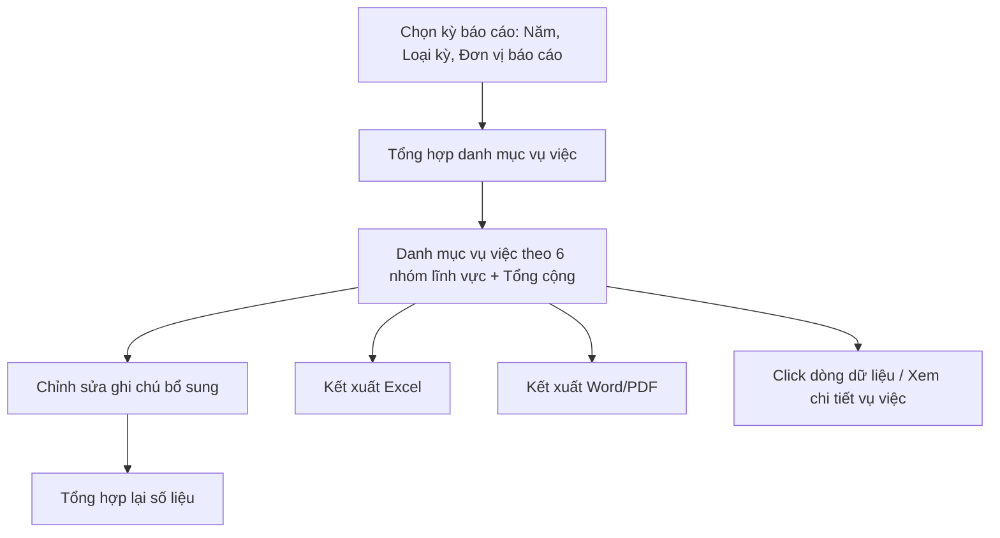

#### 4.3.3.21. UCPS019 - Danh mục vụ việc giải quyết yêu cầu bồi thường (Mẫu số 01-TT08)

##### 4.3.3.21.1. Mục đích

\- Cho phép cán bộ nghiệp vụ BTNN tổng hợp, rà soát và kết xuất Danh mục vụ việc giải quyết yêu cầu bồi thường theo đúng Mẫu số 01 ban hành kèm Thông tư 08/2019/TT-BTP (Điều 10), phục vụ báo cáo công tác bồi thường nhà nước (BTNN) định kỳ.

\- Dữ liệu vụ việc được hệ thống tự động tổng hợp từ các module Tiếp nhận YCBT, Giải quyết yêu cầu bồi thường, Quyết định giải quyết bồi thường, Cấp kinh phí bồi thường; cán bộ chỉ bổ sung nội dung thuyết minh (khó khăn, vướng mắc, ghi chú) trước khi kết xuất.

*a. Phân quyền*

\- Cán bộ nghiệp vụ BTNN: được tra cứu, tạo kỳ tổng hợp, chỉnh sửa nội dung thuyết minh (khó khăn/vướng mắc, ghi chú) và kết xuất biểu mẫu.

\- Lãnh đạo: được tra cứu, xem chi tiết và kết xuất biểu mẫu; không chỉnh sửa nội dung thuyết minh.

*b. Điều kiện thực hiện*

\- Người dùng đã đăng nhập thành công vào Website quản trị.

\- Người dùng được phân quyền truy cập màn hình `Danh mục vụ việc giải quyết yêu cầu bồi thường (Mẫu số 01-TT08)`.

\- Loại cơ quan báo cáo Tham chiếu Danh mục Loại cơ quan báo cáo [DM_43]. Loại kỳ báo cáo Tham chiếu Danh mục Loại kỳ báo cáo [DM_44]. Lĩnh vực phát sinh thiệt hại Tham chiếu Danh mục Lĩnh vực phát sinh thiệt hại [DM_22].

\- Nguồn dữ liệu vụ việc lấy từ trường `Mã vụ việc`, `Tên vụ việc`, `Họ và tên người yêu cầu bồi thường`, `Địa chỉ chi tiết`/`Tỉnh/TP`, `Cơ quan giải quyết bồi thường`, `Pháp luật áp dụng để giải quyết bồi thường`, `Thời điểm tiếp nhận`, `Trạng thái` đã đặc tả tại SRS Tiếp nhận YCBT và Giải quyết yêu cầu bồi thường.

---

##### 4.3.3.21.2. Sơ đồ luồng nghiệp vụ theo giao diện

---

##### 4.3.3.21.3. MH01 - Màn hình Danh mục vụ việc giải quyết yêu cầu bồi thường

###### 4.3.3.21.3.1. Màn hình

###### 4.3.3.21.3.2. Mô tả thông tin trên màn hình

| Trường thông tin | Kiểu dữ liệu | Bắt buộc | Mặc định | Mô tả |
| :--- | :--- | :--- | :--- | :--- |
| **I. Khối chọn kỳ báo cáo** | | | | |
| Năm báo cáo | Enum(String(10)) | Có | Năm hiện tại | Giá trị gồm 05 năm gần nhất tính đến năm hiện tại. |
| Loại kỳ báo cáo | Enum(String(100)) | Có | `Báo cáo năm số liệu thực tế (01/01 - 31/10)` | Tham chiếu Danh mục Loại kỳ báo cáo [DM_44]. Xác định khoảng thời gian lấy số liệu tương ứng (01/01-31/10 hoặc 01/01-31/12 của năm báo cáo). |
| Đơn vị báo cáo | Enum(String(255)) | Có | Theo đơn vị đăng nhập | Tham chiếu Danh mục Cơ quan, Đơn vị giải quyết [DM_DON_VI]. Cho phép tìm kiếm nhanh theo `Mã đơn vị` hoặc `Tên đơn vị`; áp dụng tìm gần đúng. |
| Loại cơ quan báo cáo | Enum(String(100)) | Có | `UBND cấp tỉnh` | Tham chiếu Danh mục Loại cơ quan báo cáo [DM_43]. |
| **II. Bộ lọc bổ sung** | | | | |
| Lĩnh vực phát sinh thiệt hại | Enum(String(100)) | Không | `Tất cả` | Tham chiếu Danh mục Lĩnh vực phát sinh thiệt hại [DM_22]. |
| Từ khóa | String(255) | Không | Trống | Tìm kiếm gần đúng theo `Mã vụ việc`, `Tên vụ việc` hoặc `Họ và tên người yêu cầu bồi thường`. |
| **III. Bảng danh mục vụ việc** | | | | |
| Nhóm dòng theo lĩnh vực | String(255) | - | Theo dữ liệu | Chỉ đọc. Vụ việc được nhóm theo 06 lĩnh vực phát sinh thiệt hại [DM_22], đánh số nhóm bằng số La Mã `I`, `II`, `III`, `IV`, `V`, `VI` tương ứng (Quản lý hành chính, Tố tụng hình sự, Tố tụng dân sự, Tố tụng hành chính, Thi hành án hình sự, Thi hành án dân sự). Dòng tiêu đề mỗi nhóm hiển thị số La Mã tại cột `STT`, còn tên nhóm lĩnh vực **merge (colspan) từ cột (1) đến hết cột (8)** thành một ô duy nhất, đúng bố cục Mẫu số 01-TT08 gốc. |
| Cột: STT | Integer(10) | - | Tự tăng | Chỉ đọc. Tại dòng tiêu đề nhóm hiển thị số La Mã của nhóm; tại dòng vụ việc đánh số thứ tự 1, 2, 3... theo thứ tự hiển thị trong từng nhóm lĩnh vực (không đánh số liên tục toàn bảng). |
| Cột (1): Họ và tên của người yêu cầu bồi thường | String(100) | - | Theo dữ liệu | Chỉ đọc. Với tổ chức, hiển thị tên tổ chức kèm người đại diện theo pháp luật nếu có. |
| Cột (2): Địa chỉ của người yêu cầu bồi thường | String(500) | - | Theo dữ liệu | Chỉ đọc. Hiển thị dạng `[Địa chỉ chi tiết], [Tỉnh/TP]`. |
| Cột (3): Cơ quan giải quyết bồi thường | String(255) | - | Theo dữ liệu | Chỉ đọc. |
| Cột (4): Pháp luật áp dụng để giải quyết bồi thường | Enum(String(100)) | - | Theo dữ liệu | Chỉ đọc. Hiển thị đúng giá trị đã ghi nhận tại bước nhập liệu hồ sơ vụ việc. |
| Cột (5): Tình hình giải quyết bồi thường | Text(1000) | - | Hệ thống tự tổng hợp | Chỉ đọc. Hệ thống tự sinh mô tả ngắn theo `Trạng thái` hiện tại và mốc xử lý chính (ngày thụ lý, ngày hoàn thành xác minh, ngày thương lượng, ngày ban hành quyết định) theo dữ liệu Timeline xử lý của vụ việc. |
| Cột (6): Chi trả tiền bồi thường | Text(500) | - | Hệ thống tự tổng hợp | Chỉ đọc. Hiển thị tình trạng và số tiền đã chi trả theo dữ liệu từ Quản lý kinh phí bồi thường; hiển thị `Chưa chi trả` nếu chưa phát sinh. |
| Cột (7): Khó khăn, vướng mắc | Text(1000) | - | Theo dữ liệu | Chỉ đọc. Lấy từ `Danh sách khó khăn, vướng mắc` ghi nhận tại accordion `Khó khăn, vướng mắc` của vụ việc (SRS Giải quyết yêu cầu bồi thường); mỗi dòng vướng mắc hiển thị dạng `[Giai đoạn phát sinh] - [Loại vướng mắc]: [Mô tả chi tiết]`, các dòng phân tách bằng ` `. Hiển thị trống nếu vụ việc chưa ghi nhận khó khăn, vướng mắc nào. |
| Cột (8): Ghi chú | Text(500) | Không | Trống | Cho phép cán bộ nhập bổ sung thông tin phục vụ quản lý. |
| Dòng Tổng cộng | Integer(10) | - | Hệ thống tính | Chỉ đọc. Hiển thị tại cột `STT` chữ `Tổng cộng`, số liệu tổng số vụ việc của toàn bộ 06 nhóm lĩnh vực hiển thị tại các cột số liệu tương ứng (nếu có); không merge dòng này. |
| Trạng thái kỳ tổng hợp | Enum(String(50)) | - | `Nháp` | \- Giá trị gồm: + Nháp + Đã kết xuất |

###### 4.3.3.21.3.3. Chức năng trên màn hình

| STT | Tên chức năng | Định dạng | Mô tả |
| :--- | :--- | :--- | :--- |
| 1 | Tổng hợp danh mục | Button | TH1 (Không có vụ việc phù hợp): Hệ thống hiển thị bảng danh mục trống kèm thông báo không có dữ liệu. |
|  |  |  | TH2 (Có dữ liệu): Hệ thống tổng hợp toàn bộ vụ việc có `Thời điểm tiếp nhận` hoặc trạng thái xử lý phát sinh trong khoảng thời gian của `Loại kỳ báo cáo` đã chọn, nhóm theo 06 lĩnh vực phát sinh thiệt hại, tính dòng `Tổng cộng` và hiển thị lên bảng danh mục ở trạng thái kỳ tổng hợp `Nháp`. |
| 2 | Tìm kiếm | Button | Hệ thống lọc bảng danh mục đang hiển thị theo `Lĩnh vực phát sinh thiệt hại`, `Từ khóa` đã nhập, không thực hiện tổng hợp lại từ đầu. - **TH Không có dữ liệu trả về**: + Bảng kết quả: Hiển thị dòng thông báo rỗng *"Không tìm thấy dữ liệu phù hợp với điều kiện tìm kiếm."* ở giữa bảng. + Thanh phân trang (Pagination): Dòng số lượng hiển thị *"Hiển thị 0-0 của 0 bản ghi"* (hoặc *"Hiển thị 0-0 của 0 yêu cầu"*); các nút điều hướng trang (`&#124;&lt;&lt;`, `&lt;`, các số trang, `&gt;`, `&gt;&gt;&#124;`) ở trạng thái ẩn hoặc khóa mờ (Disabled). + Nút "Kết xuất Excel" (nếu màn hình có nút này): Thiết lập ở trạng thái khóa mờ (Disabled) kèm tooltip: *"Không có dữ liệu để kết xuất Excel"*. |
| 3 | Chỉnh sửa ghi chú | Icon button | Chỉ hiển thị với cán bộ nghiệp vụ BTNN. Hệ thống mở **Popup Chỉnh sửa ghi chú** cho dòng vụ việc được chọn. |
| 4 | Click dòng dữ liệu | Row click | Hệ thống mở màn hình chi tiết vụ việc tương ứng (SRS Giải quyết yêu cầu bồi thường) ở chế độ chỉ xem, tại một tab riêng; không thực hiện khi click vào icon `Chỉnh sửa ghi chú`. |
| 5 | Kết xuất Excel | Button | Hệ thống kết xuất toàn bộ bảng danh mục hiện hành (đã nhóm theo lĩnh vực, có dòng Tổng cộng) ra file Excel theo đúng cấu trúc Mẫu số 01-TT08 và hiển thị [MSG-SUC-SYS-002]. |
| 6 | Kết xuất Word/PDF | Button | Hệ thống kết xuất bảng danh mục hiện hành ra file Word/PDF theo đúng cấu trúc Mẫu số 01-TT08 để trình ký, cập nhật `Trạng thái kỳ tổng hợp` sang `Đã kết xuất` và hiển thị [MSG-SUC-SYS-002]. |

---

##### 4.3.3.21.4. Popup Chỉnh sửa ghi chú

###### 4.3.3.21.4.1. Màn hình

###### 4.3.3.21.4.2. Mô tả thông tin trên màn hình

| Trường thông tin | Kiểu dữ liệu | Bắt buộc | Mặc định | Mô tả |
| :--- | :--- | :--- | :--- | :--- |
| Tiêu đề popup | String(255) | - | - | Chỉ đọc. `Chỉnh sửa ghi chú - [Mã vụ việc]`. |
| Mã vụ việc | String(50) | - | Theo dữ liệu | Chỉ đọc. |
| Tên vụ việc | String(255) | - | Theo dữ liệu | Chỉ đọc. |
| Khó khăn, vướng mắc | Text(1000) | - | Theo dữ liệu | Chỉ đọc. Hiển thị lại đúng nội dung đã tổng hợp từ accordion `Khó khăn, vướng mắc` của vụ việc để cán bộ tham khảo, đối chiếu khi nhập ghi chú; không cho chỉnh sửa tại đây. |
| Ghi chú | Text(500) | Không | Theo dữ liệu hiện tại | Nhập ghi chú bổ sung phục vụ báo cáo. |
| Hủy bỏ | - | Không | Hiển thị | Đóng popup, không lưu dữ liệu. |
| Lưu lại | - | Không | Hiển thị | Chi tiết nghiệp vụ xem tại bảng Chức năng trên màn hình. |

###### 4.3.3.21.4.3. Chức năng trên màn hình

| STT | Tên chức năng | Định dạng | Mô tả |
| :--- | :--- | :--- | :--- |
| 1 | Hủy bỏ | Button | Hệ thống đóng popup, không lưu dữ liệu. |
| 2 | Lưu lại | Button | Hệ thống lưu nội dung `Ghi chú` vào đúng dòng vụ việc, đóng popup, cập nhật lại bảng danh mục và hiển thị [MSG-SUC-SYS-002]. |

---

##### 4.3.3.21.5. Ghi chú phạm vi đặc tả

\- Bảng danh mục trên màn hình hiển thị đúng và chỉ đúng **08 cột đánh số (1) đến (8)** theo Mẫu số 01-TT08 gốc (Điều 10 Thông tư 08/2019/TT-BTP), cùng cột `STT` không đánh số thứ tự (n): `Họ và tên của người yêu cầu bồi thường (1)`, `Địa chỉ của người yêu cầu bồi thường (2)`, `Cơ quan giải quyết bồi thường (3)`, `Pháp luật áp dụng để giải quyết bồi thường (4)`, `Tình hình giải quyết bồi thường (5)`, `Chi trả tiền bồi thường (6)`, `Khó khăn, vướng mắc (7)`, `Ghi chú (8)`. Không hiển thị thêm cột `Mã vụ việc`/`Tên vụ việc` trên bảng; `Mã vụ việc` chỉ dùng nội bộ hệ thống để liên kết dữ liệu, tìm kiếm theo `Từ khóa` và mở màn hình chi tiết vụ việc.

\- Dòng tiêu đề mỗi nhóm lĩnh vực (`I`, `II`, `III`, `IV`, `V`, `VI`) merge (colspan) nội dung tên nhóm từ cột (1) đến hết cột (8) thành một ô, số La Mã của nhóm hiển thị riêng tại cột `STT`. Dòng `Tổng cộng` ở cuối bảng không merge.

\- Cột `Tình hình giải quyết bồi thường`, `Chi trả tiền bồi thường` và `Khó khăn, vướng mắc` đều do hệ thống tự tổng hợp từ dữ liệu vụ việc, không chỉnh sửa trực tiếp trên màn hình báo cáo; muốn thay đổi nội dung phải cập nhật lại tại hồ sơ vụ việc (SRS Giải quyết yêu cầu bồi thường), sau đó bấm `Tổng hợp danh mục` để tổng hợp lại. Cán bộ nghiệp vụ BTNN chỉ được phép nhập bổ sung cột `Ghi chú` tại **Popup Chỉnh sửa ghi chú**.

\- Một `Mã vụ việc` chỉ được tính một lần trong cùng kỳ báo cáo và cùng nhóm lĩnh vực phát sinh thiệt hại.

\- Kỳ tổng hợp ở trạng thái `Nháp` cho phép bấm `Tổng hợp danh mục` để tổng hợp lại khi dữ liệu nghiệp vụ thay đổi; sau khi chuyển `Đã kết xuất`, lần kết xuất tiếp theo tạo phiên bản file mới, không ghi đè phiên bản đã kết xuất trước đó.
