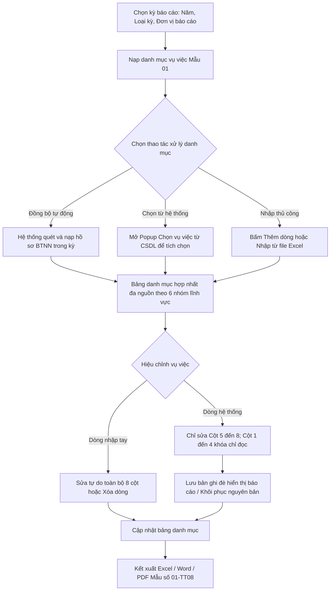

### 4.3.3.21. Danh mục vụ việc giải quyết yêu cầu bồi thường (Mẫu số 01-TT08)

#### 1. Mục đích
Cho phép quản lý danh mục vụ việc giải quyết yêu cầu bồi thường theo Mẫu số 01 ban hành kèm Thông tư 08/2019/TT-BTP (Điều 10), bao gồm:
- Tổng hợp, rà soát và kết xuất danh sách chi tiết các vụ việc giải quyết yêu cầu bồi thường trong năm/kỳ báo cáo theo 06 nhóm lĩnh vực phát sinh thiệt hại.
- Hỗ trợ cơ chế bán tự động và hợp nhất đa nguồn: Đồng bộ tự động các vụ việc từ cơ sở dữ liệu hồ sơ bồi thường nhà nước trên hệ thống, đồng thời cho phép chọn bổ sung vụ việc từ hệ thống hoặc nhập liệu thủ công các vụ việc phát sinh ngoài phần mềm.
- Áp dụng cơ chế chỉnh sửa phân tầng có kiểm soát: Khóa chỉ đọc các thông tin định danh và pháp lý gốc của vụ việc hệ thống; cho phép hiệu chỉnh linh hoạt nội dung thuyết minh, tiến độ, chi trả, khó khăn vướng mắc và ghi chú cho riêng kỳ báo cáo mà không làm sai lệch dữ liệu gốc trong hồ sơ nghiệp vụ.
- Hỗ trợ nhập liệu nhanh danh mục vụ việc ngoài hệ thống qua file mẫu Excel và kết xuất biểu mẫu Mẫu 01 ra file Excel, Word/PDF phục vụ công tác báo cáo định kỳ.

*a. Phân quyền*
- Cán bộ nghiệp vụ BTNN: Được tra cứu, tạo kỳ tổng hợp, đồng bộ dữ liệu hệ thống, chọn bổ sung vụ việc, nhập tay thêm dòng, chỉnh sửa nội dung thuyết minh, nhập từ Excel và kết xuất biểu mẫu.
- Lãnh đạo: Được tra cứu, xem chi tiết và kết xuất biểu mẫu; không trực tiếp chỉnh sửa nội dung.

*b. Điều kiện thực hiện*
- Người dùng đã đăng nhập thành công vào hệ thống Website quản trị.
- Người dùng được phân quyền truy cập chức năng Danh mục vụ việc giải quyết yêu cầu bồi thường (Mẫu số 01-TT08).
- Các danh mục dùng chung đã được thiết lập: Danh mục Loại cơ quan báo cáo [DM_43], Danh mục Loại kỳ báo cáo [DM_44], Danh mục Lĩnh vực phát sinh thiệt hại [DM_22], Danh mục Cơ quan, Đơn vị giải quyết [DM_DON_VI], Danh mục Trạng thái vụ việc yêu cầu bồi thường [DM_24].
- Cơ sở dữ liệu hồ sơ nghiệp vụ bồi thường nhà nước đã sẵn sàng kết nối dữ liệu từ các bước Tiếp nhận YCBT, Giải quyết yêu cầu bồi thường, Quyết định giải quyết bồi thường, Cấp kinh phí và Chi trả.

---

#### 2. Sơ đồ luồng nghiệp vụ theo giao diện

---

### MH01 - Màn hình Danh mục vụ việc giải quyết yêu cầu bồi thường

#### 1. Màn hình

#### 2. Mô tả thông tin trên màn hình

| Trường thông tin | Kiểu dữ liệu | Bắt buộc | Mặc định | Mô tả |
| :--- | :--- | :--- | :--- | :--- |
| **I. Khối chọn kỳ báo cáo** | | | | |
| Năm báo cáo | Enum(String(10)) | Có | Năm hiện tại | Control UI: Combobox. Giá trị gồm 05 năm gần nhất tính đến năm hiện tại. |
| Loại kỳ báo cáo | Enum(String(100)) | Có | `Báo cáo năm số liệu thực tế (01/01 - 31/10)` | Control UI: Combobox. Tham chiếu Danh mục Loại kỳ báo cáo [DM_44]. Xác định khoảng thời gian lấy số liệu tương ứng (01/01-31/10 hoặc 01/01-31/12 của năm báo cáo). |
| Đơn vị báo cáo | Enum(String(255)) | Có | Theo đơn vị đăng nhập | Control UI: Combobox có tìm kiếm nhanh. Tham chiếu Danh mục Cơ quan, Đơn vị giải quyết [DM_DON_VI]. Cho phép tìm kiếm nhanh theo `Mã đơn vị` hoặc `Tên đơn vị`; áp dụng tìm gần đúng. |
| Loại cơ quan báo cáo | Enum(String(100)) | Có | `UBND cấp tỉnh` | Control UI: Combobox. Tham chiếu Danh mục Loại cơ quan báo cáo [DM_43]. |
| **II. Bộ lọc bổ sung** | | | | |
| Lĩnh vực phát sinh thiệt hại | Enum(String(100)) | Không | `Tất cả` | Control UI: Combobox. Tham chiếu Danh mục Lĩnh vực phát sinh thiệt hại [DM_22]. |
| Từ khóa | String(255) | Không | Trống | Control UI: Textbox. Tìm kiếm gần đúng theo `Mã vụ việc`, `Tên vụ việc` hoặc `Họ và tên của người yêu cầu bồi thường`. |
| Nút: Xóa bộ lọc | Button | Không | Hiển thị | Control UI: Button. Luôn hiển thị ở trạng thái khả dụng. |
| Nút: Tìm kiếm | Button | Không | Hiển thị | Control UI: Button. Luôn hiển thị ở trạng thái khả dụng. |
| **III. Thanh công cụ Toolbar Mẫu 01** | | | | |
| Nút: Đồng bộ từ hệ thống | Button | Không | Hiển thị | Control UI: Button (icon `fa-rotate`). - Hiển thị khả dụng với cán bộ nghiệp vụ BTNN khi kỳ báo cáo ở trạng thái `Đang nhập liệu` hoặc `Nháp`. - Khóa mờ khi kỳ báo cáo ở trạng thái `Đã gửi chờ duyệt`, `Đã duyệt` hoặc `Hoàn thành`. |
| Nút: Chọn vụ việc từ hệ thống | Button | Không | Hiển thị | Control UI: Button (icon `fa-list-check`). - Hiển thị khả dụng khi kỳ báo cáo ở trạng thái cho phép nhập liệu. - Khóa mờ khi kỳ báo cáo đã gửi hoặc đã duyệt. |
| Nút: Thêm vụ việc thủ công | Button | Không | Hiển thị | Control UI: Button (icon `fa-plus`). - Hiển thị khả dụng khi kỳ báo cáo ở trạng thái cho phép nhập liệu. - Khóa mờ khi kỳ báo cáo đã gửi hoặc đã duyệt. |
| Nút: Nhập từ Excel | Button | Không | Hiển thị | Control UI: Button (icon `fa-file-import`). - Hiển thị khả dụng khi kỳ báo cáo ở trạng thái cho phép nhập liệu. - Khóa mờ khi kỳ báo cáo đã gửi hoặc đã duyệt. |
| Nút: Kết xuất Excel | Button | Không | Hiển thị | Control UI: Button (icon `fa-file-excel`). - Hiển thị khả dụng khi bảng có dữ liệu. - Khóa mờ kèm tooltip *"Không có dữ liệu để kết xuất Excel"* khi bảng danh mục không có bản ghi nào. |
| Nút: Kết xuất Word/PDF | Button | Không | Hiển thị | Control UI: Button (icon `fa-file-pdf`). - Hiển thị khả dụng khi bảng có dữ liệu. - Khóa mờ khi bảng danh mục trống. |
| **IV. Bảng danh mục vụ việc Mẫu 01** | - | - | 20 bản ghi/trang | Control UI: Data grid. - Khi người dùng truy cập màn hình, hệ thống tự động tải trang đầu tiên (Trang 1) với số lượng mặc định 20 bản ghi. - Sắp xếp mặc định: Sắp xếp theo thứ tự nhóm lĩnh vực I đến VI, trong từng nhóm sắp xếp theo số thứ tự tăng dần. - Trạng thái có dữ liệu: Hiển thị danh sách các bản ghi kết quả theo cấu trúc 8 cột nguyên văn Thông tư 08. - Trạng thái không có dữ liệu (Empty State): Khi không có bản ghi phù hợp, bảng hiển thị duy nhất 01 dòng căn giữa trên toàn bộ chiều rộng bảng (`colspan`), in nghiêng với nội dung theo MessageList dùng chung [MSG-INF-SYS-001]. |
| Nhóm dòng theo lĩnh vực | String(255) | - | Theo dữ liệu | Control UI: Table group row. Chỉ đọc. Vụ việc được phân thành 06 nhóm lĩnh vực theo [DM_22], đánh số La Mã `I`, `II`, `III`, `IV`, `V`, `VI` tương ứng (Quản lý hành chính, Tố tụng hình sự, Tố tụng dân sự, Tố tụng hành chính, Thi hành án hình sự, Thi hành án dân sự). Dòng tiêu đề nhóm hiển thị số La Mã tại cột `STT`, tên nhóm lĩnh vực merge (colspan) từ Cột (1) đến hết Cột (8) thành một ô duy nhất. Kèm số lượng vụ việc và nút `+ Thêm dòng` nhanh cho riêng nhóm đó. |
| Cột: STT | Integer(10) | - | Tự tăng | Control UI: Text. Chỉ đọc. Tại dòng tiêu đề nhóm hiển thị số La Mã; tại dòng vụ việc đánh số thứ tự 1, 2, 3... trong từng nhóm lĩnh vực (không đánh số liên tục toàn bảng). Hiển thị kèm Badge nguồn gốc: `[Hệ thống]` (màu xanh dương) hoặc `[Nhập tay]` (màu cam nhạt). |
| Cột (1): Họ và tên của người yêu cầu bồi thường | String(100) | Có | Theo dữ liệu | Control UI: Text / Link. - Đối với dòng hệ thống: Hiển thị dạng liên kết văn bản màu xanh; khóa chỉ đọc trên bảng Mẫu 01. - Đối với dòng nhập tay: Cho phép nhập/sửa trực tiếp; với tổ chức ghi tên tổ chức kèm người đại diện theo pháp luật nếu có. |
| Cột (2): Địa chỉ của người yêu cầu bồi thường | String(500) | Không | Theo dữ liệu | Control UI: Text. - Đối với dòng hệ thống: Khóa chỉ đọc. Hiển thị dạng `[Địa chỉ chi tiết], [Phường/Xã], [Tỉnh/Thành phố]`. - Đối với dòng nhập tay: Cho phép nhập/sửa trực tiếp. |
| Cột (3): Cơ quan giải quyết bồi thường | String(255) | Có | Theo dữ liệu | Control UI: Text / Combobox autocomplete. - Đối với dòng hệ thống: Khóa chỉ đọc. - Đối với dòng nhập tay: Cho phép chọn gợi ý từ danh mục cơ quan hành chính [DM_DON_VI] hoặc nhập tay tên cơ quan giải quyết. |
| Cột (4): Pháp luật áp dụng để giải quyết bồi thường | Enum(String(100)) | Có | Theo dữ liệu | Control UI: Combobox. - Đối với dòng hệ thống: Khóa chỉ đọc. - Đối với dòng nhập tay: Cho phép chọn 1 trong 4 giá trị quy định: + Luật Trách nhiệm bồi thường của Nhà nước năm 2017 + Luật Trách nhiệm bồi thường của Nhà nước năm 2009 + Nghị quyết số 388/2003/NQ-UBTVQH11 ngày 17/03/2003 + Nghị định số 47-CP ngày 03/05/1997 |
| Cột (5): Tình hình giải quyết bồi thường | Text(1000) | Có | Theo dữ liệu | Control UI: Textarea. - Áp dụng cơ chế Controlled Override: Cho phép cán bộ hiệu chỉnh trực tiếp trên cả dòng hệ thống và dòng nhập tay. - Đối với dòng hệ thống: Mặc định điền câu tóm tắt tự động theo Timeline xử lý; khi cán bộ sửa, hệ thống gắn nhãn `[Đã hiệu chỉnh]` và lưu riêng cho kỳ báo cáo. |
| Cột (6): Chi trả tiền bồi thường | Text(500) | Không | Theo dữ liệu | Control UI: Textarea. - Áp dụng cơ chế Controlled Override: Cho phép hiệu chỉnh trực tiếp trên cả dòng hệ thống và dòng nhập tay. - Đối với dòng hệ thống: Mặc định lấy tình trạng và số tiền đã chi trả từ module kinh phí; hiển thị `Chưa chi trả` nếu chưa phát sinh chi trả. |
| Cột (7): Khó khăn, vướng mắc | Text(1000) | Không | Theo dữ liệu | Control UI: Textarea. - Áp dụng cơ chế Controlled Override: Cho phép hiệu chỉnh trực tiếp trên cả dòng hệ thống và dòng nhập tay. - Đối với dòng hệ thống: Mặc định lấy từ danh sách khó khăn, vướng mắc của hồ sơ vụ việc; hiển thị trống nếu vụ việc chưa ghi nhận vướng mắc. |
| Cột (8): Ghi chú | Text(500) | Không | Trống | Control UI: Textarea. Cho phép cán bộ nhập bổ sung thông tin phục vụ quản lý cho mọi dòng dữ liệu. |
| Cột: Thao tác | Action buttons | - | - | Control UI: Group icon button. Cố định 03 slot thao tác cho mỗi dòng: - Slot 1 (Icon Chỉnh sửa `fa-pen-to-square`): Luôn hiển thị khả dụng khi kỳ báo cáo cho phép nhập liệu; mở MH02. - Slot 2 (Icon Khôi phục nguyên bản `fa-rotate-left`): Hiển thị khả dụng đối với dòng hệ thống đã có hiệu chỉnh ở Cột 5 đến 8; hiển thị mờ đối với dòng nhập tay hoặc dòng hệ thống chưa sửa. - Slot 3 (Icon Xóa / Loại trừ `fa-trash-can`): Hiển thị khả dụng khi kỳ cho phép nhập liệu; xóa dòng nhập tay hoặc chuyển dòng hệ thống sang diện loại trừ. |
| Dòng Tổng cộng | Integer(10) | - | Hệ thống tính | Control UI: Table total row. Chỉ đọc. Hiển thị chữ `Tổng cộng` tại cột `STT`, số liệu tổng số vụ việc của toàn bộ 06 nhóm lĩnh vực hiển thị tại Cột (1); không merge dòng này. |
| Trạng thái kỳ tổng hợp | Enum(String(50)) | - | `Nháp` | Control UI: Badge. Giá trị gồm: + Nháp + Đã gửi chờ duyệt + Yêu cầu chỉnh lý + Đã kết xuất |
| Phân trang | String(255) | Không | 20 bản ghi/trang | Control UI: Pagination. - Cho phép chọn cấu hình số lượng bản ghi hiển thị: 10, 20, 50, 100 bản ghi/trang; mặc định chọn sẵn 20 bản ghi/trang. - Đầy đủ các nút điều hướng trang: Đầu (&#124;&lt;&lt;), Trước (&lt;), các số trang, Sau (&gt;), Cuối (&gt;&gt;&#124;). - Hiển thị dải bản ghi: "Hiển thị [từ] - [đến] của [tổng số] bản ghi". |

#### 3. Chức năng trên màn hình

| STT | Tên chức năng | Định dạng | Mô tả |
| :--- | :--- | :--- | :--- |
| 1 | Xóa bộ lọc | Button | Hệ thống đặt lại các giá trị lọc về mặc định ban đầu: `Lĩnh vực phát sinh thiệt hại = Tất cả`, `Từ khóa = Trống`, làm mới lại bảng danh mục và đưa về Trang 1. |
| 2 | Tìm kiếm | Button | Khi người dùng click nút, hệ thống kiểm tra điều kiện dữ liệu và thực hiện tìm kiếm: **TH1 - Khoảng ngày không hợp lệ**: Nếu `Từ ngày` lớn hơn `Đến ngày`, vi phạm [BR-VAL-007], hệ thống hiển thị cảnh báo lỗi [MSG-ERR-VAL-007] và không thực hiện tìm kiếm. **TH Hợp lệ (Có dữ liệu phù hợp)**: Hệ thống lọc và hiển thị danh sách các bản ghi thỏa mãn đồng thời các tiêu chí lọc, hiển thị kết quả lên bảng và đưa về Trang 1. **TH Không có dữ liệu trả về**: Bảng kết quả hiển thị duy nhất 01 dòng căn giữa `colspan`, in nghiêng nội dung [MSG-INF-SYS-001]; thanh phân trang hiển thị *"Hiển thị 0-0 của 0 bản ghi"*, nút Kết xuất Excel ở trạng thái khóa mờ kèm tooltip *"Không có dữ liệu để kết xuất Excel"*. |
| 3 | Đồng bộ từ hệ thống | Button | Khi người dùng click nút, hệ thống kiểm tra và thực hiện đồng bộ: **TH1 - Kỳ báo cáo đã bị khóa**: Nếu kỳ ở trạng thái `Đã gửi chờ duyệt` hoặc `Đã duyệt`, hệ thống cảnh báo không cho đồng bộ. **TH Hợp lệ**: Hệ thống quét toàn bộ hồ sơ BTNN thuộc thẩm quyền của đơn vị có thời điểm tiếp nhận hoặc mốc xử lý trong kỳ báo cáo. Tự động ánh xạ dữ liệu vào 06 nhóm lĩnh vực và điền sẵn Cột (1) đến Cột (7). Nếu phát hiện dòng hệ thống đã có hiệu chỉnh thủ công trước đó, hệ thống hiển thị xác nhận [MSG-CFM-SYS-001] hỏi người dùng có muốn giữ lại câu thuyết minh đã chỉnh sửa hay ghi đè mới. Quá trình đồng bộ tuyệt đối không xóa các dòng do người dùng đã nhập tay. Hiển thị thông báo thành công [MSG-SUC-SYS-002]. |
| 4 | Chọn vụ việc từ hệ thống | Button | Hệ thống mở **MH03 - Popup Chọn vụ việc từ hệ thống** để người dùng tìm kiếm và tích chọn bổ sung các hồ sơ BTNN đưa vào danh mục Mẫu 01. |
| 5 | Thêm vụ việc thủ công | Button | Hệ thống thêm 01 dòng rỗng vào cuối nhóm lĩnh vực đang chọn hoặc mở **MH02 - Popup Chỉnh sửa vụ việc Mẫu 01** ở chế độ thêm mới cho dòng nhập tay, focus con trỏ vào ô `Họ và tên của người yêu cầu bồi thường`. |
| 6 | Nhập từ Excel | Button | Hệ thống mở popup tiếp nhận file Excel danh mục Mẫu 01 theo đúng quy chuẩn Mục 5.6 của 04_Danh_muc_va_Phu_luc.md. Sau khi kiểm tra định dạng và dữ liệu hợp lệ, hệ thống tự động nạp các dòng vụ việc vào đúng 06 nhóm lĩnh vực tương ứng trên bảng. |
| 7 | Chỉnh sửa vụ việc | Icon button | Hệ thống mở **MH02 - Popup Chỉnh sửa vụ việc Mẫu 01** với dữ liệu của dòng được chọn để cán bộ xem chi tiết và hiệu chỉnh. |
| 8 | Khôi phục nguyên bản | Icon button | Áp dụng cho dòng hệ thống đã có hiệu chỉnh ở Cột (5) đến (8). Hệ thống hiển thị hộp thoại xác nhận [MSG-CFM-SYS-001]; sau khi xác nhận, hệ thống xóa bỏ bản ghi đè hiển thị, khôi phục lại nguyên bản các câu tóm tắt tự động do hệ thống sinh ban đầu và hiển thị [MSG-SUC-SYS-002]. |
| 9 | Xóa / Loại trừ vụ việc | Icon button | Khi người dùng click icon xóa: **TH1 - Dòng nhập tay**: Hệ thống hiển thị xác nhận [MSG-CFM-SYS-001]; sau xác nhận, xóa hoàn toàn dòng này khỏi bảng danh mục và cập nhật lại dòng Tổng cộng. **TH2 - Dòng hệ thống**: Hệ thống hiển thị xác nhận loại trừ; sau xác nhận, chuyển trạng thái dòng thành `Đã loại trừ khỏi kỳ báo cáo`, tạm ẩn khỏi bảng hiển thị và không tính vào dòng Tổng cộng. Cung cấp chức năng khôi phục khi cần. |
| 10 | Click Họ tên người yêu cầu | Link click | Chỉ áp dụng cho dòng hệ thống. Hệ thống mở màn hình chi tiết vụ việc tương ứng ở chế độ chỉ xem tại một tab mới của trình duyệt; không thực hiện khi click các ô khác. |
| 11 | Kết xuất Excel | Button | Áp dụng quy chuẩn Mục 5.5 của 04_Danh_muc_va_Phu_luc.md. Hệ thống kết xuất toàn bộ dữ liệu danh mục hiện hành (đầy đủ 06 nhóm lĩnh vực, đúng 100% tiêu đề 8 cột và dòng Tổng cộng) ra file Excel theo mẫu Mẫu số 01-TT08 và hiển thị [MSG-SUC-SYS-002]. |
| 12 | Kết xuất Word/PDF | Button | Hệ thống kết xuất bảng danh mục hiện hành ra file Word/PDF theo đúng thể thức văn bản hành chính để trình ký, cập nhật trạng thái kỳ sang `Đã kết xuất` và hiển thị [MSG-SUC-SYS-002]. |

---

### MH02 - Popup Chỉnh sửa vụ việc Mẫu 01

#### 1. Màn hình

#### 2. Mô tả thông tin trên màn hình

| Trường thông tin | Kiểu dữ liệu | Bắt buộc | Mặc định | Mô tả |
| :--- | :--- | :--- | :--- | :--- |
| Tiêu đề popup | String(255) | - | - | Control UI: Modal Header. Chỉ đọc. Hiển thị `Chỉnh sửa vụ việc Mẫu 01 - [Mã vụ việc]` hoặc `Thêm mới vụ việc thủ công`. |
| Nguồn dữ liệu | Enum(String(50)) | - | Theo dữ liệu | Control UI: Badge. Chỉ đọc. Hiển thị `[Hệ thống]` hoặc `[Nhập tay]`. |
| Nhóm lĩnh vực | Enum(String(100)) | Có | Theo dòng | Control UI: Combobox. Tham chiếu Danh mục Lĩnh vực phát sinh thiệt hại [DM_22]. Cho phép thay đổi nhóm lĩnh vực đối với dòng nhập tay; khóa chỉ đọc đối với dòng hệ thống. |
| Họ và tên của người yêu cầu bồi thường | String(100) | Có | Theo dữ liệu | Control UI: Textbox. - Đối với dòng hệ thống: Khóa chỉ đọc (`Disabled`). - Đối với dòng nhập tay: Cho phép nhập/sửa; áp dụng [BR-VAL-001]. |
| Địa chỉ của người yêu cầu bồi thường | String(500) | Không | Theo dữ liệu | Control UI: Textarea. - Đối với dòng hệ thống: Khóa chỉ đọc (`Disabled`). - Đối với dòng nhập tay: Cho phép nhập địa chỉ chi tiết. |
| Cơ quan giải quyết bồi thường | String(255) | Có | Theo dữ liệu | Control UI: Combobox autocomplete. - Đối với dòng hệ thống: Khóa chỉ đọc (`Disabled`). - Đối với dòng nhập tay: Cho phép tìm kiếm chọn đơn vị theo [DM_DON_VI] hoặc nhập tên cơ quan; áp dụng [BR-VAL-001]. |
| Pháp luật áp dụng để giải quyết bồi thường | Enum(String(100)) | Có | Theo dữ liệu | Control UI: Combobox. - Đối với dòng hệ thống: Khóa chỉ đọc (`Disabled`). - Đối với dòng nhập tay: Cho phép chọn 1 trong 4 giá trị luật quy định; áp dụng [BR-VAL-001]. |
| Tùy chỉnh nội dung báo cáo | Boolean | Không | `Bật` nếu đã sửa | Control UI: Switch / Checkbox. Chỉ hiển thị với dòng hệ thống. Cho phép bật để mở khóa các ô thuyết minh bên dưới phục vụ chỉnh sửa báo cáo. |
| Tình hình giải quyết bồi thường | Text(1000) | Có | Theo dữ liệu | Control UI: Textarea (3 dòng). Áp dụng cơ chế Controlled Override. Cho phép sửa câu từ tóm tắt tiến độ, các mốc thụ lý, xác minh, thương lượng, quyết định giải quyết; áp dụng [BR-VAL-001]. |
| Chi trả tiền bồi thường | Text(500) | Không | Theo dữ liệu | Control UI: Textarea (2 dòng). Áp dụng cơ chế Controlled Override. Cho phép sửa/bổ sung tình trạng chi trả, số tiền chi trả thực tế ngoài ngân sách. |
| Khó khăn, vướng mắc | Text(1000) | Không | Theo dữ liệu | Control UI: Textarea (3 dòng). Áp dụng cơ chế Controlled Override. Cho phép tóm lược các vướng mắc pháp lý hoặc thực tiễn phát sinh trong quá trình giải quyết. |
| Ghi chú | Text(500) | Không | Theo dữ liệu | Control UI: Textarea (2 dòng). Cho phép nhập tự do thông tin bổ sung phục vụ quản lý. |
| Nút: Khôi phục nguyên bản | Button | Không | Hiển thị | Control UI: Button (icon `fa-rotate-left`). - Chỉ hiển thị với dòng hệ thống đã có hiệu chỉnh thuyết minh. - Khóa mờ đối với dòng nhập tay hoặc dòng hệ thống chưa bị sửa. |
| Nút: Hủy bỏ | Button | Không | Hiển thị | Control UI: Button. Luôn hiển thị ở trạng thái khả dụng. |
| Nút: Lưu lại | Button | Không | Hiển thị | Control UI: Button. Luôn hiển thị ở trạng thái khả dụng. |

#### 3. Chức năng trên màn hình

| STT | Tên chức năng | Định dạng | Mô tả |
| :--- | :--- | :--- | :--- |
| 1 | Khôi phục nguyên bản | Button | Hệ thống hiển thị xác nhận [MSG-CFM-SYS-001]; sau khi xác nhận, hệ thống nạp lại toàn bộ nội dung tự động gốc từ Timeline và module kinh phí vào Cột (5), (6), (7), xóa cờ hiệu chỉnh và cập nhật lại form popup. |
| 2 | Hủy bỏ | Button | Hệ thống đóng popup, không lưu bất kỳ thay đổi nào vừa nhập. |
| 3 | Lưu lại | Button | Khi người dùng click nút, hệ thống kiểm tra tính hợp lệ dữ liệu: **TH1 - Bỏ trống trường bắt buộc**: Nếu bỏ trống `Họ và tên của người yêu cầu bồi thường`, `Cơ quan giải quyết bồi thường`, `Pháp luật áp dụng để giải quyết bồi thường` hoặc `Tình hình giải quyết bồi thường`, vi phạm [BR-VAL-001], hệ thống highlight viền đỏ ô lỗi đầu tiên, hiển thị cảnh báo đỏ *"Đây là trường bắt buộc"* ngay dưới ô đó và tự động focus con trỏ vào ô lỗi. **TH2 - Trùng lặp dữ liệu**: Nếu là dòng nhập tay và trùng lặp hoàn toàn thông tin Họ tên, Địa chỉ và Cơ quan giải quyết với một vụ việc đã tồn tại trong kỳ, hệ thống cảnh báo theo [BR-VAL-009]. **TH Hợp lệ**: Hệ thống lưu dữ liệu (đối với dòng hệ thống: ghi nhận vào bảng đè hiển thị báo cáo, giữ nguyên CSDL gốc; đối với dòng nhập tay: lưu thông tin vụ việc nhập tay), đóng popup, cập nhật lại bảng danh mục Mẫu 01 và hiển thị [MSG-SUC-SYS-002]. |

---

### MH03 - Popup Chọn vụ việc từ hệ thống

#### 1. Màn hình

#### 2. Mô tả thông tin trên màn hình

| Trường thông tin | Kiểu dữ liệu | Bắt buộc | Mặc định | Mô tả |
| :--- | :--- | :--- | :--- | :--- |
| Tiêu đề popup | String(255) | - | - | Control UI: Modal Header. Chỉ đọc. `Chọn vụ việc từ hệ thống đưa vào Mẫu 01`. |
| Từ khóa tìm kiếm | String(255) | Không | Trống | Control UI: Textbox. Tìm kiếm theo Mã vụ việc, Tên vụ việc hoặc Họ tên người yêu cầu. |
| Lĩnh vực thiệt hại | Enum(String(100)) | Không | `Tất cả` | Control UI: Combobox. Tham chiếu Danh mục Lĩnh vực phát sinh thiệt hại [DM_22]. |
| Nút: Tìm kiếm | Button | Không | Hiển thị | Control UI: Button. Luôn hiển thị khả dụng. |
| Bảng danh sách vụ việc khả dụng | - | - | 10 bản ghi/trang | Control UI: Data grid có checkbox. Hiển thị danh sách các hồ sơ BTNN thuộc đơn vị chưa có mặt trong danh mục Mẫu 01 hiện tại. Gồm các cột: `Checkbox chọn`, `STT`, `Mã vụ việc`, `Tên vụ việc`, `Người yêu cầu`, `Lĩnh vực`, `Ngày thụ lý`, `Trạng thái`. |
| Nút: Hủy bỏ | Button | Không | Hiển thị | Control UI: Button. Đóng popup, không thêm vụ việc. |
| Nút: Thêm vào danh mục | Button | Không | Hiển thị | Control UI: Button. - Hiển thị khả dụng khi có ít nhất 01 vụ việc được tích chọn. - Khóa mờ khi chưa chọn vụ việc nào. |

#### 3. Chức năng trên màn hình

| STT | Tên chức năng | Định dạng | Mô tả |
| :--- | :--- | :--- | :--- |
| 1 | Tìm kiếm | Button | Hệ thống lọc danh sách hồ sơ bồi thường nhà nước theo từ khóa và lĩnh vực được chọn, cập nhật bảng kết quả và đưa về Trang 1. |
| 2 | Hủy bỏ | Button | Hệ thống đóng popup, giữ nguyên bảng Mẫu 01 hiện tại. |
| 3 | Thêm vào danh mục | Button | Hệ thống nạp toàn bộ các vụ việc đã tích chọn vào bảng danh mục Mẫu 01 theo đúng nhóm lĩnh vực tương ứng, tự động điền sẵn thông tin trích xuất từ hệ thống, đóng popup, cập nhật lại bảng danh mục và hiển thị [MSG-SUC-SYS-002]. |
