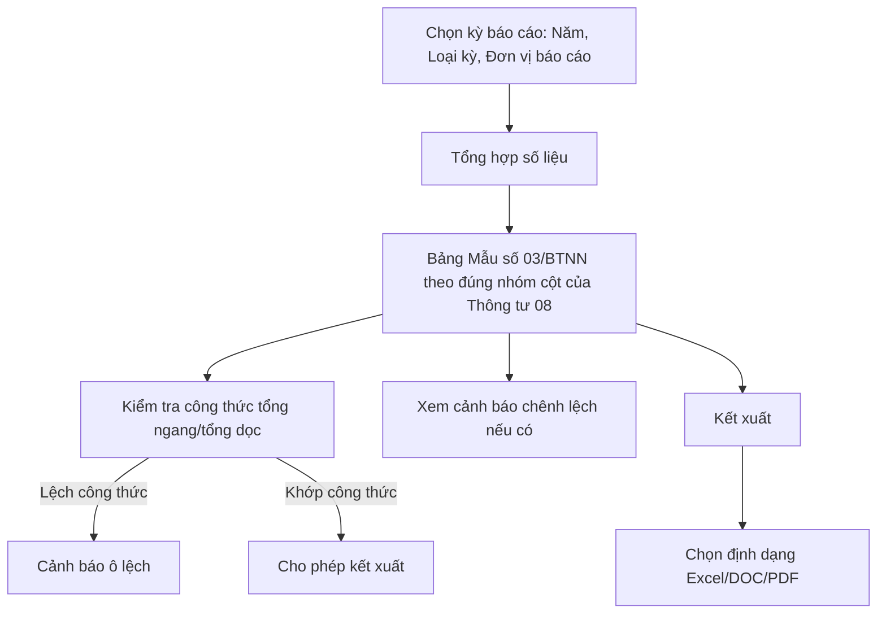

#### 4.3.3.22. UCPS020 - Tổng hợp tình hình yêu cầu bồi thường, giải quyết bồi thường và chi trả tiền bồi thường (Mẫu số 03-TT08)

##### 4.3.3.22.1. Mục đích

\- Cho phép cán bộ nghiệp vụ BTNN tổng hợp, kiểm tra và kết xuất bảng số liệu Tổng hợp tình hình yêu cầu bồi thường, giải quyết bồi thường và chi trả tiền bồi thường theo đúng Mẫu số 03 ban hành kèm Thông tư 08/2019/TT-BTP (Điều 24), phân theo 06 lĩnh vực phát sinh thiệt hại và theo kỳ báo cáo.

\- Toàn bộ cột số liệu trên Mẫu số 03/BTNN được hệ thống tự động tổng hợp từ dữ liệu vụ việc tại các module Tiếp nhận YCBT, Giải quyết yêu cầu bồi thường, Quyết định giải quyết bồi thường và Cấp kinh phí bồi thường; cán bộ chỉ rà soát số liệu, xem cảnh báo chênh lệch công thức (nếu có) trước khi kết xuất.

*a. Phân quyền*

\- Cán bộ nghiệp vụ BTNN: được tra cứu, tổng hợp số liệu, nhập giải trình chênh lệch và kết xuất biểu mẫu.

\- Lãnh đạo: được tra cứu, xem chi tiết và kết xuất biểu mẫu; không chỉnh sửa số liệu hoặc giải trình.

*b. Điều kiện thực hiện*

\- Người dùng đã đăng nhập thành công vào Website quản trị.

\- Người dùng được phân quyền truy cập màn hình `Tổng hợp tình hình yêu cầu bồi thường, giải quyết bồi thường và chi trả tiền bồi thường (Mẫu số 03-TT08)`.

\- Loại cơ quan báo cáo tham chiếu danh mục [DM_43]. Loại kỳ báo cáo tham chiếu danh mục [DM_44]. Lĩnh vực phát sinh thiệt hại tham chiếu [DM_22].

\- Phân loại nguồn thụ lý của từng vụ việc (tại cơ quan trực tiếp quản lý người thi hành công vụ/tại Tòa án theo điểm a khoản 1 Điều 52/theo điểm b khoản 1 và khoản 2 Điều 52/trong quá trình tố tụng hình sự-hành chính theo Điều 55) được suy ra từ các trường `Tình trạng pháp lý hồ sơ`, `Nguồn phát sinh bản án`, `Trường hợp khởi kiện` đã đặc tả tại SRS Giải quyết yêu cầu bồi thường; không yêu cầu nhập liệu bổ sung.

\- Số tiền trên biểu mẫu kết xuất quy đổi theo đơn vị `nghìn đồng`; hệ thống tự động quy đổi từ dữ liệu nghiệp vụ lưu theo đơn vị đồng.

---

##### 4.3.3.22.2. Sơ đồ luồng nghiệp vụ theo giao diện

---

##### 4.3.3.22.3. MH01 - Màn hình Tổng hợp tình hình yêu cầu bồi thường, giải quyết bồi thường và chi trả tiền bồi thường

###### 4.3.3.22.3.1. Màn hình

###### 4.3.3.22.3.2. Mô tả thông tin trên màn hình

\- Bảng tiêu đề cột gộp/tách đúng theo Mẫu số 03/BTNN gốc: 3 nhóm lớn `Thụ lý vụ việc (vụ việc)`, `Tình hình giải quyết vụ việc`, `Chi trả tiền bồi thường` được gộp ngang thành tiêu đề nhóm; trong mỗi nhóm, chỉ tiêu tiếp tục được tách theo nguồn thụ lý (`tại cơ quan trực tiếp quản lý người thi hành công vụ` / `tại Tòa án`), và nhánh `tại Tòa án` tách tiếp theo `Khởi kiện vụ án dân sự` (rồi tách tiếp theo điểm a/điểm b khoản 1 Điều 52) và `Yêu cầu bồi thường trong quá trình tố tụng hình sự, tố tụng hành chính`; các chỉ tiêu không cần tách tiếp (ví dụ `Tổng số vụ việc`, `Số tiền bồi thường`) giữ nguyên 1 cột gộp dọc xuyên suốt các dòng tiêu đề. Đúng theo văn bản gốc, cột `STT` được tính là chỉ tiêu `(1)`; 25 chỉ tiêu số liệu còn lại đánh số `(2)` đến `(26)` đúng theo bảng mô tả trường bên dưới, mỗi số chỉ tiêu tương ứng với đúng 1 cột dữ liệu duy nhất (các nhãn cột trùng tên xuất hiện ở nhiều nhóm khác nhau, ví dụ `tại cơ quan trực tiếp quản lý`, vẫn là các cột dữ liệu độc lập, không gộp chung với nhau).

| Trường thông tin | Kiểu dữ liệu | Bắt buộc | Mặc định | Mô tả |
| :--- | :--- | :--- | :--- | :--- |
| **I. Khối chọn kỳ báo cáo** | | | | |
| Năm báo cáo | Enum(String(10)) | Có | Năm hiện tại | Giá trị gồm 05 năm gần nhất tính đến năm hiện tại. |
| Loại kỳ báo cáo | Enum(String(100)) | Có | `Báo cáo năm số liệu thực tế (01/01 - 31/10)` | Tham chiếu [DM_44]. |
| Đơn vị báo cáo | Enum(String(255)) | Có | Theo đơn vị đăng nhập | Giá trị lấy từ Danh mục các đơn vị trên hệ thống `[DM_DON_VI]`. Cho phép tìm kiếm nhanh theo `Mã đơn vị` hoặc `Tên đơn vị`; áp dụng tìm gần đúng. |
| Loại cơ quan báo cáo | Enum(String(100)) | Có | `UBND cấp tỉnh` | Tham chiếu [DM_43]. |
| **II. Bảng Mẫu số 03/BTNN** | | | | |
| STT | Integer(10) | - | Tự tăng | Chỉ đọc. Cột số thứ tự theo mẫu, đồng thời là chỉ tiêu `(1)` theo đúng đánh số của văn bản gốc. |
| Dòng đánh số chỉ tiêu | String(255) | - | Cố định | Chỉ đọc. Ngay dưới dòng tiêu đề cột (đã lồng nhóm theo cấu trúc bên dưới), hệ thống hiển thị 1 dòng ghi số thứ tự chỉ tiêu `(1)` (tại cột `STT`) đến `(26)` tương ứng với đúng 26 cột của Mẫu số 03/BTNN, để đối chiếu nhanh với văn bản gốc. |
| Lĩnh vực phát sinh thiệt hại | String(255) | - | Theo dữ liệu | Chỉ đọc. Số liệu trình bày theo 06 dòng lĩnh vực phát sinh thiệt hại [DM_22] (Quản lý hành chính, Tố tụng hình sự, Tố tụng dân sự, Tố tụng hành chính, Thi hành án hình sự, Thi hành án dân sự) và 01 dòng `Tổng cộng`. |
| **Thụ lý vụ việc (vụ việc)** | | | | Nhóm cột thể hiện tình hình thụ lý vụ việc theo Mẫu số 03/BTNN. |
| (2) Tổng số vụ việc (vụ việc) | Integer(10) | - | Hệ thống tính | Chỉ đọc. Công thức bằng tổng `Số vụ việc thụ lý mới` và `Số vụ việc kỳ trước chuyển sang`. |
| (3) Số vụ việc thụ lý mới - Thụ lý tại cơ quan trực tiếp quản lý người thi hành công vụ gây thiệt hại | Integer(10) | - | Hệ thống tính | Chỉ đọc. Đếm vụ việc `Tình trạng pháp lý hồ sơ` = "Yêu cầu chưa có Bản án/Quyết định của Tòa án" và `Thời điểm tiếp nhận` nằm trong kỳ báo cáo. |
| (4) Số vụ việc thụ lý mới - Thụ lý tại Tòa án - Khởi kiện vụ án dân sự - Theo điểm a khoản 1 Điều 52 | Integer(10) | - | Hệ thống tính | Chỉ đọc. Đếm vụ việc `Nguồn phát sinh bản án` = "Khởi kiện vụ án dân sự (Điều 52)", `Trường hợp khởi kiện` = "điểm a khoản 1 Điều 52" và `Thời điểm tiếp nhận` nằm trong kỳ báo cáo. |
| (5) Số vụ việc thụ lý mới - Thụ lý tại Tòa án - Khởi kiện vụ án dân sự - Theo điểm b khoản 1 và khoản 2 Điều 52 | Integer(10) | - | Hệ thống tính | Chỉ đọc. Đếm vụ việc `Nguồn phát sinh bản án` = "Khởi kiện vụ án dân sự (Điều 52)", `Trường hợp khởi kiện` = "điểm b khoản 1 và khoản 2 Điều 52" và `Thời điểm tiếp nhận` nằm trong kỳ báo cáo. |
| (6) Số vụ việc thụ lý mới - Thụ lý tại Tòa án - Yêu cầu bồi thường trong quá trình tố tụng hình sự, tố tụng hành chính | Integer(10) | - | Hệ thống tính | Chỉ đọc. Đếm vụ việc `Nguồn phát sinh bản án` = "Giải quyết trong tố tụng hình sự, tố tụng hành chính (Điều 55)" và `Thời điểm tiếp nhận` nằm trong kỳ báo cáo. |
| (7) Số vụ việc kỳ trước chuyển sang - Thụ lý tại cơ quan trực tiếp quản lý người thi hành công vụ gây thiệt hại | Integer(10) | - | Hệ thống tính | Chỉ đọc. Cùng điều kiện phân loại như cột thụ lý mới tại cơ quan trực tiếp quản lý, nhưng `Thời điểm tiếp nhận` trước kỳ báo cáo và `Trạng thái` chưa thuộc nhóm kết thúc xử lý. |
| (8) Số vụ việc kỳ trước chuyển sang - Thụ lý tại Tòa án - Khởi kiện vụ án dân sự - Theo điểm a khoản 1 Điều 52 | Integer(10) | - | Hệ thống tính | Chỉ đọc. Cùng điều kiện phân loại như cột thụ lý mới tại Tòa án theo điểm a khoản 1 Điều 52, nhưng thụ lý trước kỳ báo cáo và chưa kết thúc xử lý. |
| (9) Số vụ việc kỳ trước chuyển sang - Thụ lý tại Tòa án - Khởi kiện vụ án dân sự - Theo điểm b khoản 1 và khoản 2 Điều 52 | Integer(10) | - | Hệ thống tính | Chỉ đọc. Cùng điều kiện phân loại như cột thụ lý mới tại Tòa án theo điểm b khoản 1 và khoản 2 Điều 52, nhưng thụ lý trước kỳ báo cáo và chưa kết thúc xử lý. |
| (10) Số vụ việc kỳ trước chuyển sang - Thụ lý tại Tòa án - Yêu cầu bồi thường trong quá trình tố tụng hình sự, tố tụng hành chính | Integer(10) | - | Hệ thống tính | Chỉ đọc. Cùng điều kiện phân loại như cột thụ lý mới trong quá trình tố tụng hình sự, tố tụng hành chính, nhưng thụ lý trước kỳ báo cáo và chưa kết thúc xử lý. |
| **Tình hình giải quyết vụ việc** | | | | Nhóm cột thể hiện kết quả giải quyết, vụ việc đang giải quyết và đình chỉ. |
| (11) Đã có văn bản giải quyết bồi thường có hiệu lực pháp luật - Tổng số vụ việc (vụ việc) | Integer(10) | - | Hệ thống tính | Chỉ đọc. Công thức bằng tổng các vụ việc đã giải quyết tại cơ quan trực tiếp quản lý, tại Tòa án và trong quá trình tố tụng hình sự/hành chính. |
| (12) Đã có văn bản giải quyết bồi thường có hiệu lực pháp luật - Tại cơ quan trực tiếp quản lý người thi hành công vụ gây thiệt hại | Integer(10) | - | Hệ thống tính | Chỉ đọc. Đếm vụ việc thuộc nhóm thụ lý tại cơ quan trực tiếp quản lý, `Trạng thái` = "Hoàn thành". |
| (13) Đã có văn bản giải quyết bồi thường có hiệu lực pháp luật - Tại Tòa án - Khởi kiện vụ án dân sự - Theo điểm a khoản 1 Điều 52 | Integer(10) | - | Hệ thống tính | Chỉ đọc. Đếm vụ việc thuộc nhóm Tòa án theo điểm a khoản 1 Điều 52, `Trạng thái` = "Hoàn thành". |
| (14) Đã có văn bản giải quyết bồi thường có hiệu lực pháp luật - Tại Tòa án - Khởi kiện vụ án dân sự - Theo điểm b khoản 1 và khoản 2 Điều 52 | Integer(10) | - | Hệ thống tính | Chỉ đọc. Đếm vụ việc thuộc nhóm Tòa án theo điểm b khoản 1 và khoản 2 Điều 52, `Trạng thái` = "Hoàn thành". |
| (15) Đã có văn bản giải quyết bồi thường có hiệu lực pháp luật - Tại Tòa án - Trong quá trình tố tụng hình sự, tố tụng hành chính | Integer(10) | - | Hệ thống tính | Chỉ đọc. Đếm vụ việc giải quyết bồi thường trong quá trình tố tụng hình sự, tố tụng hành chính, `Trạng thái` = "Hoàn thành". |
| (16) Số tiền bồi thường theo văn bản có hiệu lực pháp luật (nghìn đồng) | Decimal(18,0) | - | Hệ thống tính | Chỉ đọc. Tổng `Số tiền bồi thường quyết định` của các vụ việc đã có văn bản giải quyết bồi thường có hiệu lực pháp luật trong kỳ báo cáo, quy đổi đơn vị nghìn đồng. |
| (17) Đang giải quyết (vụ việc) - Tổng số vụ việc | Integer(10) | - | Hệ thống tính | Chỉ đọc. Công thức bằng tổng các vụ việc đang giải quyết tại cơ quan trực tiếp quản lý, tại Tòa án và trong quá trình tố tụng hình sự/hành chính. |
| (18) Đang giải quyết (vụ việc) - Tại cơ quan trực tiếp quản lý người thi hành công vụ gây thiệt hại | Integer(10) | - | Hệ thống tính | Chỉ đọc. Đếm vụ việc thuộc nhóm thụ lý tại cơ quan trực tiếp quản lý, `Trạng thái` thuộc nhóm đang xử lý/chưa kết thúc. |
| (19) Đang giải quyết (vụ việc) - Tại Tòa án - Khởi kiện vụ án dân sự - Theo điểm a khoản 1 Điều 52 | Integer(10) | - | Hệ thống tính | Chỉ đọc. Đếm vụ việc thuộc nhóm Tòa án theo điểm a khoản 1 Điều 52 với trạng thái đang xử lý/chưa kết thúc. |
| (20) Đang giải quyết (vụ việc) - Tại Tòa án - Khởi kiện vụ án dân sự - Theo điểm b khoản 1 và khoản 2 Điều 52 | Integer(10) | - | Hệ thống tính | Chỉ đọc. Đếm vụ việc thuộc nhóm Tòa án theo điểm b khoản 1 và khoản 2 Điều 52 với trạng thái đang xử lý/chưa kết thúc. |
| (21) Đang giải quyết (vụ việc) - Tại Tòa án - Trong quá trình tố tụng hình sự, tố tụng hành chính | Integer(10) | - | Hệ thống tính | Chỉ đọc. Đếm vụ việc đang giải quyết bồi thường trong quá trình tố tụng hình sự, tố tụng hành chính. |
| (22) Đình chỉ (vụ việc) - Tại cơ quan trực tiếp quản lý người thi hành công vụ gây thiệt hại | Integer(10) | - | Hệ thống tính | Chỉ đọc. Đếm vụ việc thuộc nhóm cơ quan trực tiếp quản lý, `Trạng thái` = "Đình chỉ giải quyết". |
| (23) Đình chỉ (vụ việc) - Tại Tòa án/theo thủ tục tố tụng tại Tòa án | Integer(10) | - | Hệ thống tính | Chỉ đọc. Đếm vụ việc thuộc nhóm Tòa án hoặc tố tụng, `Trạng thái` = "Đình chỉ giải quyết". |
| **Chi trả tiền bồi thường** | | | | Nhóm cột thể hiện số vụ việc và số tiền đã chi trả. |
| (24) Số vụ việc đã chi trả (vụ việc) | Integer(10) | - | Hệ thống tính | Chỉ đọc. Đếm vụ việc có đề nghị cấp kinh phí bồi thường ở trạng thái "Hoàn thành" (đã chi trả xong) theo SRS Quản lý kinh phí bồi thường. |
| (25) Số tiền đã chi trả theo quyết định có hiệu lực của cơ quan trực tiếp quản lý người thi hành công vụ (nghìn đồng) | Decimal(18,0) | - | Hệ thống tính | Chỉ đọc. Tổng `Số tiền thực tế chi trả` của các vụ việc đã giải quyết tại cơ quan trực tiếp quản lý, quy đổi đơn vị nghìn đồng. |
| (26) Số tiền đã chi trả theo bản án, quyết định có hiệu lực của Tòa án (nghìn đồng) | Decimal(18,0) | - | Hệ thống tính | Chỉ đọc. Tổng `Số tiền thực tế chi trả` của các vụ việc đã giải quyết tại Tòa án hoặc trong quá trình tố tụng hình sự/hành chính, quy đổi đơn vị nghìn đồng. |
| Ghi chú nội bộ hệ thống | Text(2000) | Không | Trống | **Không thuộc 26 cột chính thức của Mẫu số 03/BTNN gốc** (không có số chỉ tiêu riêng), hiển thị thành 1 khung ghi chú riêng ngay dưới bảng. Dùng để cán bộ nghiệp vụ BTNN giải trình chênh lệch số liệu hoặc ghi chú nguồn dữ liệu khi cần điều chỉnh thủ công; không in ra khi kết xuất đúng theo Mẫu số 03/BTNN gốc. |
| Trạng thái kỳ tổng hợp | Enum(String(50)) | - | `Nháp` | \- Giá trị gồm: + Nháp + Đã kết xuất |

###### 4.3.3.22.3.3. Chức năng trên màn hình

| STT | Tên chức năng | Định dạng | Mô tả |
| :--- | :--- | :--- | :--- |
| 1 | Tổng hợp số liệu | Button | Trường hợp không có vụ việc phù hợp: Hệ thống hiển thị bảng Mẫu số 03/BTNN với toàn bộ số liệu bằng 0 kèm thông báo không có dữ liệu. |
|  |  |  | Trường hợp có dữ liệu: Hệ thống tính toán số liệu theo từng dòng lĩnh vực và dòng `Tổng cộng`, thực hiện kiểm tra tổng ngang/tổng dọc theo công thức mẫu, hiển thị bảng tổng hợp ở trạng thái kỳ tổng hợp `Nháp`. |
|  |  |  | Trường hợp phát hiện lệch công thức: Hệ thống tô nổi bật các ô bị lệch công thức và hiển thị [MSG-WRN-SYS-001] tại vùng bảng; vẫn cho phép xem nhưng cảnh báo trước khi kết xuất. |
| 2 | Kết xuất | Button/Menu | Khi chọn nút `Kết xuất`, hệ thống mở menu chọn định dạng gồm `Excel`, `DOC`, `PDF`. |
|  |  |  | Chọn `Excel`: Hệ thống kết xuất bảng tổng hợp hiện hành ra file Excel theo đúng cấu trúc Mẫu số 03/BTNN, quy đổi số tiền sang nghìn đồng và hiển thị [MSG-SUC-SYS-002]. |
|  |  |  | Chọn `DOC`: Hệ thống kết xuất file Word theo đúng cấu trúc Mẫu số 03/BTNN, cập nhật `Trạng thái kỳ tổng hợp` sang `Đã kết xuất` và hiển thị [MSG-SUC-SYS-002]. |
|  |  |  | Chọn `PDF`: Hệ thống kết xuất file PDF theo đúng cấu trúc Mẫu số 03/BTNN, cập nhật `Trạng thái kỳ tổng hợp` sang `Đã kết xuất` và hiển thị [MSG-SUC-SYS-002]. Nếu còn cảnh báo lệch số liệu, hệ thống hiển thị [MSG-CFM-SYS-001] để người dùng xác nhận trước khi kết xuất. |

---

##### 4.3.3.22.4. Ghi chú phạm vi đặc tả

\- Một `Mã vụ việc` chỉ được tính một lần trong cùng kỳ báo cáo, cùng lĩnh vực phát sinh thiệt hại và cùng cột số liệu; hệ thống tự loại trùng khi tổng hợp.

\- Kỳ tổng hợp ở trạng thái `Nháp` cho phép bấm `Tổng hợp số liệu` để tính lại khi dữ liệu nghiệp vụ thay đổi; sau khi chuyển `Đã kết xuất`, lần kết xuất tiếp theo tạo phiên bản file mới, không ghi đè phiên bản đã kết xuất trước đó.

\- Bảng hiển thị và file kết xuất phải tuân thủ đúng bố cục Mẫu số 03/BTNN (26 cột được đánh số `(1)` đến `(26)` tính cả cột `STT`, lồng nhóm nhiều cấp đúng như văn bản gốc); không bổ sung cột nội bộ vào trong bảng 26 cột này. Riêng `Ghi chú nội bộ hệ thống` hiển thị tách riêng thành khung ghi chú ngay dưới bảng, không có số chỉ tiêu và không tính là cột bổ sung vi phạm quy tắc trên.
