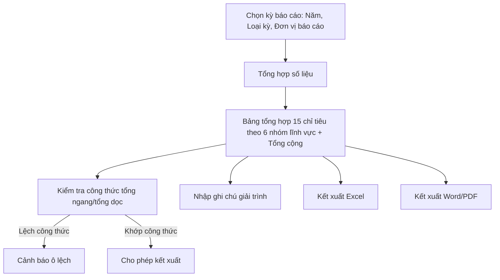

#### 4.3.3.23. UCPS021 - Tình hình thực hiện trách nhiệm hoàn trả (Mẫu số 04-TT08)

##### 4.3.3.23.1. Mục đích

\- Cho phép cán bộ nghiệp vụ BTNN tổng hợp, kiểm tra và kết xuất bảng số liệu Tình hình thực hiện trách nhiệm hoàn trả theo đúng Mẫu số 04 ban hành kèm Thông tư 08/2019/TT-BTP (Điều 24), phân theo 06 lĩnh vực phát sinh thiệt hại và theo kỳ báo cáo.

\- Toàn bộ 15 chỉ tiêu được hệ thống tự động tổng hợp từ dữ liệu hồ sơ tại module Xem xét trách nhiệm hoàn trả và module Cấp kinh phí bồi thường; cán bộ chỉ rà soát, giải trình chênh lệch (nếu có) trước khi kết xuất.

*a. Phân quyền*

\- Cán bộ nghiệp vụ BTNN: được tra cứu, tổng hợp số liệu, nhập giải trình chênh lệch và kết xuất biểu mẫu.

\- Lãnh đạo: được tra cứu, xem chi tiết và kết xuất biểu mẫu; không chỉnh sửa số liệu hoặc giải trình.

*b. Điều kiện thực hiện*

\- Người dùng đã đăng nhập thành công vào Website quản trị.

\- Người dùng được phân quyền truy cập màn hình `Tình hình thực hiện trách nhiệm hoàn trả (Mẫu số 04-TT08)`.

\- Loại cơ quan báo cáo tham chiếu danh mục [DM_43]. Loại kỳ báo cáo tham chiếu danh mục [DM_44]. Lĩnh vực phát sinh thiệt hại tham chiếu [DM_22], lấy theo `Lĩnh vực phát sinh thiệt hại` của vụ việc yêu cầu bồi thường gốc liên kết với hồ sơ hoàn trả.

\- Nguồn dữ liệu chính lấy từ module Xem xét trách nhiệm hoàn trả (`SRS_BTNN_TrachNhiemHoanTra_XemXet.md`): `Trạng thái tiến trình`, `Kết luận của Hội đồng`, `Số tiền phải hoàn trả chính thức`, `Ngày quyết định hoàn trả có hiệu lực`, dữ liệu `Giảm mức hoàn trả` (MH08), `Hoãn hoàn trả` (MH09), giao dịch thu hồi (MH06); và từ module Cấp kinh phí bồi thường (`SRS_BTNN_GiaiQuyetBT_KinhPhi_BT.md`): `Số tiền thực tế chi trả`.

\- Số tiền trên biểu mẫu kết xuất quy đổi theo đơn vị `nghìn đồng`; hệ thống tự động quy đổi từ dữ liệu nghiệp vụ lưu theo đơn vị đồng.

---

##### 4.3.3.23.2. Sơ đồ luồng nghiệp vụ theo giao diện

---

##### 4.3.3.23.3. MH01 - Màn hình Tình hình thực hiện trách nhiệm hoàn trả

###### 4.3.3.23.3.1. Màn hình

###### 4.3.3.23.3.2. Mô tả thông tin trên màn hình

| Trường thông tin | Kiểu dữ liệu | Bắt buộc | Mặc định | Mô tả |
| :--- | :--- | :--- | :--- | :--- |
| **I. Khối chọn kỳ báo cáo** | | | | |
| Năm báo cáo | Enum(String(10)) | Có | Năm hiện tại | Giá trị gồm 05 năm gần nhất tính đến năm hiện tại. |
| Loại kỳ báo cáo | Enum(String(100)) | Có | `Báo cáo năm số liệu thực tế (01/01 - 31/10)` | Tham chiếu [DM_44]. |
| Đơn vị báo cáo | Enum(String(255)) | Có | Theo đơn vị đăng nhập | Giá trị lấy từ Danh mục các đơn vị trên hệ thống `[DM_DON_VI]`. Cho phép tìm kiếm nhanh theo `Mã đơn vị` hoặc `Tên đơn vị`; áp dụng tìm gần đúng. |
| Loại cơ quan báo cáo | Enum(String(100)) | Có | `UBND cấp tỉnh` | Tham chiếu [DM_43]. |
| **II. Bảng tổng hợp** | | | | |
| Nhóm dòng theo lĩnh vực | String(255) | - | Theo dữ liệu | Chỉ đọc. Số liệu trình bày theo 06 dòng lĩnh vực phát sinh thiệt hại [DM_22] (Quản lý hành chính, Tố tụng hình sự, Tố tụng dân sự, Tố tụng hành chính, Thi hành án hình sự, Thi hành án dân sự) và 01 dòng `Tổng cộng`. |
| Chỉ tiêu 1 - STT/nhóm lĩnh vực | String(255) | - | Theo dữ liệu | Chỉ đọc. Hiển thị mã nhóm (I-VI) hoặc `TC` (Tổng cộng). |
| Chỉ tiêu 2 - Số tiền đã chi trả xong cho người yêu cầu bồi thường | Decimal(18,0) | - | Hệ thống tính | Chỉ đọc. Đơn vị nghìn đồng. Tổng `Số tiền thực tế chi trả` (SRS Cấp kinh phí bồi thường) của các vụ việc đã chi trả xong, làm căn cứ xem xét hoàn trả trong kỳ báo cáo. |
| Chỉ tiêu 3 - Tổng số vụ việc xem xét trách nhiệm hoàn trả | Integer(10) | - | Hệ thống tính | Chỉ đọc. Công thức `3 = 4 + 6`. |
| Chỉ tiêu 4 - Số vụ việc có quyết định hoàn trả có hiệu lực pháp luật và đã thực hiện hoàn trả | Integer(10) | - | Hệ thống tính | Chỉ đọc. Đếm hồ sơ có `Ngày quyết định hoàn trả có hiệu lực` nằm trong hoặc trước kỳ báo cáo và `Kết luận của Hội đồng` = "Có lỗi - Kiến nghị hoàn trả". |
| Chỉ tiêu 5 - Số tiền phải hoàn trả | Decimal(18,0) | - | Hệ thống tính | Chỉ đọc. Đơn vị nghìn đồng. Tổng `Số tiền phải hoàn trả chính thức` của các hồ sơ tính tại Chỉ tiêu 4. |
| Chỉ tiêu 6 - Số vụ việc đang xem xét trách nhiệm hoàn trả | Integer(10) | - | Hệ thống tính | Chỉ đọc. Đếm hồ sơ `Trạng thái tiến trình` thuộc nhóm "Chờ thành lập hội đồng", "Đang họp hội đồng", "Chờ ban hành QĐ", "Đang thi hành" tại thời điểm chốt số liệu. |
| Chỉ tiêu 7 - Số vụ việc không xem xét trách nhiệm hoàn trả do người thi hành công vụ không có lỗi | Integer(10) | - | Hệ thống tính | Chỉ đọc. Đếm hồ sơ `Kết luận của Hội đồng` = "Không xem xét - Người thi hành công vụ không có lỗi" trong kỳ báo cáo. |
| Chỉ tiêu 8 - Số vụ việc không xem xét trách nhiệm hoàn trả do người thi hành công vụ chết trước khi ra quyết định hoàn trả | Integer(10) | - | Hệ thống tính | Chỉ đọc. Đếm hồ sơ `Kết luận của Hội đồng` = "Không xem xét - Người thi hành công vụ đã chết trước khi ra quyết định hoàn trả" trong kỳ báo cáo. |
| Chỉ tiêu 9 - Số vụ việc được giảm mức hoàn trả | Integer(10) | - | Hệ thống tính | Chỉ đọc. Đếm hồ sơ có phát sinh dữ liệu `Giảm mức hoàn trả` (MH08) trong kỳ báo cáo. |
| Chỉ tiêu 10 - Số tiền hoàn trả được giảm | Decimal(18,0) | - | Hệ thống tính | Chỉ đọc. Đơn vị nghìn đồng. Tổng `Số tiền được giảm` (MH08) của các hồ sơ tính tại Chỉ tiêu 9. |
| Chỉ tiêu 11 - Số vụ việc được hoãn hoàn trả | Integer(10) | - | Hệ thống tính | Chỉ đọc. Đếm hồ sơ có phát sinh dữ liệu `Hoãn hoàn trả` (MH09) còn hiệu lực trong kỳ báo cáo. |
| Chỉ tiêu 12 - Tổng số tiền đã hoàn trả | Decimal(18,0) | - | Hệ thống tính | Chỉ đọc. Đơn vị nghìn đồng. Công thức `12 = 13 + 14`. |
| Chỉ tiêu 13 - Số tiền đã hoàn trả trong kỳ báo cáo | Decimal(18,0) | - | Hệ thống tính | Chỉ đọc. Đơn vị nghìn đồng. Tổng số tiền các giao dịch thu hồi (MH06) có ngày giao dịch nằm trong khoảng thời gian của `Loại kỳ báo cáo` đã chọn. |
| Chỉ tiêu 14 - Số tiền đã hoàn trả kỳ trước chuyển sang | Decimal(18,0) | - | Hệ thống tính | Chỉ đọc. Đơn vị nghìn đồng. Tổng số tiền các giao dịch thu hồi (MH06) có ngày giao dịch trước kỳ báo cáo nhưng thuộc hồ sơ vẫn còn nghĩa vụ hoàn trả chuyển tiếp sang kỳ này. |
| Chỉ tiêu 15 - Số tiền còn phải hoàn trả | Decimal(18,0) | - | Hệ thống tính | Chỉ đọc. Đơn vị nghìn đồng. Công thức `15 = Tổng số tiền phải hoàn trả (Chỉ tiêu 5, lũy kế) − Chỉ tiêu 12 (lũy kế) − Tổng số tiền hoàn trả được giảm (Chỉ tiêu 10, lũy kế)`; không bao gồm phần thuộc các hồ sơ đang `Hoãn hoàn trả` (Chỉ tiêu 11) trong kỳ. |
| Ghi chú giải trình | Text(2000) | Không | Trống | Không thuộc chỉ tiêu pháp lý chính; dùng để cán bộ lưu giải trình chênh lệch, nguồn số liệu điều chỉnh thủ công (nếu có) trước khi kết xuất. |
| Trạng thái kỳ tổng hợp | Enum(String(50)) | - | `Nháp` | \- Giá trị gồm: + Nháp + Đã kết xuất |

###### 4.3.3.23.3.3. Chức năng trên màn hình

| STT | Tên chức năng | Định dạng | Mô tả |
| :--- | :--- | :--- | :--- |
| 1 | Tổng hợp số liệu | Button | TH1 (Không có hồ sơ phù hợp): Hệ thống hiển thị bảng tổng hợp với toàn bộ chỉ tiêu bằng 0 kèm thông báo không có dữ liệu. |
|  |  |  | TH2 (Có dữ liệu): Hệ thống tính toán 15 chỉ tiêu theo từng dòng lĩnh vực và dòng `Tổng cộng`, thực hiện kiểm tra tổng ngang (`3=4+6`, `12=13+14`) và tổng dọc (dòng `Tổng cộng` = tổng 06 dòng lĩnh vực), hiển thị bảng tổng hợp ở trạng thái kỳ tổng hợp `Nháp`. |
|  |  |  | TH3 (Phát hiện lệch công thức): Hệ thống tô nổi bật (viền cảnh báo) các ô chỉ tiêu bị lệch công thức và hiển thị [MSG-WRN-SYS-001] tại vùng bảng; vẫn cho phép xem nhưng cảnh báo trước khi kết xuất. |
| 2 | Nhập ghi chú giải trình | Icon button | Hệ thống mở ô nhập trực tiếp trên ô `Ghi chú giải trình` của dòng lĩnh vực hoặc dòng Tổng cộng tương ứng để cán bộ ghi giải trình. |
| 3 | Kết xuất Excel | Button | Hệ thống kết xuất bảng tổng hợp hiện hành ra file Excel theo đúng cấu trúc Mẫu số 04-TT08 (15 chỉ tiêu x 07 dòng), quy đổi số tiền sang nghìn đồng và hiển thị [MSG-SUC-SYS-002]. |
| 4 | Kết xuất Word/PDF | Button | TH1 (Còn chỉ tiêu lệch công thức): Hệ thống hiển thị [MSG-CFM-SYS-001] xác nhận kết xuất dù còn cảnh báo lệch số liệu. |
|  |  |  | TH2 (Hợp lệ hoặc đã xác nhận kết xuất): Hệ thống kết xuất file Word/PDF theo đúng cấu trúc Mẫu số 04-TT08, cập nhật `Trạng thái kỳ tổng hợp` sang `Đã kết xuất` và hiển thị [MSG-SUC-SYS-002]. |

---

##### 4.3.3.23.4. Ghi chú phạm vi đặc tả

\- Một hồ sơ hoàn trả chỉ được tính một lần trong cùng kỳ báo cáo, cùng lĩnh vực phát sinh thiệt hại (lấy theo vụ việc bồi thường gốc) và cùng chỉ tiêu; hệ thống tự loại trùng khi tổng hợp.

\- Chỉ tiêu 7, 8 (không xem xét trách nhiệm hoàn trả) yêu cầu module Xem xét trách nhiệm hoàn trả đã ghi nhận `Kết luận của Hội đồng` tại MH04 theo đúng 1 trong 3 giá trị đã đặc tả tại `SRS_BTNN_TrachNhiemHoanTra_XemXet.md` (mục 4.4.1) và trạng thái hồ sơ "Không xem xét trách nhiệm hoàn trả" (HT-BR-002, HT-BR-019).

\- Kỳ tổng hợp ở trạng thái `Nháp` cho phép bấm `Tổng hợp số liệu` để tính lại khi dữ liệu nghiệp vụ thay đổi; sau khi chuyển `Đã kết xuất`, lần kết xuất tiếp theo tạo phiên bản file mới, không ghi đè phiên bản đã kết xuất trước đó.
