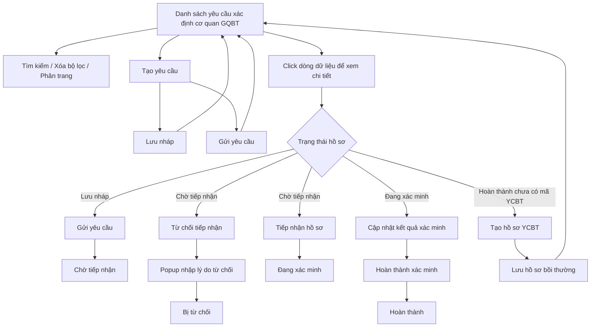

### 4.3.3. Dành cho Cán bộ nghiệp vụ bồi thường nhà nước

#### 4.3.3.1. Nhóm tính năng Xác định cơ quan giải quyết bồi thường

##### 4.3.3.1.1. Mục đích

\- Cho phép người dùng trên Website quản trị quản lý danh sách yêu cầu xác định cơ quan giải quyết bồi thường.

\- Cho phép tạo mới, lưu nháp, gửi yêu cầu, xem chi tiết, tiếp nhận, từ chối tiếp nhận, cập nhật kết quả xác định cơ quan giải quyết bồi thường.

\- Cho phép khởi tạo hồ sơ yêu cầu bồi thường liên thông từ hồ sơ xác định cơ quan đã hoàn thành và chưa có mã hồ sơ yêu cầu bồi thường.

*a. Phân quyền*

\- HTML không thể hiện ma trận phân quyền chi tiết theo vai trò.

\- Các thao tác được đặc tả theo trạng thái hiển thị và điều kiện enable/disable đang có trên file `xac_dinh_co_quan_boi_thuong.html` và `xac_dinh_co_quan_boi_thuong.js`.

*b. Điều kiện thực hiện*

\- Người dùng truy cập màn hình `Xác định cơ quan giải quyết bồi thường` trên Website quản trị.

\- Danh sách dữ liệu được nạp từ nguồn dữ liệu hiện hành của màn hình.

\- Trạng thái hồ sơ đang sử dụng trên màn hình gồm: "Chờ tiếp nhận", "Đang xác minh", "Bị từ chối", "Hoàn thành", "Lưu nháp". Tham chiếu danh mục trạng thái hồ sơ [DM_05].

---

##### 4.3.3.1.2. Sơ đồ luồng nghiệp vụ theo giao diện

---

##### 4.3.3.1.3. MH01 - Màn hình Danh sách yêu cầu xác định cơ quan giải quyết bồi thường

###### 4.3.3.1.3.1. Màn hình

###### 4.3.3.1.3.2. Mô tả thông tin trên màn hình

| Trường thông tin | Kiểu dữ liệu | Bắt buộc | Mặc định | Mô tả |
| :--- | :--- | :--- | :--- | :--- |
| **Khối bộ lọc tìm kiếm** | String(255) | - | - | Hiển thị phía trên bảng danh sách. |
| Mã yêu cầu | String(50) | Không | Trống | Placeholder: `Nhập mã yêu cầu...`. Tìm kiếm gần đúng theo mã yêu cầu, không phân biệt hoa thường, có trim khoảng trắng. |
| Tên người yêu cầu | String(100) | Không | Trống | Placeholder: `Nhập tên người yêu cầu...`. Tìm kiếm gần đúng theo tên người yêu cầu, không phân biệt hoa thường, có trim khoảng trắng. |
| Lĩnh vực phát sinh thiệt hại | Enum(String(100)) | Không | `Tất cả lĩnh vực` | Tham chiếu danh mục Lĩnh vực phát sinh thiệt hại [DM_22]. Giá trị lọc gồm `Tất cả lĩnh vực` và các giá trị thuộc [DM_22]. |
| Trạng thái | Enum(String(50)) | Không | `Tất cả trạng thái` | Tham chiếu danh mục trạng thái hồ sơ [DM_05]. Giá trị gồm: - "Tất cả trạng thái" - "Chờ tiếp nhận" - "Đang xác minh" - "Bị từ chối" - "Hoàn thành" - "Lưu nháp" |
| Từ ngày | Date | Không | Ngày hiện tại trừ 03 tháng | Định dạng hiển thị `dd/mm/yyyy`. Có icon lịch. |
| Đến ngày | Date | Không | Ngày hiện tại | Định dạng hiển thị `dd/mm/yyyy`. Có icon lịch. |
| Tìm kiếm | - | Không | Hiển thị | Chi tiết nghiệp vụ xem tại bảng Chức năng trên màn hình. |
| Xóa bộ lọc | - | Không | Hiển thị | Chi tiết nghiệp vụ xem tại bảng Chức năng trên màn hình. |
| Tạo yêu cầu | - | Không | Hiển thị | Nằm phía trên bên phải bảng danh sách. Chi tiết nghiệp vụ xem tại bảng Chức năng trên màn hình. |
| **Bảng danh sách yêu cầu xác định cơ quan giải quyết bồi thường** | - | - | Dữ liệu sau khi lọc | Bảng có row click: click vào dòng dữ liệu để mở màn hình chi tiết, trừ khi click vào icon thao tác. - Trạng thái có dữ liệu: Hiển thị danh sách các bản ghi kết quả theo cấu trúc các cột quy định. - Trạng thái không có dữ liệu (Empty State): Khi không tìm thấy kết quả phù hợp với điều kiện tìm kiếm, bảng hiển thị duy nhất 01 dòng căn giữa trên toàn bộ chiều rộng bảng (`colspan`), in nghiêng với nội dung: *"Không tìm thấy dữ liệu phù hợp với điều kiện tìm kiếm."* |
| Cột: STT | Integer(10) | - | Tự tăng | Căn giữa. Hiển thị số thứ tự theo trang hiện tại. |
| Cột: Mã yêu cầu | String(50) | - | Theo dữ liệu | Chỉ đọc. Căn giữa. Hiển thị đậm. Ví dụ mock data: `XD-2026-001`. |
| Cột: Tên người yêu cầu | String(100) | - | Theo dữ liệu | Chỉ đọc. Hiển thị tên người yêu cầu. Nếu chưa nhập hiển thị `(Chưa nhập)`. |
| Cột: Số điện thoại | String(20) | - | Theo dữ liệu | Chỉ đọc. Căn giữa. Nếu chưa nhập hiển thị `(Chưa nhập)`. |
| Cột: Lĩnh vực thiệt hại | Enum(String(50)) | - | Theo dữ liệu | Chỉ đọc. Hiển thị lĩnh vực thiệt hại theo danh mục [DM_22], trên lưới bỏ tiền tố `TRONG HOẠT ĐỘNG`. |
| Cột: Hành vi gây thiệt hại | String(255) | - | Theo dữ liệu | Chỉ đọc. Hiển thị tóm tắt hành vi. Nếu nội dung dài hơn 50 ký tự thì rút gọn và thêm `...`; nội dung đầy đủ đặt tại thuộc tính `title`. |
| Cột: Ngày tiếp nhận | Date | - | Theo dữ liệu | Căn giữa. Định dạng `dd/mm/yyyy`. |
| Cột: Mã hồ sơ YCBT | String(50) | - | Theo dữ liệu | Chỉ đọc. Căn giữa, hiển thị đậm, màu tím. Nếu chưa có mã hiển thị `-`. |
| Cột: Trạng thái | Enum(String(50)) | - | Theo dữ liệu | Hiển thị badge theo trạng thái hồ sơ [DM_05]: - "Chờ tiếp nhận" - "Đang xác minh" - "Bị từ chối" - "Hoàn thành" - "Lưu nháp" |
| Cột: Thao tác | String(255) | - | Theo trạng thái | Gồm các icon: - `Tiếp nhận hồ sơ` - `Chỉnh sửa thông tin` hoặc `Cập nhật kết quả xác minh` - `Tạo yêu cầu bồi thường` - `Xóa yêu cầu` Các icon không đủ điều kiện hiển thị dạng mờ, không cho click. |
| Số dòng hiển thị | Enum(String(50)) | Không | `10` | Giá trị gồm: - `10` - `30` - `50` |
| Range text | String(255) | - | Theo dữ liệu | Chỉ đọc. Hiển thị dạng `Hiển thị 1-10 trong số 12 bản ghi`. |
| Phân trang | String(255) | - | Trang 1 | Gồm nút `<<`, `<`, số trang, `>`, `>>`. |

###### 4.3.3.1.3.3. Chức năng trên màn hình

| STT | Tên chức năng | Định dạng | Mô tả |
| :--- | :--- | :--- | :--- |
| 1 | Tìm kiếm | Button | TH1 (Có dữ liệu phù hợp): Hệ thống lọc danh sách theo `Mã yêu cầu`, `Tên người yêu cầu`, `Lĩnh vực phát sinh thiệt hại`, `Trạng thái`, `Từ ngày`, `Đến ngày`. Kết quả lọc được hiển thị lên bảng danh sách và đưa về trang 1. - **TH Không có dữ liệu trả về**: + Bảng kết quả: Hiển thị dòng thông báo rỗng *"Không tìm thấy dữ liệu phù hợp với điều kiện tìm kiếm."* ở giữa bảng. + Thanh phân trang (Pagination): Dòng số lượng hiển thị *"Hiển thị 0-0 của 0 bản ghi"* (hoặc *"Hiển thị 0-0 của 0 yêu cầu"*); các nút điều hướng trang (`&#124;&lt;&lt;`, `&lt;`, các số trang, `&gt;`, `&gt;&gt;&#124;`) ở trạng thái ẩn hoặc khóa mờ (Disabled). + Nút "Kết xuất Excel" (nếu màn hình có nút này): Thiết lập ở trạng thái khóa mờ (Disabled) với thuộc tính `style="opacity: 0.35; pointer-events: none; cursor: not-allowed;"` kèm tooltip: *"Không có dữ liệu để kết xuất Excel"*. |
|  |  |  | TH2 (Không có dữ liệu phù hợp): Bảng danh sách không hiển thị bản ghi phù hợp. |
| 2 | Xóa bộ lọc | Button | Hệ thống xóa `Mã yêu cầu`, `Tên người yêu cầu`, `Lĩnh vực phát sinh thiệt hại`, `Trạng thái`; đặt lại `Từ ngày` là ngày hiện tại trừ 03 tháng và `Đến ngày` là ngày hiện tại; tải lại danh sách theo bộ lọc mặc định. |
| 3 | Tạo yêu cầu | Button | Hệ thống chuyển sang màn hình `THÊM MỚI YÊU CẦU XÁC ĐỊNH CƠ QUAN GIẢI QUYẾT BỒI THƯỜNG`. |
| 4 | Click dòng dữ liệu | Row click | TH1 (Click vào dòng dữ liệu): Hệ thống chuyển sang màn hình `CHI TIẾT YÊU CẦU XÁC ĐỊNH CƠ QUAN GIẢI QUYẾT BỒI THƯỜNG` của bản ghi được chọn. |
|  |  |  | TH2 (Click vào icon thao tác trong cột `Thao tác`): Không thực hiện row click; thực hiện đúng chức năng của icon được click. |
| 5 | Tiếp nhận hồ sơ | Icon button | TH1 (Hồ sơ ở trạng thái "Chờ tiếp nhận"): Hệ thống cập nhật trạng thái hồ sơ sang "Đang xác minh", hiển thị thông báo thành công [MSG-SUC-BTNN-XDCQ-001]. |
|  |  |  | TH2 (Không đủ điều kiện): Icon hiển thị dạng mờ, không cho click; tooltip: `Chỉ tiếp nhận khi ở trạng thái Chờ tiếp nhận`. |
| 6 | Chỉnh sửa thông tin | Icon button | Hiển thị với các bản ghi không ở trạng thái "Đang xác minh". Khi click, hệ thống mở màn hình chỉnh sửa yêu cầu xác định cơ quan giải quyết bồi thường và tự động điền dữ liệu của bản ghi. |
| 7 | Cập nhật kết quả xác minh | Icon button | Chỉ hiển thị thay cho icon chỉnh sửa khi hồ sơ ở trạng thái "Đang xác minh". Khi click, hệ thống mở màn hình `CẬP NHẬT KẾT QUẢ XÁC ĐỊNH CƠ QUAN GIẢI QUYẾT BỒI THƯỜNG`. |
| 8 | Tạo yêu cầu bồi thường | Icon button | TH1 (Hồ sơ ở trạng thái "Hoàn thành" và `Mã hồ sơ YCBT` đang là `-`): Hệ thống mở màn hình `KHỞI TẠO HỒ SƠ YÊU CẦU BỒI THƯỜNG LIÊN THÔNG`. |
|  |  |  | TH2 (Không đủ điều kiện): Icon hiển thị dạng mờ, không cho click; tooltip: `Tạo yêu cầu bồi thường (Chỉ dành cho hồ sơ Hoàn thành)`. |
| 9 | Xóa yêu cầu | Icon button | TH1 (Bản ghi trạng thái "Lưu nháp"): Hệ thống mở popup xác nhận [MSG-CFM-BTNN-XDCQ-001]. Nếu người dùng chọn `Đồng ý`, hệ thống xóa bản ghi khỏi danh sách và hiển thị thông báo thành công [MSG-SUC-BTNN-XDCQ-003]. |
|  |  |  | TH2 (Người dùng chọn `Hủy bỏ` trên popup xác nhận): Hệ thống đóng popup, không xóa bản ghi. |
|  |  |  | TH3 (Bản ghi không đủ điều kiện xóa): Icon hiển thị dạng mờ hoặc không thực hiện xóa; không thay đổi dữ liệu hồ sơ. |
| 10 | Số dòng hiển thị | Dropdown | Khi người dùng chọn `10`, `30` hoặc `50`, hệ thống cập nhật số bản ghi hiển thị trên mỗi trang và render lại bảng danh sách. |
| 11 | Phân trang | Pagination | Cho phép chuyển về trang đầu `<<`, trang trước `<`, chọn số trang, trang sau `>`, trang cuối `>>`. Nút phân trang không khả dụng khi không còn trang tương ứng. |

---

##### 4.3.3.1.4. MH02 - Màn hình Thêm mới/Chỉnh sửa yêu cầu xác định cơ quan giải quyết bồi thường

###### 4.3.3.1.4.1. Màn hình

###### 4.3.3.1.4.2. Mô tả thông tin trên màn hình

| Trường thông tin | Kiểu dữ liệu | Bắt buộc | Mặc định | Mô tả |
| :--- | :--- | :--- | :--- | :--- |
| Tiêu đề màn hình | String(255) | - | Theo ngữ cảnh | Chỉ đọc. Khi thêm mới hiển thị `THÊM MỚI YÊU CẦU XÁC ĐỊNH CƠ QUAN GIẢI QUYẾT BỒI THƯỜNG`. Khi chỉnh sửa hiển thị `CHỈNH SỬA YÊU CẦU XÁC ĐỊNH CƠ QUAN GIẢI QUYẾT BỒI THƯỜNG`. |
| **I. THÔNG TIN CHUNG** | String(255) | - | - | Khối thông tin chung của yêu cầu. |
| Hình thức tiếp nhận hồ sơ | Enum(String(50)) | Có | `Trực tiếp` | Giá trị gồm: - `Trực tiếp` - `Bưu chính` - `Phương thức điện tử` |
| Lĩnh vực phát sinh thiệt hại | Enum(String(100)) | Có | `TRONG HOẠT ĐỘNG QUẢN LÝ HÀNH CHÍNH` | Tham chiếu danh mục Lĩnh vực phát sinh thiệt hại [DM_22]. |
| **II. THÔNG TIN CHI TIẾT NGƯỜI YÊU CẦU BỒI THƯỜNG** | String(100) | - | - | Khối thông tin người yêu cầu bồi thường. |
| Họ và tên người yêu cầu bồi thường | String(100) | Có | Trống | Placeholder: `Nhập họ và tên...`. |
| Tư cách người yêu cầu bồi thường | Enum(String(50)) | Có | `Người bị thiệt hại` | Giá trị gồm: - `Người bị thiệt hại` - `Người thừa kế của người bị thiệt hại` - `Tổ chức kế thừa quyền, nghĩa vụ của tổ chức bị thiệt hại đã chấm dứt tồn tại` - `Người đại diện theo pháp luật của người bị thiệt hại` - `Cá nhân, pháp nhân được ủy quyền hợp pháp` |
| Giới tính | Enum(String(50)) | Có | `Nam` | Tham chiếu danh mục Giới tính [DM_23]. |
| Ngày tháng năm sinh | Date | Có | Trống | Placeholder: `dd/mm/yyyy`. Có icon lịch. |
| Số điện thoại liên hệ | String(20) | Có | Trống | Placeholder: `Nhập số điện thoại...`. |
| Thư điện tử (Email) | String(255) | Tùy điều kiện | Trống | Placeholder: `Nhập email...`. Email bắt buộc khi chọn `Hình thức nhận kết quả giải quyết` là `Phương thức điện tử`. |
| Loại giấy tờ thân nhân | Enum(String(50)) | Có | `CCCD` | Tham chiếu danh mục loại giấy tờ pháp lý [DM_10]. Giá trị gồm: - `Căn cước công dân / Thẻ căn cước` - `Chứng minh nhân dân` - `Hộ chiếu` |
| Số giấy tờ thân nhân | String(50) | Có | Trống | Placeholder: `Nhập số giấy tờ...`. |
| Ngày cấp | Date | Có | Trống | Placeholder: `dd/mm/yyyy`. Có icon lịch. |
| Nơi cấp | String(255) | Có | Trống | Placeholder: `Nhập nơi cấp...`. |
| Quốc gia | Enum(String(50)) | Có | `Việt Nam` | Tham chiếu danh mục Quốc tịch/Quốc gia [DM_09]. Giá trị gồm: - `Việt Nam` - `Mỹ` - `Nhật Bản` - `Hàn Quốc` - `Khác` |
| Tỉnh / Thành phố | Enum(String(50)) | Có | `Thành phố Hà Nội` nếu Quốc gia là `Việt Nam` | Tham chiếu danh mục Tỉnh/Thành phố [DM_13]. Nếu `Quốc gia` là `Việt Nam` [DM_09], hiển thị dropdown gồm: - `Thành phố Hà Nội` - `Thành phố Hồ Chí Minh` - `Thành phố Đà Nẵng` - `Tỉnh Lâm Đồng` - `Thành phố Hải Phòng` Nếu `Quốc gia` khác `Việt Nam`, hiển thị textbox placeholder `Nhập tỉnh/thành phố nước ngoài...`. |
| Địa chỉ chi tiết | String(500) | Không | Trống | Trường nhập địa chỉ chi tiết của người yêu cầu. |
| **III. HÀNH VI GÂY THIỆT HẠI & PHƯƠNG THỨC NHẬN KẾT QUẢ** | Text(2000) | - | - | Khối thông tin hành vi và cách nhận kết quả. |
| Hành vi gây thiệt hại của người thi hành công vụ gây thiệt hại | Text(2000) | Có | Trống | Placeholder: `Nhập tóm tắt hành vi gây thiệt hại và cơ quan gây thiệt hại...`. |
| Hình thức nhận kết quả giải quyết | Enum(String(50)) | Có | `Phương thức điện tử` | Giá trị gồm: - `Phương thức điện tử (Bắt buộc Email)` - `Hồ sơ giấy` |
| Tài liệu đính kèm (Đơn đề nghị xác định cơ quan và chứng minh nhân thân) | File | Không | Trống | Có nút `Chọn tệp đính kèm +`. Sau khi chọn file hiển thị tên file, link `Xem file`, link `Xóa`. |
| Hủy bỏ | - | Không | Hiển thị | Chi tiết nghiệp vụ xem tại bảng Chức năng trên màn hình. |
| Lưu nháp | - | Không | Hiển thị | Chi tiết nghiệp vụ xem tại bảng Chức năng trên màn hình. |
| Gửi yêu cầu | - | Không | Hiển thị | Chi tiết nghiệp vụ xem tại bảng Chức năng trên màn hình. |

###### 4.3.3.1.4.3. Chức năng trên màn hình

| STT | Tên chức năng | Định dạng | Mô tả |
| :--- | :--- | :--- | :--- |
| 1 | Hủy bỏ | Button | Hệ thống đóng màn hình thêm mới/chỉnh sửa và quay về danh sách. |
| 2 | Lưu nháp | Button | TH1 (Thêm mới): Hệ thống sinh `id`, sinh `Mã yêu cầu` theo dạng `XD-2026-xxx`, ghi nhận ngày hiện tại, trạng thái "Lưu nháp", lưu dữ liệu đã nhập và hiển thị thông báo thành công [MSG-SUC-BTNN-XDCQ-006]. |
|  |  |  | TH2 (Chỉnh sửa): Hệ thống cập nhật dữ liệu bản ghi hiện tại, **giữ nguyên trạng thái hiện tại của bản ghi** (không đổi thành "Lưu nháp" nếu bản ghi đang ở trạng thái khác) và hiển thị thông báo thành công [MSG-SUC-BTNN-XDCQ-008]. |
| 3 | Gửi yêu cầu | Button | TH1 (Bỏ trống một trong các trường bắt buộc: `Họ và tên`, `Ngày tháng năm sinh`, `Số giấy tờ thân nhân`, `Ngày cấp`, `Nơi cấp`, `Số điện thoại liên hệ`, `Hành vi gây thiệt hại...`, hoặc `Thư điện tử (Email)` khi `Hình thức nhận kết quả giải quyết` là `Phương thức điện tử`): Vi phạm quy tắc [BR-VAL-001]. Hệ thống tô viền đỏ ô trống đầu tiên theo đúng thứ tự các trường nêu trên, hiển thị cảnh báo lỗi [MSG-ERR-VAL-001] màu đỏ dưới ô nhập và focus vào ô đó. Không cho phép gửi yêu cầu. |
|  |  |  | TH2 (Hợp lệ - thêm mới): Hệ thống sinh `id`, sinh `Mã yêu cầu` theo dạng `XD-2026-xxx`, ghi nhận ngày hiện tại, trạng thái "Chờ tiếp nhận", lưu dữ liệu và hiển thị thông báo thành công [MSG-SUC-BTNN-XDCQ-007]. |
|  |  |  | TH3 (Hợp lệ - chỉnh sửa): Hệ thống cập nhật dữ liệu bản ghi, chuyển trạng thái sang "Chờ tiếp nhận" và hiển thị thông báo thành công [MSG-SUC-BTNN-XDCQ-009]. |
|  |  |  | Ghi chú: Tại phiên bản HTML/JS hiện tại, màn hình chỉ kiểm tra bắt buộc nhập (không rỗng) cho các trường nêu trên; chưa kiểm tra định dạng số điện thoại, định dạng email, số chữ số của giấy tờ thân nhân hoặc ngày lớn hơn ngày hiện tại. |
| 4 | Chọn tệp đính kèm + | File trigger | Hệ thống mở trình chọn file cho trường tương ứng. Sau khi chọn file, hệ thống hiển thị tên file đã chọn và hiển thị thông báo thành công [MSG-SUC-BTNN-XDCQ-004]. |
| 5 | Xem file | Link | Cho phép xem file tại một tab riêng. |
| 6 | Xóa | Link | TH1 (Người dùng xác nhận xóa file): Hệ thống mở popup xác nhận [MSG-CFM-BTNN-XDCQ-002]. Nếu người dùng chọn `Đồng ý`, hệ thống gỡ file và hiển thị thông báo thành công [MSG-SUC-BTNN-XDCQ-005]. |
|  |  |  | TH2 (Người dùng hủy thao tác): Hệ thống đóng popup xác nhận, giữ nguyên file đính kèm. |

---

##### 4.3.3.1.5. MH03 - Màn hình Cập nhật kết quả xác định cơ quan giải quyết bồi thường

###### 4.3.3.1.5.1. Màn hình

###### 4.3.3.1.5.2. Mô tả thông tin trên màn hình

| Trường thông tin | Kiểu dữ liệu | Bắt buộc | Mặc định | Mô tả |
| :--- | :--- | :--- | :--- | :--- |
| Tiêu đề màn hình | String(255) | - | - | Chỉ đọc. `CẬP NHẬT KẾT QUẢ XÁC ĐỊNH CƠ QUAN GIẢI QUYẾT BỒI THƯỜNG`. |
| **Tóm tắt hồ sơ yêu cầu xác định** | String(255) | - | Theo hồ sơ | Chỉ đọc. Hiển thị thông tin tóm tắt của hồ sơ đang xử lý. |
| Mã yêu cầu | String(50) | - | Theo hồ sơ | Chỉ đọc. Hiển thị trong khối tóm tắt. |
| Họ tên người yêu cầu | String(100) | - | Theo hồ sơ | Chỉ đọc. Hiển thị trong khối tóm tắt. |
| Lĩnh vực phát sinh thiệt hại | Enum(String(50)) | - | Theo hồ sơ | Chỉ đọc. Hiển thị trong khối tóm tắt, tham chiếu danh mục [DM_22]. |
| Số điện thoại | String(20) | - | Theo hồ sơ | Chỉ đọc. Hiển thị trong khối tóm tắt. |
| Hành vi gây thiệt hại | String(255) | - | Theo hồ sơ | Chỉ đọc. Hiển thị trong khối tóm tắt. |
| **NỘI DUNG XÁC ĐỊNH THẨM QUYỀN (ĐIỀU 40 LUẬT TNBTCNN)** | Text(2000) | - | - | Khối nhập kết quả xác định thẩm quyền. |
| Căn cứ pháp lý xác định thẩm quyền | Text(2000) | Có | Nếu chưa có dữ liệu thì gợi ý `Khoản 2 Điều 40 - Có sự tham gia của nhiều cơ quan cùng gây thiệt hại` | Placeholder: `Nhập căn cứ pháp lý xác định thẩm quyền...`. |
| Chỉ định Cơ quan có thẩm quyền giải quyết bồi thường | Enum(String(100)) | Có | Nếu chưa có dữ liệu thì gợi ý `Sở Tư pháp Thành phố Hà Nội` | Placeholder: `Nhập hoặc tìm kiếm cơ quan có thẩm quyền...`. Danh sách gợi ý gồm: - `Sở Tư pháp Thành phố Hà Nội` - `UBND quận Cầu Giấy, Thành phố Hà Nội` - `Cục Thi hành án dân sự tỉnh Lâm Đồng` - `UBND quận Hoàn Kiếm, Thành phố Hà Nội` - `Tòa án nhân dân tỉnh Lâm Đồng` |
| Nhận định lý do xác định chi tiết | Text(2000) | Có | Theo hồ sơ nếu có | Placeholder: `Nhập lập luận, phân tích lý do chỉ định cơ quan giải quyết này dựa trên hồ sơ xác minh...`. |
| **THÔNG TIN NGƯỜI THI HÀNH CÔNG VỤ GÂY THIỆT HẠI** | String(100) | - | - | Khối quản lý danh sách người thi hành công vụ gây thiệt hại. |
| Thêm người thi hành công vụ | - | Không | Hiển thị | Mở popup `Thông tin Người thi hành công vụ gây thiệt hại`. |
| Bảng người thi hành công vụ gây thiệt hại | - | - | Nếu chưa có dữ liệu hiển thị `Chưa có dữ liệu cán bộ gây thiệt hại. Bấm "Thêm người thi hành công vụ" để thêm mới.` | Bảng cho phép sửa/xóa từng dòng qua cột thao tác. |
| Cột: STT | Integer(10) | - | Tự tăng | Căn giữa. |
| Cột: Họ và tên | String(100) | - | Theo dữ liệu | Chỉ đọc. Hiển thị họ tên người thi hành công vụ. |
| Cột: Chức vụ lúc gây thiệt hại | String(100) | - | Theo dữ liệu | Chỉ đọc. Hiển thị chức vụ tại thời điểm gây thiệt hại. |
| Cột: Cơ quan lúc gây thiệt hại | String(255) | - | Theo dữ liệu | Chỉ đọc. Hiển thị cơ quan công tác tại thời điểm gây thiệt hại. |
| Cột: Tình trạng hiện tại | String(255) | - | Theo dữ liệu | Chỉ đọc. Hiển thị tình trạng công tác hiện tại. |
| Cột: Chức vụ hiện tại | String(100) | - | Theo dữ liệu | Chỉ đọc. Chỉ hiển thị giá trị khi tình trạng hiện tại là `Đã chuyển công tác` và có dữ liệu; nếu không hiển thị `-`. |
| Cột: Đơn vị hiện tại | String(255) | - | Theo dữ liệu | Chỉ đọc. Chỉ hiển thị giá trị khi tình trạng hiện tại là `Đã chuyển công tác` và có dữ liệu; nếu không hiển thị `-`. |
| Cột: Thao tác | String(255) | - | Hiển thị | Gồm icon `Sửa` và `Xóa`. |
| Tải lên file scan quyết định xác định cơ quan giải quyết bồi thường | File | Không | Trống | Có nút `Chọn tệp đính kèm +`. Sau khi chọn file hiển thị tên file, link `Xem file`, link `Xóa`. |
| Hủy bỏ | - | Không | Hiển thị | Chi tiết nghiệp vụ xem tại bảng Chức năng trên màn hình. |
| Hoàn thành xác minh | - | Không | Hiển thị | Chi tiết nghiệp vụ xem tại bảng Chức năng trên màn hình. |

###### 4.3.3.1.5.3. Chức năng trên màn hình

| STT | Tên chức năng | Định dạng | Mô tả |
| :--- | :--- | :--- | :--- |
| 1 | Hủy bỏ | Button | Hệ thống đóng màn hình cập nhật kết quả xác minh và quay về danh sách. |
| 2 | Hoàn thành xác minh | Button | TH1 (Bỏ trống trường bắt buộc): Vi phạm quy tắc [BR-VAL-001]. Hệ thống kiểm tra tuần tự `Căn cứ pháp lý xác định thẩm quyền`, `Chỉ định Cơ quan có thẩm quyền giải quyết bồi thường`, `Nhận định lý do xác định chi tiết`; dừng lại ở trường trống đầu tiên và hiển thị thông báo lỗi dạng toast tương ứng [MSG-ERR-VAL-001] (không tô viền đỏ ô nhập, không hiển thị chữ lỗi dưới ô nhập). Không cho phép hoàn thành xác minh. |
|  |  |  | TH2 (Hợp lệ): Hệ thống lưu `Căn cứ pháp lý xác định thẩm quyền`, `Chỉ định Cơ quan có thẩm quyền giải quyết bồi thường`, `Nhận định lý do xác định chi tiết`, danh sách người thi hành công vụ gây thiệt hại và file quyết định nếu có; nếu chưa chọn file thì mặc định ghi nhận `Quyet_dinh_chuyen_giao.pdf`; chuyển trạng thái hồ sơ sang "Hoàn thành"; hiển thị thông báo thành công [MSG-SUC-BTNN-XDCQ-010]; chuyển sang màn hình chi tiết của hồ sơ. |
| 3 | Thêm người thi hành công vụ | Button | Hệ thống mở popup `Thông tin Người thi hành công vụ gây thiệt hại` ở chế độ thêm mới. |
| 4 | Sửa | Icon button | Hệ thống mở popup `Thông tin Người thi hành công vụ gây thiệt hại` và điền dữ liệu dòng được chọn. |
| 5 | Xóa | Icon button | TH1 (Người dùng xác nhận xóa): Hệ thống mở popup xác nhận [MSG-CFM-BTNN-XDCQ-003]. Nếu người dùng chọn `Đồng ý`, hệ thống xóa dòng khỏi bảng và hiển thị thông báo thành công [MSG-SUC-BTNN-XDCQ-014]. |
|  |  |  | TH2 (Người dùng hủy thao tác): Hệ thống đóng popup xác nhận, giữ nguyên danh sách người thi hành công vụ. |
| 6 | Chọn tệp đính kèm + | File trigger | Hệ thống mở trình chọn file. Sau khi chọn file, hệ thống hiển thị tên file đã chọn và hiển thị thông báo thành công [MSG-SUC-BTNN-XDCQ-004]. |
| 7 | Xem file | Link | Cho phép xem file tại một tab riêng. |
| 8 | Xóa | Link | TH1 (Người dùng xác nhận xóa file): Hệ thống mở popup xác nhận [MSG-CFM-BTNN-XDCQ-002]. Nếu người dùng chọn `Đồng ý`, hệ thống gỡ file và hiển thị thông báo thành công [MSG-SUC-BTNN-XDCQ-005]. |
|  |  |  | TH2 (Người dùng hủy thao tác): Hệ thống đóng popup xác nhận, giữ nguyên file đính kèm. |

---

##### 4.3.3.1.6. MH04 - Màn hình Chi tiết yêu cầu xác định cơ quan giải quyết bồi thường

###### 4.3.3.1.6.1. Màn hình

###### 4.3.3.1.6.2. Mô tả thông tin trên màn hình

| Trường thông tin | Kiểu dữ liệu | Bắt buộc | Mặc định | Mô tả |
| :--- | :--- | :--- | :--- | :--- |
| Tiêu đề màn hình | String(255) | - | - | Chỉ đọc. `CHI TIẾT YÊU CẦU XÁC ĐỊNH CƠ QUAN GIẢI QUYẾT BỒI THƯỜNG`. |
| **THÔNG TIN TỪ CHỐI TIẾP NHẬN** | String(255) | - | Ẩn | Chỉ hiển thị khi trạng thái hồ sơ là "Bị từ chối". |
| Lý do bị từ chối | Text(2000) | - | Theo hồ sơ | Chỉ đọc. Hiển thị `rejectionReason`; nếu không có thì hiển thị `procReason`; nếu vẫn không có thì hiển thị `Không có lý do.` |
| Văn bản đính kèm | File | - | Theo hồ sơ | Chỉ đọc. Nếu có `rejectionFile` hoặc `procDecisionFile`, hiển thị tên file và link `Xem file`. Nếu không có file hiển thị `Không có tệp đính kèm`. |
| **I. THÔNG TIN TIẾP NHẬN HỒ SƠ** | String(255) | - | - | Khối thông tin tiếp nhận hồ sơ. |
| Mã yêu cầu | String(50) | - | Theo hồ sơ | Chỉ đọc. Hiển thị đậm, màu chính. |
| Trạng thái xử lý | Enum(String(50)) | - | Theo hồ sơ | Hiển thị trạng thái hiện tại của hồ sơ, tham chiếu danh mục trạng thái hồ sơ [DM_05]. |
| Hình thức tiếp nhận | Enum(String(50)) | - | Theo hồ sơ | Chỉ đọc. Hiển thị hình thức tiếp nhận hồ sơ. |
| Lĩnh vực phát sinh thiệt hại | Enum(String(50)) | - | Theo hồ sơ | Chỉ đọc. Hiển thị lĩnh vực phát sinh thiệt hại theo danh mục [DM_22]. |
| **II. THÔNG TIN CHI TIẾT NGƯỜI YÊU CẦU BỒI THƯỜNG** | String(100) | - | - | Khối thông tin người yêu cầu bồi thường. |
| Họ và tên người yêu cầu | String(100) | - | Theo hồ sơ | Chỉ đọc. Hiển thị đậm, dạng chữ hoa. |
| Tư cách người yêu cầu | String(100) | - | Theo hồ sơ | Chỉ đọc. Hiển thị tư cách người yêu cầu. |
| Giới tính / Ngày sinh | Date | - | Theo hồ sơ | Chỉ đọc. Hiển thị theo dạng `[Giới tính] / [Ngày sinh]`; Giới tính tham chiếu danh mục [DM_23]. |
| Giấy tờ thân nhân | String(255) | - | Theo hồ sơ | Chỉ đọc. Hiển thị theo dạng `[Loại giấy tờ] - Số: [Số giấy tờ] (Cấp ngày: [Ngày cấp] tại [Nơi cấp])`; loại giấy tờ tham chiếu danh mục loại giấy tờ pháp lý [DM_10]. |
| Số điện thoại liên hệ | String(20) | - | Theo hồ sơ | Chỉ đọc. Hiển thị số điện thoại liên hệ. |
| Thư điện tử (Email) | String(255) | - | Theo hồ sơ | Chỉ đọc. Nếu không có dữ liệu hiển thị `Chưa cung cấp`. |
| Địa chỉ cư trú / liên hệ | String(500) | - | Theo hồ sơ | Chỉ đọc. Hiển thị theo dạng `[Địa chỉ chi tiết], [Tỉnh/Thành phố], [Quốc gia]`; Tỉnh/Thành phố tham chiếu [DM_13], Quốc gia tham chiếu [DM_09]. |
| Đính kèm đơn đề nghị ban đầu | File | - | Theo hồ sơ | Chỉ đọc. Nếu có file hiển thị tên file và link `Xem file`; nếu không có file hiển thị `Không có file đính kèm`. |
| **III. HÀNH VI GÂY THIỆT HẠI & PHƯƠNG THỨC NHẬN KẾT QUẢ** | Text(2000) | - | - | Khối hành vi và phương thức nhận kết quả. |
| Hành vi gây thiệt hại của công chức | String(255) | - | Theo hồ sơ | Chỉ đọc. Hiển thị nội dung hành vi gây thiệt hại. |
| Phương thức nhận kết quả | Text(2000) | - | Theo hồ sơ | Chỉ đọc. Hiển thị phương thức nhận kết quả. |
| **IV. KẾT QUẢ XÁC ĐỊNH CƠ QUAN GIẢI QUYẾT BỒI THƯỜNG** | String(255) | - | Ẩn | Chỉ hiển thị khi trạng thái thuộc một trong các giá trị: "Hoàn thành", "Đã hoàn thành xác định", "Đã có kết quả", "Đang xác minh". |
| Căn cứ pháp lý xác định | Text(2000) | - | Theo hồ sơ | Chỉ đọc. Nếu trạng thái "Đang xác minh" nhưng chưa có căn cứ, hiển thị `Đang xác minh, chưa có căn cứ`. |
| Cơ quan được chỉ định giải quyết | String(255) | - | Theo hồ sơ | Chỉ đọc. Nếu trạng thái "Đang xác minh" nhưng chưa có cơ quan, hiển thị `Đang tiến hành chỉ định`. |
| Nhận định lý do chi tiết | Text(2000) | - | Theo hồ sơ | Chỉ đọc. Nếu trạng thái "Đang xác minh" nhưng chưa có nhận định, hiển thị `Đang cập nhật báo cáo kết luận...`. |
| **V. THÔNG TIN NGƯỜI THI HÀNH CÔNG VỤ GÂY THIỆT HẠI** | String(100) | - | Ẩn | Hiển thị trong khối kết quả xác định. Bảng dạng chỉ đọc. |
| Bảng người thi hành công vụ gây thiệt hại | - | - | Nếu chưa có dữ liệu hiển thị `Không có dữ liệu người thi hành công vụ gây thiệt hại.` | Hiển thị danh sách người thi hành công vụ gây thiệt hại. |
| Cột: STT | Integer(10) | - | Tự tăng | Căn giữa. |
| Cột: Họ và tên | String(100) | - | Theo dữ liệu | Chỉ đọc. Hiển thị họ tên. |
| Cột: Chức vụ lúc gây thiệt hại | String(100) | - | Theo dữ liệu | Chỉ đọc. Hiển thị chức vụ lúc gây thiệt hại. |
| Cột: Cơ quan lúc gây thiệt hại | String(255) | - | Theo dữ liệu | Chỉ đọc. Hiển thị cơ quan lúc gây thiệt hại. |
| Cột: Tình trạng hiện tại | String(255) | - | Theo dữ liệu | Chỉ đọc. Hiển thị tình trạng hiện tại. |
| Cột: Chức vụ hiện tại | String(100) | - | Theo dữ liệu | Chỉ đọc. Nếu không đủ điều kiện hiển thị `-`. |
| Cột: Đơn vị hiện tại | String(255) | - | Theo dữ liệu | Chỉ đọc. Nếu không đủ điều kiện hiển thị `-`. |
| Quyết định chuyển giao đính kèm | File | - | Theo hồ sơ | Chỉ đọc. Nếu có file hiển thị tên file và link `Xem file`; nếu chưa có hiển thị `Chưa đính kèm quyết định`. |
| Mã hồ sơ yêu cầu bồi thường | String(50) | - | Ẩn | Chỉ đọc. Chỉ hiển thị khi hồ sơ "Hoàn thành" và `Mã hồ sơ YCBT` khác `-`. |
| Đóng | - | Không | Luôn hiển thị | Chi tiết nghiệp vụ xem tại bảng Chức năng trên màn hình. |
| Từ chối tiếp nhận | - | Không | Theo trạng thái | Chỉ hiển thị khi trạng thái "Chờ tiếp nhận". |
| Tiếp nhận hồ sơ | - | Không | Theo trạng thái | Chỉ hiển thị khi trạng thái "Chờ tiếp nhận". |
| Cập nhật kết quả xác minh | - | Không | Theo trạng thái | Chỉ hiển thị khi trạng thái "Đang xác minh". |
| Tạo hồ sơ YCBT | - | Không | Theo trạng thái | Chỉ hiển thị khi trạng thái "Hoàn thành". Nếu đã có mã hồ sơ YCBT thì nút disabled. |
| Gửi yêu cầu | - | Không | Theo trạng thái | Chỉ hiển thị khi trạng thái "Lưu nháp". |

###### 4.3.3.1.6.3. Chức năng trên màn hình

| STT | Tên chức năng | Định dạng | Mô tả |
| :--- | :--- | :--- | :--- |
| 1 | Đóng | Button | Hệ thống đóng màn hình chi tiết và quay về danh sách. |
| 2 | Từ chối tiếp nhận | Button | Chỉ hiển thị khi trạng thái "Chờ tiếp nhận". Khi click, hệ thống mở popup `Từ chối tiếp nhận hồ sơ`. |
| 3 | Tiếp nhận hồ sơ | Button | Chỉ hiển thị khi trạng thái "Chờ tiếp nhận". Khi click, hệ thống cập nhật trạng thái sang "Đang xác minh", hiển thị thông báo thành công [MSG-SUC-BTNN-XDCQ-001] và refresh lại màn hình chi tiết. |
| 4 | Cập nhật kết quả xác minh | Button | Chỉ hiển thị khi trạng thái "Đang xác minh". Khi click, hệ thống mở màn hình `CẬP NHẬT KẾT QUẢ XÁC ĐỊNH CƠ QUAN GIẢI QUYẾT BỒI THƯỜNG`. |
| 5 | Tạo hồ sơ YCBT | Button | TH1 (Hồ sơ chưa có mã hồ sơ YCBT): Hệ thống mở màn hình `KHỞI TẠO HỒ SƠ YÊU CẦU BỒI THƯỜNG LIÊN THÔNG`. |
|  |  |  | TH2 (Hồ sơ đã có mã hồ sơ YCBT): Nút disabled, opacity giảm, không cho click. |
| 6 | Gửi yêu cầu | Button | Chỉ hiển thị khi trạng thái "Lưu nháp". Khi click, hệ thống chuyển trạng thái sang "Chờ tiếp nhận", hiển thị thông báo thành công [MSG-SUC-BTNN-XDCQ-002] và refresh lại màn hình chi tiết. |
| 7 | Xem file | Link | Cho phép xem file tại một tab riêng. |

---

##### 4.3.3.1.7. MH05 - Màn hình Khởi tạo hồ sơ yêu cầu bồi thường liên thông

###### 4.3.3.1.7.1. Màn hình

###### 4.3.3.1.7.2. Mô tả thông tin trên màn hình

| Trường thông tin | Kiểu dữ liệu | Bắt buộc | Mặc định | Mô tả |
| :--- | :--- | :--- | :--- | :--- |
| Tiêu đề màn hình | String(255) | - | - | Chỉ đọc. `KHỞI TẠO HỒ SƠ YÊU CẦU BỒI THƯỜNG LIÊN THÔNG`. |
| Khối thông báo liên thông dữ liệu | String(255) | - | Hiển thị | Nội dung tham chiếu [MSG-INF-BTNN-XDCQ-002]. |
| **I. ĐƠN VỊ THỤ LÝ VÀ THÔNG TIN CHI TIẾT NGƯỜI YÊU CẦU** | String(100) | - | - | Khối thông tin kế thừa từ hồ sơ xác định cơ quan. |
| Đơn vị thụ lý giải quyết bồi thường (được xác định) | String(255) | - | Theo hồ sơ | Nếu chưa xác định hiển thị `Chưa xác định`. |
| Tên người yêu cầu bồi thường | String(100) | - | Theo hồ sơ | Kế thừa từ hồ sơ xác định cơ quan. |
| Tư cách người yêu cầu | String(100) | - | Theo hồ sơ | Kế thừa từ hồ sơ xác định cơ quan. |
| Số điện thoại | String(20) | - | Theo hồ sơ | Kế thừa từ hồ sơ xác định cơ quan. |
| Email | String(255) | - | Theo hồ sơ | Nếu không có email hiển thị `Không có`. |
| Địa chỉ liên hệ | String(500) | - | Theo hồ sơ | Hiển thị theo dạng `[Địa chỉ chi tiết], [Tỉnh/Thành phố], [Quốc gia]`; Tỉnh/Thành phố tham chiếu [DM_13], Quốc gia tham chiếu [DM_09]. |
| **II. NỘI DUNG YÊU CẦU BỒI THƯỜNG** | Text(2000) | - | - | Khối nội dung yêu cầu bồi thường. |
| Văn bản căn cứ yêu cầu bồi thường | Text(2000) | - | Theo hồ sơ | Hiển thị dạng `Quyết định chuyển giao cơ quan GQBT số 04/QĐ-XĐCQ đính kèm: [Tên file]`; nếu chưa có file thì dùng `QD.pdf`. |
| Hành vi phản ánh gây thiệt hại | Text(2000) | - | Theo hồ sơ | Kế thừa từ hồ sơ xác định cơ quan. |
| **III. THÔNG TIN ĐỐI TƯỢNG GÂY THIỆT HẠI (KẾ THỪA TỪ KẾT QUẢ XÁC MINH)** | Text(2000) | - | - | Kế thừa người thi hành công vụ đầu tiên trong danh sách xác minh nếu có. |
| Cán bộ trực tiếp gây thiệt hại | String(255) | - | Theo dữ liệu | Kế thừa từ người thi hành công vụ đầu tiên. |
| Chức vụ lúc gây thiệt hại | String(100) | - | Theo dữ liệu | Kế thừa từ người thi hành công vụ đầu tiên. |
| Cơ quan công tác lúc gây thiệt hại | String(255) | - | Theo dữ liệu | Kế thừa từ người thi hành công vụ đầu tiên. |
| Tình trạng công tác hiện tại | String(255) | - | `Vẫn công tác tại đơn vị cũ` nếu chưa có dữ liệu | Kế thừa từ người thi hành công vụ đầu tiên. |
| Cơ quan công tác hiện tại | String(255) | - | Ẩn | Chỉ hiển thị khi tình trạng công tác hiện tại là "Đã chuyển công tác". |
| **IV. MỨC ĐỘ THIỆT HẠI & TÀI LIỆU CHỨNG MINH** | Enum(String(50)) | - | - | Khối nhập thông tin yêu cầu bồi thường. |
| Tổng số tiền yêu cầu bồi thường (đồng) | Decimal(18,0) | Có | Trống | Placeholder: `Nhập tổng số tiền yêu cầu...`. Giá trị phải lớn hơn 0. |
| Tải lên hồ sơ yêu cầu bồi thường (Mẫu 01/BTNN kèm chứng từ thiệt hại) | File | Không | Trống | Có nút `Chọn tệp đính kèm +`. Sau khi chọn file hiển thị tên file, link `Xem file`, link `Xóa`. |
| Hủy bỏ | - | Không | Hiển thị | Chi tiết nghiệp vụ xem tại bảng Chức năng trên màn hình. |
| Lưu hồ sơ bồi thường | - | Không | Hiển thị | Chi tiết nghiệp vụ xem tại bảng Chức năng trên màn hình. |

###### 4.3.3.1.7.3. Chức năng trên màn hình

| STT | Tên chức năng | Định dạng | Mô tả |
| :--- | :--- | :--- | :--- |
| 1 | Hủy bỏ | Button | Hệ thống quay lại màn hình chi tiết hồ sơ xác định cơ quan đang được mở. |
| 2 | Lưu hồ sơ bồi thường | Button | TH1 (`Tổng số tiền yêu cầu bồi thường (đồng)` trống hoặc nhỏ hơn/bằng 0): Vi phạm quy tắc [BR-VAL-010]. Hệ thống hiển thị thông báo lỗi dạng toast [MSG-ERR-VAL-012] (không tô viền đỏ ô nhập, do trường này không có khối hiển thị lỗi inline). Không cho phép lưu hồ sơ bồi thường. |
|  |  |  | TH2 (Hợp lệ): Hệ thống sinh mã hồ sơ yêu cầu bồi thường theo dạng `BT-2026-xxx`, gán vào hồ sơ nguồn, hiển thị thông báo thành công [MSG-SUC-BTNN-XDCQ-011] và quay về danh sách. |
| 3 | Chọn tệp đính kèm + | File trigger | Hệ thống mở trình chọn file. Sau khi chọn file, hệ thống hiển thị tên file đã chọn và hiển thị thông báo thành công [MSG-SUC-BTNN-XDCQ-004]. |
| 4 | Xem file | Link | Cho phép xem file tại một tab riêng. |
| 5 | Xóa | Link | TH1 (Người dùng xác nhận xóa file): Hệ thống mở popup xác nhận [MSG-CFM-BTNN-XDCQ-002]. Nếu người dùng chọn `Đồng ý`, hệ thống gỡ file và hiển thị thông báo thành công [MSG-SUC-BTNN-XDCQ-005]. |
|  |  |  | TH2 (Người dùng hủy thao tác): Hệ thống đóng popup xác nhận, giữ nguyên file đính kèm. |

---

##### 4.3.3.1.8. Popup Thông tin Người thi hành công vụ gây thiệt hại

###### 4.3.3.1.8.1. Màn hình

###### 4.3.3.1.8.2. Mô tả thông tin trên màn hình

| Trường thông tin | Kiểu dữ liệu | Bắt buộc | Mặc định | Mô tả |
| :--- | :--- | :--- | :--- | :--- |
| Tiêu đề popup | String(255) | - | - | Chỉ đọc. `Thông tin Người thi hành công vụ gây thiệt hại`. |
| Họ và tên cán bộ gây thiệt hại | String(100) | Có theo xử lý JS | Trống | Placeholder: `Nhập họ và tên cán bộ...`. Khi lưu, áp dụng Rule bắt buộc nhập - [BR-VAL-001]. |
| Chức vụ tại thời điểm gây thiệt hại | String(100) | Không | Trống | Placeholder: `Ví dụ: Điều tra viên sơ cấp...`. |
| Cơ quan công tác tại thời điểm gây thiệt hại | String(255) | Không | Trống | Placeholder: `Nhập cơ quan công tác...`. |
| Tình trạng công tác hiện tại | Enum(String(50)) | Không | `Vẫn công tác tại đơn vị cũ` | Giá trị gồm: - "Vẫn công tác tại đơn vị cũ" - "Đã chuyển công tác" - "Đã nghỉ hưu / nghỉ việc" - "Không rõ" |
| Cơ quan công tác hiện tại | String(255) | Không | Ẩn | Chỉ hiển thị khi `Tình trạng công tác hiện tại` là "Đã chuyển công tác". Placeholder: `Nhập cơ quan hiện tại...`. |
| Chức vụ hiện tại | String(100) | Không | Ẩn | Chỉ hiển thị khi `Tình trạng công tác hiện tại` là "Đã chuyển công tác". Placeholder: `Nhập chức vụ hiện tại...`. |
| Hủy bỏ | - | Không | Hiển thị | Đóng popup, không lưu dữ liệu. |
| Lưu lại | - | Không | Hiển thị | Lưu thêm mới hoặc cập nhật dòng người thi hành công vụ. |

###### 4.3.3.1.8.3. Chức năng trên màn hình

| STT | Tên chức năng | Định dạng | Mô tả |
| :--- | :--- | :--- | :--- |
| 1 | Hủy bỏ | Button | Hệ thống đóng popup và không thay đổi danh sách người thi hành công vụ. |
| 2 | Lưu lại | Button | TH1 (Bỏ trống `Họ và tên cán bộ gây thiệt hại`): Vi phạm quy tắc [BR-VAL-001]. Hệ thống hiển thị thông báo lỗi dạng toast [MSG-ERR-VAL-001] (không tô viền đỏ ô nhập, không focus vào trường lỗi). Không cho phép lưu. |
|  |  |  | TH2 (Hợp lệ - thêm mới): Hệ thống thêm người thi hành công vụ vào bảng và hiển thị thông báo thành công [MSG-SUC-BTNN-XDCQ-012]. |
|  |  |  | TH3 (Hợp lệ - sửa): Hệ thống cập nhật dòng người thi hành công vụ đang chọn và hiển thị thông báo thành công [MSG-SUC-BTNN-XDCQ-013]. |

---

##### 4.3.3.1.9. Popup Từ chối tiếp nhận hồ sơ

###### 4.3.3.1.9.1. Màn hình

###### 4.3.3.1.9.2. Mô tả thông tin trên màn hình

| Trường thông tin | Kiểu dữ liệu | Bắt buộc | Mặc định | Mô tả |
| :--- | :--- | :--- | :--- | :--- |
| Tiêu đề popup | String(255) | - | - | Chỉ đọc. `Từ chối tiếp nhận hồ sơ`. |
| Lý do từ chối tiếp nhận | Text(2000) | Có | Trống | Placeholder: `Nhập lý do chi tiết từ chối tiếp nhận hồ sơ...`. |
| Văn bản thông báo từ chối đính kèm | File | Không | Trống | Có nút `Chọn tệp đính kèm...`. Sau khi chọn file hiển thị icon file PDF, tên file, link `Xem file`, link `Xóa`. |
| Hủy bỏ | - | Không | Hiển thị | Đóng popup, giữ nguyên trạng thái hồ sơ. |
| Xác nhận từ chối | - | Không | Hiển thị | Xác nhận từ chối tiếp nhận hồ sơ. |

###### 4.3.3.1.9.3. Chức năng trên màn hình

| STT | Tên chức năng | Định dạng | Mô tả |
| :--- | :--- | :--- | :--- |
| 1 | Hủy bỏ | Button | Hệ thống đóng popup, xóa validate đang hiển thị và giữ nguyên trạng thái hồ sơ. |
| 2 | Xác nhận từ chối | Button | TH1 (Bỏ trống trường bắt buộc): Vi phạm quy tắc [BR-VAL-001]. Hệ thống tô viền đỏ textarea, hiển thị cảnh báo lỗi [MSG-ERR-VAL-001] màu đỏ dưới ô nhập và focus vào trường lỗi. Không cho phép xác nhận từ chối. |
|  |  |  | TH2 (Hợp lệ): Hệ thống lưu `Lý do từ chối tiếp nhận`, lưu tên file đính kèm nếu có, chuyển trạng thái hồ sơ sang "Bị từ chối", hiển thị thông báo thành công [MSG-SUC-BTNN-XDCQ-015], đóng popup và quay về danh sách. |
| 3 | Chọn tệp đính kèm... | File trigger | Hệ thống mở trình chọn file, hiển thị tên file đã chọn cùng link `Xem file` và `Xóa`. |
| 4 | Xem file | Link | Cho phép xem file tại một tab riêng. Trường hợp giao diện mock chưa có file thật thì hiển thị thông báo [MSG-INF-BTNN-XDCQ-001]. |
| 5 | Xóa | Link | Hệ thống gỡ file khỏi popup từ chối tiếp nhận. |

---

##### 4.3.3.1.10. Popup Xác nhận xóa

###### 4.3.3.1.10.1. Màn hình

###### 4.3.3.1.10.2. Mô tả thông tin trên màn hình

| Trường thông tin | Kiểu dữ liệu | Bắt buộc | Mặc định | Mô tả |
| :--- | :--- | :--- | :--- | :--- |
| Tiêu đề popup | String(255) | - | - | Chỉ đọc. `Xác nhận xóa`. |
| Nội dung xác nhận | Text(2000) | - | Theo thao tác | Chỉ đọc. Nội dung thay đổi theo thao tác gọi popup. Trường hợp xóa nháp mặc định tham chiếu [MSG-CFM-BTNN-XDCQ-001]. |
| Hủy bỏ | - | Không | Hiển thị | Đóng popup, không thực hiện thao tác. |
| Đồng ý | - | Không | Hiển thị | Xác nhận thực hiện thao tác đang chờ. |

###### 4.3.3.1.10.3. Chức năng trên màn hình

| STT | Tên chức năng | Định dạng | Mô tả |
| :--- | :--- | :--- | :--- |
| 1 | Hủy bỏ | Button | Hệ thống đóng popup và không thực hiện callback đang chờ. |
| 2 | Đồng ý | Button | Hệ thống đóng popup và thực hiện callback của thao tác đã gọi popup, ví dụ xóa yêu cầu lưu nháp, gỡ file đính kèm hoặc xóa người thi hành công vụ khỏi danh sách. |

---

##### 4.3.3.1.11. Quy tắc trạng thái và thao tác theo trạng thái

| Trạng thái hồ sơ | Hiển thị trên danh sách | Thao tác chính trên danh sách | Thao tác trên màn chi tiết |
| :--- | :--- | :--- | :--- |
| "Lưu nháp" | Badge "Lưu nháp" | `Chỉnh sửa thông tin`; `Xóa yêu cầu` theo icon hiển thị | `Đóng`; `Gửi yêu cầu` |
| "Chờ tiếp nhận" | Badge "Chờ tiếp nhận" | `Tiếp nhận hồ sơ`; `Chỉnh sửa thông tin`; icon xóa hiển thị enable theo render lưới | `Đóng`; `Từ chối tiếp nhận`; `Tiếp nhận hồ sơ` |
| "Đang xác minh" | Badge "Đang xác minh" | `Cập nhật kết quả xác minh` | `Đóng`; `Cập nhật kết quả xác minh`; hiển thị khối kết quả xác định với dữ liệu đang xác minh hoặc placeholder |
| "Bị từ chối" | Badge "Bị từ chối" | `Chỉnh sửa thông tin`; các thao tác không đủ điều kiện hiển thị dạng mờ | `Đóng`; hiển thị khối `THÔNG TIN TỪ CHỐI TIẾP NHẬN` |
| "Hoàn thành" | Badge "Hoàn thành" | `Tạo yêu cầu bồi thường` nếu chưa có mã hồ sơ YCBT; các thao tác không đủ điều kiện hiển thị dạng mờ | `Đóng`; `Tạo hồ sơ YCBT` nếu chưa có mã hồ sơ YCBT, disabled nếu đã có mã |

---

##### 4.3.3.1.12. Ghi chú phạm vi đặc tả

\- Tài liệu này chỉ đặc tả các thông tin, trường dữ liệu, trạng thái, nút bấm, popup và luồng xử lý có trong file HTML/JS hiện tại của màn hình `xac_dinh_co_quan_boi_thuong`.

\- Không đặc tả các nội dung ngoài phạm vi đang thể hiện trong file HTML/JS hiện tại.
