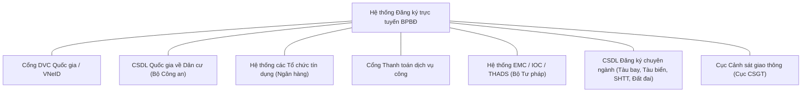

### 4.3.4 Phân hệ Tích hợp & Chia sẻ dữ liệu qua API (UC644 - UC684)

#### 4.3.4.1 Tổng quan kiến trúc kết nối
Hệ thống Đăng ký trực tuyến biện pháp bảo đảm (BPBĐ) bằng động sản được thiết kế như một cổng kết nối trung tâm (Integration Hub), hỗ trợ kết nối, tích hợp và chia sẻ dữ liệu hai chiều với các hệ thống thông tin dùng chung của Bộ Tư pháp, các Cơ sở dữ liệu quốc gia (CSDLQG), Cổng Dịch vụ công Quốc gia, các Tổ chức tín dụng (Ngân hàng), và các cơ quan quản lý chuyên ngành liên quan.



#### 4.3.4.2 Quy chuẩn kỹ thuật và Bảo mật kết nối API
Toàn bộ các dịch vụ chia sẻ dữ liệu (Web Services/APIs) được triển khai trên hệ thống bắt buộc phải tuân thủ các quy chuẩn kỹ thuật chung sau:
- **Giao thức truyền thông:** RESTful API sử dụng phương thức HTTPS mã hóa TLS 1.2 hoặc TLS 1.3 để bảo vệ dữ liệu trên đường truyền.
- **Định dạng dữ liệu:** Chuẩn trao đổi dữ liệu JSON (JavaScript Object Notation) sử dụng bảng mã UTF-8.
- **Xác thực và ủy quyền:** 
  - Đối với các kết nối hệ thống - hệ thống (System-to-System): Sử dụng chuẩn xác thực **OAuth 2.0 (Client Credentials Grant)** kết hợp mã hóa chữ ký gói tin **HMAC-SHA256** sử dụng cặp khóa (Access Key / Secret Key) hoặc Ký số Token để chống giả mạo và chống tấn công Replay Attack.
  - Đối với đăng nhập người dùng từ bên ngoài: Sử dụng chuẩn đăng nhập đơn trị **SSO (OpenID Connect / OAuth 2.0)** tích hợp qua Cổng Dịch vụ công Quốc gia / định danh điện tử VNeID.
- **Kiểm soát lưu lượng (Rate Limiting):** Cấu hình giới hạn số lượng request tối đa trên giây (tùy theo cấu hình đối tác tại **UC551**) để bảo vệ hệ thống khỏi tấn công DDoS và quá tải.
- **Nhật ký kết nối (API Gateway Log):** Lưu trữ toàn bộ thông tin Request/Response Metadata, mã kết quả (HTTP Status Code), mã phản hồi nghiệp vụ, IP đối tác, thời gian xử lý và lịch sử lỗi (đặc tả tại **UC676** và **UC684**).

---

#### 4.3.4.3 Danh sách các Use Case Tích hợp và Chia sẻ Dữ liệu

Dưới đây là đặc tả phân nhóm 41 Use Cases tích hợp và chia sẻ dữ liệu của hệ thống:

| Mã UC | Tên Use Case / Chức năng | Hệ thống kết nối / Đối tác | Hướng kết nối | Mô tả nghiệp vụ |
| :--- | :--- | :--- | :---: | :--- |
| **UC644** | Trao đổi qua API dữ liệu tài khoản cá nhân sử dụng dịch vụ công | Cổng DVC Quốc gia / VNeID | Nhận | Lấy thông tin định danh cá nhân (Số định danh, Họ tên, Ngày sinh, Quê quán) khi thực hiện liên thông tài khoản hoặc đăng nhập qua VNeID. |
| **UC645** | Trao đổi qua API dữ liệu tài khoản tổ chức sử dụng dịch vụ công | Cổng DVC Quốc gia | Nhận | Lấy thông tin định danh của doanh nghiệp/tổ chức (MST, Tên doanh nghiệp, Người đại diện) từ Cổng DVC Quốc gia phục vụ đăng ký. |
| **UC646** | Trao đổi qua API dữ liệu hỗ trợ thực hiện dịch vụ Đăng ký mới BPBĐ | Hệ thống Ngân hàng / TCTD | Gửi/Nhận | Hỗ trợ các Ngân hàng gọi API truy vấn dữ liệu nháp, lấy danh mục hỗ trợ nhập liệu tự động từ xa. |
| **UC647** | Trao đổi qua API dữ liệu hỗ trợ cấp bản sao văn bản chứng nhận đăng ký | Hệ thống Ngân hàng / TCTD | Gửi/Nhận | Hỗ trợ đối tác gọi dịch vụ truy vấn và tải xuống Bản sao văn bản chứng nhận điện tử (PDF đã ký số) tự động qua API. |
| **UC648** | Trao đổi qua API dữ liệu hỗ trợ thực hiện dịch vụ Đăng ký thay đổi BPBĐ | Hệ thống Ngân hàng / TCTD | Gửi/Nhận | Truy vấn hồ sơ gốc, đồng bộ thông tin thay đổi từ hệ thống Core của Ngân hàng sang hệ thống BPBĐ. |
| **UC649** | Trao đổi qua API dữ liệu hỗ trợ thực hiện dịch vụ Xóa đăng ký BPBĐ | Hệ thống Ngân hàng / TCTD | Gửi/Nhận | Tiếp nhận yêu cầu xóa đăng ký từ Ngân hàng (sau khi khách hàng tất toán khoản vay) để xử lý tự động. |
| **UC650** | Trao đổi qua API dữ liệu đăng ký/thay đổi/xóa thông báo xử lý tài sản bảo đảm | Hệ thống Ngân hàng / TCTD | Gửi/Nhận | Tiếp nhận và xử lý tự động hồ sơ Thông báo xử lý tài sản bảo đảm phục vụ thu hồi nợ. |
| **UC651** | Trao đổi qua API dữ liệu hỗ trợ cung cấp thông tin về BPBĐ | Hệ thống Đối tác ngoài | Gửi/Nhận | API truy vấn tình trạng tài sản thế chấp hỗ trợ quá trình kiểm tra thông tin của bên thứ ba hợp lệ. |
| **UC652** | Trao đổi qua API dữ liệu tiếp nhận hồ sơ dịch vụ Đăng ký mới BPBĐ | Hệ thống Ngân hàng / TCTD | Nhận | Tiếp nhận trực tiếp gói tin hồ sơ đăng ký mới BPBĐ gửi tự động từ Core Banking, đẩy vào danh sách chờ duyệt hoặc tự động duyệt (nếu đủ điều kiện). |
| **UC653** | Trao đổi qua API dữ liệu tiếp nhận hồ sơ cấp bản sao văn bản chứng nhận | Hệ thống Ngân hàng / TCTD | Nhận | Nhận yêu cầu nộp hồ sơ xin cấp bản sao văn bản chứng nhận đăng ký qua API. |
| **UC654** | Trao đổi qua API dữ liệu tiếp nhận hồ sơ Đăng ký thay đổi BPBĐ | Hệ thống Ngân hàng / TCTD | Nhận | Nhận hồ sơ đăng ký thay đổi trực tiếp qua API từ Ngân hàng gửi sang. |
| **UC655** | Trao đổi qua API dữ liệu tiếp nhận hồ sơ Xóa đăng ký BPBĐ | Hệ thống Ngân hàng / TCTD | Nhận | Nhận hồ sơ yêu cầu xóa đăng ký trực tiếp qua API từ Ngân hàng gửi sang. |
| **UC656** | Trao đổi qua API dữ liệu tiếp nhận hồ sơ xử lý tài sản bảo đảm | Hệ thống Ngân hàng / TCTD | Nhận | Nhận yêu cầu đăng ký thông báo xử lý tài sản bảo đảm trực tiếp qua API từ Ngân hàng gửi sang. |
| **UC657** | Trao đổi qua API dữ liệu tiếp nhận hồ sơ cung cấp thông tin về BPBĐ | Hệ thống Ngân hàng / TCTD | Nhận | Nhận yêu cầu tra cứu và cung cấp thông tin biện pháp bảo đảm qua API. |
| **UC658** | Trao đổi qua API dữ liệu kết quả thanh toán dịch vụ công | Cổng thanh toán quốc gia | Nhận | Tiếp nhận thông báo thanh toán thành công (IPN - Instant Payment Notification) từ cổng thanh toán để tự động gạch nợ phí/lệ phí hồ sơ. |
| **UC659** | Nhận thủ công dữ liệu hồ sơ đăng ký BPBĐ bằng chứng khoán đã lưu ký | Tổng công ty Lưu ký và Bù trừ CK | Nhận (File) | Cho phép import thủ công danh sách hồ sơ chứng khoán đã lưu ký từ VSDC gửi sang định kỳ. |
| **UC660** | Trao đổi qua API dữ liệu hồ sơ đăng ký BPBĐ bằng chứng khoán đã lưu ký | Tổng công ty Lưu ký và Bù trừ CK | Gửi/Nhận | Tự động đồng bộ và xác thực thông tin tài khoản sở hữu chứng khoán thế chấp với VSDC qua API kết nối. |
| **UC661** | Nhận thủ công dữ liệu hồ sơ đăng ký BPBĐ bằng quyền sử dụng đất | Văn phòng Đăng ký đất đai | Nhận (File) | Tiếp nhận file báo cáo danh sách thế chấp quyền sử dụng đất từ Văn phòng ĐKĐĐ để đối soát chéo. |
| **UC662** | Trao đổi qua API dữ liệu hồ sơ đăng ký BPBĐ bằng quyền sử dụng đất | Văn phòng Đăng ký đất đai | Gửi/Nhận | Liên thông kiểm tra tình trạng thế chấp tài sản gắn liền với đất để tránh đăng ký trùng lặp động sản/bất động sản. |
| **UC663** | Nhận thủ công dữ liệu hồ sơ đăng ký BPBĐ bằng tàu bay | Cục Hàng không Việt Nam | Nhận (File) | Tiếp nhận danh sách dữ liệu thế chấp tàu bay bằng phương thức truyền file thủ công an toàn. |
| **UC664** | Trao đổi qua API dữ liệu hồ sơ đăng ký BPBĐ bằng tàu bay | Cục Hàng không Việt Nam | Gửi/Nhận | Truy vấn và xác thực số đăng ký tàu bay quốc gia trước khi chấp thuận đăng ký thế chấp tàu bay. |
| **UC665** | Nhận thủ công dữ liệu hồ sơ đăng ký BPBĐ bằng tàu biển | Cục Hàng hải Việt Nam | Nhận (File) | Tiếp nhận danh sách dữ liệu thế chấp tàu biển bằng phương thức truyền file thủ công an toàn. |
| **UC666** | Trao đổi qua API dữ liệu hồ sơ đăng ký BPBĐ bằng tàu biển | Cục Hàng hải Việt Nam | Gửi/Nhận | Truy vấn thông tin đăng ký tàu biển quốc gia phục vụ thẩm định hồ sơ thế chấp tàu biển. |
| **UC667** | Trao đổi qua API dữ liệu tài sản sở hữu trí tuệ | Cục Sở hữu trí tuệ | Gửi/Nhận | Xác thực tính hợp lệ của văn bằng bảo hộ sở hữu trí tuệ (Sáng chế, Nhãn hiệu, Kiểu dáng công nghiệp) dùng làm tài sản bảo đảm. |
| **UC668** | Trao đổi qua API dữ liệu về phương tiện giao thông | Cục Đăng kiểm / Cục CSGT | Gửi/Nhận | Truy vấn dữ liệu số đăng ký, số khung, số máy phương tiện giao thông đường bộ từ CSDL đăng kiểm để hỗ trợ tự động điền và validate dữ liệu. |
| **UC669** | Trao đổi qua API dữ liệu xác định cơ quan giải quyết bồi thường | Hệ thống Bồi thường Nhà nước | Gửi | Chuyển tiếp dữ liệu hồ sơ yêu cầu bồi thường sang hệ thống chuyên ngành để xác định cơ quan thụ lý bồi thường. |
| **UC670** | Trao đổi qua API dữ liệu phục hồi danh dự | Hệ thống Bồi thường Nhà nước | Gửi | Gửi thông tin quyết định phục hồi danh dự cho cá nhân bị thiệt hại sang hệ thống Quản lý công tác BTNN. |
| **UC671** | Trao đổi qua API dữ liệu giải quyết yêu cầu bồi thường | Hệ thống Bồi thường Nhà nước | Gửi/Nhận | Đồng bộ tình trạng giải quyết hồ sơ bồi thường nhà nước giữa hệ thống dịch vụ công và phân hệ nghiệp vụ BTNN nội bộ. |
| **UC672** | Trao đổi qua API thông tin người sử dụng từ Nền tảng dùng chung Bộ Tư pháp | Nền tảng dùng chung STP | Nhận | Tích hợp xác thực tài khoản Cán bộ nghiệp vụ thông qua Active Directory (LDAP/AD) hoặc IAM dùng chung của Bộ Tư pháp. |
| **UC673** | Trao đổi qua API danh mục Tỉnh/Thành phố | CSDL Danh mục quốc gia | Nhận | Tự động cập nhật danh mục Tỉnh/Thành phố từ CSDL hành chính quốc gia định kỳ. |
| **UC674** | Trao đổi qua API danh mục Phường/Xã | CSDL Danh mục quốc gia | Nhận | Tự động cập nhật danh mục Quận/Huyện, Phường/Xã từ CSDL hành chính quốc gia định kỳ. |
| **UC675** | Trao đổi qua API danh mục mã nước | CSDL Danh mục quốc gia | Nhận | Đồng bộ danh mục mã quốc gia theo tiêu chuẩn ISO 3166 dùng chung. |
| **UC676** | Kết quả thực hiện API tiếp nhận dữ liệu | Hệ thống giám sát (Dashboard) | Nội bộ | Giao diện quản trị theo dõi log, thống kê tỷ lệ API tiếp nhận hồ sơ thành công/thất bại, xử lý sự cố kết nối API từ Ngân hàng. |
| **UC677** | Trao đổi qua API dữ liệu về đăng ký BPBĐ (Với CSDLTH Quốc gia) | CSDLTH Quốc gia | Gửi | Đồng bộ dữ liệu hồ sơ đã hoàn thành đăng ký sang Cơ sở dữ liệu tích hợp quốc gia để lưu trữ tập trung. |
| **UC678** | Trao đổi qua API dữ liệu về đăng ký BPBĐ (phương tiện giao thông cơ giới) | Cục CSGT (Bộ Công an) | Gửi | Gửi danh sách phương tiện thế chấp (số khung, số máy, biển số, tên chủ xe) sang CSDL của Cục CSGT để phục vụ ngăn chặn sang tên, chuyển nhượng trái phép. |
| **UC679** | Trao đổi qua API dữ liệu với hệ thống EMC | Hệ thống EMC (Bộ Tư pháp) | Gửi | Gửi dữ liệu thống kê, báo cáo và chỉ số hiệu năng hoạt động của hệ thống sang cổng giám sát EMC. |
| **UC680** | Trao đổi qua API dữ liệu với TTDHTM (IOC - Bộ Tư pháp) | Hệ thống IOC Bộ Tư pháp | Gửi | Gửi thông tin báo cáo động, dữ liệu biểu đồ phân tích sang Trung tâm điều hành thông minh (IOC). |
| **UC681** | Trao đổi qua API dữ liệu với hệ thống thi hành án dân sự (THADS) | CSDL Thi hành án dân sự | Gửi/Nhận | Truy vấn tự động trạng thái tài sản thế chấp xem có đang nằm trong danh sách kê biên thi hành án hay không để cảnh báo cán bộ thẩm định (UC028). |
| **UC682** | Trao đổi qua API dữ liệu hồ sơ đăng ký BPBĐ với tổ chức tra cứu thông tin | Các tổ chức tài chính / TCTD | Gửi | API chia sẻ dữ liệu (có phí) hỗ trợ các tổ chức tài chính truy vấn lịch sử thế chấp của tài sản khi thẩm định hồ sơ vay vốn. |
| **UC683** | Trao đổi qua API dữ liệu theo cấu trúc biểu mẫu TTHC về BPBĐ | Văn phòng Chính phủ / DVCQG | Gửi | Đồng bộ báo cáo số liệu giải quyết thủ tục hành chính về đăng ký BPBĐ theo chuẩn quy định. |
| **UC684** | Kết quả thực hiện API chia sẻ dữ liệu | Hệ thống giám sát (Dashboard) | Nội bộ | Thống kê số lượng, kiểm soát log các API chia sẻ dữ liệu ra bên ngoài, hỗ trợ đối soát sản lượng truy cập tính phí dịch vụ. |

---

#### 4.3.4.4 Đặc tả chi tiết một số API mẫu tiêu biểu

##### 1. API Tiếp nhận hồ sơ Đăng ký mới biện pháp bảo đảm (UC652)
- **Mục đích:** Cho phép hệ thống Core Banking của các Tổ chức tín dụng gửi trực tiếp hồ sơ đăng ký mới biện pháp bảo đảm sang hệ thống BPBĐ.
- **Phương thức:** `POST`
- **Đường dẫn API:** `/api/v1/registration/new-secure-transaction`
- **Cấu trúc Header yêu cầu:**
```json
{
  "Content-Type": "application/json",
  "Authorization": "Bearer [JWT_Token]",
  "X-Partner-Code": "BANK_ACB_01",
  "X-Signature": "[HMAC_SHA256_Signature_of_Body]"
}
```
- **Cấu trúc Body yêu cầu (Request Payload - Tóm lược):**
```json
{
  "requester_type": "DM_17_02",
  "general_info": {
    "agency_code": "DM_08_01",
    "transaction_type": "DM_01_01",
    "secure_method": "DM_02_01",
    "contract_number": "HD-2026/ACB-0199",
    "contract_effective_date": "2026-05-28",
    "loan_amount": 1500000000.00
  },
  "mortgagors": [
    {
      "subject_type": "DM_06_01",
      "full_name": "NGUYỄN VĂN A",
      "identity_type": "DM_10_01",
      "identity_number": "001092008765",
      "country_code": "VN",
      "province_code": "01",
      "address_detail": "Số 12 Phố Huế, Hoàn Kiếm, Hà Nội"
    }
  ],
  "mortgagees": [
    {
      "org_name": "NGÂN HÀNG TMCP Á CHÂU - CHI NHÁNH HÀ NỘI",
      "country_code": "VN",
      "province_code": "01",
      "address_detail": "184 Phố Huế, Hai Bà Trưng, Hà Nội"
    }
  ],
  "assets": {
    "asset_type_codes": ["DM_07_01"],
    "common_description": "Thế chấp 01 chiếc xe ô tô con nhãn hiệu Toyota Camry làm tài sản bảo đảm cho khoản vay",
    "vehicle_details": [
      {
        "vehicle_type": "Ô tô",
        "brand_color": "Toyota Camry, Màu đen",
        "chassis_number": "T7364239847239-C",
        "engine_number": "E-9837498273",
        "plate_number": "30K-999.99"
      }
    ]
  }
}
```
- **Cấu trúc phản hồi thành công (Response Payload - HTTP 200 OK):**
```json
{
  "code": "SUCCESS",
  "message": "Hồ sơ đã được tiếp nhận thành công",
  "data": {
    "dossier_code": "HS-20260529-00827",
    "status": "Chờ thanh toán",
    "amount_to_pay": 80000,
    "payment_qr_url": "https://gateway.service.gov.vn/pay/qr/HS-20260529-00827",
    "received_time": "2026-05-29T11:27:00Z"
  }
}
```

##### 2. API Đối soát danh sách tài sản kê biên với Hệ thống Thi hành án dân sự (UC681)
- **Mục đích:** Hệ thống tự động gửi yêu cầu kiểm tra tình trạng tài sản đăng ký thế chấp có đang bị ngăn chặn/kê biên bởi cơ quan THADS hay không trước khi Cán bộ thụ lý duyệt hồ sơ.
- **Phương thức:** `GET`
- **Đường dẫn API:** `/api/v1/thads/check-asset-restriction`
- **Cấu trúc Parameter:**
  - `chassis_number`: Số khung phương tiện cần kiểm tra (Ví dụ: `T7364239847239-C`)
  - `plate_number`: Biển số xe (Ví dụ: `30K-999.99`)
- **Cấu trúc phản hồi phát hiện ngăn chặn (HTTP 200 OK):**
```json
{
  "is_restricted": true,
  "restriction_details": {
    "decision_number": "102/QĐ-CCTHADS",
    "decision_date": "2026-04-15",
    "enforcing_agency": "Chi cục Thi hành án dân sự quận Hoàn Kiếm",
    "reason": "Kê biên tài sản bảo đảm thi hành án theo Bản án số 45/2026/DS-ST",
    "status": "Đang áp dụng ngăn chặn"
  }
}
```
*Lưu ý nghiệp vụ:* Khi API này trả về `is_restricted: true`, hệ thống lập tức kích hoạt cảnh báo đỏ trên Panel đối soát chi tiết hồ sơ cán bộ (quy định tại **UC028**), khóa nút Duyệt và tự động bật nút Từ chối kèm lý do được điền tự động lấy từ trường `reason`.

##### 3. API Chia sẻ dữ liệu trạng thái đăng ký BPBĐ cho Cục Cảnh sát Giao thông (UC678)
- **Mục đích:** Ngay khi Lãnh đạo ký số hoàn thành đăng ký thế chấp xe ô tô/xe máy, hệ thống tự động gọi API đồng bộ thông tin thế chấp sang Cục CSGT để phục vụ nghiệp vụ ngăn chặn sang tên mua bán tài sản đang thế chấp.
- **Phương thức:** `POST`
- **Đường dẫn API:** `/api/v1/csgt/notify-vehicle-mortgage`
- **Cấu trúc Request Body:**
```json
{
  "action": "LOCK", 
  "mortgage_dossier_code": "HS-20260529-00827",
  "certificate_number": "CC-98273981-GDBĐ",
  "certified_date": "2026-05-29",
  "vehicle_info": {
    "chassis_number": "T7364239847239-C",
    "engine_number": "E-9837498273",
    "plate_number": "30K-999.99",
    "owner_name": "NGUYỄN VĂN A",
    "owner_id_card": "001092008765"
  },
  "mortgagee_name": "NGÂN HÀNG TMCP Á CHÂU - CHI NHÁNH HÀ NỘI"
}
```
- **Cấu trúc phản hồi (Response HTTP 200 OK):**
```json
{
  "status": "SUCCESS",
  "sync_id": "CSGT-SYNC-20260529-99283",
  "message": "Đã ghi nhận trạng thái thế chấp phương tiện thành công trên hệ thống CSGT"
}
```
