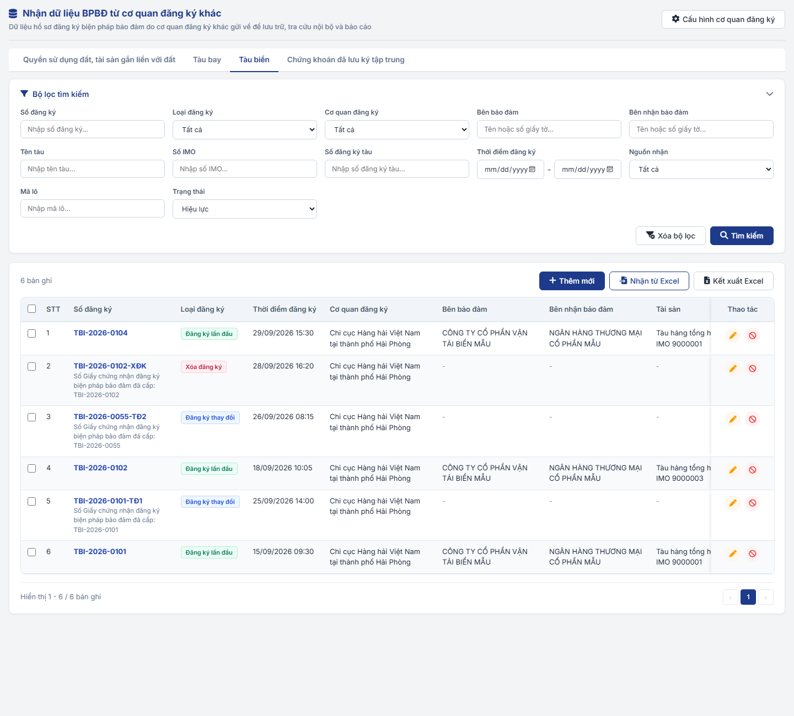
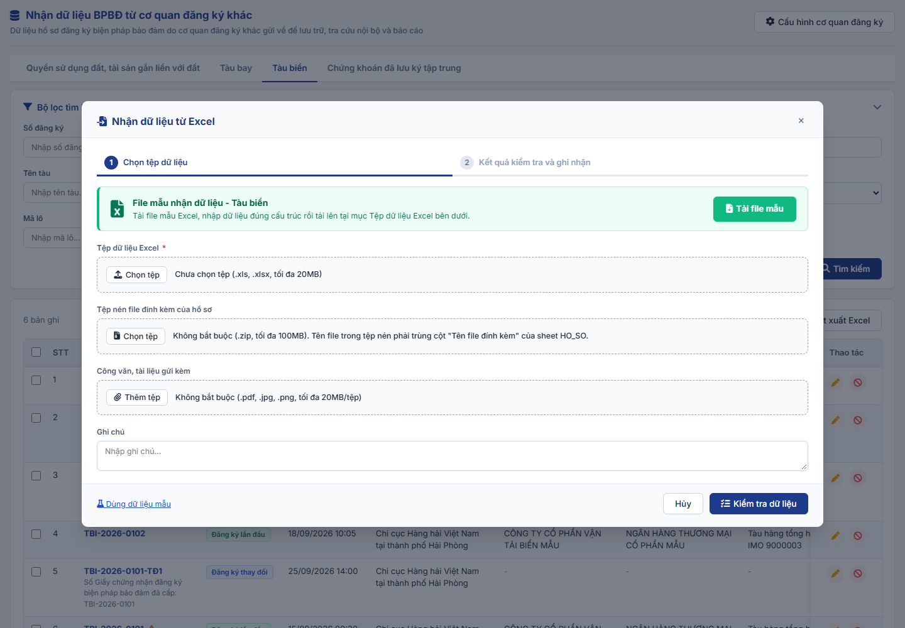
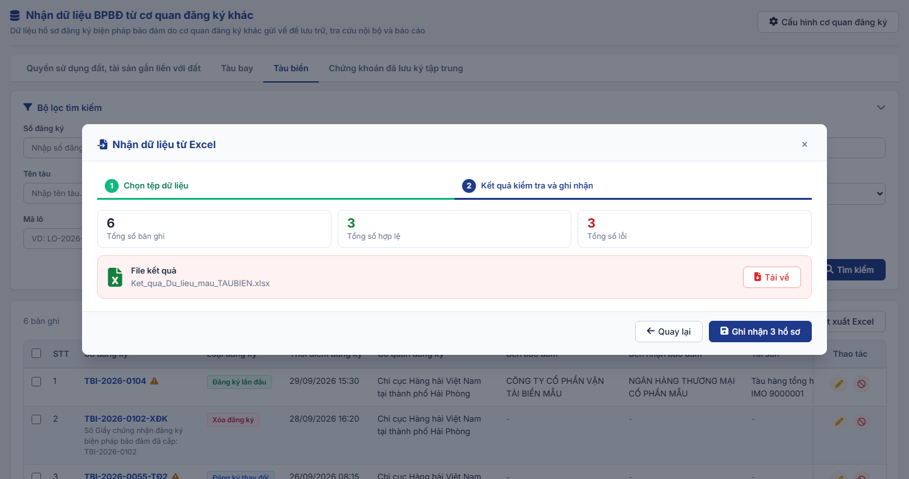
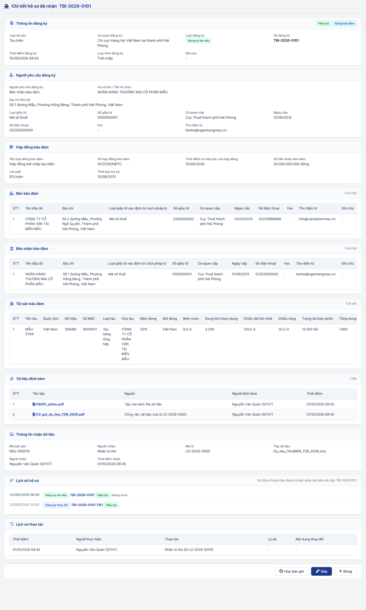
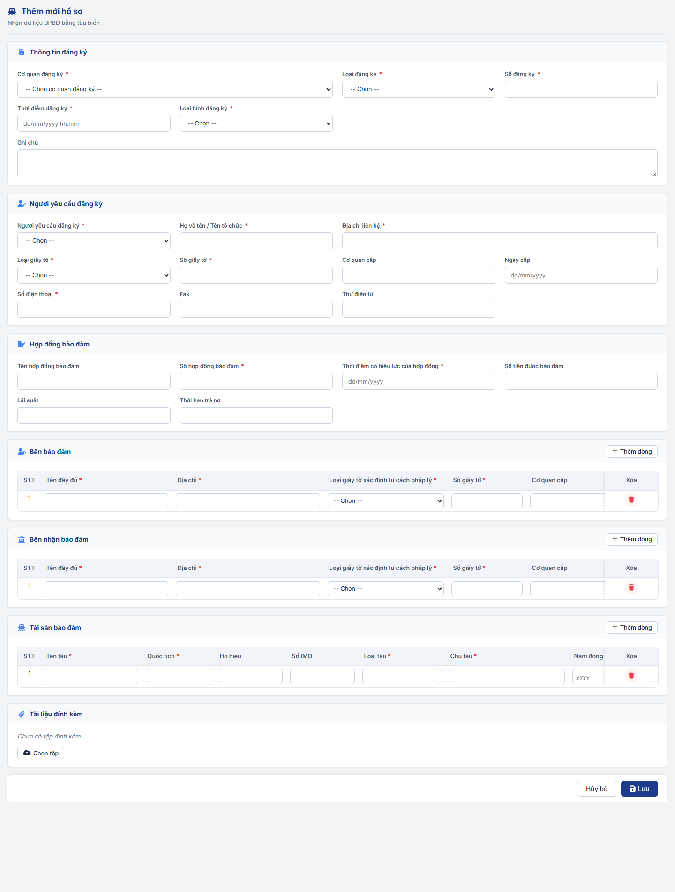

### 4.3.2.27. Nhận dữ liệu BPBĐ bằng tàu biển

#### 4.3.2.27.1. Mục đích

\- Cho phép Người dùng nhận vào hệ thống dữ liệu hồ sơ đăng ký biện pháp bảo đảm bằng tàu biển do cơ quan đăng ký tàu biển thực hiện đăng ký và gửi về.

\- Thông tin hồ sơ theo Phiếu yêu cầu đăng ký biện pháp bảo đảm bằng tàu biển tại Phụ lục ban hành kèm theo Nghị định số 99/2022/NĐ-CP, chi tiết tại mục [Cấu trúc dữ liệu tàu biển](#cau-truc-du-lieu-tau-bien):

\+ Thông tin chung: Loại hình đăng ký, Người yêu cầu đăng ký.

\+ Hợp đồng bảo đảm.

\+ Bên bảo đảm, Bên nhận bảo đảm.

\+ Mô tả tài sản bảo đảm (tàu biển).

\- Đăng ký thay đổi, Xóa đăng ký: Tạm áp dụng theo mô hình Nhận dữ liệu BPBĐ bằng tàu bay (chỉ nhập thông tin đăng ký, Người yêu cầu đăng ký; không nhập Hợp đồng bảo đảm, Bên bảo đảm, Bên nhận bảo đảm, Tài sản bảo đảm). Cần khách hàng cung cấp mẫu phiếu đăng ký thay đổi, xóa đăng ký biện pháp bảo đảm bằng tàu biển để xác nhận.

\- Gồm các chức năng:

\+ Tìm kiếm dữ liệu hồ sơ đã nhận vào hệ thống.

\+ Xem chi tiết dữ liệu hồ sơ đã nhận.

\+ Nhận thủ công dữ liệu hồ sơ vào hệ thống theo 02 cách: Nhận từ Excel theo biểu mẫu tàu biển (nhiều hồ sơ một lần, cách chính) và Thêm mới thủ công từng hồ sơ (cách phụ, dùng khi nhận bản giấy hoặc hồ sơ lẻ).

\+ Đính kèm file liên quan đến dữ liệu hồ sơ (nếu có) khi Nhận từ Excel, Thêm mới, Sửa.

\+ Sửa, Hủy bản ghi đã nhận (hủy từng bản ghi hoặc chọn nhiều bản ghi để hủy, xử lý trường hợp nhận nhầm, nhận sai).

\- Mỗi lần Nhận từ Excel thành công, hệ thống sinh 01 Mã lô và gắn vào từng hồ sơ được ghi nhận, kèm thông tin tệp dữ liệu, công văn gửi kèm. Mã lô dùng để lọc các hồ sơ của cùng một lần nhận (VD: hủy toàn bộ khi nhận nhầm cả tệp); không có màn hình quản lý lô riêng. Hồ sơ Thêm mới thủ công không có Mã lô.

\- Phạm vi, bản chất dữ liệu nhận thực hiện theo [BR-NDL-001]: dữ liệu không qua luồng kiểm tra, phê duyệt, ký số; không thu phí; không cấp Số đăng ký, mã PIN mới; giữ nguyên Cơ quan đăng ký, Số đăng ký, Thời điểm đăng ký theo dữ liệu cơ quan đăng ký tàu biển gửi.

*a. Phân quyền*

\- Menu "Biện pháp bảo đảm > Nhận dữ liệu BPBĐ từ cơ quan đăng ký khác" mở 01 màn hình gồm 04 tab theo Loại tài sản. Tab Tàu biển là 01 chức năng phân quyền riêng.

\- Người dùng được phân quyền chức năng này thì xem Tab Tàu biển và dữ liệu tàu biển; được thực hiện toàn bộ thao tác Tìm kiếm, Xem chi tiết, Nhận từ Excel, Thêm mới, Sửa, Hủy.

\- Vai trò thực hiện dự kiến: Quản trị hệ thống (QTHT).

*b. Điều kiện thực hiện*

\- Người dùng đã đăng nhập thành công vào Website Quản trị và được phân quyền chức năng Nhận dữ liệu BPBĐ bằng tàu biển.

---

#### 4.3.2.27.2. MH01 - Màn hình Danh sách dữ liệu tàu biển đã nhận

##### 4.3.2.27.2.1. Màn hình

##### 4.3.2.27.2.2. Mô tả thông tin trên màn hình

\- Trên giao diện, tên các khối không đánh số La Mã (số La Mã chỉ dùng để tham chiếu trong tài liệu).

| Trường thông tin | Kiểu dữ liệu | Bắt buộc | Mặc định | Mô tả |
| :--- | :--- | :---: | :--- | :--- |
| **I. Tiêu đề màn hình** | - | - | - | Control UI: Label. - Tiêu đề: "Nhận dữ liệu BPBĐ từ cơ quan đăng ký khác". - Góc phải: Nút "Cấu hình cơ quan đăng ký" (chỉ hiển thị khi được phân quyền), mở [MH06 - Popup Cấu hình cơ quan đăng ký - Nhận dữ liệu BPBĐ từ cơ quan đăng ký khác - Module Biện pháp bảo đảm (Website Quản trị)](SRS_Nhan_du_lieu_BPBD_tu_co_quan_dang_ky_khac.md#mh06). |
| **II. Tab Loại tài sản** | - | - | Tab đầu tiên được phân quyền | Control UI: Tab, chỉ hiển thị tên Loại tài sản (không có icon, không có badge số lượng). Gồm: + Quyền sử dụng đất, tài sản gắn liền với đất + Tàu bay + Tàu biển + Chứng khoán đã lưu ký tập trung - Chỉ hiển thị tab được phân quyền. - Tài liệu này mô tả Tab Tàu biển. |
| **III. Bộ lọc tìm kiếm** | - | - | - | Control UI: Khối thu gọn/mở rộng (Accordion), mặc định mở rộng. |
| Số đăng ký | String(50) | Không | Trống | Control UI: Input text. - Placeholder: "Nhập số đăng ký...". - Tìm gần đúng theo Số đăng ký hoặc Số Giấy chứng nhận đăng ký biện pháp bảo đảm đã cấp; không phân biệt hoa thường, bỏ qua dấu cách và ký tự - . /. |
| Loại đăng ký | Enum(String(50)) | Không | Tất cả | Control UI: Hộp chọn. Gồm: + Tất cả + Đăng ký lần đầu + Đăng ký thay đổi + Xóa đăng ký |
| Cơ quan đăng ký | Enum(String(255)) | Không | Tất cả | Control UI: Hộp chọn. Gồm: + Tất cả + Các cơ quan đăng ký đã cấu hình cho Loại tài sản Tàu biển tại [MH06 - Popup Cấu hình cơ quan đăng ký - Nhận dữ liệu BPBĐ từ cơ quan đăng ký khác - Module Biện pháp bảo đảm (Website Quản trị)](SRS_Nhan_du_lieu_BPBD_tu_co_quan_dang_ky_khac.md#mh06) theo [BR-NDL-011]. |
| Bên bảo đảm | String(255) | Không | Trống | Control UI: Input text. - Placeholder: "Tên hoặc số giấy tờ...". - Tìm gần đúng theo Tên đầy đủ hoặc Số giấy tờ của bất kỳ Bên bảo đảm nào của bản ghi. |
| Bên nhận bảo đảm | String(255) | Không | Trống | Control UI: Input text. - Placeholder: "Tên hoặc số giấy tờ...". - Tìm gần đúng như trường Bên bảo đảm. |
| Tên tàu | String(255) | Không | Trống | Control UI: Input text. - Placeholder: "Nhập tên tàu...". - Tìm gần đúng theo Tên tàu của bất kỳ tàu biển nào thuộc bản ghi; không phân biệt hoa thường, bỏ qua dấu cách và ký tự - . /. |
| Số IMO | String(20) | Không | Trống | Control UI: Input text. - Placeholder: "Nhập số IMO...". - Tìm gần đúng theo Số IMO của bất kỳ tàu biển nào thuộc bản ghi. |
| Số đăng ký tàu | String(50) | Không | Trống | Control UI: Input text. - Placeholder: "Nhập số đăng ký tàu...". - Tìm gần đúng theo Số đăng ký (mục 5 - Mô tả tài sản bảo đảm) của bất kỳ tàu biển nào thuộc bản ghi; không phân biệt hoa thường, bỏ qua dấu cách và ký tự - . /. |
| Thời điểm đăng ký | Date | Không | Trống | Control UI: Cặp ô chọn ngày Từ ngày - Đến ngày (dd/mm/yyyy). - Kiểm tra theo [BR-VAL-007], vi phạm hiển thị [MSG-ERR-VAL-007]. |
| Nguồn nhận | Enum(String(50)) | Không | Tất cả | Control UI: Hộp chọn. Gồm: + Tất cả + Nhận từ file + Thêm mới thủ công |
| Mã lô | String(20) | Không | Trống | Control UI: Input text. - Placeholder: "Nhập mã lô...". - Tìm gần đúng. |
| Trạng thái | Enum(String(50)) | Không | Hiệu lực | Control UI: Hộp chọn. Gồm: + Tất cả + Hiệu lực + Đã hủy |
| **IV. Danh sách** | - | - | - | Control UI: Bảng/Lưới hiển thị, phân trang 10 bản ghi/trang. - Thanh công cụ phía trên bảng: bên trái hiển thị tổng số bản ghi; bên phải gồm các nút theo thứ tự: Hủy bản ghi đã chọn (chỉ hiển thị khi có bản ghi được chọn), Thêm mới, Nhận từ Excel, Kết xuất Excel. - Sắp xếp mặc định: Ngày nhận giảm dần, sau đó Thời điểm đăng ký giảm dần. - Click vào dòng mở [MH03 - Màn hình Xem chi tiết hồ sơ tàu biển đã nhận](#tbi-mh03). - Dòng có trạng thái "Đã hủy" hiển thị chữ màu xám. |
| Chọn | Boolean | - | Không chọn | Control UI: Checkbox. - Tiêu đề cột là checkbox Chọn tất cả: chọn/bỏ chọn toàn bộ bản ghi "Hiệu lực" trên trang hiện tại. - Bản ghi "Đã hủy": checkbox vô hiệu hóa. - Danh sách đã chọn được xóa khi Tìm kiếm, Xóa bộ lọc. |
| STT | Integer(10) | - | Tự sinh | Số thứ tự tăng dần theo trang. |
| Số đăng ký | String(50) | - | Theo dữ liệu | Control UI: Link. - Loại đăng ký khác Đăng ký lần đầu: hiển thị thêm dòng phụ "Số Giấy chứng nhận đăng ký biện pháp bảo đảm đã cấp: [Số Giấy chứng nhận đăng ký biện pháp bảo đảm đã cấp]". |
| Loại đăng ký | Enum(String(50)) | - | Theo dữ liệu | Control UI: Tag màu theo Loại đăng ký. Gồm: + Đăng ký lần đầu + Đăng ký thay đổi + Xóa đăng ký |
| Thời điểm đăng ký | DateTime | - | Theo dữ liệu | Định dạng dd/mm/yyyy hh:mm. |
| Cơ quan đăng ký | String(255) | - | Theo dữ liệu | |
| Bên bảo đảm | String(255) | - | Theo dữ liệu | Tên đầy đủ của Bên bảo đảm thứ nhất; nhiều chủ thể hiển thị thêm "(+n)". - Đăng ký thay đổi, Xóa đăng ký: hiển thị "-". |
| Bên nhận bảo đảm | String(255) | - | Theo dữ liệu | Tên đầy đủ của Bên nhận bảo đảm thứ nhất; nhiều chủ thể hiển thị thêm "(+n)". - Đăng ký thay đổi, Xóa đăng ký: hiển thị "-". |
| Tài sản | String(500) | - | Theo dữ liệu | Tóm tắt tàu biển thứ nhất theo cú pháp "[Loại tàu] [Tên tàu] - IMO [Số IMO]"; nhiều tàu biển hiển thị thêm "(+n tài sản)". - Đăng ký thay đổi, Xóa đăng ký: hiển thị "-". |
| Nguồn nhận | Enum(String(50)) | - | Theo dữ liệu | Nhận từ file hoặc Thêm mới thủ công; Nhận từ file hiển thị thêm Mã lô. |
| Ngày nhận | DateTime | - | Theo dữ liệu | Thời điểm ghi nhận bản ghi vào hệ thống, định dạng dd/mm/yyyy hh:mm. |
| Trạng thái | Enum(String(50)) | - | Theo [BR-NDL-006] | Control UI: Tag. Gồm: + Hiệu lực + Đã hủy |
| Thao tác | - | - | - | Control UI: Cột cố định bên phải, gồm các nút thao tác: + Sửa: Cho phép sửa khi bản ghi "Hiệu lực" (bản ghi "Đã hủy" hiển thị mờ/vô hiệu hóa). + Hủy bản ghi: Cho phép hủy khi bản ghi "Hiệu lực" (bản ghi "Đã hủy" hiển thị mờ/vô hiệu hóa). *(Thao tác xem chi tiết được thực hiện bằng cách click vào dòng trên bảng)*. |

##### 4.3.2.27.2.3. Chức năng trên màn hình

| STT | Tên chức năng | Định dạng | Mô tả |
| :-- | :--- | :--- | :--- |
| 1 | Chuyển tab Loại tài sản | Tab | - Mở danh sách của Loại tài sản được chọn, các tiêu chí lọc về mặc định. |
| 2 | Thêm mới | Nút (Thanh công cụ lưới) | - Mở [MH04 - Màn hình Thêm mới/Sửa hồ sơ tàu biển](#tbi-mh04) ở chế độ Thêm mới. |
| 3 | Nhận từ Excel | Nút (Thanh công cụ lưới) | - Mở [MH02 - Popup Nhận dữ liệu tàu biển từ Excel](#tbi-mh02). |
| 4 | Kết xuất Excel | Nút (Thanh công cụ lưới) | - Kiểm tra theo yêu cầu tại [BR-EXP-040]. - TH1 (Danh sách rỗng): Hiển thị [MSG-WRN-SYS-001]. - TH Hợp lệ: Xuất tệp Excel theo kết quả tìm kiếm hiện hành, gồm các cột: STT, Số đăng ký, Số Giấy chứng nhận đăng ký biện pháp bảo đảm đã cấp, Loại đăng ký, Thời điểm đăng ký, Cơ quan đăng ký, Bên bảo đảm, Bên nhận bảo đảm, Tài sản, Nguồn nhận, Mã lô, Ngày nhận, Trạng thái, Cảnh báo. |
| 5 | Tìm kiếm | Nút | - TH1 (Khoảng ngày không hợp lệ): Vi phạm [BR-VAL-007], hiển thị [MSG-ERR-VAL-007]. - TH Hợp lệ: Lọc danh sách theo đồng thời các tiêu chí đã nhập/chọn, về trang 1, bỏ chọn các bản ghi đã chọn. |
| 6 | Xóa bộ lọc | Nút | - Xóa các tiêu chí đã nhập, đưa Trạng thái về "Hiệu lực", tải lại danh sách, bỏ chọn các bản ghi đã chọn. |
| 7 | Xem chi tiết | Click dòng trên bảng | - Click vào dòng bất kỳ trên bảng (trừ cột Chọn, Thao tác) để mở [MH03 - Màn hình Xem chi tiết hồ sơ tàu biển đã nhận](#tbi-mh03). |
| 8 | Sửa | Icon | - Mở [MH04 - Màn hình Thêm mới/Sửa hồ sơ tàu biển](#tbi-mh04) ở chế độ Sửa. |
| 9 | Hủy bản ghi | Icon | - Kiểm tra theo yêu cầu tại [BR-NDL-010]. - TH1 (Bản ghi Đăng ký lần đầu đang có bản ghi Đăng ký thay đổi, Xóa đăng ký "Hiệu lực" cùng hồ sơ): Hiển thị [MSG-ERR-NDL-007], không mở popup. - TH Hợp lệ: Mở [MH05 - Popup Hủy bản ghi](#tbi-mh05) với nội dung [MSG-CFM-NDL-002]. |
| 10 | Chọn / Chọn tất cả | Checkbox | - Chọn hoặc bỏ chọn bản ghi; nhãn nút Hủy bản ghi đã chọn hiển thị số bản ghi đang chọn. |
| 11 | Hủy bản ghi đã chọn ([N]) | Nút (Thanh công cụ lưới) | - Chỉ hiển thị khi có ít nhất 01 bản ghi được chọn. - Dùng khi nhận nhầm nhiều hồ sơ, VD: nhận nhầm cả tệp thì lọc theo Mã lô, Chọn tất cả rồi hủy. - Kiểm tra theo yêu cầu tại [BR-NDL-010]. - TH1 (Có bản ghi Đăng ký lần đầu đang được bản ghi "Hiệu lực" ngoài danh sách đã chọn liên kết): Hiển thị [MSG-ERR-NDL-007], không mở popup. - TH Hợp lệ: Mở [MH05 - Popup Hủy bản ghi](#tbi-mh05) với nội dung [MSG-CFM-NDL-003]. |
| 12 | Cấu hình cơ quan đăng ký | Nút (Góc phải tiêu đề) | - Chỉ hiển thị khi được phân quyền chức năng Cấu hình cơ quan đăng ký. - Mở [MH06 - Popup Cấu hình cơ quan đăng ký - Nhận dữ liệu BPBĐ từ cơ quan đăng ký khác - Module Biện pháp bảo đảm (Website Quản trị)](SRS_Nhan_du_lieu_BPBD_tu_co_quan_dang_ky_khac.md#mh06). |

---

#### 4.3.2.27.3. MH02 - Popup Nhận dữ liệu tàu biển từ Excel

##### 4.3.2.27.3.1. Màn hình

##### 4.3.2.27.3.2. Mô tả thông tin trên màn hình

| Trường thông tin | Kiểu dữ liệu | Bắt buộc | Mặc định | Mô tả |
| :--- | :--- | :---: | :--- | :--- |
| **I. Thanh bước** | - | - | Bước 1 | Control UI: Thanh tiến trình 02 bước: Bước 1 "Chọn tệp dữ liệu", Bước 2 "Kết quả kiểm tra và ghi nhận". |
| **II. Bước 1 - Chọn tệp dữ liệu** | - | - | - | |
| **Khối Tải file mẫu** | - | - | - | Control UI: Khối thông báo màu xanh lá đặt đầu Bước 1, gồm icon Excel, tiêu đề "File mẫu nhận dữ liệu - Tàu biển", dòng hướng dẫn và nút "Tải file mẫu" nổi bật (nút màu xanh lá) bên phải. |
| Tệp dữ liệu Excel | File | Có | Trống | Control UI: Upload file. - Kiểm tra theo yêu cầu tại [BR-NDL-002]: định dạng .xls, .xlsx; tối đa 20MB. - Vi phạm hiển thị [MSG-ERR-IMP-001] hoặc [MSG-ERR-IMP-002] dạng Inline. |
| Tệp nén file đính kèm của hồ sơ | File | Không | Trống | Control UI: Upload file. - Kiểm tra theo yêu cầu tại [BR-NDL-008]: định dạng .zip; tối đa 100MB. - Vi phạm hiển thị [MSG-ERR-NDL-002]; không đọc được tệp hiển thị [MSG-ERR-NDL-008]. - Đọc hợp lệ: hiển thị tên tệp và số tệp bên trong. |
| Công văn, tài liệu gửi kèm | File | Không | Trống | Control UI: Upload nhiều file, hiển thị dạng chip có nút xóa. - Kiểm tra theo yêu cầu tại [BR-NDL-008]: .pdf, .jpg, .jpeg, .png; tối đa 20MB/tệp. - Vi phạm hiển thị [MSG-ERR-FILE-003] hoặc [MSG-ERR-FILE-004]. |
| Ghi chú | Text(500) | Không | Trống | Control UI: Textarea. - Placeholder: "Nhập ghi chú...". |
| **III. Bước 2 - Kết quả kiểm tra** | - | - | - | Control UI: Khối thông tin chỉ đọc, gồm 03 thẻ số liệu và khối File kết quả. |
| Tổng số bản ghi | Integer(10) | - | Theo kết quả | Control UI: Thẻ số liệu. - Số hồ sơ (số dòng dữ liệu của sheet HO_SO) đọc được từ tệp. |
| Tổng số hợp lệ | Integer(10) | - | Theo kết quả | Control UI: Thẻ số liệu, số màu xanh lá. - Số hồ sơ không có lỗi, được ghi nhận khi chọn "Ghi nhận [N] hồ sơ". - Gồm cả hồ sơ có cảnh báo theo [BR-NDL-005], [BR-NDL-007] (cảnh báo không chặn ghi nhận). |
| Tổng số lỗi | Integer(10) | - | Theo kết quả | Control UI: Thẻ số liệu, số màu đỏ. - Số hồ sơ không được ghi nhận do vi phạm [BR-NDL-003], [BR-NDL-005], [BR-NDL-008] hoặc trùng theo [BR-NDL-004] (gồm cả hồ sơ đã tồn tại trên hệ thống). |
| **Khối File kết quả** | - | - | Ẩn | Control UI: Khối màu đỏ nhạt, gồm icon Excel, tiêu đề "File kết quả", tên tệp và nút "Tải về". - Chỉ hiển thị khi Tổng số lỗi lớn hơn 0 hoặc có dòng không xác định được hồ sơ (dòng ở sheet BEN_BAO_DAM, BEN_NHAN_BAO_DAM, TAI_SAN có Mã hồ sơ không có trong sheet HO_SO). |
| Tên File kết quả | String(255) | - | Theo dữ liệu | Control UI: Label. - Định dạng "Ket_qua_[Tên Tệp dữ liệu Excel].xlsx". |

##### 4.3.2.27.3.3. Chức năng trên màn hình

| STT | Tên chức năng | Định dạng | Mô tả |
| :-- | :--- | :--- | :--- |
| 1 | Tải file mẫu | Nút (Bước 1) | - Hệ thống tải xuống file mẫu Excel tàu biển theo mục [Cấu trúc dữ liệu tàu biển](#cau-truc-du-lieu-tau-bien). |
| 2 | Kiểm tra dữ liệu | Nút (Bước 1) | - TH1 (Bỏ trống trường bắt buộc): Vi phạm [BR-VAL-001], hiển thị [MSG-ERR-VAL-001] dưới Tệp dữ liệu Excel. - TH2 (Tệp sai cấu trúc): Thiếu sheet hoặc tên, thứ tự cột khác biểu mẫu tàu biển theo [BR-NDL-002]. Hiển thị [MSG-ERR-IMP-003], giữ nguyên Bước 1. - TH3 (Tệp không có dữ liệu): Hiển thị [MSG-ERR-NDL-001], giữ nguyên Bước 1. - TH Hợp lệ: Hệ thống đọc dữ liệu, kiểm tra từng hồ sơ theo yêu cầu tại [BR-NDL-003], [BR-NDL-004], [BR-NDL-005], [BR-NDL-007], [BR-NDL-008] và mục [Kiểm tra dữ liệu tàu biển](#kiem-tra-du-lieu-tau-bien), chuyển sang Bước 2. - Thứ tự kiểm tra trong cùng tệp: Đăng ký lần đầu trước, sau đó Đăng ký thay đổi, Xóa đăng ký theo Thời điểm đăng ký tăng dần. - Bước kiểm tra chưa ghi nhận dữ liệu vào hệ thống. |
| 3 | Hủy | Nút (Bước 1) | - Đóng popup, không lưu dữ liệu. |
| 4 | Tải về | Nút (Khối File kết quả) | - Tải xuống File kết quả theo mục [Cấu trúc File kết quả](#tbi-file-ket-qua). - Người dùng sửa dữ liệu trực tiếp trên File kết quả và nhận lại bằng chức năng Nhận từ Excel; hệ thống bỏ qua cột "Mô tả lỗi" theo [BR-NDL-002]. |
| 5 | Quay lại | Nút (Bước 2) | - Quay về Bước 1, giữ nguyên các thông tin đã chọn. |
| 6 | Ghi nhận [N] hồ sơ | Nút (Bước 2) | - Nhãn nút hiển thị số hồ sơ sẽ ghi nhận (Tổng số hợp lệ). - TH1 (Không có hồ sơ được ghi nhận): Hiển thị [MSG-ERR-NDL-003]. - TH Hợp lệ: Hiển thị popup xác nhận [MSG-CFM-NDL-001]: + Chọn "Hủy": Đóng popup xác nhận, giữ nguyên Bước 2. + Chọn "Đồng ý": Hệ thống thực hiện: * Sinh Mã lô cho lần nhận (định dạng LO-[yyyy]-[Số thứ tự 4 chữ số]; Mã lô không có trong file Excel); lưu thông tin lần nhận gồm Cơ quan gửi dữ liệu (các Cơ quan đăng ký có trong tệp), Tệp dữ liệu, Tệp nén, Công văn tài liệu gửi kèm, Ghi chú, Người nhận, Thời điểm nhận, Tổng số bản ghi, Tổng số hợp lệ, Tổng số lỗi. * Ghi nhận từng hồ sơ hợp lệ thành 01 bản ghi: Cơ quan đăng ký, Loại đăng ký theo dữ liệu, Nguồn nhận "Nhận từ file", Mã lô, Người nhận, Ngày nhận là thời điểm hiện tại, trạng thái "Hiệu lực"; lưu các tệp đã khai báo tại cột "Tên file đính kèm" theo [BR-NDL-008]; tệp trong tệp nén không được hồ sơ hợp lệ nào khai báo thì không lưu. * Liên kết các lần đăng ký của hồ sơ theo [BR-NDL-005]. * Ghi lịch sử thao tác "Nhận từ file (lô [Mã lô])". * Đóng popup, tải lại danh sách, hiển thị [MSG-SUC-NDL-001]. |
| 7 | Đóng (x) | Icon | - Đóng popup, không lưu dữ liệu. |

##### 4.3.2.27.3.4. Cấu trúc File kết quả

\- Giống file mẫu nhận dữ liệu tàu biển, chỉ giữ lại các bản ghi bị lỗi, thêm cột "Mô tả lỗi" ở cuối mỗi sheet dữ liệu ghi rõ lỗi của từng dòng.

---

#### 4.3.2.27.4. MH03 - Màn hình Xem chi tiết hồ sơ tàu biển đã nhận

##### 4.3.2.27.4.1. Màn hình

##### 4.3.2.27.4.2. Mô tả thông tin trên màn hình

\- Màn hình chỉ xem, các thông tin hiển thị theo dữ liệu đã ghi nhận của bản ghi; trường không có dữ liệu hiển thị "-".

\- Thông tin, khối thông tin không áp dụng cho Loại đăng ký của bản ghi thì không hiển thị (theo điều kiện tại cột Mô tả).

\- Trên giao diện, tên các khối không đánh số La Mã (số La Mã chỉ dùng để tham chiếu trong tài liệu).

\- Các nút thao tác (Hủy bản ghi, Sửa, Đóng) đặt tại thanh cố định cuối màn hình, luôn hiển thị khi cuộn trang: Hủy bản ghi và Sửa bên trái; nút Đóng nằm ở trong cùng góc phải màn hình.

| Trường thông tin | Kiểu dữ liệu | Bắt buộc | Mặc định | Mô tả |
| :--- | :--- | :---: | :--- | :--- |
| **Tiêu đề màn hình** | - | - | - | Control UI: Label "Chi tiết hồ sơ đã nhận [Số đăng ký]". |
| **Khối thông báo** | - | - | - | Control UI: Khối thông báo đặt dưới tiêu đề; chỉ hiển thị khi bản ghi đã hủy. |
| Thông báo bản ghi đã hủy | - | - | Theo dữ liệu bản ghi | Control UI: Khối màu đỏ "Bản ghi đã bị hủy. Lý do: [Lý do hủy]". - Chỉ hiển thị khi Trạng thái là "Đã hủy". |
| **I. Thông tin đăng ký** | - | - | - | Control UI: Khối thông tin chỉ đọc, lưới 4 cột. - Luôn hiển thị. |
| Trạng thái | - | - | Theo dữ liệu bản ghi | Control UI: Tag tại góc phải tiêu đề khối. |
| Tình trạng hồ sơ | - | - | Theo dữ liệu bản ghi | Control UI: Tag tại góc phải tiêu đề khối, cạnh Trạng thái. |
| Loại tài sản | - | - | Theo dữ liệu bản ghi | Control UI: Label, giá trị "Tàu biển". |
| Cơ quan đăng ký | - | - | Theo dữ liệu bản ghi | Control UI: Label. |
| Loại đăng ký | - | - | Theo dữ liệu bản ghi | Control UI: Tag. |
| Số đăng ký | - | - | Theo dữ liệu bản ghi | Control UI: Label, chữ đậm. |
| Số Giấy chứng nhận đăng ký biện pháp bảo đảm đã cấp | - | - | Theo dữ liệu bản ghi | Control UI: Label. - Chỉ hiển thị nếu Loại đăng ký là Đăng ký thay đổi hoặc Xóa đăng ký. |
| Thời điểm đăng ký | - | - | Theo dữ liệu bản ghi | Control UI: Label, định dạng dd/mm/yyyy hh:mm. |
| Loại hình đăng ký | - | - | Theo dữ liệu bản ghi | Control UI: Label (mục 1.1). - Chỉ hiển thị nếu Loại đăng ký là Đăng ký lần đầu hoặc Đăng ký thay đổi. |
| Nội dung thay đổi | - | - | Theo dữ liệu bản ghi | Control UI: Label, chiếm cả dòng. - Chỉ hiển thị nếu Loại đăng ký là Đăng ký thay đổi. |
| Căn cứ xóa đăng ký | - | - | Theo dữ liệu bản ghi | Control UI: Label. - Chỉ hiển thị nếu Loại đăng ký là Xóa đăng ký. |
| Ghi chú | - | - | Theo dữ liệu bản ghi | Control UI: Label. |
| **II. Người yêu cầu đăng ký** | - | - | - | Control UI: Khối thông tin chỉ đọc, lưới 4 cột (mục 1.2). - Luôn hiển thị. |
| Người yêu cầu đăng ký | - | - | Theo dữ liệu bản ghi | Control UI: Label. |
| Họ và tên / Tên tổ chức | - | - | Theo dữ liệu bản ghi | Control UI: Label. |
| Địa chỉ liên hệ | - | - | Theo dữ liệu bản ghi | Control UI: Label, chiếm cả dòng. |
| Loại giấy tờ | - | - | Theo dữ liệu bản ghi | Control UI: Label. |
| Số giấy tờ | - | - | Theo dữ liệu bản ghi | Control UI: Label. |
| Cơ quan cấp | - | - | Theo dữ liệu bản ghi | Control UI: Label. |
| Ngày cấp | - | - | Theo dữ liệu bản ghi | Control UI: Label, định dạng dd/mm/yyyy. |
| Số điện thoại | - | - | Theo dữ liệu bản ghi | Control UI: Label. |
| Fax | - | - | Theo dữ liệu bản ghi | Control UI: Label. |
| Thư điện tử | - | - | Theo dữ liệu bản ghi | Control UI: Label. |
| **III. Hợp đồng bảo đảm** | - | - | - | Control UI: Khối thông tin chỉ đọc (mục 2). - Chỉ hiển thị nếu Loại đăng ký là Đăng ký lần đầu. |
| Tên hợp đồng bảo đảm | - | - | Theo dữ liệu bản ghi | Control UI: Label. |
| Số hợp đồng bảo đảm | - | - | Theo dữ liệu bản ghi | Control UI: Label. |
| Thời điểm có hiệu lực của hợp đồng | - | - | Theo dữ liệu bản ghi | Control UI: Label, định dạng dd/mm/yyyy. |
| Số tiền được bảo đảm | - | - | Theo dữ liệu bản ghi | Control UI: Label. |
| Lãi suất | - | - | Theo dữ liệu bản ghi | Control UI: Label. |
| Thời hạn trả nợ | - | - | Theo dữ liệu bản ghi | Control UI: Label. |
| **IV. Bên bảo đảm** | - | - | - | Control UI: Bảng chỉ đọc (mục 3); góc phải tiêu đề khối hiển thị "[N] chủ thể". - Chỉ hiển thị nếu Loại đăng ký là Đăng ký lần đầu. |
| STT | - | - | Theo dữ liệu bản ghi | Số thứ tự tăng dần. |
| Tên đầy đủ | - | - | Theo dữ liệu bản ghi | Chữ IN HOA. |
| Địa chỉ | - | - | Theo dữ liệu bản ghi | Hiển thị theo [BR-VAL-015]. |
| Loại giấy tờ xác định tư cách pháp lý | - | - | Theo dữ liệu bản ghi | Control UI: Label. |
| Số giấy tờ | - | - | Theo dữ liệu bản ghi | Control UI: Label. |
| Cơ quan cấp | - | - | Theo dữ liệu bản ghi | Control UI: Label. |
| Ngày cấp | - | - | Theo dữ liệu bản ghi | Định dạng dd/mm/yyyy. |
| Số điện thoại | - | - | Theo dữ liệu bản ghi | Control UI: Label. |
| Fax | - | - | Theo dữ liệu bản ghi | Control UI: Label. |
| Thư điện tử | - | - | Theo dữ liệu bản ghi | Control UI: Label. |
| Ghi chú | - | - | Theo dữ liệu bản ghi | Control UI: Label. |
| **V. Bên nhận bảo đảm** | - | - | - | Control UI: Bảng chỉ đọc (mục 4); góc phải tiêu đề khối hiển thị "[N] chủ thể". - Chỉ hiển thị nếu Loại đăng ký là Đăng ký lần đầu. - Các cột như Khối IV. Bên bảo đảm. |
| **VI. Tài sản bảo đảm** | - | - | - | Control UI: Bảng chỉ đọc (mục 5), cuộn ngang; mỗi dòng là 01 tàu biển; góc phải tiêu đề khối hiển thị "[N] tài sản". - Chỉ hiển thị nếu Loại đăng ký là Đăng ký lần đầu. |
| STT | - | - | Theo dữ liệu bản ghi | Số thứ tự tăng dần. |
| Tên tàu | - | - | Theo dữ liệu bản ghi | Control UI: Label. |
| Quốc tịch | - | - | Theo dữ liệu bản ghi | Control UI: Label. |
| Hô hiệu | - | - | Theo dữ liệu bản ghi | Control UI: Label. |
| Số IMO | - | - | Theo dữ liệu bản ghi | Control UI: Label. |
| Loại tàu | - | - | Theo dữ liệu bản ghi | Control UI: Label. |
| Chủ tàu | - | - | Theo dữ liệu bản ghi | Control UI: Label. |
| Năm đóng | - | - | Theo dữ liệu bản ghi | Định dạng yyyy. |
| Nơi đóng | - | - | Theo dữ liệu bản ghi | Control UI: Label. |
| Mớn nước | - | - | Theo dữ liệu bản ghi | Control UI: Label. |
| Dung tích thực dụng | - | - | Theo dữ liệu bản ghi | Control UI: Label. |
| Chiều dài lớn nhất | - | - | Theo dữ liệu bản ghi | Control UI: Label. |
| Chiều rộng | - | - | Theo dữ liệu bản ghi | Control UI: Label. |
| Trọng tải toàn phần | - | - | Theo dữ liệu bản ghi | Control UI: Label. |
| Tổng dung tích | - | - | Theo dữ liệu bản ghi | Control UI: Label. |
| Nơi đăng ký | - | - | Theo dữ liệu bản ghi | Control UI: Label. |
| Tổ chức đăng kiểm | - | - | Theo dữ liệu bản ghi | Control UI: Label. |
| Tổng công suất máy chính | - | - | Theo dữ liệu bản ghi | Control UI: Label. |
| Số đăng ký | - | - | Theo dữ liệu bản ghi | Control UI: Label. |
| Ngày đăng ký | - | - | Theo dữ liệu bản ghi | Định dạng dd/mm/yyyy. |
| Tình trạng tài sản | - | - | Theo dữ liệu bản ghi | Control UI: Tag. - Bản ghi "Đã hủy": hiển thị "-". |
| **VII. Tài liệu đính kèm** | - | - | - | Control UI: Bảng chỉ đọc; góc phải tiêu đề khối hiển thị "[N] tệp". - Chỉ hiển thị khi bản ghi có ít nhất 01 tệp; không có tệp thì ẩn toàn bộ khối. - Không có chức năng đính kèm thêm tại màn hình này (đính kèm tại [MH04 - Màn hình Thêm mới/Sửa hồ sơ tàu biển](#tbi-mh04)). |
| STT | - | - | Theo dữ liệu bản ghi | Số thứ tự tăng dần. |
| Tên tệp | - | - | Theo dữ liệu bản ghi | Control UI: Link, click mở tệp. |
| Nguồn | - | - | Theo dữ liệu bản ghi | Control UI: Label. |
| Người đính kèm | - | - | Theo dữ liệu bản ghi | Họ tên Người dùng đính kèm tệp. |
| Thời điểm | - | - | Theo dữ liệu bản ghi | Định dạng dd/mm/yyyy hh:mm. |
| **VIII. Thông tin nhận dữ liệu** | - | - | - | Control UI: Khối thông tin chỉ đọc. - Luôn hiển thị; các thông tin hiển thị theo điều kiện dưới. |
| Mã bản ghi | - | - | Theo dữ liệu bản ghi | Control UI: Label. - Luôn hiển thị. - Mã định danh bản ghi do hệ thống tự sinh khi ghi nhận, định dạng NDL-[Số thứ tự 6 chữ số]. |
| Nguồn nhận | - | - | Theo dữ liệu bản ghi | Control UI: Label. - Luôn hiển thị. |
| Mã lô | - | - | Theo dữ liệu bản ghi | Control UI: Label. - Chỉ hiển thị nếu Nguồn nhận là "Nhận từ file". - Mã do hệ thống tự sinh khi người dùng chọn "Ghi nhận [N] hồ sơ" tại [MH02 - Popup Nhận dữ liệu tàu biển từ Excel](#tbi-mh02), định dạng LO-[yyyy]-[Số thứ tự 4 chữ số]; mỗi lần Nhận từ Excel sinh 01 Mã lô, dùng chung cho mọi hồ sơ được ghi nhận trong lần đó. - Không có trong file Excel, người dùng không nhập. |
| Tệp dữ liệu | - | - | Theo dữ liệu bản ghi | Control UI: Label, tên tệp Excel đã tải lên khi Nhận từ Excel. - Chỉ hiển thị nếu Nguồn nhận là "Nhận từ file". |
| Người nhận | - | - | Theo dữ liệu bản ghi | Control UI: Label, họ tên Người dùng thực hiện Nhận từ Excel hoặc Thêm mới. - Luôn hiển thị. |
| Thời điểm nhận | - | - | Theo dữ liệu bản ghi | Control UI: Label, định dạng dd/mm/yyyy hh:mm. - Luôn hiển thị. |
| **IX. Lịch sử hồ sơ** | - | - | - | Control UI: Dòng thời gian (Timeline). - Luôn hiển thị. - Liệt kê các bản ghi cùng hồ sơ (cùng Cơ quan đăng ký và Số Giấy chứng nhận đăng ký biện pháp bảo đảm đã cấp) theo [BR-NDL-005], gồm cả bản ghi "Đã hủy", sắp xếp Thời điểm đăng ký tăng dần. |
| Số Giấy chứng nhận đăng ký biện pháp bảo đảm đã cấp | - | - | Theo dữ liệu bản ghi | Control UI: Label tại góc phải tiêu đề khối. - Đăng ký lần đầu: là Số đăng ký của bản ghi. - Chưa có bản ghi Đăng ký lần đầu "Hiệu lực": hiển thị thêm "(chưa có hồ sơ gốc)". |
| Thời điểm đăng ký | - | - | Theo dữ liệu bản ghi | Định dạng dd/mm/yyyy hh:mm; mỗi dòng của Timeline là 01 bản ghi. |
| Loại đăng ký | - | - | Theo dữ liệu bản ghi | Control UI: Tag. |
| Số đăng ký | - | - | Theo dữ liệu bản ghi | Control UI: Link, click mở màn hình Xem chi tiết của bản ghi đó. |
| Trạng thái | - | - | Theo dữ liệu bản ghi | Control UI: Tag (Hiệu lực, Đã hủy). |
| Đang xem | - | - | Theo dữ liệu bản ghi | Dòng của bản ghi đang xem in đậm, kèm chữ "(đang xem)". |
| **X. Lịch sử thao tác** | - | - | - | Control UI: Bảng, sắp xếp Thời điểm giảm dần. - Luôn hiển thị. |
| Thời điểm | - | - | Theo dữ liệu bản ghi | Định dạng dd/mm/yyyy hh:mm. |
| Người thực hiện | - | - | Theo dữ liệu bản ghi | Họ tên Người dùng thực hiện thao tác. |
| Thao tác | - | - | Theo dữ liệu bản ghi | Control UI: Label. |
| Lý do | - | - | Theo dữ liệu bản ghi | Lý do sửa, Lý do hủy; không có hiển thị "-". |
| Nội dung thay đổi | - | - | Theo dữ liệu bản ghi | Theo [BR-NDL-009]; không có hiển thị "-". |

##### 4.3.2.27.4.3. Chức năng trên màn hình

| STT | Tên chức năng | Định dạng | Mô tả |
| :-- | :--- | :--- | :--- |
| 1 | Đóng | Nút (Góc phải thanh cố định cuối màn hình) | - Đóng màn hình xem chi tiết, quay về [MH01 - Màn hình Danh sách dữ liệu tàu biển đã nhận](#tbi-mh01). |
| 2 | Sửa | Nút (Thanh cố định cuối màn hình) | - Hiển thị khi bản ghi "Hiệu lực". - Mở [MH04 - Màn hình Thêm mới/Sửa hồ sơ tàu biển](#tbi-mh04) ở chế độ Sửa. |
| 3 | Hủy bản ghi | Nút (Thanh cố định cuối màn hình) | - Hiển thị khi bản ghi "Hiệu lực". - Xử lý như chức năng Hủy bản ghi tại [MH01 - Màn hình Danh sách dữ liệu tàu biển đã nhận](#tbi-mh01). |
| 4 | Xem bản ghi khác của hồ sơ | Link Số đăng ký (Khối IX. Lịch sử hồ sơ) | - Mở màn hình Xem chi tiết của bản ghi được chọn. |

---

#### 4.3.2.27.5. MH04 - Màn hình Thêm mới/Sửa hồ sơ tàu biển

##### 4.3.2.27.5.1. Màn hình

##### 4.3.2.27.5.2. Mô tả thông tin trên màn hình

\- Các trường nhập liệu sử dụng đúng danh sách trường, bắt buộc, định dạng và danh sách chọn của biểu mẫu Excel tàu biển tại mục [Cấu trúc dữ liệu tàu biển](#cau-truc-du-lieu-tau-bien).

\- Không áp dụng các nghiệp vụ của màn hình Đăng ký mới BPBĐ: lệ phí, thanh toán, mã PIN, kiểm tra thẩm quyền, danh sách thi hành án, đối chiếu C08.

\- Trên giao diện, tên các khối không đánh số La Mã; không hiển thị dòng chú thích, hướng dẫn dưới các trường; toàn bộ nhãn, thông báo bằng tiếng Việt. Ô nhập ngày, thời điểm hiển thị placeholder định dạng (dd/mm/yyyy, dd/mm/yyyy hh:mm, yyyy).

\- Bố cục: các khối Thông tin đăng ký, Người yêu cầu đăng ký, Hợp đồng bảo đảm hiển thị dạng lưới 4 cột cố định; trường địa chỉ, Số Giấy chứng nhận đăng ký biện pháp bảo đảm đã cấp chiếm 02 cột; trường văn bản dài (Nội dung thay đổi, Ghi chú) chiếm cả dòng.

\- Màn hình không hiển thị Loại tài sản (xác định theo Tab Tàu biển).

\- Khi thay đổi Loại đăng ký, hệ thống hiển thị/ẩn các trường, khối phụ thuộc theo mô tả dưới; trường bị ẩn không kiểm tra khi lưu.

| Trường thông tin | Kiểu dữ liệu | Bắt buộc | Mặc định | Mô tả |
| :--- | :--- | :---: | :--- | :--- |
| **Tiêu đề** | String(255) | - | - | Thêm mới: "Thêm mới hồ sơ". Sửa: "Sửa hồ sơ [Số đăng ký]", dòng phụ kèm Mã bản ghi. |
| **Khối thông báo lỗi** | - | - | Ẩn | Control UI: Khối màu đỏ dưới tiêu đề, liệt kê lỗi theo dạng "[Khối] [dòng] - [Tên trường]: [Nội dung lỗi]"; các ô lỗi tô viền đỏ. |
| **I. Thông tin đăng ký** | - | - | - | Control UI: Khối nhập liệu dạng lưới 4 cột. |
| Cơ quan đăng ký | Enum(String(255)) | Có | Loại tài sản chỉ có 01 cơ quan: chọn sẵn cơ quan đó | Control UI: Hộp chọn, chiếm 02 cột. - Danh sách: Các cơ quan đăng ký đã cấu hình cho Loại tài sản Tàu biển tại [MH06 - Popup Cấu hình cơ quan đăng ký - Nhận dữ liệu BPBĐ từ cơ quan đăng ký khác - Module Biện pháp bảo đảm (Website Quản trị)](SRS_Nhan_du_lieu_BPBD_tu_co_quan_dang_ky_khac.md#mh06) theo [BR-NDL-011]. - Dùng cho kiểm tra trùng hồ sơ theo [BR-NDL-004], liên kết các lần đăng ký theo [BR-NDL-005]. - Chế độ Sửa: cho phép sửa; giá trị mới phải thuộc danh sách đã cấu hình; thay đổi được ghi vào Nội dung thay đổi của lịch sử thao tác theo [BR-NDL-009]. |
| Loại đăng ký | Enum(String(50)) | Có | Trống | Control UI: Hộp chọn. Gồm: + Đăng ký lần đầu + Đăng ký thay đổi + Xóa đăng ký - Chưa chọn: hiển thị các trường theo Đăng ký lần đầu. - Chế độ Sửa: chỉ đọc theo [BR-NDL-009]. |
| Số đăng ký | String(50) | Có | Trống | Control UI: Input text. - Số đăng ký do cơ quan đăng ký cấp cho lần đăng ký này. |
| Số Giấy chứng nhận đăng ký biện pháp bảo đảm đã cấp | String(50) | Tùy điều kiện | Trống | Control UI: Input text, chiếm 02 cột. - Chỉ hiển thị và bắt buộc khi Loại đăng ký là Đăng ký thay đổi, Xóa đăng ký. |
| Thời điểm đăng ký | DateTime | Có | Trống | Control UI: Input text, định dạng dd/mm/yyyy hh:mm. - Không lớn hơn thời điểm hiện tại. |
| Loại hình đăng ký | Enum(String(50)) | Tùy điều kiện | Trống | Control UI: Hộp chọn (mục 1.1). Gồm: + Thế chấp + Bảo lưu quyền sở hữu - Hiển thị và bắt buộc khi Loại đăng ký là Đăng ký lần đầu, Đăng ký thay đổi; ẩn khi Xóa đăng ký. |
| Nội dung thay đổi | Text(2000) | Tùy điều kiện | Trống | Control UI: Textarea, chiếm cả dòng. - Chỉ hiển thị và bắt buộc khi Loại đăng ký là Đăng ký thay đổi. |
| Căn cứ xóa đăng ký | Enum(String(255)) | Tùy điều kiện | Trống | Control UI: Hộp chọn. - Chỉ hiển thị và bắt buộc khi Loại đăng ký là Xóa đăng ký. Gồm: + Chấm dứt nghĩa vụ được bảo đảm + Hủy bỏ hoặc thay thế biện pháp bảo đảm + Tài sản bảo đảm đã được xử lý xong + Theo bản án, quyết định của Tòa án hoặc cơ quan có thẩm quyền + Bên nhận bảo đảm đồng ý xóa đăng ký + Căn cứ khác |
| Ghi chú | Text(1000) | Không | Trống | Control UI: Textarea, chiếm cả dòng. - Hiển thị với mọi Loại đăng ký. |
| **II. Người yêu cầu đăng ký** | - | - | - | Control UI: Khối nhập liệu dạng lưới 4 cột (mục 1.2). |
| Người yêu cầu đăng ký | Enum(String(100)) | Có | Trống | Control UI: Hộp chọn. Gồm: + Bên nhận bảo đảm + Bên bảo đảm + Quản tài viên; Doanh nghiệp quản lý, thanh lý tài sản + Người đại diện |
| Họ và tên / Tên tổ chức | String(255) | Có | Trống | Control UI: Input text. - Họ và tên đầy đủ đối với cá nhân, tên đầy đủ đối với tổ chức. - Tự động chuyển chữ IN HOA khi nhập. |
| Địa chỉ liên hệ | String(500) | Có | Trống | Control UI: Input text, chiếm 02 cột. - Nhập theo cú pháp "Địa chỉ chi tiết, Phường/Xã, Tỉnh/Thành phố, Quốc gia" theo [BR-VAL-015]. |
| Loại giấy tờ | Enum(String(100)) | Có | Trống | Control UI: Hộp chọn. Gồm: + Chứng minh nhân dân, Căn cước công dân, Chứng minh quân đội + Hộ chiếu + Thẻ thường trú + Mã số thuế |
| Số giấy tờ | String(50) | Có | Trống | Control UI: Input text. - Loại giấy tờ là Mã số thuế và giá trị nhập là chữ số: Kiểm tra theo [BR-VAL-005]. |
| Cơ quan cấp | String(255) | Không | Trống | Control UI: Input text. |
| Ngày cấp | Date | Không | Trống | Control UI: Input text, định dạng dd/mm/yyyy. - Không lớn hơn ngày hiện tại. |
| Số điện thoại | String(20) | Có | Trống | Control UI: Input text. |
| Fax | String(20) | Không | Trống | Control UI: Input text. |
| Thư điện tử | String(100) | Không | Trống | Control UI: Input text. - Đúng định dạng thư điện tử. |
| **III. Hợp đồng bảo đảm** | - | - | - | Control UI: Khối nhập liệu dạng lưới 4 cột (mục 2). - Chỉ hiển thị nếu Loại đăng ký là Đăng ký lần đầu; Loại đăng ký khác: ẩn khối, không kiểm tra các trường của khối khi lưu. |
| Tên hợp đồng bảo đảm | String(500) | Không | Trống | Control UI: Input text. |
| Số hợp đồng bảo đảm | String(50) | Có | Trống | Control UI: Input text. |
| Thời điểm có hiệu lực của hợp đồng | Date | Có | Trống | Control UI: Input text, định dạng dd/mm/yyyy. - Không lớn hơn ngày hiện tại. |
| Số tiền được bảo đảm | String(100) | Không | Trống | Control UI: Input text. |
| Lãi suất | String(100) | Không | Trống | Control UI: Input text. |
| Thời hạn trả nợ | String(100) | Không | Trống | Control UI: Input text. |
| **Thông báo không nhập chủ thể, tài sản** | - | - | Ẩn | Control UI: Khối thông báo màu xanh, thay cho các khối IV, V, VI. - Chỉ hiển thị nếu Loại đăng ký khác Đăng ký lần đầu. - Đăng ký thay đổi: "Đăng ký thay đổi không nhập Bên bảo đảm, Bên nhận bảo đảm, Tài sản bảo đảm (chỉ nhập với Đăng ký lần đầu)." - Xóa đăng ký: "Xóa đăng ký không yêu cầu nhập Bên bảo đảm, Bên nhận bảo đảm, Tài sản. Khi lưu, toàn bộ tài sản của hồ sơ chuyển "Đã giải chấp"." |
| **IV. Bên bảo đảm** | - | Có | Chế độ Thêm mới: 01 dòng trống | Control UI: Lưới nhập liệu, cuộn ngang (mục 3); mỗi dòng là 01 chủ thể. - Chỉ hiển thị nếu Loại đăng ký là Đăng ký lần đầu. - Nút "Thêm dòng" tại góc phải tiêu đề khối: thêm 01 dòng trống. - Dòng không nhập giá trị nào được bỏ qua khi lưu. |
| STT | Integer(10) | - | Tự sinh | Số thứ tự tăng dần. |
| Tên đầy đủ | String(255) | Có | Trống | Control UI: Input text. - Tự động chuyển chữ IN HOA khi nhập. |
| Địa chỉ | String(500) | Có | Trống | Control UI: Input text. - Nhập theo cú pháp tại [BR-VAL-015]. |
| Loại giấy tờ xác định tư cách pháp lý | Enum(String(100)) | Có | Trống | Control UI: Hộp chọn. - Danh sách như trường Loại giấy tờ của Người yêu cầu đăng ký. |
| Số giấy tờ | String(50) | Có | Trống | Control UI: Input text. |
| Cơ quan cấp | String(255) | Không | Trống | Control UI: Input text. |
| Ngày cấp | Date | Không | Trống | Control UI: Input text, định dạng dd/mm/yyyy. |
| Số điện thoại | String(20) | Không | Trống | Control UI: Input text. |
| Fax | String(20) | Không | Trống | Control UI: Input text. |
| Thư điện tử | String(100) | Không | Trống | Control UI: Input text. - Đúng định dạng thư điện tử. |
| Ghi chú | Text(1000) | Không | Trống | Control UI: Input text. |
| Xóa dòng | - | - | - | Control UI: Icon tại cột cố định cuối dòng; xóa dòng khỏi lưới. |
| **V. Bên nhận bảo đảm** | - | Có | Chế độ Thêm mới: 01 dòng trống | Control UI: Lưới nhập liệu, cuộn ngang (mục 4); mỗi dòng là 01 chủ thể. - Chỉ hiển thị nếu Loại đăng ký là Đăng ký lần đầu. - Các cột, nút như Khối IV. Bên bảo đảm. |
| **VI. Tài sản bảo đảm** | - | Có | Chế độ Thêm mới: 01 dòng trống | Control UI: Lưới nhập liệu, cuộn ngang (mục 5); mỗi dòng là 01 tàu biển. - Chỉ hiển thị nếu Loại đăng ký là Đăng ký lần đầu. - Nút "Thêm dòng" tại góc phải tiêu đề khối: thêm 01 dòng trống. - Dòng không nhập giá trị nào được bỏ qua khi lưu. |
| STT | Integer(10) | - | Tự sinh | Số thứ tự tăng dần. |
| Tên tàu | String(255) | Có | Trống | Control UI: Input text. |
| Quốc tịch | String(100) | Có | Trống | Control UI: Input text. |
| Hô hiệu | String(20) | Không | Trống | Control UI: Input text. |
| Số IMO | String(7) | Không | Trống | Control UI: Input text. - Gồm 07 chữ số. |
| Loại tàu | String(255) | Có | Trống | Control UI: Input text. |
| Chủ tàu | String(255) | Có | Trống | Control UI: Input text. |
| Năm đóng | Integer(4) | Không | Trống | Control UI: Input text, placeholder "yyyy". - Gồm 04 chữ số. |
| Nơi đóng | String(255) | Không | Trống | Control UI: Input text. |
| Mớn nước | String(50) | Không | Trống | Control UI: Input text. |
| Dung tích thực dụng | String(50) | Không | Trống | Control UI: Input text. |
| Chiều dài lớn nhất | String(50) | Không | Trống | Control UI: Input text. |
| Chiều rộng | String(50) | Không | Trống | Control UI: Input text. |
| Trọng tải toàn phần | String(50) | Không | Trống | Control UI: Input text. |
| Tổng dung tích | String(50) | Không | Trống | Control UI: Input text. |
| Nơi đăng ký | String(255) | Không | Trống | Control UI: Input text. |
| Tổ chức đăng kiểm | String(255) | Không | Trống | Control UI: Input text. |
| Tổng công suất máy chính | String(50) | Không | Trống | Control UI: Input text. |
| Số đăng ký | String(50) | Có | Trống | Control UI: Input text. |
| Ngày đăng ký | Date | Không | Trống | Control UI: Input text, định dạng dd/mm/yyyy. - Không lớn hơn ngày hiện tại. |
| Xóa dòng | - | - | - | Control UI: Icon tại cột cố định cuối dòng; xóa dòng khỏi lưới. |
| **VII. Tài liệu đính kèm** | File | Không | Chế độ Sửa: các tệp đã có | Control UI: Upload nhiều file. - Danh sách tệp đã tải lên hiển thị phía trên, mỗi tệp 01 dòng gồm: icon loại tệp, Tên tệp, Dung lượng, link "Xem file", link "Xóa". - Chưa có tệp: hiển thị "Chưa có tệp đính kèm.". - Nút "Chọn tệp" đặt phía dưới danh sách tệp. - Kiểm tra theo yêu cầu tại [BR-NDL-008]. |
| **VIII. Lý do sửa** | Text(1000) | Có (chế độ Sửa) | Trống | Control UI: Textarea, chỉ hiển thị ở chế độ Sửa. |

##### 4.3.2.27.5.3. Chức năng trên màn hình

| STT | Tên chức năng | Định dạng | Mô tả |
| :-- | :--- | :--- | :--- |
| 1 | Lưu | Nút | - Kiểm tra theo yêu cầu tại [BR-NDL-003], [BR-NDL-004], [BR-NDL-005], [BR-NDL-007] và mục [Kiểm tra dữ liệu tàu biển](#kiem-tra-du-lieu-tau-bien) (chế độ Sửa thêm [BR-NDL-009]). - TH1 (Dữ liệu chưa hợp lệ): Hiển thị Khối thông báo lỗi, tô viền đỏ các ô lỗi, cuộn lên đầu màn hình; không lưu. Gồm các lỗi: + Bỏ trống trường bắt buộc (gồm Cơ quan đăng ký): [MSG-ERR-VAL-001]. + Đăng ký lần đầu thiếu chủ thể, tài sản: [MSG-ERR-NDL-005]. + Trùng hồ sơ đã có: [MSG-ERR-NDL-004]. + Hồ sơ gốc đã xóa đăng ký: [MSG-ERR-NDL-006]. + Sai định dạng, vi phạm quy tắc tại mục [Kiểm tra dữ liệu tàu biển](#kiem-tra-du-lieu-tau-bien). + Chế độ Sửa bỏ trống Lý do sửa: [MSG-ERR-VAL-001] dưới trường Lý do sửa. - TH2 (Có cảnh báo): Hiển thị popup [MSG-CFM-NDL-004] liệt kê cảnh báo [MSG-WRN-NDL-001], [MSG-WRN-NDL-002]: + Chọn "Hủy": Đóng popup, giữ nguyên màn hình. + Chọn "Đồng ý": Thực hiện như TH Hợp lệ. - TH Hợp lệ: + Chế độ Thêm mới: Ghi nhận bản ghi với Cơ quan đăng ký, Loại đăng ký đã nhập/chọn, Nguồn nhận "Thêm mới thủ công", không có Mã lô, Người nhận, Ngày nhận là thời điểm hiện tại, trạng thái "Hiệu lực"; liên kết các lần đăng ký theo [BR-NDL-005]; ghi lịch sử thao tác "Thêm mới thủ công"; hiển thị [MSG-SUC-NDL-002]. + Chế độ Sửa: Cập nhật bản ghi; ghi lịch sử thao tác "Sửa bản ghi" kèm Lý do và Nội dung thay đổi theo [BR-NDL-009]; hiển thị [MSG-SUC-NDL-003]. + Chuyển sang [MH03 - Màn hình Xem chi tiết hồ sơ tàu biển đã nhận](#tbi-mh03) của bản ghi. |
| 2 | Hủy bỏ | Nút | - TH1 (Chưa nhập hoặc chưa thay đổi dữ liệu): Quay về màn hình trước (Thêm mới về MH01, Sửa về MH03), không hiển thị xác nhận. - TH Hợp lệ (Có dữ liệu chưa lưu): Hiển thị [MSG-CFM-UCPS-001]; chọn "Đồng ý" quay về màn hình trước, không lưu; chọn "Hủy" đóng popup. |
| 3 | Thêm dòng / Xóa dòng | Nút / Icon | - Thêm hoặc xóa dòng tại lưới Bên bảo đảm, Bên nhận bảo đảm, Tài sản bảo đảm (chỉ có khi Loại đăng ký là Đăng ký lần đầu). |
| 4 | Chọn tệp | Nút (Khối VII) | - Cho phép chọn nhiều tệp, kiểm tra theo [BR-NDL-008]. - TH1 (Tệp không hợp lệ): Hiển thị [MSG-ERR-FILE-003] hoặc [MSG-ERR-FILE-004], bỏ qua tệp đó. - TH Hợp lệ: Thêm tệp vào danh sách, hiển thị link "Xem file", "Xóa" của tệp. |
| 5 | Xem file | Link (Khối VII) | - Mở tệp trên tab mới của trình duyệt. |
| 6 | Xóa | Link (Khối VII) | - Hiển thị popup xác nhận "Bạn có chắc chắn muốn xóa tệp [Tên tệp]?": + Chọn "Hủy": Đóng popup, giữ nguyên tệp. + Chọn "Đồng ý": Gỡ tệp khỏi danh sách (chỉ có hiệu lực khi Lưu). |

---

#### 4.3.2.27.6. MH05 - Popup Hủy bản ghi

| Trường thông tin | Kiểu dữ liệu | Bắt buộc | Mặc định | Mô tả |
| :--- | :--- | :---: | :--- | :--- |
| Nội dung xác nhận | String(500) | - | - | Hủy bản ghi: [MSG-CFM-NDL-002]. Hủy bản ghi đã chọn: [MSG-CFM-NDL-003]. |
| Lý do hủy | Text(1000) | Có | Trống | Control UI: Textarea. Lý do được lưu cho từng bản ghi bị hủy. |

| STT | Tên chức năng | Định dạng | Mô tả |
| :-- | :--- | :--- | :--- |
| 1 | Đồng ý | Nút | - TH1 (Bỏ trống Lý do hủy): Vi phạm [BR-VAL-001], hiển thị [MSG-ERR-VAL-001]. - TH Hợp lệ: Thực hiện theo [BR-NDL-010]: + Chuyển bản ghi (hoặc toàn bộ bản ghi đã chọn) sang "Đã hủy", lưu Lý do hủy, ghi lịch sử thao tác "Hủy bản ghi" cho từng bản ghi. + Tính lại Tình trạng hồ sơ, tài sản theo [BR-NDL-006]; tải lại màn hình, bỏ chọn các bản ghi đã chọn. + Hiển thị [MSG-SUC-NDL-004] (hủy 01 bản ghi) hoặc [MSG-SUC-NDL-005] (hủy bản ghi đã chọn). |
| 2 | Hủy / Đóng (x) | Nút / Icon | - Đóng popup, không thay đổi dữ liệu. |

---

#### 4.3.2.27.7. Cấu trúc dữ liệu tàu biển (Theo Phiếu yêu cầu đăng ký biện pháp bảo đảm bằng tàu biển - Nghị định số 99/2022/NĐ-CP)

\- Tệp biểu mẫu (bản dự thảo đề xuất, chờ khách hàng xác nhận): [Mau_Nhan_du_lieu_BPBD_Tau_bien.xlsx](../Bieu_mau_nhan_du_lieu_BPBD/Mau_Nhan_du_lieu_BPBD_Tau_bien.xlsx).

\- Cấu trúc tệp theo [BR-NDL-002]:

\+ Gồm các sheet HUONG_DAN, HO_SO, BEN_BAO_DAM, BEN_NHAN_BAO_DAM, TAI_SAN, DANH_MUC.

\+ Các sheet dữ liệu liên kết với nhau qua cột "Mã hồ sơ trong file".

\+ Dòng 1 là tên cột, dòng 2 là hướng dẫn nhập (tiếng Việt); dữ liệu đọc từ dòng 3.

\+ Dòng ví dụ VD01 (Đăng ký lần đầu), VD02 (Đăng ký thay đổi), VD03 (Xóa đăng ký) tô vàng, hệ thống bỏ qua khi nhận.

\- Mỗi dòng sheet HO_SO là 01 lần đăng ký; một tệp có thể gồm cả Đăng ký lần đầu, Đăng ký thay đổi, Xóa đăng ký.

\- Ngoài các mục của mẫu phiếu, biểu mẫu có thêm các cột kỹ thuật: Mã hồ sơ trong file, Cơ quan đăng ký, Loại đăng ký, Số đăng ký, Số Giấy chứng nhận đăng ký biện pháp bảo đảm đã cấp, Thời điểm đăng ký, Nội dung thay đổi, Căn cứ xóa đăng ký, STT chủ thể, STT tài sản, Tên file đính kèm, Ghi chú.

##### 4.3.2.27.7.1. Sheet HO_SO (mỗi dòng là 01 lần đăng ký)

| STT | Cột | Mục mẫu phiếu | Kiểu dữ liệu | Bắt buộc | Mô tả |
| :-- | :--- | :--- | :--- | :---: | :--- |
| 1 | Mã hồ sơ trong file | - | String(20) | Có | Do đơn vị lập file tự đặt, không trùng trong file. VD: HS001. |
| 2 | Cơ quan đăng ký | - | Enum(String(255)) | Có | Danh sách CO_QUAN_DK (sheet DANH_MUC) gồm các cơ quan đăng ký đã cấu hình cho Loại tài sản Tàu biển theo [BR-NDL-011]; Loại tài sản chỉ có 01 cơ quan thì file mẫu điền sẵn. |
| 3 | Loại đăng ký | - | Enum(String(50)) | Có | Danh sách: + Đăng ký lần đầu + Đăng ký thay đổi + Xóa đăng ký |
| 4 | Số đăng ký | - | String(50) | Có | Số đăng ký do cơ quan đăng ký cấp cho lần đăng ký này. |
| 5 | Số Giấy chứng nhận đăng ký biện pháp bảo đảm đã cấp | - | String(50) | Tùy điều kiện | Bắt buộc với Đăng ký thay đổi, Xóa đăng ký. - Đăng ký lần đầu: để trống hoặc trùng Số đăng ký. |
| 6 | Thời điểm đăng ký | - | DateTime | Có | dd/mm/yyyy hh:mm (24 giờ). |
| 7 | Loại hình đăng ký | 1.1 | Enum(String(50)) | Tùy điều kiện | Danh sách: + Thế chấp + Bảo lưu quyền sở hữu - Bắt buộc với Đăng ký lần đầu, Đăng ký thay đổi; để trống với Xóa đăng ký. |
| 8 | Nội dung thay đổi | - | Text(2000) | Tùy điều kiện | Bắt buộc với Đăng ký thay đổi. |
| 9 | Căn cứ xóa đăng ký | - | Enum(String(255)) | Tùy điều kiện | Bắt buộc với Xóa đăng ký. Danh sách: + Chấm dứt nghĩa vụ được bảo đảm + Hủy bỏ hoặc thay thế biện pháp bảo đảm + Tài sản bảo đảm đã được xử lý xong + Theo bản án, quyết định của Tòa án hoặc cơ quan có thẩm quyền + Bên nhận bảo đảm đồng ý xóa đăng ký + Căn cứ khác |
| 10 | Người yêu cầu đăng ký | 1.2 | Enum(String(100)) | Có | Danh sách: + Bên nhận bảo đảm + Bên bảo đảm + Quản tài viên; Doanh nghiệp quản lý, thanh lý tài sản + Người đại diện |
| 11 | Họ và tên / Tên tổ chức | 1.2 | String(255) | Có | Họ và tên đầy đủ đối với cá nhân, tên đầy đủ đối với tổ chức. Viết chữ IN HOA. |
| 12 | Địa chỉ liên hệ | 1.2 | String(500) | Có | Theo cú pháp "Địa chỉ chi tiết, Phường/Xã, Tỉnh/Thành phố, Quốc gia" tại [BR-VAL-015]. |
| 13 | Loại giấy tờ | 1.2 | Enum(String(100)) | Có | Danh sách: + Chứng minh nhân dân, Căn cước công dân, Chứng minh quân đội + Hộ chiếu + Thẻ thường trú + Mã số thuế |
| 14 | Số giấy tờ | 1.2 | String(50) | Có | Nhập dạng văn bản, giữ số 0 ở đầu. |
| 15 | Cơ quan cấp | 1.2 | String(255) | Không | |
| 16 | Ngày cấp | 1.2 | Date | Không | dd/mm/yyyy. |
| 17 | Số điện thoại | 1.2 | String(20) | Có | |
| 18 | Fax | 1.2 | String(20) | Không | Nếu có. |
| 19 | Thư điện tử | 1.2 | String(100) | Không | Nếu có. |
| 20 | Tên hợp đồng bảo đảm | 2 | String(500) | Không | Chỉ nhập với Đăng ký lần đầu. |
| 21 | Số hợp đồng bảo đảm | 2 | String(50) | Tùy điều kiện | Bắt buộc với Đăng ký lần đầu; để trống với Loại đăng ký khác. |
| 22 | Thời điểm có hiệu lực của hợp đồng | 2 | Date | Tùy điều kiện | dd/mm/yyyy. Bắt buộc với Đăng ký lần đầu; để trống với Loại đăng ký khác. |
| 23 | Số tiền được bảo đảm | 2 | String(100) | Không | Chỉ nhập với Đăng ký lần đầu. |
| 24 | Lãi suất | 2 | String(100) | Không | Chỉ nhập với Đăng ký lần đầu. |
| 25 | Thời hạn trả nợ | 2 | String(100) | Không | Chỉ nhập với Đăng ký lần đầu. |
| 26 | Tên file đính kèm | - | String(1000) | Không | Tên tệp trong tệp nén .zip tải lên kèm, nhiều tệp cách nhau bởi dấu ";" theo [BR-NDL-008]. |
| 27 | Ghi chú | - | Text(1000) | Không | |

##### 4.3.2.27.7.2. Sheet BEN_BAO_DAM (mục 3), BEN_NHAN_BAO_DAM (mục 4) (mỗi dòng là 01 chủ thể)

\- Chỉ nhập với Đăng ký lần đầu; Đăng ký thay đổi, Xóa đăng ký không nhập (có dòng của hồ sơ thì hồ sơ bị đánh dấu Lỗi).

| STT | Cột | Mục mẫu phiếu | Kiểu dữ liệu | Bắt buộc | Mô tả |
| :-- | :--- | :--- | :--- | :---: | :--- |
| 1 | Mã hồ sơ trong file | - | String(20) | Có | Trùng với Mã hồ sơ ở sheet HO_SO. |
| 2 | STT chủ thể | - | Integer(10) | Có | 1, 2, 3... trong cùng hồ sơ. |
| 3 | Tên đầy đủ | 3.1, 4.1 | String(255) | Có | Viết chữ IN HOA. |
| 4 | Địa chỉ | 3.2, 4.2 | String(500) | Có | Theo cú pháp "Địa chỉ chi tiết, Phường/Xã, Tỉnh/Thành phố, Quốc gia" tại [BR-VAL-015]. |
| 5 | Loại giấy tờ xác định tư cách pháp lý | 3.3, 4.3 | Enum(String(100)) | Có | Danh sách như cột Loại giấy tờ của sheet HO_SO. |
| 6 | Số giấy tờ | 3.3, 4.3 | String(50) | Có | Nhập dạng văn bản, giữ số 0 ở đầu. |
| 7 | Cơ quan cấp | 3.3, 4.3 | String(255) | Không | |
| 8 | Ngày cấp | 3.3, 4.3 | Date | Không | dd/mm/yyyy. |
| 9 | Số điện thoại | 3.3, 4.3 | String(20) | Không | Nếu có. |
| 10 | Fax | 3.3, 4.3 | String(20) | Không | Nếu có. |
| 11 | Thư điện tử | 3.3, 4.3 | String(100) | Không | Nếu có. |
| 12 | Ghi chú | - | Text(1000) | Không | |

\- Không có các cột Loại chủ thể, Quốc tịch / Quốc gia.

##### 4.3.2.27.7.3. Sheet TAI_SAN (mục 5 - Mô tả tài sản bảo đảm, mỗi dòng là 01 tàu biển)

\- Chỉ nhập với Đăng ký lần đầu; Đăng ký thay đổi, Xóa đăng ký không nhập (có dòng của hồ sơ thì hồ sơ bị đánh dấu Lỗi).

| STT | Cột | Kiểu dữ liệu | Bắt buộc | Mô tả |
| :-- | :--- | :--- | :---: | :--- |
| 1 | Mã hồ sơ trong file | String(20) | Có | Trùng với Mã hồ sơ ở sheet HO_SO. |
| 2 | STT tài sản | Integer(10) | Có | 1, 2, 3... trong cùng hồ sơ. |
| 3 | Tên tàu | String(255) | Có | |
| 4 | Quốc tịch | String(100) | Có | |
| 5 | Hô hiệu | String(20) | Không | |
| 6 | Số IMO | String(7) | Không | Gồm 07 chữ số. |
| 7 | Loại tàu | String(255) | Có | |
| 8 | Chủ tàu | String(255) | Có | |
| 9 | Năm đóng | Integer(4) | Không | yyyy. |
| 10 | Nơi đóng | String(255) | Không | |
| 11 | Mớn nước | String(50) | Không | |
| 12 | Dung tích thực dụng | String(50) | Không | |
| 13 | Chiều dài lớn nhất | String(50) | Không | |
| 14 | Chiều rộng | String(50) | Không | |
| 15 | Trọng tải toàn phần | String(50) | Không | |
| 16 | Tổng dung tích | String(50) | Không | |
| 17 | Nơi đăng ký | String(255) | Không | |
| 18 | Tổ chức đăng kiểm | String(255) | Không | |
| 19 | Tổng công suất máy chính | String(50) | Không | |
| 20 | Số đăng ký | String(50) | Có | Số đăng ký tàu biển. |
| 21 | Ngày đăng ký | Date | Không | dd/mm/yyyy. |

##### 4.3.2.27.7.4. Sheet DANH_MUC, HUONG_DAN

\- Sheet DANH_MUC gồm 06 danh sách:

\+ Cơ quan đăng ký (sinh theo cấu hình cơ quan đăng ký của Loại tài sản tại thời điểm tải file mẫu).

\+ Loại đăng ký.

\+ Loại hình đăng ký.

\+ Người yêu cầu đăng ký.

\+ Loại giấy tờ.

\+ Căn cứ xóa đăng ký.

\- Sheet HUONG_DAN gồm: cấu trúc tệp, quy tắc nhập, cách nhập theo Loại đăng ký, cách khai báo file đính kèm.

#### 4.3.2.27.8. Kiểm tra dữ liệu tàu biển

\- Áp dụng chung cho Nhận từ Excel, Thêm mới thủ công và Sửa; đơn vị kiểm tra là hồ sơ theo [BR-NDL-003].

\- Ngoài các quy tắc chung tại [BR-NDL-003], dữ liệu tàu biển được kiểm tra:

\+ Cột có dấu (*) bắt buộc nhập; cột có danh sách chọn chỉ nhận giá trị thuộc sheet DANH_MUC; Cơ quan đăng ký phải thuộc danh sách cơ quan đăng ký đã cấu hình cho Tàu biển theo [BR-NDL-011]. Cột chỉ áp dụng cho một số Loại đăng ký (Loại hình đăng ký, các cột Hợp đồng bảo đảm) không kiểm tra với Loại đăng ký không áp dụng.

\+ Bắt buộc theo Loại đăng ký:

\* Đăng ký lần đầu: Loại hình đăng ký, Số hợp đồng bảo đảm, Thời điểm có hiệu lực của hợp đồng; Số Giấy chứng nhận đăng ký biện pháp bảo đảm đã cấp để trống hoặc trùng Số đăng ký.

\* Đăng ký thay đổi: Số Giấy chứng nhận đăng ký biện pháp bảo đảm đã cấp, Loại hình đăng ký, Nội dung thay đổi.

\* Xóa đăng ký: Số Giấy chứng nhận đăng ký biện pháp bảo đảm đã cấp, Căn cứ xóa đăng ký.

\+ Đăng ký lần đầu: Hồ sơ phải có ít nhất 01 Bên bảo đảm, 01 Bên nhận bảo đảm, 01 tàu biển; vi phạm hiển thị [MSG-ERR-NDL-005].

\+ Đăng ký thay đổi, Xóa đăng ký: Không nhập Bên bảo đảm, Bên nhận bảo đảm, Tài sản bảo đảm; tệp có dòng của hồ sơ tại sheet BEN_BAO_DAM, BEN_NHAN_BAO_DAM, TAI_SAN thì hồ sơ bị đánh dấu Lỗi với nội dung "[Loại đăng ký] không nhập Bên bảo đảm, Bên nhận bảo đảm, Tài sản bảo đảm (chỉ nhập với Đăng ký lần đầu). Vui lòng xóa các dòng của hồ sơ tại sheet BEN_BAO_DAM, BEN_NHAN_BAO_DAM, TAI_SAN.".

\+ Thời điểm đăng ký theo định dạng dd/mm/yyyy hh:mm, không lớn hơn thời điểm hiện tại.

\+ Thời điểm có hiệu lực của hợp đồng, Ngày cấp, Ngày đăng ký theo định dạng dd/mm/yyyy, không lớn hơn ngày hiện tại.

\+ Họ và tên / Tên tổ chức của Người yêu cầu đăng ký, Tên đầy đủ của Bên bảo đảm, Bên nhận bảo đảm viết chữ IN HOA; vi phạm hiển thị "Phải viết chữ IN HOA.".

\+ Thư điện tử đúng định dạng thư điện tử.

\+ Loại giấy tờ là Mã số thuế và Số giấy tờ là chữ số: Kiểm tra theo [BR-VAL-005].

\+ Số IMO gồm 07 chữ số; Năm đóng gồm 04 chữ số.

\- Kiểm tra trùng hồ sơ theo [BR-NDL-004]: cùng Cơ quan đăng ký, Số đăng ký và Loại đăng ký với bản ghi tàu biển trạng thái "Hiệu lực".

\- Liên kết các lần đăng ký theo [BR-NDL-005]: Đăng ký thay đổi, Xóa đăng ký liên kết với hồ sơ gốc theo Số Giấy chứng nhận đăng ký biện pháp bảo đảm đã cấp.

\+ Chưa có hồ sơ gốc "Hiệu lực": Vẫn ghi nhận, hiển thị cảnh báo [MSG-WRN-NDL-001].

\+ Hồ sơ gốc đã có bản ghi Xóa đăng ký "Hiệu lực": Không ghi nhận, hiển thị [MSG-ERR-NDL-006].

\- Cảnh báo trùng tàu biển theo [BR-NDL-007]: trùng Số IMO (không có Số IMO thì theo Số đăng ký tàu biển) với tàu biển của hồ sơ khác đang có Tình trạng "Đang bảo đảm"; hiển thị [MSG-WRN-NDL-002], không chặn ghi nhận.

\- Nội dung chờ khách hàng xác nhận:

\+ Mẫu phiếu đăng ký thay đổi, xóa đăng ký biện pháp bảo đảm bằng tàu biển (hiện tạm áp dụng theo mô hình tàu bay).

\+ Trường bắt buộc của Hợp đồng bảo đảm và Mô tả tài sản bảo đảm (mẫu phiếu không ghi rõ trường bắt buộc).
