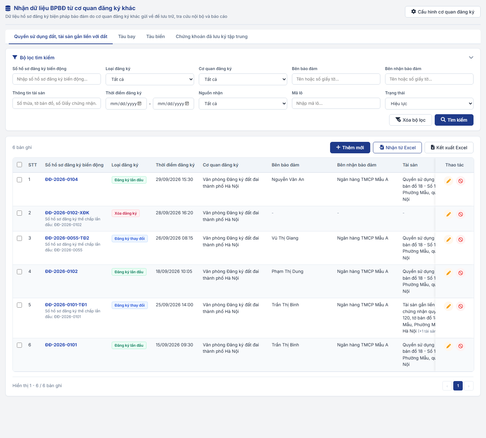
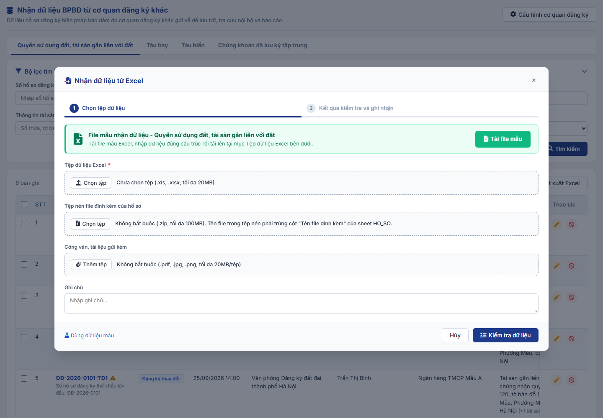
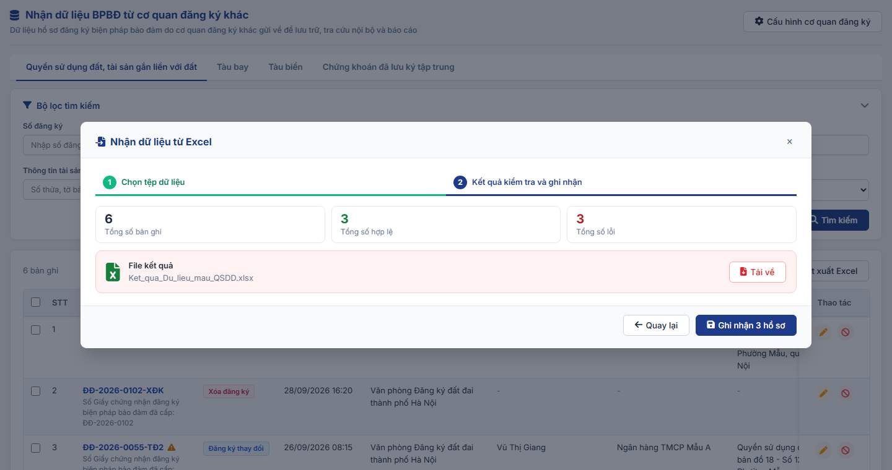
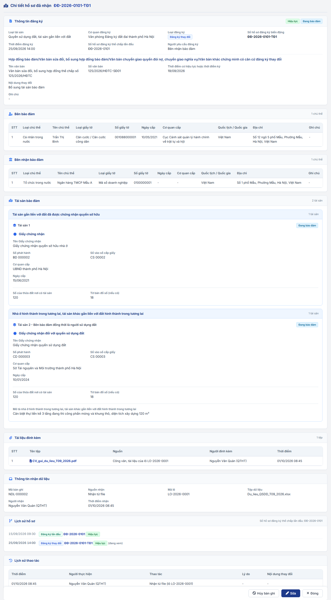
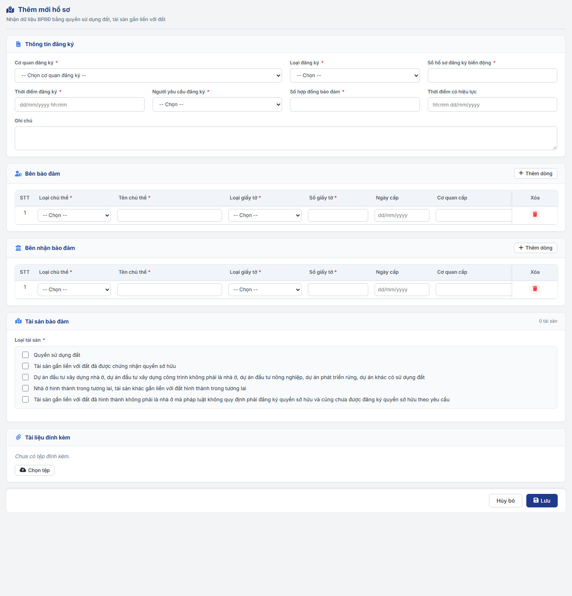
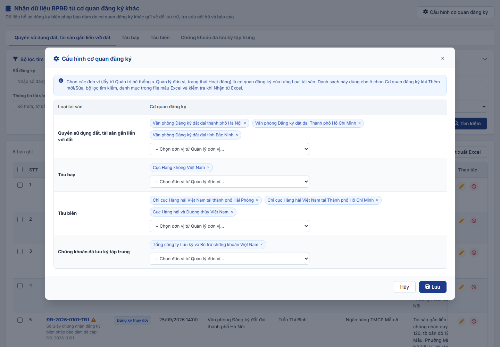

### 4.3.2.25. Nhận dữ liệu BPBĐ từ cơ quan đăng ký khác

#### 4.3.2.25.1. Mục đích

\- Cho phép Người dùng nhận vào hệ thống dữ liệu hồ sơ đăng ký biện pháp bảo đảm do cơ quan đăng ký khác thực hiện đăng ký và gửi về, theo 04 Loại tài sản:

\+ Quyền sử dụng đất, tài sản gắn liền với đất (thông tin theo biểu mẫu) - cơ quan gửi: Văn phòng Đăng ký đất đai và các Chi nhánh.

\+ Tàu bay - cơ quan gửi: Cục Hàng không Việt Nam (đặc tả chi tiết tại [Mục đích - Nhận dữ liệu BPBĐ bằng tàu bay - Module Biện pháp bảo đảm (Website Quản trị)](SRS_Nhan_du_lieu_BPBD_Tau_bay.md)).

\+ Tàu biển - cơ quan gửi: Cục Hàng hải và Đường thủy Việt Nam, các Chi cục Hàng hải (đặc tả chi tiết tại [Mục đích - Nhận dữ liệu BPBĐ bằng tàu biển - Module Biện pháp bảo đảm (Website Quản trị)](SRS_Nhan_du_lieu_BPBD_Tau_bien.md)).

\+ Chứng khoán đã lưu ký tập trung (thông tin theo biểu mẫu) - cơ quan gửi: Tổng công ty Lưu ký và Bù trừ chứng khoán Việt Nam.

\- Mỗi Loại tài sản gồm các chức năng:

\+ Tìm kiếm dữ liệu hồ sơ đã nhận vào hệ thống.

\+ Xem chi tiết dữ liệu hồ sơ đã nhận.

\+ Nhận thủ công dữ liệu hồ sơ vào hệ thống theo 02 cách: Nhận từ Excel theo biểu mẫu (nhiều hồ sơ một lần, cách chính) và Thêm mới thủ công từng hồ sơ (cách phụ, dùng khi nhận bản giấy hoặc hồ sơ lẻ).

\+ Đính kèm file liên quan đến dữ liệu hồ sơ (nếu có) khi Nhận từ Excel, Thêm mới, Sửa.

\+ Sửa, Hủy bản ghi đã nhận (hủy từng bản ghi hoặc chọn nhiều bản ghi để hủy, xử lý trường hợp nhận nhầm, nhận sai).

\- Cấu hình cơ quan đăng ký theo Loại tài sản (chọn từ danh sách đơn vị tại Quản lý đơn vị) theo [BR-NDL-011]; danh sách này dùng cho hộp chọn Cơ quan đăng ký, bộ lọc và file mẫu Excel của từng Loại tài sản.

\- Mỗi lần Nhận từ Excel thành công, hệ thống sinh 01 Mã lô và gắn vào từng hồ sơ được ghi nhận, kèm thông tin tệp dữ liệu, công văn gửi kèm. Mã lô dùng để lọc các hồ sơ của cùng một lần nhận (VD: hủy toàn bộ khi nhận nhầm cả tệp); không có màn hình quản lý lô riêng. Hồ sơ Thêm mới thủ công không có Mã lô.

\- Phạm vi, bản chất dữ liệu nhận thực hiện theo [BR-NDL-001]: dữ liệu không qua luồng kiểm tra, phê duyệt, ký số; không thu phí; không cấp Số đăng ký, mã PIN mới; giữ nguyên Cơ quan đăng ký, Số đăng ký, Thời điểm đăng ký theo dữ liệu cơ quan gửi.

\- Chức năng là phương thức nhận thủ công, dùng song song với phương thức trao đổi dữ liệu qua API tại [Danh sách các Use Case Tích hợp và Chia sẻ Dữ liệu - Tích hợp và chia sẻ dữ liệu - Module Tích hợp (Website Quản trị)](../04_Tich_hop_va_chia_se_du_lieu.md#4343-danh-sach-cac-use-case-tich-hop-va-chia-se-du-lieu). Hai phương thức dùng chung cấu trúc dữ liệu theo biểu mẫu tại mục [Biểu mẫu Excel nhận dữ liệu](#bieu-mau-excel-nhan-du-lieu).

*a. Phân quyền*

\- Menu "Biện pháp bảo đảm > Nhận dữ liệu BPBĐ từ cơ quan đăng ký khác" mở 01 màn hình gồm 04 tab theo Loại tài sản, mỗi tab là 01 chức năng phân quyền riêng:

\+ Quyền sử dụng đất, tài sản gắn liền với đất.

\+ Tàu bay.

\+ Tàu biển.

\+ Chứng khoán đã lưu ký tập trung.

\- Người dùng được phân quyền ít nhất 01 tab thì xem menu; chỉ xem tab và dữ liệu của Loại tài sản được phân quyền; được thực hiện toàn bộ thao tác Tìm kiếm, Xem chi tiết, Nhận từ Excel, Thêm mới, Sửa, Hủy của Loại tài sản đó.

\- Chức năng Cấu hình cơ quan đăng ký (áp dụng cho cả 04 Loại tài sản) là 01 chức năng phân quyền riêng.

\- Vai trò thực hiện dự kiến: Quản trị hệ thống (QTHT).

*b. Điều kiện thực hiện*

\- Người dùng đã đăng nhập thành công vào Website Quản trị và được phân quyền chức năng tương ứng.

---

#### 4.3.2.25.2. MH01 - Màn hình Danh sách dữ liệu đã nhận

##### 4.3.2.25.2.1. Màn hình

##### 4.3.2.25.2.2. Mô tả thông tin trên màn hình

| Trường thông tin | Kiểu dữ liệu | Bắt buộc | Mặc định | Mô tả |
| :--- | :--- | :---: | :--- | :--- |
| **I. Tiêu đề màn hình** | - | - | - | Control UI: Label. - Tiêu đề: "Nhận dữ liệu BPBĐ từ cơ quan đăng ký khác". - Góc phải: Nút "Cấu hình cơ quan đăng ký" (chỉ hiển thị khi được phân quyền). |
| **II. Tab Loại tài sản** | - | - | Tab đầu tiên được phân quyền | Control UI: Tab, chỉ hiển thị tên Loại tài sản (không có icon, không có badge số lượng). Gồm: + Quyền sử dụng đất, tài sản gắn liền với đất + Tàu bay + Tàu biển + Chứng khoán đã lưu ký tập trung - Chỉ hiển thị tab được phân quyền. - Bộ lọc, danh sách và các màn hình bên dưới áp dụng theo Loại tài sản của tab đang chọn. Riêng Tab Tàu bay mô tả tại [MH01 - Màn hình Danh sách dữ liệu tàu bay đã nhận - Nhận dữ liệu BPBĐ bằng tàu bay - Module Biện pháp bảo đảm (Website Quản trị)](SRS_Nhan_du_lieu_BPBD_Tau_bay.md#tb-mh01). |
| **III. Bộ lọc tìm kiếm** | - | - | - | Control UI: Khối thu gọn/mở rộng (Accordion), mặc định mở rộng. |
| Số đăng ký | String(50) | Không | Trống | Control UI: Input text. - Placeholder: "Nhập số đăng ký...". - Tìm gần đúng theo Số đăng ký hoặc Số Giấy chứng nhận đăng ký biện pháp bảo đảm đã cấp; không phân biệt hoa thường, bỏ qua dấu cách và ký tự - . /. - Đối với Quyền sử dụng đất, tài sản gắn liền với đất: Nhãn "Số hồ sơ đăng ký biến động", placeholder "Nhập số hồ sơ đăng ký biến động..."; tìm theo Số hồ sơ đăng ký biến động hoặc Số hồ sơ đăng ký thế chấp lần đầu. |
| Loại đăng ký | Enum(String(50)) | Không | Tất cả | Control UI: Hộp chọn. Gồm: + Tất cả + Đăng ký lần đầu + Đăng ký thay đổi + Sửa chữa sai sót + Xóa đăng ký - Danh sách theo biểu mẫu của Loại tài sản (Tàu bay; Quyền sử dụng đất, tài sản gắn liền với đất không có Sửa chữa sai sót). |
| Cơ quan đăng ký | Enum(String(255)) | Không | Tất cả | Control UI: Hộp chọn. Gồm: + Tất cả + Các cơ quan đăng ký đã cấu hình cho Loại tài sản của tab đang chọn tại [MH06 - Popup Cấu hình cơ quan đăng ký](#mh06) theo [BR-NDL-011]. |
| Bên bảo đảm | String(255) | Không | Trống | Control UI: Input text. - Placeholder: "Tên hoặc số giấy tờ...". - Tìm gần đúng theo Tên chủ thể hoặc Số giấy tờ của bất kỳ Bên bảo đảm nào của bản ghi. |
| Bên nhận bảo đảm | String(255) | Không | Trống | Control UI: Input text. - Placeholder: "Tên hoặc số giấy tờ...". - Tìm gần đúng như trường Bên bảo đảm. |
| Thông tin tài sản | String(255) | Không | Trống | Control UI: Input text. - Nhãn và placeholder động theo Loại tài sản, tìm gần đúng theo các trường: + Quyền sử dụng đất, tài sản gắn liền với đất: Số thửa, Tờ bản đồ số, Số phát hành và Số vào sổ cấp Giấy chứng nhận, Địa chỉ thửa đất, Tên dự án, Số Quyết định. + Tàu bay: Không dùng ô tìm gộp; tách thành 03 ô Số hiệu đăng ký, Loại tàu bay, Kiểu tàu bay. + Tàu biển: Tên tàu, Số IMO, Hô hiệu, Số đăng ký tàu biển. + Chứng khoán đã lưu ký tập trung: Mã chứng khoán, Tên tổ chức phát hành, Số tài khoản lưu ký, Thành viên lưu ký. |
| Thời điểm đăng ký | Date | Không | Trống | Control UI: Cặp ô chọn ngày Từ ngày - Đến ngày (dd/mm/yyyy). - Kiểm tra theo [BR-VAL-007], vi phạm hiển thị [MSG-ERR-VAL-007]. |
| Nguồn nhận | Enum(String(50)) | Không | Tất cả | Control UI: Hộp chọn. Gồm: + Tất cả + Nhận từ file + Thêm mới thủ công |
| Mã lô | String(20) | Không | Trống | Control UI: Input text. - Placeholder: "Nhập mã lô...". - Tìm gần đúng. |
| Trạng thái | Enum(String(50)) | Không | Hiệu lực | Control UI: Hộp chọn. Gồm: + Tất cả + Hiệu lực + Đã hủy (theo [BR-NDL-006]) |
| **IV. Danh sách** | - | - | - | Control UI: Bảng/Lưới hiển thị, phân trang 10 bản ghi/trang. - Thanh công cụ phía trên bảng: bên trái hiển thị tổng số bản ghi; bên phải gồm các nút theo thứ tự: Hủy bản ghi đã chọn (chỉ hiển thị khi có bản ghi được chọn), Thêm mới, Nhận từ Excel, Kết xuất Excel. - Sắp xếp mặc định: Ngày nhận giảm dần, sau đó Thời điểm đăng ký giảm dần. - Click vào dòng mở [MH03 - Màn hình Xem chi tiết hồ sơ đã nhận](#mh03). - Dòng có trạng thái "Đã hủy" hiển thị chữ màu xám. |
| Chọn | Boolean | - | Không chọn | Control UI: Checkbox. - Tiêu đề cột là checkbox Chọn tất cả: chọn/bỏ chọn toàn bộ bản ghi "Hiệu lực" trên trang hiện tại. - Bản ghi "Đã hủy": checkbox vô hiệu hóa. - Danh sách đã chọn được xóa khi Tìm kiếm, Xóa bộ lọc. |
| STT | Integer(10) | - | Tự sinh | Số thứ tự tăng dần theo trang. |
| Số đăng ký | String(50) | - | Theo dữ liệu | Control UI: Link. - Hiển thị Số đăng ký / Số vào sổ. - Loại đăng ký khác Đăng ký lần đầu: hiển thị thêm dòng phụ "Số Giấy chứng nhận đăng ký biện pháp bảo đảm đã cấp: [Số Giấy chứng nhận đăng ký biện pháp bảo đảm đã cấp]". - Đối với Quyền sử dụng đất, tài sản gắn liền với đất: Tiêu đề cột "Số hồ sơ đăng ký biến động"; dòng phụ "Số hồ sơ đăng ký thế chấp lần đầu: [Số hồ sơ đăng ký thế chấp lần đầu]". |
| Loại đăng ký | Enum(String(50)) | - | Theo dữ liệu | Control UI: Tag màu theo Loại đăng ký. |
| Thời điểm đăng ký | DateTime | - | Theo dữ liệu | Định dạng dd/mm/yyyy hh:mm. |
| Cơ quan đăng ký | String(255) | - | Theo dữ liệu | |
| Bên bảo đảm | String(255) | - | Theo dữ liệu | Tên Bên bảo đảm thứ nhất; nhiều chủ thể hiển thị thêm "(+n)". |
| Bên nhận bảo đảm | String(255) | - | Theo dữ liệu | Tên Bên nhận bảo đảm thứ nhất; nhiều chủ thể hiển thị thêm "(+n)". |
| Tài sản | String(500) | - | Theo dữ liệu | Tóm tắt tài sản thứ nhất theo Loại tài sản; nhiều tài sản hiển thị thêm "(+n tài sản)": + Quyền sử dụng đất, tài sản gắn liền với đất: "[Loại tài sản]: Thửa [Số thửa], tờ bản đồ [Tờ bản đồ số] - [Địa chỉ thửa đất]". + Tàu bay: "[Loại tàu bay] [Kiểu tàu bay] - [Số hiệu đăng ký] (S/N [Số xuất xưởng tàu bay])". + Tàu biển: "[Loại tài sản] [Tên tàu] - IMO [Số IMO]". + Chứng khoán đã lưu ký tập trung: "[Loại chứng khoán] [Mã chứng khoán] - SL [Số lượng] (TK [Số tài khoản lưu ký])". |
| Nguồn nhận | Enum(String(50)) | - | Theo dữ liệu | Nhận từ file hoặc Thêm mới thủ công; Nhận từ file hiển thị thêm Mã lô. |
| Ngày nhận | DateTime | - | Theo dữ liệu | Thời điểm ghi nhận bản ghi vào hệ thống, định dạng dd/mm/yyyy hh:mm. |
| Trạng thái | Enum(String(50)) | - | Theo [BR-NDL-006] | Control UI: Tag. Gồm: + Hiệu lực + Đã hủy |
| Thao tác | - | - | - | Control UI: Cột cố định bên phải, gồm các nút thao tác: + Sửa: Cho phép sửa khi bản ghi "Hiệu lực" (bản ghi "Đã hủy" hiển thị mờ/vô hiệu hóa). + Hủy bản ghi: Cho phép hủy khi bản ghi "Hiệu lực" (bản ghi "Đã hủy" hiển thị mờ/vô hiệu hóa). *(Thao tác xem chi tiết được thực hiện bằng cách click vào dòng trên bảng)*. |

##### 4.3.2.25.2.3. Chức năng trên màn hình

| STT | Tên chức năng | Định dạng | Mô tả |
| :-- | :--- | :--- | :--- |
| 1 | Chuyển tab Loại tài sản | Tab | - Mở danh sách của Loại tài sản được chọn, các tiêu chí lọc về mặc định. |
| 2 | Thêm mới | Nút (Thanh công cụ lưới) | - Mở [MH04 - Màn hình Thêm mới/Sửa hồ sơ](#mh04) ở chế độ Thêm mới. |
| 3 | Nhận từ Excel | Nút (Thanh công cụ lưới) | - Mở [MH02 - Popup Nhận dữ liệu từ Excel](#mh02). |
| 4 | Kết xuất Excel | Nút (Thanh công cụ lưới) | - Kiểm tra theo yêu cầu tại [BR-EXP-040]. - TH1 (Danh sách rỗng): Hiển thị [MSG-WRN-SYS-001]. - TH Hợp lệ: Xuất tệp Excel theo kết quả tìm kiếm hiện hành, gồm các cột: STT, Số đăng ký, Số Giấy chứng nhận đăng ký biện pháp bảo đảm đã cấp, Loại đăng ký, Thời điểm đăng ký, Cơ quan đăng ký, Bên bảo đảm, Bên nhận bảo đảm, Tài sản, Nguồn nhận, Mã lô, Ngày nhận, Trạng thái, Cảnh báo. |
| 5 | Tìm kiếm | Nút | - TH1 (Khoảng ngày không hợp lệ): Vi phạm [BR-VAL-007], hiển thị [MSG-ERR-VAL-007]. - TH Hợp lệ: Lọc danh sách theo đồng thời các tiêu chí đã nhập/chọn, về trang 1, bỏ chọn các bản ghi đã chọn. |
| 6 | Xóa bộ lọc | Nút | - Xóa các tiêu chí đã nhập, đưa Trạng thái về "Hiệu lực", tải lại danh sách, bỏ chọn các bản ghi đã chọn. |
| 7 | Xem chi tiết | Click dòng trên bảng | - Click vào dòng bất kỳ trên bảng (trừ cột Chọn, Thao tác) để mở [MH03 - Màn hình Xem chi tiết hồ sơ đã nhận](#mh03). |
| 8 | Sửa | Icon | - Mở [MH04 - Màn hình Thêm mới/Sửa hồ sơ](#mh04) ở chế độ Sửa. |
| 9 | Hủy bản ghi | Icon | - Kiểm tra theo yêu cầu tại [BR-NDL-010]. - TH1 (Bản ghi Đăng ký lần đầu đang có bản ghi khác "Hiệu lực" cùng hồ sơ): Hiển thị [MSG-ERR-NDL-007], không mở popup. - TH Hợp lệ: Mở [MH05 - Popup Hủy bản ghi](#mh05) với nội dung [MSG-CFM-NDL-002]. |
| 10 | Chọn / Chọn tất cả | Checkbox | - Chọn hoặc bỏ chọn bản ghi; nhãn nút Hủy bản ghi đã chọn hiển thị số bản ghi đang chọn. |
| 11 | Hủy bản ghi đã chọn ([N]) | Nút (Thanh công cụ lưới) | - Chỉ hiển thị khi có ít nhất 01 bản ghi được chọn. - Dùng khi nhận nhầm nhiều hồ sơ, VD: nhận nhầm cả tệp thì lọc theo Mã lô, Chọn tất cả rồi hủy. - Kiểm tra theo yêu cầu tại [BR-NDL-010]. - TH1 (Có bản ghi Đăng ký lần đầu đang được bản ghi "Hiệu lực" ngoài danh sách đã chọn liên kết): Hiển thị [MSG-ERR-NDL-007], không mở popup. - TH Hợp lệ: Mở [MH05 - Popup Hủy bản ghi](#mh05) với nội dung [MSG-CFM-NDL-003]. |
| 12 | Cấu hình cơ quan đăng ký | Nút (Góc phải tiêu đề) | - Chỉ hiển thị khi người dùng được phân quyền chức năng Cấu hình cơ quan đăng ký. - Mở [MH06 - Popup Cấu hình cơ quan đăng ký](#mh06). |

---

#### 4.3.2.25.3. MH02 - Popup Nhận dữ liệu từ Excel

##### 4.3.2.25.3.1. Màn hình

##### 4.3.2.25.3.2. Mô tả thông tin trên màn hình

| Trường thông tin | Kiểu dữ liệu | Bắt buộc | Mặc định | Mô tả |
| :--- | :--- | :---: | :--- | :--- |
| **I. Thanh bước** | - | - | Bước 1 | Control UI: Thanh tiến trình 02 bước: Bước 1 "Chọn tệp dữ liệu", Bước 2 "Kết quả kiểm tra và ghi nhận". |
| **II. Bước 1 - Chọn tệp dữ liệu** | - | - | - | |
| **Khối Tải file mẫu** | - | - | - | Control UI: Khối thông báo màu xanh lá đặt đầu Bước 1, gồm icon Excel, tiêu đề "File mẫu nhận dữ liệu - [Tên Loại tài sản]", dòng hướng dẫn và nút "Tải file mẫu" nổi bật (nút màu xanh lá) bên phải. |
| Tệp dữ liệu Excel | File | Có | Trống | Control UI: Upload file. - Loại tài sản xác định theo tab đang chọn, không hiển thị trên popup. - Kiểm tra theo yêu cầu tại [BR-NDL-002]: định dạng .xls, .xlsx; tối đa 20MB. - Vi phạm hiển thị [MSG-ERR-IMP-001] hoặc [MSG-ERR-IMP-002] dạng Inline. |
| Tệp nén file đính kèm của hồ sơ | File | Không | Trống | Control UI: Upload file. - Kiểm tra theo yêu cầu tại [BR-NDL-008]: định dạng .zip; tối đa 100MB. - Vi phạm hiển thị [MSG-ERR-NDL-002]; không đọc được tệp hiển thị [MSG-ERR-NDL-008]. - Đọc hợp lệ: hiển thị tên tệp và số tệp bên trong. |
| Công văn, tài liệu gửi kèm | File | Không | Trống | Control UI: Upload nhiều file, hiển thị dạng chip có nút xóa. - Kiểm tra theo yêu cầu tại [BR-NDL-008]: .pdf, .jpg, .jpeg, .png; tối đa 20MB/tệp. - Vi phạm hiển thị [MSG-ERR-FILE-003] hoặc [MSG-ERR-FILE-004]. |
| Ghi chú | Text(500) | Không | Trống | Control UI: Textarea. - Placeholder: "Nhập ghi chú...". |
| **III. Bước 2 - Kết quả kiểm tra** | - | - | - | Control UI: Khối thông tin chỉ đọc, gồm 03 thẻ số liệu và khối File kết quả. |
| Tổng số bản ghi | Integer(10) | - | Theo kết quả | Control UI: Thẻ số liệu. - Số hồ sơ (số dòng dữ liệu của sheet HO_SO) đọc được từ tệp. |
| Tổng số hợp lệ | Integer(10) | - | Theo kết quả | Control UI: Thẻ số liệu, số màu xanh lá. - Số hồ sơ không có lỗi, được ghi nhận khi chọn "Ghi nhận [N] hồ sơ". - Gồm cả hồ sơ có cảnh báo theo [BR-NDL-005], [BR-NDL-007] (cảnh báo không chặn ghi nhận). |
| Tổng số lỗi | Integer(10) | - | Theo kết quả | Control UI: Thẻ số liệu, số màu đỏ. - Số hồ sơ không được ghi nhận do vi phạm [BR-NDL-003], [BR-NDL-005], [BR-NDL-008] hoặc trùng theo [BR-NDL-004] (gồm cả hồ sơ đã tồn tại trên hệ thống). |
| **Khối File kết quả** | - | - | Ẩn | Control UI: Khối màu đỏ nhạt, gồm icon Excel, tiêu đề "File kết quả", tên tệp và nút "Tải về". - Chỉ hiển thị khi Tổng số lỗi lớn hơn 0 hoặc có dòng không xác định được hồ sơ (dòng ở sheet BEN_BAO_DAM, BEN_NHAN_BAO_DAM, TAI_SAN có Mã hồ sơ không có trong sheet HO_SO). |
| Tên File kết quả | String(255) | - | Theo dữ liệu | Control UI: Label. - Định dạng "Ket_qua_[Tên Tệp dữ liệu Excel].xlsx". |

##### 4.3.2.25.3.3. Chức năng trên màn hình

| STT | Tên chức năng | Định dạng | Mô tả |
| :-- | :--- | :--- | :--- |
| 1 | Tải file mẫu | Nút (Bước 1) | - Hệ thống tải xuống file mẫu Excel của Loại tài sản đang chọn theo mục [Biểu mẫu Excel nhận dữ liệu](#bieu-mau-excel-nhan-du-lieu). |
| 2 | Kiểm tra dữ liệu | Nút (Bước 1) | - TH1 (Bỏ trống trường bắt buộc): Vi phạm [BR-VAL-001], hiển thị [MSG-ERR-VAL-001] dưới Tệp dữ liệu Excel. - TH2 (Tệp sai cấu trúc): Thiếu sheet hoặc tên, thứ tự cột khác biểu mẫu theo [BR-NDL-002]. Hiển thị [MSG-ERR-IMP-003], giữ nguyên Bước 1. - TH3 (Tệp không có dữ liệu): Hiển thị [MSG-ERR-NDL-001], giữ nguyên Bước 1. - TH Hợp lệ: Hệ thống đọc dữ liệu, kiểm tra từng hồ sơ theo [BR-NDL-003], [BR-NDL-004], [BR-NDL-005], [BR-NDL-007], [BR-NDL-008] và chuyển sang Bước 2. - Bước kiểm tra chưa ghi nhận dữ liệu vào hệ thống. |
| 3 | Dùng dữ liệu mẫu | Link (Bước 1) | - Chỉ dùng trên bản giả lập (Mockup) để xem thử kết quả kiểm tra với bộ dữ liệu mẫu gồm cả hồ sơ hợp lệ và hồ sơ lỗi. Không thuộc phạm vi hệ thống chính thức. |
| 4 | Hủy | Nút (Bước 1) | - Đóng popup, không lưu dữ liệu. |
| 5 | Tải về | Nút (Khối File kết quả) | - Tải xuống File kết quả theo mục [Cấu trúc File kết quả](#file-ket-qua). - Người dùng sửa dữ liệu trực tiếp trên File kết quả và nhận lại bằng chức năng Nhận từ Excel; hệ thống bỏ qua cột "Mô tả lỗi" theo [BR-NDL-002]. |
| 6 | Quay lại | Nút (Bước 2) | - Quay về Bước 1, giữ nguyên các thông tin đã chọn. |
| 7 | Ghi nhận [N] hồ sơ | Nút (Bước 2) | - Nhãn nút hiển thị số hồ sơ sẽ ghi nhận (Tổng số hợp lệ). - TH1 (Không có hồ sơ được ghi nhận): Hiển thị [MSG-ERR-NDL-003]. - TH Hợp lệ: Hiển thị popup xác nhận [MSG-CFM-NDL-001]: + Chọn "Hủy": Đóng popup xác nhận, giữ nguyên Bước 2. + Chọn "Đồng ý": Hệ thống thực hiện: * Sinh Mã lô cho lần nhận (định dạng LO-[yyyy]-[Số thứ tự 4 chữ số]; Mã lô không có trong file Excel); lưu thông tin lần nhận gồm Cơ quan gửi dữ liệu (các Cơ quan đăng ký có trong tệp), Tệp dữ liệu, Tệp nén, Công văn tài liệu gửi kèm, Ghi chú, Người nhận, Thời điểm nhận, Tổng số bản ghi, Tổng số hợp lệ, Tổng số lỗi. * Ghi nhận từng hồ sơ hợp lệ thành 01 bản ghi: Cơ quan đăng ký theo cột Cơ quan đăng ký của hồ sơ, Nguồn nhận "Nhận từ file", Mã lô, Người nhận, Ngày nhận là thời điểm hiện tại, trạng thái "Hiệu lực"; lưu các tệp đã khai báo tại cột "Tên file đính kèm" theo [BR-NDL-008]; tệp trong tệp nén không được hồ sơ hợp lệ nào khai báo thì không lưu. * Ghi lịch sử thao tác "Nhận từ file (lô [Mã lô])". * Đóng popup, tải lại danh sách, hiển thị [MSG-SUC-NDL-001]. |
| 8 | Đóng (x) | Icon | - Đóng popup, không lưu dữ liệu. |

##### 4.3.2.25.3.4. Cấu trúc File kết quả

| STT | Thành phần | Mô tả |
| :-- | :--- | :--- |
| 1 | Định dạng tệp | Tệp .xlsx, đúng biểu mẫu Excel đã nhận của Loại tài sản. |
| 2 | Sheet | Giữ nguyên tên, thứ tự các sheet của tệp đã nhận: HUONG_DAN, HO_SO, BEN_BAO_DAM, BEN_NHAN_BAO_DAM, TAI_SAN, DANH_MUC. |
| 3 | Cột dữ liệu | Giữ nguyên tên, thứ tự cột và danh sách chọn của biểu mẫu. |
| 4 | Dòng 1, dòng 2 | Giữ nguyên dòng tên cột (dòng 1) và dòng hướng dẫn nhập (dòng 2). |
| 5 | Dòng dữ liệu sheet HO_SO | Chỉ giữ dòng của hồ sơ lỗi (hồ sơ tính vào Tổng số lỗi), giữ nguyên giá trị đã nhập. |
| 6 | Dòng dữ liệu sheet BEN_BAO_DAM, BEN_NHAN_BAO_DAM, TAI_SAN | Giữ toàn bộ các dòng có Mã hồ sơ trong file thuộc hồ sơ lỗi (kể cả dòng không có lỗi) để người dùng sửa và nhận lại đầy đủ hồ sơ. |
| 7 | Dòng không xác định được hồ sơ | Giữ các dòng ở sheet BEN_BAO_DAM, BEN_NHAN_BAO_DAM, TAI_SAN có Mã hồ sơ không có trong sheet HO_SO. |
| 8 | Dòng không giữ lại | Dòng của hồ sơ hợp lệ, dòng ví dụ (Mã hồ sơ bắt đầu bằng "VD") và dòng trống. |
| 9 | Cột "Mô tả lỗi" | Thêm vào sau cột cuối cùng của các sheet HO_SO, BEN_BAO_DAM, BEN_NHAN_BAO_DAM, TAI_SAN. - Dòng 2: "Lỗi của dòng dữ liệu. Sửa dữ liệu theo nội dung này rồi nhận lại; hệ thống bỏ qua cột này khi nhận." - Mỗi lỗi ghi trên 01 dòng trong ô. - Dòng không có lỗi: Để trống. |
| 10 | Nội dung lỗi gắn với cột | Định dạng "Cột "[Tên cột]": [Nội dung lỗi]". |
| 11 | Nội dung lỗi chung của hồ sơ | Ghi tại dòng sheet HO_SO, định dạng "[Nội dung lỗi]" (VD: Thiếu Bên bảo đảm, Bên nhận bảo đảm hoặc tài sản). |
| 12 | Hồ sơ đã tồn tại trên hệ thống | Ghi tại dòng sheet HO_SO: "Đã tồn tại trên hệ thống (bản ghi [Mã bản ghi]), không ghi nhận lại." |
| 13 | Hồ sơ có lỗi tại sheet khác | Ghi thêm tại dòng sheet HO_SO: "Hồ sơ có lỗi tại sheet [Tên sheet] (xem cột "Mô tả lỗi" của sheet đó)." |
| 14 | Dòng không xác định được hồ sơ | Ghi: "Mã hồ sơ trong file không có trong sheet HO_SO." |

---

#### 4.3.2.25.4. MH03 - Màn hình Xem chi tiết hồ sơ đã nhận

##### 4.3.2.25.4.1. Màn hình

##### 4.3.2.25.4.2. Mô tả thông tin trên màn hình

\- Màn hình chỉ xem, các thông tin hiển thị theo dữ liệu đã ghi nhận của bản ghi; trường không có dữ liệu hiển thị "-".

\- Thông tin, khối thông tin không áp dụng cho Loại đăng ký của bản ghi thì không hiển thị (theo điều kiện tại cột Mô tả).

\- Trên giao diện, tên các khối không đánh số La Mã (số La Mã chỉ dùng để tham chiếu trong tài liệu).

\- Các nút thao tác (Hủy bản ghi, Sửa, Đóng) đặt tại thanh cố định cuối màn hình, luôn hiển thị khi cuộn trang: Hủy bản ghi và Sửa bên trái; nút Đóng nằm ở trong cùng góc phải màn hình.

| Trường thông tin | Kiểu dữ liệu | Bắt buộc | Mặc định | Mô tả |
| :--- | :--- | :---: | :--- | :--- |
| **Tiêu đề màn hình** | - | - | - | Control UI: Label "Chi tiết hồ sơ đã nhận [Số đăng ký]". |
| **Khối thông báo** | - | - | Ẩn | Control UI: Khối thông báo đặt dưới tiêu đề; chỉ hiển thị khi bản ghi đã hủy. |
| Thông báo bản ghi đã hủy | - | - | Theo dữ liệu bản ghi | Control UI: Khối màu đỏ "Bản ghi đã bị hủy. Lý do: [Lý do hủy]". - Chỉ hiển thị khi Trạng thái là "Đã hủy". |
| **I. Thông tin đăng ký** | - | - | - | Control UI: Khối thông tin chỉ đọc, lưới 4 cột cố định; góc phải tiêu đề khối hiển thị Tag Trạng thái và Tag Tình trạng hồ sơ. - Luôn hiển thị. |
| Trạng thái | - | - | Theo dữ liệu bản ghi | Control UI: Tag tại góc phải tiêu đề khối. Gồm: + Hiệu lực + Đã hủy |
| Tình trạng hồ sơ | - | - | Theo dữ liệu bản ghi | Control UI: Tag tại góc phải tiêu đề khối, cạnh Trạng thái. Gồm: + Đang bảo đảm + Đã giải chấp |
| Loại tài sản | - | - | Theo dữ liệu bản ghi | Control UI: Label. Gồm: + Quyền sử dụng đất, tài sản gắn liền với đất + Tàu bay + Tàu biển + Chứng khoán đã lưu ký tập trung |
| Cơ quan đăng ký | - | - | Theo dữ liệu bản ghi | Control UI: Label. |
| Loại đăng ký | - | - | Theo dữ liệu bản ghi | Control UI: Tag. Gồm: + Đăng ký lần đầu + Đăng ký thay đổi + Sửa chữa sai sót + Xóa đăng ký |
| Số đăng ký / Số vào sổ | - | - | Theo dữ liệu bản ghi | Control UI: Label, chữ in đậm. - Đối với Quyền sử dụng đất, tài sản gắn liền với đất: Nhãn "Số hồ sơ đăng ký biến động". |
| Số Giấy chứng nhận đăng ký biện pháp bảo đảm đã cấp | - | - | Theo dữ liệu bản ghi | Control UI: Label. - Chỉ hiển thị nếu Loại đăng ký khác "Đăng ký lần đầu". - Đối với Quyền sử dụng đất, tài sản gắn liền với đất: Nhãn "Số hồ sơ đăng ký thế chấp lần đầu". |
| Thời điểm đăng ký | - | - | Theo dữ liệu bản ghi | Control UI: Label, định dạng dd/mm/yyyy hh:mm. |
| Thời điểm có hiệu lực / Ngày ký hợp đồng bảo đảm | - | - | Theo dữ liệu bản ghi | Control UI: Label, định dạng dd/mm/yyyy. - Đối với Quyền sử dụng đất, tài sản gắn liền với đất: Hiển thị nhãn **Thời điểm có hiệu lực**, định dạng hh:mm dd/mm/yyyy; chỉ hiển thị khi Loại đăng ký là "Đăng ký lần đầu". - Đối với Tàu biển, Chứng khoán: Hiển thị nhãn **Ngày ký hợp đồng bảo đảm**. - Ẩn khi Loại đăng ký là "Xóa đăng ký". |
| Người yêu cầu đăng ký | - | - | Theo dữ liệu bản ghi | Control UI: Label. - Chỉ hiển thị đối với Quyền sử dụng đất, tài sản gắn liền với đất. Gồm: + Bên nhận bảo đảm + Bên bảo đảm + Quản tài viên /Doanh nghiệp quản lý, thanh lý tài sản + Chi nhánh của pháp nhân, người đại diện |
| Loại biện pháp bảo đảm | - | - | Theo dữ liệu bản ghi | Control UI: Label. - Chỉ hiển thị đối với Tàu biển, Chứng khoán. - Đối với Quyền sử dụng đất, tài sản gắn liền với đất: Bỏ thông tin (không áp dụng). |
| Số hợp đồng bảo đảm | - | - | Theo dữ liệu bản ghi | Control UI: Label. - Ẩn khi Loại đăng ký là "Xóa đăng ký". - Đối với Quyền sử dụng đất, tài sản gắn liền với đất: Chỉ hiển thị khi Loại đăng ký là "Đăng ký lần đầu". |
| **Nhóm Hợp đồng bảo đảm/Văn bản sửa đổi, bổ sung hợp đồng bảo đảm/Văn bản chuyển giao quyền đòi nợ, chuyển giao nghĩa vụ/Văn bản khác chứng minh có căn cứ đăng ký thay đổi** | - | - | - | Control UI: Tiêu đề nhóm trong Khối Thông tin đăng ký, đặt trước Nội dung thay đổi. - Chỉ áp dụng đối với Quyền sử dụng đất, tài sản gắn liền với đất. - Chỉ hiển thị khi Loại đăng ký là "Đăng ký thay đổi". |
| Tên văn bản | - | - | Theo dữ liệu bản ghi | Control UI: Label. |
| Số văn bản | - | - | Theo dữ liệu bản ghi | Control UI: Label. |
| Thời điểm có hiệu lực hoặc thời điểm ký | - | - | Theo dữ liệu bản ghi | Control UI: Label, định dạng dd/mm/yyyy. |
| Nội dung thay đổi | - | - | Theo dữ liệu bản ghi | Control UI: Label, chiếm cả dòng. - Chỉ hiển thị khi Loại đăng ký là "Đăng ký thay đổi" hoặc "Sửa chữa sai sót". |
| Căn cứ xóa đăng ký | - | - | Theo dữ liệu bản ghi | Control UI: Label. - Chỉ hiển thị khi Loại đăng ký là "Xóa đăng ký". Gồm: + Chấm dứt nghĩa vụ được bảo đảm + Hủy bỏ hoặc thay thế biện pháp bảo đảm + Tài sản bảo đảm đã được xử lý xong + Theo bản án, quyết định của Tòa án hoặc cơ quan có thẩm quyền + Bên nhận bảo đảm đồng ý xóa đăng ký + Căn cứ khác |
| Ghi chú | - | - | Theo dữ liệu bản ghi | Control UI: Label, chiếm cả dòng. |
| **II. Bên bảo đảm** | - | - | - | Control UI: Bảng chỉ đọc; góc phải tiêu đề khối hiển thị "[N] chủ thể". - Xóa đăng ký không có dữ liệu: hiển thị "Không có dữ liệu (Xóa đăng ký không yêu cầu thông tin chủ thể)". |
| STT | - | - | Theo dữ liệu bản ghi | Số thứ tự tăng dần. |
| Loại chủ thể | - | - | Theo dữ liệu bản ghi | Control UI: Label. Gồm: + Cá nhân trong nước + Tổ chức trong nước + Cá nhân nước ngoài + Tổ chức nước ngoài |
| Tên chủ thể | - | - | Theo dữ liệu bản ghi | Chữ IN HOA. |
| Địa chỉ | - | - | Theo dữ liệu bản ghi | Hiển thị theo [BR-VAL-015]. |
| Loại giấy tờ xác định tư cách pháp lý | - | - | Theo dữ liệu bản ghi | Control UI: Label. |
| Số giấy tờ | - | - | Theo dữ liệu bản ghi | Control UI: Label. |
| Ngày cấp | - | - | Theo dữ liệu bản ghi | Định dạng dd/mm/yyyy. |
| Cơ quan cấp | - | - | Theo dữ liệu bản ghi | Control UI: Label. |
| Quốc tịch / Quốc gia | - | - | Theo dữ liệu bản ghi | Control UI: Label. |
| Số điện thoại | - | - | Theo dữ liệu bản ghi | Control UI: Label. |
| Fax | - | - | Theo dữ liệu bản ghi | Control UI: Label. |
| Thư điện tử | - | - | Theo dữ liệu bản ghi | Control UI: Label. |
| Ghi chú | - | - | Theo dữ liệu bản ghi | Control UI: Label. |
| **III. Bên nhận bảo đảm** | - | - | - | Control UI: Bảng chỉ đọc; góc phải tiêu đề khối hiển thị "[N] chủ thể". - Xóa đăng ký không có dữ liệu: hiển thị "Không có dữ liệu (Xóa đăng ký không yêu cầu thông tin chủ thể)". |
| STT | - | - | Theo dữ liệu bản ghi | Số thứ tự tăng dần. |
| Loại chủ thể | - | - | Theo dữ liệu bản ghi | Control UI: Label. Gồm: + Cá nhân trong nước + Tổ chức trong nước + Cá nhân nước ngoài + Tổ chức nước ngoài |
| Tên chủ thể | - | - | Theo dữ liệu bản ghi | Chữ IN HOA. |
| Địa chỉ | - | - | Theo dữ liệu bản ghi | Hiển thị theo [BR-VAL-015]. |
| Loại giấy tờ xác định tư cách pháp lý | - | - | Theo dữ liệu bản ghi | Control UI: Label. |
| Số giấy tờ | - | - | Theo dữ liệu bản ghi | Control UI: Label. |
| Ngày cấp | - | - | Theo dữ liệu bản ghi | Định dạng dd/mm/yyyy. |
| Cơ quan cấp | - | - | Theo dữ liệu bản ghi | Control UI: Label. |
| Quốc tịch / Quốc gia | - | - | Theo dữ liệu bản ghi | Control UI: Label. |
| Số điện thoại | - | - | Theo dữ liệu bản ghi | Control UI: Label. |
| Fax | - | - | Theo dữ liệu bản ghi | Control UI: Label. |
| Thư điện tử | - | - | Theo dữ liệu bản ghi | Control UI: Label. |
| Ghi chú | - | - | Theo dữ liệu bản ghi | Control UI: Label. |
| **IV. Tài sản bảo đảm** | - | - | - | Control UI: Khối thông tin chỉ đọc; góc phải tiêu đề khối hiển thị "[N] tài sản". - Bố cục hiển thị tùy thuộc vào Loại tài sản: phân tách theo nhóm khối với Đất và dạng bảng với Tàu biển, Chứng khoán. |
| *1. Nhóm loại tài sản (đối với Đất)* | - | - | Theo dữ liệu bản ghi | Control UI: Khối con (`asset-sub`). - Không hiển thị dạng bảng phẳng; hiển thị phân tách theo 5 nhóm loại tài sản của Mẫu số 01a (chỉ hiển thị những nhóm có dữ liệu tài sản). - Tiêu đề khối con: `[Tên nhóm loại tài sản]`, góc phải hiển thị `[N] tài sản`. |
| Tiêu đề từng tài sản | - | - | Theo dữ liệu bản ghi | Control UI: Label tại thanh tiêu đề mỗi tài sản (`asset-item-head`). - **Quy tắc hiển thị**: Chỉ hiển thị tiêu đề `Tài sản [n]` nếu tổng số tài sản của hồ sơ $n > 1$ (kèm quan hệ: `- Bên bảo đảm đồng thời là người sử dụng đất` hoặc `- Bên bảo đảm không đồng thời là người sử dụng đất` đối với loại 5.4, 5.5). - Nếu hồ sơ chỉ có 01 tài sản: Ẩn tiêu đề `Tài sản 1` (nếu có thông tin quan hệ thì chỉ hiển thị thông tin quan hệ). |
| Tình trạng tài sản (Đất) | - | - | Theo dữ liệu bản ghi | Control UI: Tag đặt tại góc phải thanh tiêu đề mỗi tài sản. Gồm: + Đang bảo đảm + Đã giải chấp - Bản ghi "Đã hủy": Ẩn hoặc hiển thị "-". |
| *1.1. Quyền sử dụng đất (mục 5.1)* | - | - | Theo dữ liệu bản ghi | Gồm 02 khối thông tin được thiết kế đồng bộ, phân định rõ ràng nằm trên dưới với nhau: **1. Khối Thông tin thửa đất**: + Thửa đất số: Label. + Tờ bản đồ số (nếu có): Label. + Mục đích sử dụng đất: Label. + Thời hạn sử dụng đất: Label. + Địa chỉ thửa đất: Label, chiếm cả dòng. **2. Khối Thông tin Giấy chứng nhận đối với quyền sử dụng đất**: + Tên Giấy chứng nhận: Label, chiếm cả dòng. + Số phát hành: Label. + Số vào sổ cấp giấy: Label. + Cơ quan cấp: Label, chiếm cả dòng. + Ngày cấp: Label, định dạng dd/mm/yyyy. |
| *1.2. TSGLVĐ đã chứng nhận QSH (mục 5.2)* | - | - | Theo dữ liệu bản ghi | Gồm 02 khối thông tin: + Khối Giấy chứng nhận: Tên GCN, Số phát hành, Số vào sổ cấp giấy, Cơ quan cấp, Ngày cấp. + Khối Thông tin thửa đất: Số của thửa đất nơi có tài sản, Tờ bản đồ số (nếu có). |
| *1.3. Dự án đầu tư xây dựng... (mục 5.3)* | - | - | Theo dữ liệu bản ghi | Gồm 02 khối thông tin: + Khối Thông tin dự án: Tên dự án, Căn cứ pháp lý xác lập dự án, Số của thửa đất nơi có dự án, Tờ bản đồ số (nếu có). + Khối Giấy chứng nhận hoặc Quyết định giao/cho thuê đất: Tên GCN / Quyết định, Số, Cơ quan cấp, Ngày cấp. |
| *1.4. Nhà ở hình thành tương lai (5.4) và TSGLVĐ chưa ĐK (5.5)* | - | - | Theo dữ liệu bản ghi | Gồm: + TH Bên bảo đảm đồng thời là người sử dụng đất (5.4.1, 5.5.1): Khối Thông tin thửa đất & tài sản (Số của thửa đất, Tờ bản đồ số, Mô tả tài sản) và Khối Thông tin Giấy chứng nhận đối với quyền sử dụng đất (Tên GCN, Số phát hành, Số vào sổ cấp giấy, Cơ quan cấp, Ngày cấp). + TH Bên bảo đảm không đồng thời là người sử dụng đất (5.4.2, 5.5.2): Khối Thông tin thửa đất & tài sản (Số của thửa đất, Tờ bản đồ số, Mô tả tài sản). |
| *2. Bảng tài sản Tàu biển* | - | - | Theo dữ liệu bản ghi | Theo [MH03 - Màn hình Xem chi tiết hồ sơ tàu biển đã nhận - Nhận dữ liệu BPBĐ bằng tàu biển - Module Biện pháp bảo đảm (Website Quản trị)](SRS_Nhan_du_lieu_BPBD_Tau_bien.md#tbi-mh03). |
| *3. Bảng tài sản Chứng khoán đã lưu ký* | - | - | Theo dữ liệu bản ghi | Control UI: Bảng chỉ đọc, cuộn ngang, mỗi dòng là 01 mã chứng khoán; góc phải tiêu đề khối hiển thị "[N] tài sản". Gồm các cột: STT, Mã chứng khoán, Tên tổ chức phát hành, Loại chứng khoán, Số lượng, Mệnh giá (đồng), Tổng giá trị theo mệnh giá, Số tài khoản lưu ký, Tên chủ tài khoản, Thành viên lưu ký nơi mở tài khoản, Ghi chú, Tình trạng tài sản. |
| Tình trạng tài sản (Tàu biển, Chứng khoán) | - | - | Theo dữ liệu bản ghi | Control UI: Tag tại cột cuối của bảng. Gồm: + Đang bảo đảm + Đã giải chấp - Bản ghi "Đã hủy": Hiển thị "-". |
| **V. Tài liệu đính kèm** | - | - | Ẩn | Control UI: Bảng chỉ đọc; góc phải tiêu đề khối hiển thị "[N] tệp". - Chỉ hiển thị khi bản ghi có ít nhất 01 tệp; không có tệp thì ẩn toàn bộ khối. - Không có chức năng đính kèm thêm tại màn hình này (đính kèm tại [MH04 - Màn hình Thêm mới/Sửa hồ sơ](#mh04)). |
| STT | - | - | Theo dữ liệu bản ghi | Số thứ tự tăng dần. |
| Tên tệp | - | - | Theo dữ liệu bản ghi | Control UI: Link kèm icon loại tệp, click mở tệp trên tab mới của trình duyệt (giả lập). |
| Nguồn | - | - | Theo dữ liệu bản ghi | Control UI: Label. Gồm: + Tệp nén kèm file dữ liệu + Đính kèm khi thêm mới + Đính kèm khi sửa + Công văn, tài liệu của lô [Mã lô] |
| Người đính kèm | - | - | Theo dữ liệu bản ghi | Họ tên người dùng thực hiện đính kèm. |
| Thời điểm | - | - | Theo dữ liệu bản ghi | Định dạng dd/mm/yyyy hh:mm. |
| **VI. Thông tin nhận dữ liệu** | - | - | - | Control UI: Khối thông tin chỉ đọc, bố cục dạng lưới. - Luôn hiển thị; các thông tin hiển thị theo điều kiện dưới. |
| Mã bản ghi | - | - | Theo dữ liệu bản ghi | Control UI: Label. - Luôn hiển thị. - Mã định danh bản ghi do hệ thống tự sinh khi ghi nhận, định dạng NDL-[Số thứ tự 6 chữ số]. |
| Nguồn nhận | - | - | Theo dữ liệu bản ghi | Control UI: Label. - Luôn hiển thị. Gồm: + Nhận từ file + Thêm mới thủ công |
| Mã lô | - | - | Theo dữ liệu bản ghi | Control UI: Label. - Chỉ hiển thị nếu Nguồn nhận là "Nhận từ file". - Mã do hệ thống tự sinh khi người dùng chọn "Ghi nhận [N] hồ sơ" tại [MH02 - Popup Nhận dữ liệu từ Excel](#mh02), định dạng LO-[yyyy]-[Số thứ tự 4 chữ số]; mỗi lần Nhận từ Excel sinh 01 Mã lô, dùng chung cho mọi hồ sơ được ghi nhận trong lần đó. - Không có trong file Excel, người dùng không nhập. |
| Tệp dữ liệu | - | - | Theo dữ liệu bản ghi | Control UI: Label, tên tệp Excel đã tải lên khi Nhận từ Excel. - Chỉ hiển thị nếu Nguồn nhận là "Nhận từ file". |
| Người nhận | - | - | Theo dữ liệu bản ghi | Control UI: Label, họ tên người dùng thực hiện Nhận từ Excel hoặc Thêm mới. - Luôn hiển thị. |
| Thời điểm nhận | - | - | Theo dữ liệu bản ghi | Control UI: Label, định dạng dd/mm/yyyy hh:mm. - Luôn hiển thị. |
| **VII. Lịch sử hồ sơ** | - | - | - | Control UI: Dòng thời gian (Timeline). - Luôn hiển thị. - Liệt kê toàn bộ bản ghi cùng hồ sơ theo [BR-NDL-005] (gồm cả bản ghi "Đã hủy"), sắp xếp Thời điểm đăng ký tăng dần. |
| Số Giấy chứng nhận đăng ký biện pháp bảo đảm đã cấp | - | - | Theo dữ liệu bản ghi | Control UI: Label tại góc phải tiêu đề khối. - Đăng ký lần đầu: là Số đăng ký của bản ghi. - Chưa có bản ghi Đăng ký lần đầu "Hiệu lực": hiển thị thêm "(chưa có hồ sơ gốc)". - Đối với Quyền sử dụng đất, tài sản gắn liền với đất: Nhãn "Số hồ sơ đăng ký thế chấp lần đầu". |
| Thời điểm đăng ký | - | - | Theo dữ liệu bản ghi | Định dạng dd/mm/yyyy hh:mm; mỗi dòng của Timeline là 01 bản ghi. |
| Loại đăng ký | - | - | Theo dữ liệu bản ghi | Control UI: Tag màu theo Loại đăng ký. |
| Số đăng ký | - | - | Theo dữ liệu bản ghi | Control UI: Link, click mở xem chi tiết bản ghi tương ứng. |
| Trạng thái | - | - | Theo dữ liệu bản ghi | Control UI: Tag màu (Hiệu lực, Đã hủy). |
| Đang xem | - | - | Theo dữ liệu bản ghi | Dòng của bản ghi đang xem in đậm, kèm chữ "(đang xem)". |
| **VIII. Lịch sử thao tác** | - | - | - | Control UI: Bảng, sắp xếp Thời điểm giảm dần. - Luôn hiển thị. |
| Thời điểm | - | - | Theo dữ liệu bản ghi | Định dạng dd/mm/yyyy hh:mm. |
| Người thực hiện | - | - | Theo dữ liệu bản ghi | Họ tên người dùng thực hiện thao tác. |
| Thao tác | - | - | Theo dữ liệu bản ghi | Control UI: Label. Gồm: + Nhận từ file + Thêm mới thủ công + Sửa bản ghi + Hủy bản ghi |
| Lý do | - | - | Theo dữ liệu bản ghi | Lý do sửa, Lý do hủy; không có hiển thị "-". |
| Nội dung thay đổi | - | - | Theo dữ liệu bản ghi | Ghi nhận thay đổi theo [BR-NDL-009]; không có hiển thị "-". |

##### 4.3.2.25.4.3. Chức năng trên màn hình

| STT | Tên chức năng | Định dạng | Mô tả |
| :-- | :--- | :--- | :--- |
| 1 | Đóng | Nút (Góc phải thanh cố định cuối màn hình) | - Đóng màn hình xem chi tiết, quay về [MH01 - Màn hình Danh sách dữ liệu đã nhận](#mh01), đúng tab Loại tài sản của bản ghi. |
| 2 | Sửa | Nút (Thanh cố định cuối màn hình) | - Hiển thị khi bản ghi "Hiệu lực". - Mở [MH04 - Màn hình Thêm mới/Sửa hồ sơ](#mh04) ở chế độ Sửa. |
| 3 | Hủy bản ghi | Nút (Thanh cố định cuối màn hình) | - Hiển thị khi bản ghi "Hiệu lực". Xử lý như chức năng Hủy bản ghi tại [MH01 - Màn hình Danh sách dữ liệu đã nhận](#mh01). |
| 4 | Xem bản ghi khác của hồ sơ | Link (Khối VII. Lịch sử hồ sơ) | - Mở màn hình Xem chi tiết của bản ghi được chọn. |

---

#### 4.3.2.25.5. MH04 - Màn hình Thêm mới/Sửa hồ sơ

##### 4.3.2.25.5.1. Màn hình

##### 4.3.2.25.5.2. Mô tả thông tin trên màn hình

\- Các trường nhập liệu sử dụng đúng danh sách trường, bắt buộc, định dạng và danh sách chọn của biểu mẫu Excel Loại tài sản tương ứng tại mục [Biểu mẫu Excel nhận dữ liệu](#bieu-mau-excel-nhan-du-lieu); không áp dụng các nghiệp vụ của màn hình Đăng ký mới BPBĐ (Người yêu cầu, lệ phí, thanh toán, mã PIN, kiểm tra thẩm quyền, danh sách thi hành án, đối chiếu C08).

\- Trên giao diện, tên các khối không đánh số La Mã; không hiển thị dòng chú thích, hướng dẫn dưới các trường. Ô nhập ngày, thời điểm hiển thị placeholder định dạng (dd/mm/yyyy, dd/mm/yyyy hh:mm, yyyy).

\- Màn hình không hiển thị Loại tài sản (xác định theo tab đang chọn tại [MH01 - Màn hình Danh sách dữ liệu đã nhận](#mh01)).

\- Riêng Tàu bay: các trường, bố cục theo [MH04 - Màn hình Thêm mới/Sửa hồ sơ tàu bay - Nhận dữ liệu BPBĐ bằng tàu bay - Module Biện pháp bảo đảm (Website Quản trị)](SRS_Nhan_du_lieu_BPBD_Tau_bay.md#tb-mh04).

\- Riêng Tàu biển: các trường, bố cục theo [MH04 - Màn hình Thêm mới/Sửa hồ sơ tàu biển - Nhận dữ liệu BPBĐ bằng tàu biển - Module Biện pháp bảo đảm (Website Quản trị)](SRS_Nhan_du_lieu_BPBD_Tau_bien.md#tbi-mh04).

| Trường thông tin | Kiểu dữ liệu | Bắt buộc | Mặc định | Mô tả |
| :--- | :--- | :---: | :--- | :--- |
| **Tiêu đề** | String(255) | - | - | Thêm mới: "Thêm mới hồ sơ". Sửa: "Sửa hồ sơ [Số đăng ký]", dòng phụ kèm Mã bản ghi. |
| **Khối thông báo lỗi** | - | - | Ẩn | Control UI: Khối màu đỏ dưới tiêu đề, liệt kê lỗi theo dạng "[Khối] [dòng] - [Tên trường]: [Nội dung lỗi]"; các ô lỗi tô viền đỏ. |
| **I. Thông tin đăng ký** | - | - | - | Control UI: Khối nhập liệu dạng lưới 4 cột cố định; trường văn bản dài chiếm cả dòng. |
| Cơ quan đăng ký | Enum(String(255)) | Có | Trống (Loại tài sản chỉ có 01 cơ quan: chọn sẵn cơ quan đó) | Control UI: Hộp chọn, chiếm 02 cột. - Danh sách: Các cơ quan đăng ký đã cấu hình cho Loại tài sản của tab đang chọn tại [MH06 - Popup Cấu hình cơ quan đăng ký](#mh06) theo [BR-NDL-011]. - Dùng cho kiểm tra trùng hồ sơ theo [BR-NDL-004], liên kết các lần đăng ký theo [BR-NDL-005]. - Chế độ Sửa: Cho phép sửa; giá trị mới phải thuộc danh sách đã cấu hình; thay đổi được ghi vào Nội dung thay đổi của lịch sử thao tác theo [BR-NDL-009]. |
| Loại đăng ký | Enum(String(50)) | Có | Trống | Control UI: Hộp chọn. - Chế độ Sửa: chỉ đọc. - Khi thay đổi giá trị, hệ thống hiển thị/ẩn các trường phụ thuộc như dưới. Gồm: + Đăng ký lần đầu + Đăng ký thay đổi + Sửa chữa sai sót + Xóa đăng ký - Danh sách theo biểu mẫu của Loại tài sản (Tàu bay; Quyền sử dụng đất, tài sản gắn liền với đất không có Sửa chữa sai sót). |
| Số đăng ký / Số vào sổ | String(50) | Có | Trống | Control UI: Input text. - Đối với Quyền sử dụng đất, tài sản gắn liền với đất: Nhãn "Số hồ sơ đăng ký biến động". |
| Thời điểm đăng ký | DateTime | Có | Trống | Control UI: Input text, định dạng dd/mm/yyyy hh:mm. |
| Số Giấy chứng nhận đăng ký biện pháp bảo đảm đã cấp | String(50) | Tùy điều kiện | Trống | Control UI: Input text. - Chỉ hiển thị và bắt buộc khi Loại đăng ký khác "Đăng ký lần đầu". - Đối với Quyền sử dụng đất, tài sản gắn liền với đất: Nhãn "Số hồ sơ đăng ký thế chấp lần đầu". |
| Người yêu cầu đăng ký | Enum(String(100)) | Có (với đất) | Trống | Control UI: Hộp chọn. - Áp dụng đối với Quyền sử dụng đất, tài sản gắn liền với đất. Gồm: + Bên nhận bảo đảm + Bên bảo đảm + Quản tài viên /Doanh nghiệp quản lý, thanh lý tài sản + Chi nhánh của pháp nhân, người đại diện |
| Loại biện pháp bảo đảm | Enum(String(50)) | Có (với tàu biển, chứng khoán) | Trống | Control UI: Hộp chọn theo Loại tài sản. - Áp dụng với Tàu biển, Chứng khoán. - Đối với Tàu bay: Thay bằng trường Loại hình đăng ký theo [Cấu trúc dữ liệu tàu bay - Nhận dữ liệu BPBĐ bằng tàu bay - Module Biện pháp bảo đảm (Website Quản trị)](SRS_Nhan_du_lieu_BPBD_Tau_bay.md#cau-truc-du-lieu-tau-bay). - Đối với Quyền sử dụng đất, tài sản gắn liền với đất: Bỏ thông tin (không hiển thị). |
| Số hợp đồng bảo đảm | String(50) | Tùy điều kiện | Trống | Control UI: Input text. - Ẩn khi Loại đăng ký là "Xóa đăng ký". - Bắt buộc với Đăng ký lần đầu, Đăng ký thay đổi. - Đối với Quyền sử dụng đất, tài sản gắn liền với đất: Chỉ hiển thị và bắt buộc khi Loại đăng ký là "Đăng ký lần đầu". |
| Thời điểm có hiệu lực / Ngày ký hợp đồng bảo đảm | Date | Không | Trống | Control UI: Input text, định dạng dd/mm/yyyy. - Đối với Quyền sử dụng đất, tài sản gắn liền với đất: Hiển thị nhãn **Thời điểm có hiệu lực**, định dạng hh:mm dd/mm/yyyy, không lớn hơn thời điểm hiện tại; chỉ hiển thị khi Loại đăng ký là "Đăng ký lần đầu". - Đối với Tàu biển, Chứng khoán: Hiển thị nhãn **Ngày ký hợp đồng bảo đảm**. - Đối với Tàu bay: Thay bằng trường Thời điểm có hiệu lực của hợp đồng theo [Cấu trúc dữ liệu tàu bay - Nhận dữ liệu BPBĐ bằng tàu bay - Module Biện pháp bảo đảm (Website Quản trị)](SRS_Nhan_du_lieu_BPBD_Tau_bay.md#cau-truc-du-lieu-tau-bay). - Ẩn khi Loại đăng ký là "Xóa đăng ký". |
| **Nhóm Hợp đồng bảo đảm/Văn bản sửa đổi, bổ sung hợp đồng bảo đảm/Văn bản chuyển giao quyền đòi nợ, chuyển giao nghĩa vụ/Văn bản khác chứng minh có căn cứ đăng ký thay đổi** | - | - | Ẩn | Control UI: Tiêu đề nhóm trong Khối Thông tin đăng ký, đặt trước Nội dung thay đổi. - Chỉ áp dụng đối với Quyền sử dụng đất, tài sản gắn liền với đất. - Chỉ hiển thị khi Loại đăng ký là "Đăng ký thay đổi" (thay cho Số hợp đồng bảo đảm, Thời điểm có hiệu lực). |
| Tên văn bản | String(500) | Tùy điều kiện | Trống | Control UI: Input text. - Bắt buộc khi Loại đăng ký là "Đăng ký thay đổi". |
| Số văn bản | String(50) | Không | Trống | Control UI: Input text (nếu có). |
| Thời điểm có hiệu lực hoặc thời điểm ký | Date | Tùy điều kiện | Trống | Control UI: Input text, định dạng dd/mm/yyyy. - Bắt buộc khi Loại đăng ký là "Đăng ký thay đổi". - Không lớn hơn ngày hiện tại. |
| Nội dung thay đổi | Text(2000) | Tùy điều kiện | Trống | Control UI: Textarea. - Chỉ hiển thị và bắt buộc khi Loại đăng ký là "Đăng ký thay đổi" hoặc "Sửa chữa sai sót". |
| Căn cứ xóa đăng ký | Enum(String(255)) | Tùy điều kiện | Trống | Control UI: Hộp chọn. - Chỉ hiển thị và bắt buộc khi Loại đăng ký là "Xóa đăng ký". Gồm: + Chấm dứt nghĩa vụ được bảo đảm + Hủy bỏ hoặc thay thế biện pháp bảo đảm + Tài sản bảo đảm đã được xử lý xong + Theo bản án, quyết định của Tòa án hoặc cơ quan có thẩm quyền + Bên nhận bảo đảm đồng ý xóa đăng ký + Căn cứ khác |
| Ghi chú, các trường riêng theo Loại tài sản | String | Không | Trống | Theo biểu mẫu. |
| Các trường riêng của Tàu bay (Mẫu số 01b, 02b, 03b) | - | Tùy trường | Trống | Control UI: Hiển thị theo 03 khối như tại Màn hình Xem chi tiết, các trường, bắt buộc, định dạng và danh sách chọn theo [Cấu trúc dữ liệu tàu bay - Nhận dữ liệu BPBĐ bằng tàu bay - Module Biện pháp bảo đảm (Website Quản trị)](SRS_Nhan_du_lieu_BPBD_Tau_bay.md#cau-truc-du-lieu-tau-bay). - Hiển thị/ẩn trường theo Loại đăng ký (Đăng ký lần đầu, Đăng ký thay đổi, Xóa đăng ký). - Họ và tên / Tên tổ chức của Người yêu cầu đăng ký, Tên đầy đủ của Bên bảo đảm, Bên nhận bảo đảm: tự động chuyển chữ IN HOA khi nhập. - Thời điểm có hiệu lực không được nhỏ hơn Thời điểm đăng ký. - Lưới Bên bảo đảm, Bên nhận bảo đảm, Tài sản bảo đảm dùng các cột theo sheet tương ứng của biểu mẫu tàu bay. |
| **II. Bên bảo đảm** **III. Bên nhận bảo đảm** | - | Tùy điều kiện | Chế độ Thêm mới: 01 dòng trống | Control UI: Lưới nhập liệu, cuộn ngang; các cột theo sheet BEN_BAO_DAM, BEN_NHAN_BAO_DAM của biểu mẫu (trừ Mã hồ sơ trong file, STT tự sinh); cột có danh sách chọn hiển thị dạng hộp chọn. - Thông tin Bên bảo đảm và Bên nhận bảo đảm thực hiện thống nhất theo chuẩn thông tin BPBĐ. - Nút "Thêm dòng": thêm 01 dòng trống; icon "Xóa dòng" ở cuối mỗi dòng. - Dòng không nhập giá trị nào được bỏ qua khi lưu. - Loại đăng ký là "Xóa đăng ký": ẩn 02 khối chủ thể. |
| **IV. Tài sản bảo đảm** | - | Tùy điều kiện | Chế độ Thêm mới: 01 dòng trống (với đất: chưa tích loại nào) | Control UI: Lưới nhập liệu, cuộn ngang; các cột theo sheet TAI_SAN của biểu mẫu Loại tài sản tương ứng (trừ Mã hồ sơ trong file, STT tự sinh). - Riêng đối với Quyền sử dụng đất, tài sản gắn liền với đất (hiển thị tương tự phần chọn Loại tài sản tại màn hình Đăng ký mới BPBĐ): + Loại tài sản*: Danh sách checkbox theo mục 5 Mẫu số 01a, cho phép tích nhiều loại; trên giao diện không hiển thị số mục (5.1, 5.2...) và không hiển thị ký hiệu (i), (ii)... (số mục, ký hiệu trong tài liệu chỉ dùng để tham chiếu): Quyền sử dụng đất Tài sản gắn liền với đất đã được chứng nhận quyền sở hữu Dự án đầu tư xây dựng nhà ở, dự án đầu tư xây dựng công trình không phải là nhà ở, dự án đầu tư nông nghiệp, dự án phát triển rừng, dự án khác có sử dụng đất Nhà ở hình thành trong tương lai, tài sản khác gắn liền với đất hình thành trong tương lai Tài sản gắn liền với đất đã hình thành không phải là nhà ở mà pháp luật không quy định phải đăng ký quyền sở hữu và cũng chưa được đăng ký quyền sở hữu theo yêu cầu + Tích loại nào thì khối thông tin của loại đó hiển thị ngay phía dưới dòng tích của loại đó (thụt lề), mặc định 01 tài sản; đầu khối hiển thị số tài sản và nút "Thêm tài sản" (thêm 01 tài sản cùng loại); icon "Xóa tài sản" ở mỗi tài sản. + Các trường của từng loại theo [Chi tiết cấu trúc dữ liệu Biện pháp bảo đảm bằng quyền sử dụng đất, tài sản gắn liền với đất](#cau-truc-dat); nhóm trường có tiêu đề (VD: Giấy chứng nhận đối với quyền sử dụng đất; Quyết định giao đất, cho thuê đất...) hiển thị tiêu đề nhóm, không kèm ký hiệu (i), (ii). + Loại Nhà ở hình thành trong tương lai... (5.4) và Tài sản gắn liền với đất đã hình thành... (5.5): Chọn 01 trong 02 trường hợp (radio) "Bên bảo đảm đồng thời là người sử dụng đất" hoặc "Bên bảo đảm không đồng thời là người sử dụng đất"; chọn xong mới hiển thị các trường của trường hợp đó. Đổi trường hợp thì xóa thông tin không thuộc trường hợp mới. + Bỏ tích loại đã có thông tin: Hiển thị xác nhận "Bỏ chọn [Tên loại tài sản] sẽ xóa [N] tài sản đã nhập của loại này. Bạn có chắc chắn?"; chọn "Đồng ý" thì xóa các tài sản của loại, chọn "Hủy" giữ nguyên. + Bắt buộc: Thửa đất số / Số của thửa đất nơi có tài sản (mọi loại); Địa chỉ thửa đất (5.1); Tên dự án và Giấy chứng nhận hoặc Quyết định giao đất, cho thuê đất (5.3); trường hợp đồng thời/không đồng thời và Mô tả tài sản (5.4, 5.5). + Khối thông báo lỗi ghi rõ "[Tên loại tài sản] - Tài sản [n] - [Tên trường trên màn hình]". - Nút "Thêm dòng": thêm 01 dòng trống; icon "Xóa dòng" ở cuối mỗi dòng. - Dòng không nhập giá trị nào được bỏ qua khi lưu. - Loại đăng ký là "Xóa đăng ký": ẩn khối, hiển thị thông báo "Xóa đăng ký không yêu cầu nhập Bên bảo đảm, Bên nhận bảo đảm, Tài sản. Khi lưu, toàn bộ tài sản của hồ sơ chuyển "Đã giải chấp"." |
| **V. Tài liệu đính kèm** | File | Không | Chế độ Sửa: các tệp đã có | Control UI: Upload nhiều file. - Danh sách tệp đã tải lên hiển thị phía trên, mỗi tệp 01 dòng gồm: icon loại tệp, Tên tệp, Dung lượng, link "Xem file", link "Xóa". - Chưa có tệp: hiển thị "Chưa có tệp đính kèm.". - Nút "Chọn tệp" đặt phía dưới danh sách tệp. - Kiểm tra theo yêu cầu tại [BR-NDL-008]. |
| **VI. Lý do sửa** | Text(1000) | Có (chế độ Sửa) | Trống | Control UI: Textarea, chỉ hiển thị ở chế độ Sửa. |

##### 4.3.2.25.5.3. Chức năng trên màn hình

| STT | Tên chức năng | Định dạng | Mô tả |
| :-- | :--- | :--- | :--- |
| 1 | Lưu | Nút | - Kiểm tra theo yêu cầu tại [BR-NDL-003], [BR-NDL-004], [BR-NDL-005], [BR-NDL-007] (chế độ Sửa thêm [BR-NDL-009]). - TH1 (Dữ liệu chưa hợp lệ): Hiển thị Khối thông báo lỗi, tô viền đỏ các ô lỗi, cuộn lên đầu màn hình; không lưu. Gồm các lỗi: + Bỏ trống trường bắt buộc: [MSG-ERR-VAL-001]. + Thiếu chủ thể, tài sản: [MSG-ERR-NDL-005]. + Trùng hồ sơ đã có: [MSG-ERR-NDL-004]. + Hồ sơ gốc đã xóa đăng ký: [MSG-ERR-NDL-006]. + Chế độ Sửa bỏ trống Lý do sửa: [MSG-ERR-VAL-001] dưới trường Lý do sửa. - TH2 (Có cảnh báo): Hiển thị popup [MSG-CFM-NDL-004] liệt kê cảnh báo [MSG-WRN-NDL-001], [MSG-WRN-NDL-002]: + Chọn "Hủy": Đóng popup, giữ nguyên màn hình. + Chọn "Đồng ý": Thực hiện như TH Hợp lệ. - TH Hợp lệ: + Chế độ Thêm mới: Ghi nhận bản ghi với Nguồn nhận "Thêm mới thủ công", không có Mã lô, Người nhận, Ngày nhận là thời điểm hiện tại, trạng thái "Hiệu lực"; ghi lịch sử thao tác "Thêm mới thủ công"; hiển thị [MSG-SUC-NDL-002]. + Chế độ Sửa: Cập nhật bản ghi; ghi lịch sử thao tác "Sửa bản ghi" kèm Lý do và Nội dung thay đổi theo [BR-NDL-009]; hiển thị [MSG-SUC-NDL-003]. + Chuyển sang [MH03 - Màn hình Xem chi tiết hồ sơ đã nhận](#mh03) của bản ghi. |
| 2 | Hủy bỏ | Nút | - TH1 (Chưa nhập hoặc chưa thay đổi dữ liệu): Quay về màn hình trước (Thêm mới về MH01, Sửa về MH03), không hiển thị xác nhận. - TH Hợp lệ (Có dữ liệu chưa lưu): Hiển thị [MSG-CFM-UCPS-001]; chọn "Đồng ý" quay về màn hình trước, không lưu; chọn "Hủy" đóng popup. |
| 3 | Thêm dòng / Xóa dòng | Nút / Icon | - Thêm hoặc xóa dòng tại lưới Bên bảo đảm, Bên nhận bảo đảm, Tài sản bảo đảm. |
| 4 | Chọn tệp | Nút (Khối V) | - Cho phép chọn nhiều tệp, kiểm tra theo [BR-NDL-008]. - TH1 (Tệp không hợp lệ): Hiển thị [MSG-ERR-FILE-003] hoặc [MSG-ERR-FILE-004], bỏ qua tệp đó. - TH Hợp lệ: Thêm tệp vào danh sách, hiển thị link "Xem file", "Xóa" của tệp. |
| 5 | Xem file | Link (Khối V) | - Mở tệp trên tab mới của trình duyệt. |
| 6 | Xóa | Link (Khối V) | - Hiển thị popup xác nhận "Bạn có chắc chắn muốn xóa tệp [Tên tệp]?": + Chọn "Hủy": Đóng popup, giữ nguyên tệp. + Chọn "Đồng ý": Gỡ tệp khỏi danh sách (chỉ có hiệu lực khi Lưu). |

---

#### 4.3.2.25.6. MH05 - Popup Hủy bản ghi

| Trường thông tin | Kiểu dữ liệu | Bắt buộc | Mặc định | Mô tả |
| :--- | :--- | :---: | :--- | :--- |
| Nội dung xác nhận | String(500) | - | - | Hủy bản ghi: [MSG-CFM-NDL-002]. Hủy bản ghi đã chọn: [MSG-CFM-NDL-003]. |
| Lý do hủy | Text(1000) | Có | Trống | Control UI: Textarea. Lý do được lưu cho từng bản ghi bị hủy. |

| STT | Tên chức năng | Định dạng | Mô tả |
| :-- | :--- | :--- | :--- |
| 1 | Đồng ý | Nút | - TH1 (Bỏ trống Lý do hủy): Vi phạm [BR-VAL-001], hiển thị [MSG-ERR-VAL-001]. - TH Hợp lệ: Thực hiện theo [BR-NDL-010]: + Chuyển bản ghi (hoặc toàn bộ bản ghi đã chọn) sang "Đã hủy", lưu Lý do hủy, ghi lịch sử thao tác "Hủy bản ghi" cho từng bản ghi. + Tính lại Tình trạng hồ sơ, tài sản theo [BR-NDL-006]; tải lại màn hình, bỏ chọn các bản ghi đã chọn. + Hiển thị [MSG-SUC-NDL-004] (hủy 01 bản ghi) hoặc [MSG-SUC-NDL-005] (hủy bản ghi đã chọn). |
| 2 | Hủy / Đóng (x) | Nút / Icon | - Đóng popup, không thay đổi dữ liệu. |

---

#### 4.3.2.25.7. MH06 - Popup Cấu hình cơ quan đăng ký

##### 4.3.2.25.7.1. Màn hình

##### 4.3.2.25.7.2. Mô tả thông tin trên màn hình

\- Cấu hình thực hiện theo [BR-NDL-011]. Nguồn đơn vị: Quản trị hệ thống > Quản lý đơn vị (chỉ đơn vị trạng thái "Hoạt động"), chi tiết tại [Mục đích - Quản lý cơ cấu tổ chức (Đơn vị) - Module Quản trị hệ thống (Website Quản trị)](../01_Quan_tri_he_thong/Co_cau_to_chuc.md).

\- Dữ liệu lưu: Mỗi dòng cấu hình gồm Loại tài sản, Mã đơn vị (lưu theo Mã đơn vị; hiển thị Tên đơn vị hiện hành).

| Trường thông tin | Kiểu dữ liệu | Bắt buộc | Mặc định | Mô tả |
| :--- | :--- | :---: | :--- | :--- |
| **Khối hướng dẫn** | - | - | - | Control UI: Khối thông báo màu xanh: "Chọn các đơn vị (lấy từ Quản trị hệ thống > Quản lý đơn vị, trạng thái Hoạt động) là cơ quan đăng ký của từng Loại tài sản. Danh sách này dùng cho ô chọn Cơ quan đăng ký khi Thêm mới/Sửa, bộ lọc tìm kiếm, danh mục trong file mẫu Excel và kiểm tra khi Nhận từ Excel." |
| **Bảng cấu hình** | - | - | - | Control UI: Bảng 02 cột, 04 dòng theo Loại tài sản. |
| Loại tài sản | String(255) | - | Theo dòng | Control UI: Label. Gồm: + Quyền sử dụng đất, tài sản gắn liền với đất + Tàu bay + Tàu biển + Chứng khoán đã lưu ký tập trung |
| Cơ quan đăng ký | List(Mã đơn vị) | Có | Theo cấu hình hiện hành | Control UI: Danh sách đơn vị đã chọn dạng chip, mỗi chip có nút "x" để bỏ; phía dưới là hộp chọn "+ Chọn đơn vị từ Quản lý đơn vị..." có tìm kiếm. - Hộp chọn chỉ liệt kê đơn vị "Hoạt động" chưa được chọn cho Loại tài sản của dòng. - Chọn 01 đơn vị thì thêm chip tương ứng. - Không có đơn vị nào: hiển thị chữ đỏ "Chưa có cơ quan đăng ký.". |

##### 4.3.2.25.7.3. Chức năng trên màn hình

| STT | Tên chức năng | Định dạng | Mô tả |
| :-- | :--- | :--- | :--- |
| 1 | Chọn đơn vị / Bỏ đơn vị | Hộp chọn / Icon "x" | - Thêm hoặc bỏ đơn vị khỏi danh sách cơ quan đăng ký của Loại tài sản; chỉ có hiệu lực khi Lưu. |
| 2 | Lưu | Nút | - TH1 (Có Loại tài sản chưa có cơ quan đăng ký): Hiển thị [MSG-ERR-NDL-009], không lưu. - TH Hợp lệ: Lưu cấu hình; cập nhật bộ lọc Cơ quan đăng ký tại [MH01 - Màn hình Danh sách dữ liệu đã nhận](#mh01); hiển thị [MSG-SUC-NDL-007]; đóng popup. - Từ thời điểm lưu, hộp chọn Cơ quan đăng ký tại [MH04 - Màn hình Thêm mới/Sửa hồ sơ](#mh04), file mẫu Excel khi tải và kiểm tra khi Nhận từ Excel áp dụng cấu hình mới. - Không thay đổi Cơ quan đăng ký của bản ghi đã nhận. |
| 3 | Hủy / Đóng (x) | Nút / Icon | - Đóng popup, không lưu thay đổi. |

---

#### 4.3.2.25.8. Biểu mẫu Excel nhận dữ liệu

\- Mỗi Loại tài sản có 01 biểu mẫu Excel, cấu trúc theo [BR-NDL-002]. Tệp biểu mẫu (bản dự thảo đề xuất, chờ khách hàng xác nhận):

\+ Quyền sử dụng đất, tài sản gắn liền với đất: [Mau_Nhan_du_lieu_BPBD_QSDD_TSGLVD.xlsx](../Bieu_mau_nhan_du_lieu_BPBD/Mau_Nhan_du_lieu_BPBD_QSDD_TSGLVD.xlsx) - tham chiếu Mẫu số 01a, Mẫu số 02a Phụ lục Nghị định 99/2022/NĐ-CP.

\+ Tàu bay: [Mau_Nhan_du_lieu_BPBD_Tau_bay.xlsx](../Bieu_mau_nhan_du_lieu_BPBD/Mau_Nhan_du_lieu_BPBD_Tau_bay.xlsx) - tham chiếu Mẫu số 01b, 02b, 03b (song ngữ Việt - Anh), gồm Đăng ký lần đầu, Đăng ký thay đổi, Xóa đăng ký; cấu trúc khác các biểu mẫu còn lại, chi tiết tại [Cấu trúc dữ liệu tàu bay - Nhận dữ liệu BPBĐ bằng tàu bay - Module Biện pháp bảo đảm (Website Quản trị)](SRS_Nhan_du_lieu_BPBD_Tau_bay.md#cau-truc-du-lieu-tau-bay).

\+ Tàu biển: [Mau_Nhan_du_lieu_BPBD_Tau_bien.xlsx](../Bieu_mau_nhan_du_lieu_BPBD/Mau_Nhan_du_lieu_BPBD_Tau_bien.xlsx) - theo Phiếu yêu cầu đăng ký biện pháp bảo đảm bằng tàu biển, chi tiết tại [Cấu trúc dữ liệu tàu biển - Nhận dữ liệu BPBĐ bằng tàu biển - Module Biện pháp bảo đảm (Website Quản trị)](SRS_Nhan_du_lieu_BPBD_Tau_bien.md#cau-truc-du-lieu-tau-bien).

\+ Chứng khoán đã lưu ký tập trung: [Mau_Nhan_du_lieu_BPBD_Chung_khoan.xlsx](../Bieu_mau_nhan_du_lieu_BPBD/Mau_Nhan_du_lieu_BPBD_Chung_khoan.xlsx) - chưa xác định mẫu phiếu áp dụng, danh sách cột là đề xuất.

\- File mẫu do hệ thống sinh tại thời điểm người dùng chọn "Tải file mẫu", theo cấu hình cơ quan đăng ký hiện hành của Loại tài sản tại [MH06 - Popup Cấu hình cơ quan đăng ký](#mh06):

\+ Sheet DANH_MUC có danh sách CO_QUAN_DK gồm các cơ quan đăng ký đã cấu hình; cột Cơ quan đăng ký (cột thứ 2) của sheet HO_SO chỉ cho chọn trong danh sách này.

\+ Loại tài sản chỉ có 01 cơ quan đăng ký: điền sẵn tên cơ quan vào toàn bộ dòng nhập liệu của cột Cơ quan đăng ký; dòng chỉ có giá trị này (các cột khác trống) được coi là dòng trống khi nhận.

\+ Loại tài sản có nhiều cơ quan đăng ký: cột để trống, người dùng chọn cơ quan cho từng hồ sơ.

\- Sheet dùng chung cho 04 biểu mẫu:

| Sheet | Mỗi dòng là | Cột (dấu * là bắt buộc) |
| :--- | :--- | :--- |
| HUONG_DAN | - | Hướng dẫn cấu trúc file, quy tắc nhập, nhập theo Loại đăng ký, file đính kèm và lưu ý riêng theo Loại tài sản. |
| HO_SO | 01 hồ sơ đăng ký | Mã hồ sơ trong file* Cơ quan đăng ký* (danh sách CO_QUAN_DK theo [BR-NDL-011]; Loại tài sản chỉ có 01 cơ quan: điền sẵn) Loại đăng ký* (danh sách) Số đăng ký / Số vào sổ* Thời điểm đăng ký* (dd/mm/yyyy hh:mm) Số Giấy chứng nhận đăng ký biện pháp bảo đảm đã cấp *(Với đất: Người yêu cầu đăng ký\*; Với tàu bay, tàu biển: Loại biện pháp bảo đảm\*)* Số hợp đồng bảo đảm *(Với đất: Thời điểm có hiệu lực (hh:mm dd/mm/yyyy); Với tàu biển, chứng khoán: Ngày ký hợp đồng bảo đảm)* Nội dung thay đổi Căn cứ xóa đăng ký (danh sách) Tên file đính kèm Ghi chú Riêng đất: Số đăng ký / Số vào sổ là Số hồ sơ đăng ký biến động; Số Giấy chứng nhận đăng ký biện pháp bảo đảm đã cấp là Số hồ sơ đăng ký thế chấp lần đầu; Thời điểm có hiệu lực (hh:mm dd/mm/yyyy, chỉ với Đăng ký lần đầu); Tên văn bản, Số văn bản, Thời điểm có hiệu lực hoặc thời điểm ký (chỉ với Đăng ký thay đổi) Riêng tàu bay: Cấu trúc riêng theo Mẫu số 01b, 02b, 03b, chi tiết tại [Cấu trúc dữ liệu tàu bay - Nhận dữ liệu BPBĐ bằng tàu bay - Module Biện pháp bảo đảm (Website Quản trị)](SRS_Nhan_du_lieu_BPBD_Tau_bay.md#cau-truc-du-lieu-tau-bay) |
| BEN_BAO_DAM BEN_NHAN_BAO_DAM | 01 chủ thể | Mã hồ sơ trong file* STT chủ thể* Loại chủ thể* (danh sách) Tên chủ thể* Loại giấy tờ* (danh sách) Số giấy tờ* Ngày cấp Cơ quan cấp Quốc tịch / Quốc gia Địa chỉ* (định dạng "Địa chỉ chi tiết, Phường/Xã, Tỉnh/Thành phố, Quốc gia"; Quốc gia khác Việt Nam không có Phường/Xã theo [BR-VAL-015]) Ghi chú *(Thông tin Bên bảo đảm và Bên nhận bảo đảm thực hiện thống nhất theo chuẩn thông tin biện pháp bảo đảm)* Riêng tàu bay: Tên đầy đủ* (IN HOA), Địa chỉ*, Loại giấy tờ xác định tư cách pháp lý*, Số giấy tờ*, Cơ quan cấp, Ngày cấp, Số điện thoại, Fax, Thư điện tử, Ghi chú (không có Loại chủ thể, Quốc tịch / Quốc gia) |
| TAI_SAN | 01 tài sản | Theo Loại tài sản (bảng dưới). |
| DANH_MUC | - | Danh sách giá trị: Cơ quan đăng ký (CO_QUAN_DK, sinh theo cấu hình cơ quan đăng ký của Loại tài sản tại thời điểm tải file mẫu), Loại đăng ký, Căn cứ xóa đăng ký, Loại chủ thể, Loại giấy tờ, Người yêu cầu đăng ký, Quan hệ của Bên BD với đất, Loại tài sản và các danh sách riêng theo Loại tài sản. Riêng tàu bay gồm: Cơ quan đăng ký, Loại đăng ký, Loại hình đăng ký, Người yêu cầu đăng ký, Loại giấy tờ, Căn cứ xóa đăng ký. |

\- Cột sheet TAI_SAN theo Loại tài sản (sau 02 cột Mã hồ sơ trong file*, STT tài sản*):

| Loại tài sản | Cột |
| :--- | :--- |
| Quyền sử dụng đất, tài sản gắn liền với đất | Cấu trúc chuẩn hóa theo Mẫu số 01a (Phụ lục ban hành kèm theo Nghị định số 99/2022/NĐ-CP) gồm 5 nhóm tài sản bảo đảm (sau 02 cột Mã hồ sơ trong file*, STT tài sản*): 1. Loại tài sản* (chọn trong danh sách: Quyền sử dụng đất; Tài sản gắn liền với đất đã được chứng nhận quyền sở hữu; Dự án đầu tư xây dựng nhà ở, dự án đầu tư xây dựng công trình không phải là nhà ở, dự án đầu tư nông nghiệp, dự án phát triển rừng, dự án khác có sử dụng đất; Nhà ở hình thành trong tương lai, tài sản khác gắn liền với đất hình thành trong tương lai; Tài sản gắn liền với đất đã hình thành không phải là nhà ở mà pháp luật không quy định phải đăng ký quyền sở hữu và cũng chưa được đăng ký quyền sở hữu theo yêu cầu) 2. Quan hệ của Bên BD với đất (Bắt buộc với loại 5.4, 5.5: Bên bảo đảm đồng thời là người sử dụng đất (5.x.1) / Bên bảo đảm không đồng thời là người sử dụng đất (5.x.2)) 3. Thửa đất số* (Thửa đất số với 5.1; Số của thửa đất nơi có tài sản, dự án với 5.2 - 5.5) 4. Tờ bản đồ số 5. Địa chỉ thửa đất (bắt buộc với 5.1) 6. Mục đích sử dụng đất (áp dụng cho 5.1) 7. Thời hạn sử dụng đất (áp dụng cho 5.1) 8. Tên Giấy chứng nhận (áp dụng cho 5.1, 5.2, 5.3, 5.4.1, 5.5.1) 9. Số phát hành Giấy chứng nhận 10. Số vào sổ cấp Giấy chứng nhận 11. Cơ quan cấp Giấy chứng nhận 12. Ngày cấp Giấy chứng nhận (dd/mm/yyyy) 13. Tên Quyết định giao/cho thuê đất (áp dụng cho 5.3 khi dự án chưa được cấp GCN QSDĐ) 14. Số Quyết định (áp dụng cho 5.3) 15. Cơ quan cấp Quyết định (áp dụng cho 5.3) 16. Ngày cấp Quyết định (dd/mm/yyyy) 17. Tên dự án (áp dụng cho 5.3) 18. Căn cứ pháp lý xác lập dự án (áp dụng cho 5.3) 19. Mô tả tài sản gắn liền với đất / tài sản tương lai (áp dụng cho 5.4, 5.5) |
| Tàu bay | Theo mục 6 Mẫu số 01b (Mô tả tài sản bảo đảm), mỗi dòng là 01 tàu bay: Số hiệu đăng ký* Loại tàu bay* Kiểu tàu bay* Nhà sản xuất* Số xuất xưởng tàu bay* Năm xuất xưởng (yyyy) Kiểu loại động cơ Thời điểm hình thành (dd/mm/yyyy) Ghi chú |
| Tàu biển | Theo [Cấu trúc dữ liệu tàu biển - Nhận dữ liệu BPBĐ bằng tàu biển - Module Biện pháp bảo đảm (Website Quản trị)](SRS_Nhan_du_lieu_BPBD_Tau_bien.md#cau-truc-du-lieu-tau-bien). |
| Chứng khoán đã lưu ký tập trung | Mã chứng khoán* Tên tổ chức phát hành* Loại chứng khoán* (Cổ phiếu; Trái phiếu; Chứng chỉ quỹ; Chứng quyền có bảo đảm; Chứng khoán khác) Số lượng* Mệnh giá (đồng) Số tài khoản lưu ký* Thành viên lưu ký* Ghi chú |

##### 4.3.2.25.8.1. Chi tiết cấu trúc dữ liệu Biện pháp bảo đảm bằng quyền sử dụng đất, tài sản gắn liền với đất (Chuẩn Mẫu số 01a Nghị định số 99/2022/NĐ-CP)

1. **Người yêu cầu đăng ký**:
   - Chọn một trong các đối tượng:
     + Bên nhận bảo đảm
     + Bên bảo đảm
     + Quản tài viên /Doanh nghiệp quản lý, thanh lý tài sản
     + Chi nhánh của pháp nhân, người đại diện
2. **Thông tin đăng ký**:
   - Loại đăng ký: Đăng ký lần đầu, Đăng ký thay đổi, Xóa đăng ký (không có Sửa chữa sai sót).
   - Số hồ sơ đăng ký biến động (thay cho Số đăng ký / Số vào sổ).
   - Số hồ sơ đăng ký thế chấp lần đầu (thay cho Số Giấy chứng nhận đăng ký biện pháp bảo đảm đã cấp); bắt buộc nếu Loại đăng ký khác Đăng ký lần đầu.
   - Đăng ký lần đầu: Số hợp đồng bảo đảm (bắt buộc); Thời điểm có hiệu lực (định dạng hh:mm dd/mm/yyyy).
   - Đăng ký thay đổi: Nhóm Hợp đồng bảo đảm/Văn bản sửa đổi, bổ sung hợp đồng bảo đảm/Văn bản chuyển giao quyền đòi nợ, chuyển giao nghĩa vụ/Văn bản khác chứng minh có căn cứ đăng ký thay đổi, đặt trước Nội dung thay đổi (thay cho Số hợp đồng bảo đảm, Thời điểm có hiệu lực):
     + Tên văn bản (bắt buộc).
     + Số văn bản (nếu có).
     + Thời điểm có hiệu lực hoặc thời điểm ký (bắt buộc, định dạng dd/mm/yyyy).
   - *(Bỏ trường Loại biện pháp bảo đảm, Đơn vị đăng ký (Chi nhánh) đối với loại tài sản này)*.
3. **Bên bảo đảm và Bên nhận bảo đảm**:
   - Thông tin cá nhân, tổ chức, loại giấy tờ, số giấy tờ, ngày cấp, cơ quan cấp, quốc tịch/quốc gia, địa chỉ giữ nguyên thống nhất theo chuẩn thông tin biện pháp bảo đảm.
4. **Mô tả tài sản bảo đảm (gồm 5 nhóm theo Mục 5 Mẫu số 01a)**:
   - **5.1. Quyền sử dụng đất**:
     + (i) Thửa đất số; Tờ bản đồ số (nếu có); Mục đích sử dụng đất; Thời hạn sử dụng đất.
     + (ii) Địa chỉ thửa đất.
     + (iii) Giấy chứng nhận đối với quyền sử dụng đất: Tên Giấy chứng nhận; Số phát hành; Số vào sổ cấp giấy; Cơ quan cấp; Ngày cấp (dd/mm/yyyy).
   - **5.2. Tài sản gắn liền với đất đã được chứng nhận quyền sở hữu**:
     + (i) Giấy chứng nhận: Tên Giấy chứng nhận; Số phát hành; Số vào sổ cấp giấy; Cơ quan cấp; Ngày cấp (dd/mm/yyyy).
     + (ii) Số của thửa đất nơi có tài sản; Tờ bản đồ số (nếu có).
   - **5.3. Dự án đầu tư xây dựng nhà ở, dự án đầu tư xây dựng công trình không phải là nhà ở, dự án đầu tư nông nghiệp, dự án phát triển rừng, dự án khác có sử dụng đất**:
     + (i) Giấy chứng nhận: Tên Giấy chứng nhận; Số phát hành; Số vào sổ cấp giấy; Cơ quan cấp; Ngày cấp (dd/mm/yyyy).
     + (ii) Quyết định giao đất, cho thuê đất của cơ quan có thẩm quyền (đối với dự án đầu tư xây dựng nhà ở chưa được cấp Giấy chứng nhận đối với quyền sử dụng đất): Tên Quyết định; Số; Cơ quan cấp; Ngày cấp (dd/mm/yyyy).
     + (iii) Số của thửa đất nơi có dự án; Tờ bản đồ số (nếu có).
     + (iv) Tên dự án; Căn cứ pháp lý xác lập dự án.
   - **5.4. Nhà ở hình thành trong tương lai, tài sản khác gắn liền với đất hình thành trong tương lai**:
     + *5.4.1. Bên bảo đảm đồng thời là người sử dụng đất*:
       * (i) Giấy chứng nhận đối với quyền sử dụng đất: Tên Giấy chứng nhận; Số phát hành; Số vào sổ cấp giấy; Cơ quan cấp; Ngày cấp (dd/mm/yyyy).
       * (ii) Số của thửa đất nơi có tài sản; Tờ bản đồ số (nếu có).
       * (iii) Mô tả nhà ở hình thành trong tương lai, tài sản khác gắn liền với đất hình thành trong tương lai.
     + *5.4.2. Bên bảo đảm không đồng thời là người sử dụng đất*:
       * (i) Số của thửa đất nơi có tài sản; Tờ bản đồ số (nếu có).
       * (ii) Mô tả nhà ở hình thành trong tương lai, tài sản khác gắn liền với đất hình thành trong tương lai.
   - **5.5. Tài sản gắn liền với đất đã hình thành không phải là nhà ở mà pháp luật không quy định phải đăng ký quyền sở hữu và cũng chưa được đăng ký quyền sở hữu theo yêu cầu**:
     + *5.5.1. Bên bảo đảm đồng thời là người sử dụng đất*:
       * (i) Giấy chứng nhận đối với quyền sử dụng đất: Tên Giấy chứng nhận; Số phát hành; Số vào sổ cấp giấy; Cơ quan cấp; Ngày cấp (dd/mm/yyyy).
       * (ii) Số của thửa đất nơi có tài sản gắn liền với đất; Tờ bản đồ số (nếu có).
       * (iii) Mô tả tài sản gắn liền với đất.
     + *5.5.2. Bên bảo đảm không đồng thời là người sử dụng đất*:
       * (i) Số của thửa đất nơi có tài sản gắn liền với đất; Tờ bản đồ số (nếu có).
       * (ii) Mô tả tài sản gắn liền với đất.

##### 4.3.2.25.8.2. Chi tiết cấu trúc dữ liệu Biện pháp bảo đảm bằng tàu bay (Chuẩn Mẫu số 01b, 02b, 03b Nghị định số 99/2022/NĐ-CP)

\- Toàn bộ đặc tả chức năng nhận dữ liệu tàu bay (màn hình, cấu trúc biểu mẫu theo Mẫu số 01b, 02b, 03b, quy tắc kiểm tra) được viết thành tài liệu riêng tại [Mục đích - Nhận dữ liệu BPBĐ bằng tàu bay - Module Biện pháp bảo đảm (Website Quản trị)](SRS_Nhan_du_lieu_BPBD_Tau_bay.md).

\- Cấu trúc dữ liệu chi tiết tại [Cấu trúc dữ liệu tàu bay - Nhận dữ liệu BPBĐ bằng tàu bay - Module Biện pháp bảo đảm (Website Quản trị)](SRS_Nhan_du_lieu_BPBD_Tau_bay.md#cau-truc-du-lieu-tau-bay).

##### 4.3.2.25.8.3. Chi tiết cấu trúc dữ liệu Biện pháp bảo đảm bằng tàu biển

\- Toàn bộ đặc tả chức năng nhận dữ liệu tàu biển (màn hình, cấu trúc biểu mẫu, quy tắc kiểm tra) được viết thành tài liệu riêng tại [Mục đích - Nhận dữ liệu BPBĐ bằng tàu biển - Module Biện pháp bảo đảm (Website Quản trị)](SRS_Nhan_du_lieu_BPBD_Tau_bien.md).

\- Cấu trúc dữ liệu chi tiết tại [Cấu trúc dữ liệu tàu biển - Nhận dữ liệu BPBĐ bằng tàu biển - Module Biện pháp bảo đảm (Website Quản trị)](SRS_Nhan_du_lieu_BPBD_Tau_bien.md#cau-truc-du-lieu-tau-bien).

\- Nội dung chưa đưa vào biểu mẫu, chờ khách hàng xác nhận: dữ liệu Thông báo xử lý tài sản bảo đảm; mẫu phiếu áp dụng cho chứng khoán đã lưu ký tập trung; mẫu phiếu thay đổi, xóa đăng ký của tàu biển và xóa đăng ký của đất.
