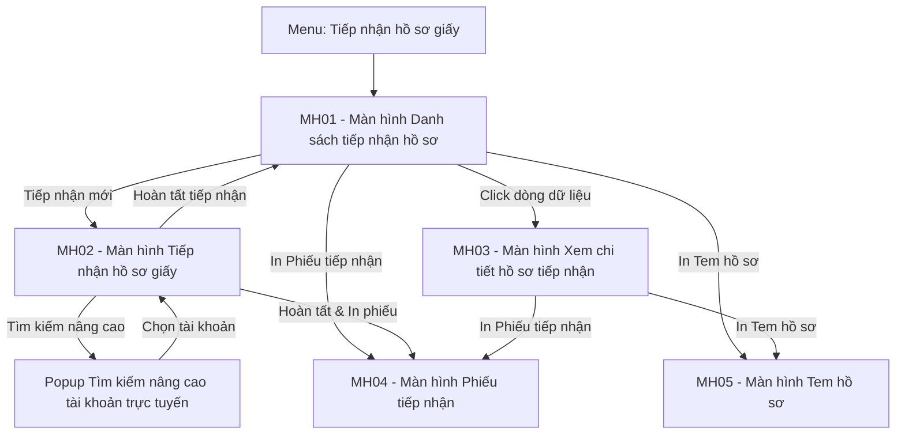

#### 4.3.2.16. Tiếp nhận hồ sơ giấy

##### 4.3.2.16.1. Mục đích

Cho phép quản lý công tác tiếp nhận hồ sơ đăng ký biện pháp bảo đảm nộp theo hình thức hồ sơ giấy tại Trung tâm đăng ký giao dịch, tài sản, từ thời điểm Cán bộ tiếp nhận ghi nhận hồ sơ đến khi hồ sơ được tạo khoản phải thu và chuyển sang bước [thu phí](Quan_ly_thu_phi_ho_so_giay_Can_bo_ke_toan.md), bao gồm:

\- Tra cứu, theo dõi danh sách hồ sơ giấy đã tiếp nhận theo phạm vi dữ liệu được phân quyền.

\- Ghi nhận thông tin hành chính tối thiểu của hồ sơ giấy: thông tin tiếp nhận, người yêu cầu, người nộp hồ sơ, Loại yêu cầu, tham số tính phí, phương thức nhận kết quả và tài liệu đính kèm.

\- Hoàn tất tiếp nhận để hệ thống sinh Mã hồ sơ, mã QR/mã vạch và tạo khoản phải thu tương ứng với biểu phí đang có hiệu lực.

\- Xem lại chi tiết hồ sơ đã tiếp nhận ở chế độ chỉ đọc kèm lịch sử trạng thái.

\- In Phiếu tiếp nhận giao cho người nộp và In Tem hồ sơ gắn vào tập hồ sơ giấy.

*a. Phân quyền*

\- **Cán bộ tiếp nhận**: Tra cứu danh sách, tạo mới hồ sơ tiếp nhận, tải lên/xem/xóa tệp đính kèm trước khi hoàn tất, hoàn tất tiếp nhận, xem chi tiết, in Phiếu tiếp nhận và in Tem hồ sơ.

\- **Cán bộ kế toán**: Chỉ xem danh sách và chi tiết hồ sơ tiếp nhận phục vụ đối chiếu [thu phí](Quan_ly_thu_phi_ho_so_giay_Can_bo_ke_toan.md); không tạo mới, không sửa, không xóa dữ liệu tiếp nhận.

\- **Cán bộ giải quyết**: Chỉ xem danh sách và chi tiết hồ sơ tiếp nhận phục vụ bước [nhập liệu nghiệp vụ](SRS_Ho_so_cho_nhap_lieu.md); không tạo mới, không sửa, không xóa dữ liệu tiếp nhận.

\- **Phạm vi hiển thị dữ liệu**: Theo Đơn vị tiếp nhận được phân quyền của người dùng đăng nhập.

*b. Điều kiện thực hiện*

\- Người dùng đã đăng nhập Website Quản trị thành công và được phân quyền truy cập chức năng `Tiếp nhận hồ sơ giấy`.

\- Hệ thống đã cấu hình biểu phí đang có hiệu lực tương ứng với Loại yêu cầu được tiếp nhận.

---

##### 4.3.2.16.2. Sơ đồ luồng nghiệp vụ theo giao diện

---

##### 4.3.2.16.3. MH01 - Màn hình Danh sách tiếp nhận hồ sơ

###### 4.3.2.16.3.1. Màn hình

###### 4.3.2.16.3.2. Mô tả thông tin trên màn hình

| Trường thông tin | Kiểu dữ liệu | Bắt buộc | Mặc định | Mô tả |
| :--- | :--- | :---: | :--- | :--- |
| **Khối Bộ lọc tìm kiếm** | - | - | - | |
| Mã hồ sơ | String(50) | Không | Trống | Control UI: Input text. - Tìm kiếm gần đúng (không phân biệt chữ hoa, chữ thường; tự động cắt khoảng trắng thừa đầu và cuối chuỗi - Trim space) theo Mã hồ sơ. |
| Số đơn giấy | String(50) | Không | Trống | Control UI: Input text. - Tìm kiếm gần đúng (không phân biệt chữ hoa, chữ thường; tự động cắt khoảng trắng thừa đầu và cuối chuỗi - Trim space) theo Số đơn giấy ghi trên đơn giấy khách hàng nộp. |
| Người yêu cầu | String(255) | Không | Trống | Control UI: Input text. - Tìm kiếm gần đúng (không phân biệt chữ hoa, chữ thường; tự động cắt khoảng trắng thừa đầu và cuối chuỗi - Trim space) theo Họ tên cá nhân/Tên tổ chức yêu cầu. |
| Loại yêu cầu | Enum(String(50)) | Không | Tất cả | Control UI: Combobox chọn một giá trị. - Giá trị gồm: + Tất cả + Đăng ký lần đầu + Đăng ký thay đổi + Xóa đăng ký + Yêu cầu cung cấp bản sao + Thông báo xử lý tài sản bảo đảm |
| Kênh tiếp nhận | Enum(String(50)) | Không | Tất cả | Control UI: Combobox chọn một giá trị. - Giá trị gồm: + Tất cả + Trực tiếp tại quầy + Qua bưu điện + Fax + Email |
| Trạng thái hồ sơ | Enum(String(50)) | Không | Tất cả | Control UI: Combobox chọn một giá trị. - Giá trị gồm: + Tất cả + Chờ thu phí + Chờ giải quyết + Bị từ chối|
| Từ ngày tiếp nhận | Date | Không | Trống | Control UI: Input date kèm icon lịch, định dạng `dd/mm/yyyy`. - Không được lớn hơn `Đến ngày tiếp nhận`. |
| Đến ngày tiếp nhận | Date | Không | Trống | Control UI: Input date kèm icon lịch, định dạng `dd/mm/yyyy`. - Không được nhỏ hơn `Từ ngày tiếp nhận`. |
| **Khối Bảng danh sách hồ sơ tiếp nhận** | - | - | - | Control UI: Bảng dữ liệu kèm thanh phân trang theo quy chuẩn phân trang dùng chung. - Khi người dùng truy cập màn hình, hệ thống tự động tải dữ liệu tại trang đầu tiên (Trang 1) với số lượng mặc định 20 bản ghi. - **Sắp xếp mặc định**: Sắp xếp theo **"Thời điểm tiếp nhận" giảm dần** (hồ sơ mới tiếp nhận nhất hiển thị lên đầu). Hỗ trợ sắp xếp động (Sortable) khi người dùng click vào tiêu đề cột. - Trạng thái không có dữ liệu (Empty State): Bảng hiển thị duy nhất 01 dòng căn giữa trên toàn bộ chiều rộng bảng (`colspan`), in nghiêng với nội dung theo MessageList dùng chung **[MSG-INF-SYS-001]**. |
| STT | Integer(10) | - | Theo trang | Control UI: Label, chỉ đọc. - Số thứ tự dòng tính liên tục theo trang kết quả hiện tại. |
| Mã hồ sơ | String(50) | - | Lấy theo dữ liệu bản ghi | Control UI: Link, chỉ đọc. - Hiển thị dạng liên kết mở [MH03 - Màn hình Xem chi tiết hồ sơ tiếp nhận](#432165-mh03---màn-hình-xem-chi-tiết-hồ-sơ-tiếp-nhận). |
| Số đơn giấy | String(50) | - | Lấy theo dữ liệu bản ghi | Control UI: Label, chỉ đọc. |
| Người yêu cầu | String(255) | - | Lấy theo dữ liệu bản ghi | Control UI: Label, chỉ đọc. - Hiển thị Họ tên cá nhân/Tên tổ chức yêu cầu. |
| Người nộp | String(255) | - | Lấy theo dữ liệu bản ghi | Control UI: Label, chỉ đọc. - Hiển thị Họ tên người trực tiếp nộp hồ sơ; để trống nếu hồ sơ không ghi nhận người nộp. |
| Loại yêu cầu | Enum(String(50)) | - | Lấy theo dữ liệu bản ghi | Control UI: Label, chỉ đọc. - Tham chiếu Danh mục Loại yêu cầu đăng ký biện pháp bảo đảm. |
| Thời điểm tiếp nhận | Datetime | - | Lấy theo dữ liệu bản ghi | Control UI: Label, chỉ đọc. - Hiển thị theo định dạng `dd/MM/yyyy HH:mm`. - Hỗ trợ sắp xếp động (Sortable); mặc định sắp xếp theo chiều giảm dần (mới nhất hiển thị lên đầu). |
| Phải thu (VNĐ) | Decimal(18,0) | - | Lấy theo dữ liệu bản ghi | Control UI: Label, chỉ đọc. - Hiển thị số tiền phải thu có phân cách hàng nghìn, căn phải. |
| Lệ phí | Enum(String(50)) | - | Lấy theo dữ liệu bản ghi | Control UI: Badge trạng thái, chỉ đọc. - Giá trị gồm: + Chưa thu + Đã thu + Miễn phí |
| Trạng thái | Enum(String(50)) | - | Lấy theo dữ liệu bản ghi | Control UI: Badge trạng thái, chỉ đọc. - Giá trị gồm: + Chờ thu phí + Chờ giải quyết + Hoàn thành + Bị từ chối |
| Cán bộ tiếp nhận | String(100) | - | Lấy theo dữ liệu bản ghi | Control UI: Label, chỉ đọc. |
| Thao tác | - | - | - | Control UI: Nhóm icon thao tác trên dòng. - `In Phiếu tiếp nhận` - `In Tem hồ sơ` |
###### 4.3.2.16.3.3. Chức năng trên màn hình

| STT | Tên chức năng | Định dạng | Mô tả |
| :--- | :--- | :--- | :--- |
| 1 | Tìm kiếm | Nút | Hệ thống tìm kiếm hồ sơ tiếp nhận theo các điều kiện đã nhập tại Khối Bộ lọc tìm kiếm, trong phạm vi Đơn vị tiếp nhận được phân quyền của người dùng đăng nhập. - **TH Dữ liệu lọc không hợp lệ**: Nếu `Từ ngày tiếp nhận` lớn hơn `Đến ngày tiếp nhận`, hiển thị thông báo lỗi **[MSG-ERR-VAL-007]**; hệ thống không thực hiện tìm kiếm. - **TH Không trả về dữ liệu**: + Bảng kết quả: Hiển thị duy nhất 01 dòng căn giữa trên toàn bộ chiều rộng bảng (`colspan`), in nghiêng với nội dung theo MessageList dùng chung **[MSG-INF-SYS-001]**. + Thanh phân trang (Pagination): Dòng số lượng hiển thị *"Hiển thị 0-0 trong tổng số 0 bản ghi"*; các nút điều hướng trang ở trạng thái khóa mờ (Disabled). - **TH Trả về dữ liệu**: Hiển thị danh sách hồ sơ thỏa mãn điều kiện lọc, sắp xếp mặc định theo `Thời điểm tiếp nhận` giảm dần (mới nhất hiển thị lên đầu), phân trang theo số dòng hiển thị đang chọn. |
| 2 | Xóa bộ lọc | Nút | Hệ thống đưa toàn bộ điều kiện tại Khối Bộ lọc tìm kiếm về giá trị mặc định, đặt lại trang hiện tại về trang 1 và tải lại danh sách trong phạm vi quyền dữ liệu. |
| 3 | Tiếp nhận mới | Nút | Hệ thống mở [MH02 - Màn hình Tiếp nhận hồ sơ giấy](#432164-mh02---màn-hình-tiếp-nhận-hồ-sơ-giấy) ở chế độ nhập mới; các trường `Thời điểm tiếp nhận`, `Đơn vị tiếp nhận`, `Cán bộ tiếp nhận` được điền tự động theo thời gian hệ thống và tài khoản đăng nhập. |
| 4 | Row click | Row click | Hệ thống mở [MH03 - Màn hình Xem chi tiết hồ sơ tiếp nhận](#432165-mh03---màn-hình-xem-chi-tiết-hồ-sơ-tiếp-nhận) của bản ghi được chọn ở chế độ chỉ đọc. |
| 5 | In Phiếu tiếp nhận | Icon | Hệ thống mở [MH04 - Màn hình Phiếu tiếp nhận](#432166-mh04---màn-hình-phiếu-tiếp-nhận) của bản ghi được chọn. - TH hồ sơ chưa có Mã hồ sơ: Hiển thị **[MSG-WRN-UCPS-001]** và không mở màn hình in. |
| 6 | In Tem hồ sơ | Icon | Hệ thống mở [MH05 - Màn hình Tem hồ sơ](#432167-mh05---màn-hình-tem-hồ-sơ) của bản ghi được chọn. - TH hồ sơ chưa có Mã hồ sơ: Hiển thị **[MSG-WRN-UCPS-001]** và không mở màn hình in. |
| 7 | Sắp xếp cột | Header cột | Khi người dùng click vào tiêu đề cột có hỗ trợ sắp xếp động (`Thời điểm tiếp nhận`): - Lần click thứ nhất: Sắp xếp danh sách kết quả theo chiều tăng dần (cũ nhất lên đầu). - Lần click thứ hai: Sắp xếp danh sách kết quả theo chiều giảm dần (mới nhất lên đầu). - Lần click thứ ba: Đưa về trạng thái sắp xếp mặc định ban đầu của hệ thống (giảm dần theo Thời điểm tiếp nhận). - Giữ nguyên các tiêu chí lọc đang thiết lập và đưa hiển thị về Trang 1. |

---

##### 4.3.2.16.4. MH02 - Màn hình Tiếp nhận hồ sơ giấy

###### 4.3.2.16.4.1. Màn hình

###### 4.3.2.16.4.2. Mô tả thông tin trên màn hình

| Trường thông tin | Kiểu dữ liệu | Bắt buộc | Mặc định | Mô tả |
| :--- | :--- | :---: | :--- | :--- |
| **Khối 01. Thông tin tiếp nhận** | - | - | - | |
| Kênh tiếp nhận | Enum(String(50)) | Có | Trực tiếp tại quầy | Control UI: Combobox chọn một giá trị. - Giá trị gồm: + Trực tiếp tại quầy + Qua bưu điện + Fax + Email |
| Thời điểm tiếp nhận | Datetime | Có | Thời gian hệ thống | Control UI: Input datetime, chỉ đọc. - Hệ thống tự ghi nhận theo thời gian đăng nhập thao tác, định dạng `dd/MM/yyyy HH:mm`. |
| Số đơn giấy | String(50) | Có | Trống | Control UI: Input text. - Kiểm tra trùng lặp: Không được trùng theo tổ hợp Số đơn giấy, Đơn vị tiếp nhận và Năm tiếp nhận. |
| Đơn vị tiếp nhận | String(255) | Có | Đơn vị của tài khoản đăng nhập | Control UI: Input text, chỉ đọc. - Lấy theo tài khoản đăng nhập, không cho chọn lại đơn vị. |
| Cán bộ tiếp nhận | String(100) | Có | Người dùng đăng nhập | Control UI: Input text, chỉ đọc. - Lấy theo tài khoản đăng nhập. |
| Ghi chú tiếp nhận | Text(1000) | Không | Trống | Control UI: Input text. - Thông tin ghi chú khác nếu có. |
| **Khối 02. Thông tin người yêu cầu** | - | - | - | |
| Loại khách hàng | Enum(String(50)) | Có | Có tài khoản trực tuyến | Control UI: Combobox chọn một giá trị. - Giá trị gồm: + Có tài khoản trực tuyến + Khách hàng vãng lai|
| Mã tài khoản trực tuyến | String(50) | Có điều kiện | Trống | Control UI: Input text kèm nút `Tìm kiếm` và nút `Tìm kiếm nâng cao`. - Chỉ hiển thị khi `Loại khách hàng` = "Có tài khoản trực tuyến"|
| Tìm kiếm | - | Có điều kiện | Trống | Control UI: Button  - Chỉ hiển thị khi `Loại khách hàng` = "Có tài khoản trực tuyến"|
| Tìm kiếm nâng cao| - | Có điều kiện | Trống | Control UI: Button  - Chỉ hiển thị khi `Loại khách hàng` = "Có tài khoản trực tuyến"|
| Họ tên/Tên tổ chức | String(255) | Có | Trống | Control UI: Input text. - Khi `Loại khách hàng` = "Có tài khoản trực tuyến": Trạng thái chỉ đọc, lấy tự động theo tài khoản đã tìm kiếm thành công hoặc chọn từ Popup Tìm kiếm nâng cao. - Khi `Loại khách hàng` = "Khách hàng vãng lai": Cho phép nhập tay. Bắt buộc nhập. |
| Số điện thoại | String(20) | Có | Trống | Control UI: Input text. - Khi `Loại khách hàng` = "Có tài khoản trực tuyến": Tự động điền theo tài khoản tìm được hoặc chọn từ popup, cho phép chỉnh sửa. - Khi `Loại khách hàng` = "Khách hàng vãng lai": Cho phép nhập tay. - Bắt buộc nhập, kiểm tra định dạng số điện thoại hợp lệ (10-11 chữ số). |
| Email | String(255) | Có | Trống | Control UI: Input text. - Khi `Loại khách hàng` = "Có tài khoản trực tuyến": Tự động điền theo tài khoản tìm được hoặc chọn từ popup, cho phép chỉnh sửa. - Khi `Loại khách hàng` = "Khách hàng vãng lai": Cho phép nhập tay. - Bắt buộc nhập, kiểm tra định dạng email hợp lệ (phải chứa ký tự `@` và tên miền hợp lệ). |
| Quốc gia | String(100) | Có | Việt Nam | Control UI: Combobox/Input text. - Khi `Loại khách hàng` = "Có tài khoản trực tuyến": Trạng thái chỉ đọc, tự động điền theo tài khoản tìm được hoặc chọn từ popup. - Khi `Loại khách hàng` = "Khách hàng vãng lai": Mặc định là "Việt Nam", cho phép chọn hoặc nhập. |
| Tỉnh/thành phố | String(100) | Có | Trống | Control UI: Combobox chọn Tỉnh/Thành phố. - Khi `Loại khách hàng` = "Có tài khoản trực tuyến": Trạng thái chỉ đọc, tự động điền theo tài khoản tìm được hoặc chọn từ popup. - Khi `Loại khách hàng` = "Khách hàng vãng lai": Cho phép chọn từ danh mục Tỉnh/Thành phố toàn quốc. |
| Phường/Xã | String(100) | Có | Trống | Control UI: Combobox chọn Phường/Xã. - Khi `Loại khách hàng` = "Có tài khoản trực tuyến": Trạng thái chỉ đọc, tự động điền theo tài khoản tìm được hoặc chọn từ popup. - Khi `Loại khách hàng` = "Khách hàng vãng lai": Cho phép chọn Phường/Xã tương ứng với Tỉnh/Thành phố đã chọn. |
| Địa chỉ chi tiết | String(500) | Có | Trống | Control UI: Input text. - Khi `Loại khách hàng` = "Có tài khoản trực tuyến": Trạng thái chỉ đọc, tự động điền theo tài khoản tìm được hoặc chọn từ popup. - Khi `Loại khách hàng` = "Khách hàng vãng lai": Bắt buộc nhập tay chi tiết số nhà, tên đường/phố, thôn/xóm... |
| **Khối 03. Thông tin người nộp hồ sơ** | - | - | - | Toàn bộ trường thông tin trong khối là không bắt buộc, chỉ khai báo khi xác định được người trực tiếp nộp hồ sơ và quan hệ ủy quyền. |
| Người nộp đồng thời là người yêu cầu | Boolean | Không | Không tích chọn | Control UI: Checkbox. - Khi tích chọn, hệ thống tự điền `Họ tên người nộp` và `Số điện thoại` theo thông tin người yêu cầu. |
| Họ tên người nộp | String(255) | Không | Trống | Control UI: Input text. |
| CCCD/Số định danh | String(20) | Không | Trống | Control UI: Input text. - Nếu có nhập, kiểm tra độ dài và định dạng theo cấu hình hệ thống. |
| Số điện thoại | String(20) | Không | Trống | Control UI: Input text. - Nếu có nhập, kiểm tra định dạng số điện thoại hợp lệ (10-11 chữ số). |
| Quan hệ | Enum(String(50)) | Không | Người được ủy quyền | Control UI: Combobox chọn một giá trị. - Giá trị gồm: + Người được ủy quyền + Người yêu cầu + Nhân viên tổ chức + Khác |
| **Khối 04. Loại yêu cầu và lệ phí** | - | - | - | |
| Loại yêu cầu | Enum(String(50)) | Có | Trống | Control UI: Combobox chọn một giá trị. - Dữ liệu lấy theo Danh mục dùng chung (Danh mục Loại yêu cầu đăng ký biện pháp bảo đảm). |
| Số lượng bản sao | Integer(10) | Có điều kiện | 1 | Control UI: Input number. - Chỉ hiển thị khi `Loại yêu cầu` thuộc nhóm "Yêu cầu cung cấp bản sao" hoặc "Yêu cầu cung cấp bản sao kèm thông báo". - Bắt buộc nhập khi hiển thị, giá trị là số nguyên dương lớn hơn hoặc bằng 1. |
| Đối tượng miễn phí | Enum(String(50)) | Không | Trống | Control UI: Combobox chọn một giá trị. - Chỉ hiển thị khi `Loại yêu cầu` thuộc trường hợp có thể được miễn lệ phí theo cấu hình biểu phí. - Giá trị gồm: + Cơ quan nhà nước theo quy định + Trường hợp miễn lệ phí theo biểu phí |
| Phương thức nhận kết quả | Enum(String(50)) | Có | Trực tiếp tại cơ quan | Control UI: Combobox chọn một giá trị. - Giá trị gồm: + Trực tiếp tại cơ quan + Qua dịch vụ bưu chính + Cách thức điện tử |
| Địa chỉ nhận kết quả | Text(1000) | Có điều kiện | Trống | Control UI: Input text. - Chỉ hiển thị và bắt buộc nhập khi `Phương thức nhận kết quả` = "Qua dịch vụ bưu chính". |
| Email nhận kết quả | String(255) | Có điều kiện | Theo Email người yêu cầu nếu có | Control UI: Input text. - Chỉ hiển thị và bắt buộc nhập khi `Phương thức nhận kết quả` = "Cách thức điện tử". - Kiểm tra định dạng email hợp lệ. |
| Tên khoản phí | String(255) | - | Theo biểu phí đang có hiệu lực | Control UI: Label, chỉ đọc. - Hệ thống tự xác định theo `Loại yêu cầu`. |
| Số tiền phải thu | Decimal(18,0) | - | Theo biểu phí đang có hiệu lực | Control UI: Label, chỉ đọc. - Hệ thống tự tính theo tham số tính phí và biểu phí đang có hiệu lực, hiển thị có phân cách hàng nghìn kèm đơn vị `VNĐ`. - Cán bộ tiếp nhận không được nhập hoặc sửa trực tiếp. |
| **Khối 05. Tài liệu đính kèm** | - | - | - | Control UI: GridTable. - Cho phép đính kèm nhiều tệp tin, không giới hạn số lượng dòng thành phần hồ sơ. - Quy định dung lượng: Tổng dung lượng tối đa cho phép của tất cả các tệp đính kèm trong hồ sơ là 50MB (dung lượng mỗi tệp đơn lẻ tối đa 20MB). Định dạng tệp tin cho phép gồm: `.pdf, .doc, .docx, .zip, .rar, .xls, .xlsx`. |
| STT | Integer(10) | - | Theo dòng | Control UI: Label, chỉ đọc. |
| Tên tài liệu | String(255) | Có điều kiện | Theo thành phần hồ sơ của Loại yêu cầu | Control UI: Label đối với thành phần hồ sơ theo quy định (kèm nhãn "Bắt buộc" màu đỏ nếu là tài liệu bắt buộc) / Input text đối với thành phần hồ sơ do cán bộ tự thêm. - Bắt buộc nhập đối với dòng thành phần hồ sơ do cán bộ tự thêm. |
| File đính kèm | File | Không | Trống | Control UI: Nút `Tải lên` / Nhãn tên tệp tin. - Khi chưa đính kèm tệp: Hiển thị nút `Tải lên`. - Khi đã đính kèm tệp: Nút `Tải lên` được thay bằng icon định dạng tệp kèm Tên tệp tin. |
| Thao tác | - | - | - | Control UI: Nhóm liên kết thao tác trên dòng. - Khi dòng chưa có tệp đính kèm: Các liên kết ở trạng thái khóa mờ (Disabled). - Khi dòng đã có tệp đính kèm: Hiển thị liên kết `Xem file` và liên kết `Xóa`. |
| Thêm thành phần hồ sơ mới | - | - | - | Control UI: Nút viền nét đứt đặt dưới bảng danh mục tài liệu. - Luôn hiển thị cho phép cán bộ bổ sung thêm thành phần hồ sơ mới. |

###### 4.3.2.16.4.3. Chức năng trên màn hình

| STT | Tên chức năng | Định dạng | Mô tả |
| :--- | :--- | :--- | :--- |
| 1 | Tìm kiếm (tại ô Mã tài khoản trực tuyến) | Nút |  - **TH Chưa nhập Mã tài khoản trực tuyến**: Áp dụng quy tắc kiểm tra bắt buộc, viền đỏ ô nhập (class `.is-invalid`), hiển thị dòng chữ cảnh báo màu đỏ *"Vui lòng nhập Mã tài khoản trực tuyến để tìm kiếm"*, tự động focus con trỏ vào ô nhập và không thực hiện tìm kiếm. - **TH Đã nhập Mã tài khoản trực tuyến**: Hệ thống thực hiện kiểm tra trên tập dữ liệu Tài khoản khách hàng theo Mã khách hàng, tìm kiếm gần đúng theo Mã tài khoản trực tuyến đã nhập: + *TH Tìm thấy*: Tự động trả về và điền (Fill) thông tin vào Khối 02 gồm: `Họ tên/Tên tổ chức`, `Số điện thoại`, `Email`, `Quốc gia`, `Tỉnh/thành phố`, `Phường/Xã`, `Địa chỉ chi tiết` theo thông tin gắn với tài khoản tra cứu được  + *TH Không tìm thấy*: Hiển thị thông báo **[MSG-ERR-UCPS-002]** |
| 2 | Tìm kiếm nâng cao (tại ô Mã tài khoản trực tuyến) | Nút | - Hệ thống mở [Popup Tìm kiếm nâng cao tài khoản trực tuyến](#4321644-popup-tìm-kiếm-nâng-cao-tài-khoản-trực-tuyến) ở chế độ mở rộng đầy đủ các tiêu chí lọc. - Tự động kế thừa và điền giá trị đang nhập tại ô `Mã tài khoản trực tuyến` trên form chính vào ô lọc tương ứng trên Popup (nếu đã có dữ liệu). |
| 3 | Người nộp đồng thời là người yêu cầu | Checkbox | Khi người dùng tích chọn, hệ thống sao chép `Họ tên/Tên tổ chức` và `Số điện thoại` của người yêu cầu sang `Họ tên người nộp` và `Số điện thoại` của khối Thông tin người nộp hồ sơ, đồng thời đặt `Quan hệ` = "Người yêu cầu". Khi bỏ tích chọn, hệ thống giữ nguyên giá trị đang có để người dùng tự điều chỉnh. |
| 4 | Tải lên | Nút | Hệ thống mở hộp thoại chọn tệp từ máy người dùng và tải tệp đính kèm vào dòng tài liệu tương ứng. - TH tệp sai định dạng cho phép: Hiển thị thông báo **[MSG-ERR-FILE-001]** và không đính kèm tệp. - TH tệp vượt quá dung lượng cho phép hoặc tổng dung lượng các tệp vượt quá dung lượng tối đa cho phép của hồ sơ: Hiển thị thông báo **[MSG-ERR-FILE-002]** và không đính kèm tệp. - TH hợp lệ: Hệ thống đính kèm tệp, hiển thị icon định dạng tệp kèm Tên tệp tin và kích hoạt các liên kết thao tác trên dòng (`Xem file`, `Xóa`). |
| 5 | Xem file | Liên kết | Hệ thống mở nội dung tệp tin đính kèm của dòng tài liệu trong một tab mới của trình duyệt. |
| 6 | Xóa | Liên kết | Hệ thống hiển thị popup xác nhận với `Loại thao tác` = "Xóa". Khi người dùng xác nhận, hệ thống gỡ tệp tin khỏi dòng tài liệu và đưa các liên kết thao tác trên dòng về trạng thái khóa mờ. |
| 7 | Thêm thành phần hồ sơ mới | Nút | Hệ thống chèn thêm một dòng trống vào bảng danh mục tài liệu gửi kèm để người dùng nhập tên tài liệu và tải lên tệp đính kèm, không giới hạn số lượng dòng. |
| 8 | Hoàn tất tiếp nhận | Nút | **TH Bỏ trống trường bắt buộc**: Áp dụng quy tắc kiểm tra bắt buộc, hiển thị viền đỏ và thông báo cảnh báo màu đỏ *"Đây là trường bắt buộc"* ngay phía dưới ô trống, tự động đưa con trỏ focus vào ô lỗi đầu tiên và hiển thị thông báo **[MSG-ERR-VAL-001]**. |
|  |  |  | **TH Dữ liệu không hợp lệ**: Hệ thống kiểm tra tính hợp lệ của dữ liệu: + Định dạng email: Phải có ký tự `@` và tên miền hợp lệ; nếu sai, hiển thị **[MSG-ERR-VAL-002]**. + Định dạng số điện thoại: Phải là số hợp lệ từ 10-11 chữ số; nếu sai, hiển thị **[MSG-ERR-VAL-003]**. + Số lượng bản sao: Phải là số nguyên dương lớn hơn hoặc bằng 1; nếu sai, hiển thị **[MSG-ERR-VAL-012]**. - Hệ thống dừng xử lý khi dữ liệu không hợp lệ. |
|  |  |  | **TH Không xác định được biểu phí**: Nếu hệ thống không tìm thấy biểu phí đang có hiệu lực tương ứng với Loại yêu cầu, hiển thị thông báo lỗi **[MSG-ERR-UCPS-003]** và không tạo hồ sơ. |
|  |  |  | **TH Hợp lệ**: Hệ thống thực hiện tuần tự các bước: + (1) Sinh Mã hồ sơ duy nhất và mã QR/mã vạch cho hồ sơ tiếp nhận. + (2) Lưu bản ghi hồ sơ tiếp nhận cùng danh mục tài liệu đính kèm vào Cơ sở dữ liệu. + (3) Khởi tạo khoản phải thu trong cùng giao dịch tương ứng với số tiền phí, lệ phí theo biểu phí có hiệu lực. + (4) Cập nhật trạng thái hồ sơ sang "Chờ thu phí" (chuyển tiếp sang bước [Quản lý thu phí hồ sơ giấy](Quan_ly_thu_phi_ho_so_giay_Can_bo_ke_toan.md)). + (5) Ghi nhật ký hệ thống (Audit Log) ghi nhận hành động tiếp nhận hồ sơ. + (6) Hiển thị thông báo tiếp nhận hồ sơ thành công (**[MSG-SUC-UCPS-001]**). + (7) Điều hướng quay về [MH01 - Màn hình Danh sách tiếp nhận hồ sơ](#432163-mh01---màn-hình-danh-sách-tiếp-nhận-hồ-sơ). - Trường hợp bước tạo khoản phải thu thất bại: Hệ thống rollback (hủy bỏ) toàn bộ giao dịch, không tạo hồ sơ và hiển thị thông báo lỗi tạo khoản phải thu (**[MSG-ERR-UCPS-004]**). |
| 9 | Hoàn tất & In phiếu | Nút | Hệ thống thực hiện đầy đủ các bước kiểm tra và xử lý như chức năng `Hoàn tất tiếp nhận`; sau khi hoàn tất thành công, hệ thống mở tiếp [MH04 - Màn hình Phiếu tiếp nhận](#432166-mh04---màn-hình-phiếu-tiếp-nhận) của hồ sơ vừa tạo. |
| 10 | Hủy bỏ | Nút | **TH Chưa nhập dữ liệu**: Hệ thống đóng màn hình và quay về [MH01 - Màn hình Danh sách tiếp nhận hồ sơ](#432163-mh01---màn-hình-danh-sách-tiếp-nhận-hồ-sơ). - **TH Đã nhập dữ liệu chưa lưu**: Hệ thống hiển thị **[MSG-CFM-UCPS-001]**; khi người dùng xác nhận, hệ thống hủy toàn bộ dữ liệu đang nhập và quay về [MH01 - Màn hình Danh sách tiếp nhận hồ sơ](#432163-mh01---màn-hình-danh-sách-tiếp-nhận-hồ-sơ). |

###### 4.3.2.16.4.4. Popup Tìm kiếm nâng cao tài khoản trực tuyến

*a. Màn hình*

Cho phép Cán bộ tiếp nhận tra cứu, tìm kiếm tài khoản trực tuyến của cá nhân/tổ chức yêu cầu đăng ký theo đa tiêu chí (Mã tài khoản trực tuyến, Họ và tên/Tên tổ chức, Email, Số điện thoại, Số CCCD/Mã định danh tổ chức) và lựa chọn để hệ thống tự động điền (Fill) thông tin vào Khối 02 trên màn hình [MH02 - Màn hình Tiếp nhận hồ sơ giấy](#432164-mh02---màn-hình-tiếp-nhận-hồ-sơ-giấy).

*b. Mô tả thông tin trên màn hình*

| Trường thông tin | Kiểu dữ liệu | Bắt buộc | Mặc định | Mô tả |
| :--- | :--- | :---: | :--- | :--- |
| Tiêu đề Popup | - | - | - | Control UI: Label, chỉ đọc. - Hiển thị tiêu đề: "Tìm kiếm nâng cao tài khoản trực tuyến". |
| **Khối Bộ lọc tìm kiếm nâng cao** | - | - | - | Bố cục dạng lưới 2 cột song song. |
| Mã tài khoản trực tuyến | String(50) | Không | Theo ô nhập tại form chính | Control UI: Input text. - Tự động điền giá trị nếu ô `Mã tài khoản trực tuyến` tại form chính đã được nhập; cho phép chỉnh sửa hoặc nhập mới. |
| Họ và tên/Tên tổ chức | String(255) | Không | Trống | Control UI: Input text. - Tìm kiếm gần đúng (không phân biệt chữ hoa/thường, tự động cắt khoảng trắng thừa đầu cuối) theo Họ và tên cá nhân hoặc Tên tổ chức. |
| Email | String(255) | Không | Trống | Control UI: Input text. - Tìm kiếm theo địa chỉ thư điện tử đã đăng ký của tài khoản trực tuyến. |
| Số điện thoại | String(20) | Không | Trống | Control UI: Input text. - Tìm kiếm theo số điện thoại liên hệ đã đăng ký của chủ tài khoản. |
| Số CCCD/Mã định danh tổ chức | String(50) | Không | Trống | Control UI: Input text. - Tìm kiếm theo Số CCCD/Số thẻ Căn cước (đối với khách hàng cá nhân) hoặc Mã số thuế/Mã định danh doanh nghiệp, tổ chức (đối với khách hàng tổ chức). |
| **Khối Bảng kết quả tìm kiếm** | - | - | - | - Mặc định khi mới mở form, bảng không hiển thị dòng dữ liệu (bỏ trống). - Chỉ hiển thị sau khi người dùng thực hiện tìm kiếm và có kết quả trả về. |
| STT | Integer(10) | - | Theo dòng | Control UI: Label, chỉ đọc. |
| Mã khách hàng | String(50) | - | Lấy theo dữ liệu bản ghi | Control UI: Label, chỉ đọc. - Hiển thị mã khách hàng. |
| Tên | String(255) | - | Lấy theo dữ liệu bản ghi | Control UI: Label, chỉ đọc. - Hiển thị Họ và tên cá nhân hoặc Tên tổ chức của chủ tài khoản. |
| Email | String(255) | - | Lấy theo dữ liệu bản ghi | Control UI: Label, chỉ đọc. - Hiển thị Email liên hệ của tài khoản. |
| Số điện thoại | String(20) | - | Lấy theo dữ liệu bản ghi | Control UI: Label, chỉ đọc. - Hiển thị Số điện thoại liên hệ của tài khoản. |
| Số giấy tờ | String(50) | - | Lấy theo dữ liệu bản ghi | Control UI: Label, chỉ đọc. - Hiển thị thông tin Số CCCD (đối với cá nhân) hoặc Mã định danh tổ chức / Mã số thuế (đối với tổ chức). |
| Thao tác | - | - | - | Nút `Chọn` |

*c. Chức năng trên màn hình*

| STT | Tên chức năng | Định dạng | Mô tả |
| :--- | :--- | :--- | :--- |
| 1 | Tìm kiếm | Nút | Hệ thống thực hiện tìm kiếm trong Cơ sở dữ liệu tài khoản trực tuyến theo các tiêu chí đã nhập (hoặc hiển thị toàn bộ danh sách phù hợp nếu để trống các tiêu chí lọc). - **TH Không tìm thấy kết quả**: Lưới kết quả hiển thị duy nhất 01 dòng căn giữa *"Không tìm thấy dữ liệu phù hợp"*, thanh phân trang hiển thị *"Hiển thị 0-0 trong tổng số 0 bản ghi"*, các nút điều hướng bị vô hiệu hóa. - **TH Tìm thấy kết quả**: Hiển thị danh sách tài khoản thỏa mãn điều kiện lên bảng lưới kết quả kèm phân trang chuẩn. |
| 2 | Xóa bộ lọc | Nút | Hệ thống xóa trắng toàn bộ dữ liệu tại các ô nhập tiêu chí lọc trên Popup (Mã tài khoản trực tuyến, Họ và tên/Tên tổ chức, Email, Số điện thoại, Số CCCD/Mã định danh tổ chức) và tải lại danh sách tài khoản ban đầu |
| 3 | Chọn (trên dòng kết quả) | Nút | Khi Cán bộ click nút `Chọn` trên một dòng dữ liệu tài khoản: + (1) Hệ thống tự động điền `Mã khách hàng` vào ô `Mã tài khoản trực tuyến` trên [MH02 - Màn hình Tiếp nhận hồ sơ giấy](#432164-mh02---màn-hình-tiếp-nhận-hồ-sơ-giấy). + (2) Tự động Fill toàn bộ thông tin của tài khoản được chọn vào các trường tại **Khối 02. Thông tin người yêu cầu** trên [MH02](#432164-mh02---màn-hình-tiếp-nhận-hồ-sơ-giấy) bao gồm: `Họ tên/Tên tổ chức`, `Số điện thoại`, `Email`, `Quốc gia`, `Tỉnh/thành phố`, `Phường/Xã`, `Địa chỉ chi tiết`. + (3) Tự động đóng Popup Tìm kiếm nâng cao và đưa người dùng quay trở lại form Tiếp nhận hồ sơ giấy. |
| 4 | Đóng | Nút | Đặt tại Footer popup và nút icon `X` góc trên bên phải Header. Hệ thống đóng Popup Tìm kiếm nâng cao mà không lưu hay thay đổi bất kỳ thông tin nào trên form chính. |

---

##### 4.3.2.16.5. MH03 - Màn hình Xem chi tiết hồ sơ tiếp nhận

###### 4.3.2.16.5.1. Màn hình

###### 4.3.2.16.5.2. Mô tả thông tin trên màn hình

| Trường thông tin | Kiểu dữ liệu | Bắt buộc | Mặc định | Mô tả |
| :--- | :--- | :---: | :--- | :--- |
| Tiêu đề màn hình | - | - | - | Control UI: Label, chỉ đọc. - Hiển thị theo cấu trúc "Chi tiết hồ sơ tiếp nhận: `Mã hồ sơ`". |
| **Khối Thông tin tiếp nhận** | - | - | - | |
| Mã hồ sơ | - | - | - | Control UI: Label, chỉ đọc. Lấy theo dữ liệu bản ghi. |
| Số đơn giấy | - | - | - | Control UI: Label, chỉ đọc. Lấy theo dữ liệu bản ghi. |
| Kênh tiếp nhận | - | - | - | Control UI: Label, chỉ đọc. Lấy theo dữ liệu bản ghi. |
| Thời điểm tiếp nhận | - | - | - | Control UI: Label, chỉ đọc. Lấy theo dữ liệu bản ghi. |
| Đơn vị tiếp nhận | - | - | - | Control UI: Label, chỉ đọc. Lấy theo dữ liệu bản ghi. |
| Cán bộ tiếp nhận | - | - | - | Control UI: Label, chỉ đọc. Lấy theo dữ liệu bản ghi. |
| **Khối Thông tin người yêu cầu** | - | - | - | |
| Loại khách hàng | - | - | - | Control UI: Label, chỉ đọc. Lấy theo dữ liệu bản ghi. |
| Mã tài khoản trực tuyến | - | - | - | Control UI: Label, chỉ đọc. Lấy theo dữ liệu bản ghi. - Chỉ hiển thị khi `Loại khách hàng` = "Có tài khoản trực tuyến". |
| Họ tên/Tên tổ chức | - | - | - | Control UI: Label, chỉ đọc. Lấy theo dữ liệu bản ghi. |
| Số điện thoại | - | - | - | Control UI: Label, chỉ đọc. Lấy theo dữ liệu bản ghi. |
| Email | - | - | - | Control UI: Label, chỉ đọc. Lấy theo dữ liệu bản ghi. |
| Quốc gia | - | - | - | Control UI: Label, chỉ đọc. Lấy theo dữ liệu bản ghi. |
| Tỉnh/thành phố | - | - | - | Control UI: Label, chỉ đọc. Lấy theo dữ liệu bản ghi. |
| Phường/Xã | - | - | - | Control UI: Label, chỉ đọc. Lấy theo dữ liệu bản ghi. |
| Địa chỉ chi tiết | - | - | - | Control UI: Label, chỉ đọc. Lấy theo dữ liệu bản ghi. |
| Ghi chú tiếp nhận | - | - | - | Control UI: Label, chỉ đọc. Lấy theo dữ liệu bản ghi. |
| **Khối Thông tin người nộp hồ sơ** | - | - | - | |
| Họ tên | - | - | - | Control UI: Label, chỉ đọc. Lấy theo dữ liệu bản ghi. |
| Giấy tờ định danh | - | - | - | Control UI: Label, chỉ đọc. Lấy theo dữ liệu bản ghi. |
| Số điện thoại | - | - | - | Control UI: Label, chỉ đọc. Lấy theo dữ liệu bản ghi. |
| Email | - | - | - | Control UI: Label, chỉ đọc. Lấy theo dữ liệu bản ghi. |
| Quan hệ với người yêu cầu | - | - | - | Control UI: Label, chỉ đọc. Lấy theo dữ liệu bản ghi. |
| Phương thức nhận kết quả | - | - | - | Control UI: Label, chỉ đọc. Lấy theo dữ liệu bản ghi. |
| Địa chỉ nhận kết quả | - | - | - | Control UI: Label, chỉ đọc. Lấy theo dữ liệu bản ghi. - Chỉ hiển thị khi `Phương thức nhận kết quả` = "Qua dịch vụ bưu chính". |
| Email nhận kết quả | - | - | - | Control UI: Label, chỉ đọc. Lấy theo dữ liệu bản ghi. - Chỉ hiển thị khi `Phương thức nhận kết quả` = "Cách thức điện tử". |
| **Khối Thông tin loại yêu cầu và lệ phí** | - | - | - | |
| Loại yêu cầu | - | - | - | Control UI: Label, chỉ đọc. Lấy theo dữ liệu bản ghi. |
| Tham số tính phí | - | - | - | Control UI: Label, chỉ đọc. Lấy theo dữ liệu bản ghi. |
| Tên khoản phí | - | - | - | Control UI: Label, chỉ đọc. Lấy theo dữ liệu bản ghi. |
| Số tiền phải thu | - | - | - | Control UI: Label, chỉ đọc. Lấy theo dữ liệu bản ghi. |
| Đối tượng miễn phí | - | - | - | Control UI: Label, chỉ đọc. Lấy theo dữ liệu bản ghi. - Chỉ hiển thị khi hồ sơ có ghi nhận đối tượng miễn phí. |
| Trạng thái lệ phí | - | - | - | Control UI: Label, chỉ đọc. Lấy theo dữ liệu bản ghi. |
| Trạng thái hồ sơ | - | - | - | Control UI: Label, chỉ đọc. Lấy theo dữ liệu bản ghi. |
| **Khối Tài liệu đính kèm** | - | - | - | Control UI: Bảng dữ liệu 4 cột (`STT`, `Tên tài liệu`, `File đính kèm`, `Thao tác`), chỉ đọc. - Ẩn toàn bộ nút `Tải lên`, liên kết `Xóa` và nút `Thêm thành phần hồ sơ mới` của [MH02 - Màn hình Tiếp nhận hồ sơ giấy](#432164-mh02---màn-hình-tiếp-nhận-hồ-sơ-giấy). |
| STT | - | - | - | Control UI: Label, chỉ đọc. Lấy theo dữ liệu bản ghi. |
| Tên tài liệu | - | - | - | Control UI: Label, chỉ đọc. Lấy theo dữ liệu bản ghi. - Không hiển thị nhãn "Bắt buộc" của thành phần hồ sơ. |
| File đính kèm | - | - | - | Control UI: Label kèm icon định dạng tệp, chỉ đọc. Lấy theo dữ liệu bản ghi. - Hiển thị dấu `-` nếu dòng tài liệu chưa có tệp đính kèm. |
| Thao tác | - | - | - | Control UI: Nhóm liên kết thao tác trên dòng, hiển thị trên cùng một dòng. - `Xem file`: Hiển thị khi dòng tài liệu đã có tệp đính kèm, ngược lại ở trạng thái khóa mờ (Disabled). - `Tải tệp`: Hiển thị khi dòng tài liệu đã có tệp đính kèm, ngược lại ở trạng thái khóa mờ (Disabled). |
| **Khối Lịch sử trạng thái** | - | - | - | Control UI: Danh sách dòng lịch sử, chỉ đọc. |
| Thời điểm | - | - | - | Control UI: Label, chỉ đọc. Lấy theo dữ liệu bản ghi. |
| Trạng thái | - | - | - | Control UI: Badge trạng thái, chỉ đọc. Lấy theo dữ liệu bản ghi. |
| Nội dung xử lý | - | - | - | Control UI: Label, chỉ đọc. Lấy theo dữ liệu bản ghi. |

###### 4.3.2.16.5.3. Chức năng trên màn hình

| STT | Tên chức năng | Định dạng | Mô tả |
| :--- | :--- | :--- | :--- |
| 1 | Xem file | Liên kết | Hệ thống mở nội dung tệp tin đính kèm của dòng tài liệu trong một tab mới của trình duyệt. |
| 2 | Tải tệp | Liên kết | Hệ thống tải tệp tin đính kèm của dòng tài liệu về máy người dùng, giữ nguyên tên tệp và định dạng gốc đã đính kèm. |
| 3 | In Phiếu tiếp nhận | Nút | Hệ thống mở [MH04 - Màn hình Phiếu tiếp nhận](#432166-mh04---màn-hình-phiếu-tiếp-nhận) của hồ sơ đang xem. - TH hồ sơ chưa có Mã hồ sơ: Hiển thị **[MSG-WRN-UCPS-001]** và không mở màn hình in. |
| 4 | In Tem hồ sơ | Nút | Hệ thống mở [MH05 - Màn hình Tem hồ sơ](#432167-mh05---màn-hình-tem-hồ-sơ) của hồ sơ đang xem. - TH hồ sơ chưa có Mã hồ sơ: Hiển thị **[MSG-WRN-UCPS-001]** và không mở màn hình in. |
| 5 | Đóng | Nút | Hệ thống đóng màn hình chi tiết và quay về [MH01 - Màn hình Danh sách tiếp nhận hồ sơ](#432163-mh01---màn-hình-danh-sách-tiếp-nhận-hồ-sơ), giữ nguyên điều kiện tìm kiếm và trang kết quả trước đó. |

---

##### 4.3.2.16.6. MH04 - Màn hình Phiếu tiếp nhận

###### 4.3.2.16.6.1. Màn hình

###### 4.3.2.16.6.2. Mô tả thông tin trên màn hình

| Trường thông tin | Kiểu dữ liệu | Bắt buộc | Mặc định | Mô tả |
| :--- | :--- | :---: | :--- | :--- |
| Tiêu đề phiếu | - | - | - | Control UI: Label, chỉ đọc. - Hiển thị tên phiếu, tên cơ quan chủ quản và Đơn vị tiếp nhận. |
| Mã QR/Mã vạch | - | - | - | Control UI: Hình ảnh mã QR/mã vạch, chỉ đọc. Lấy theo dữ liệu bản ghi. |
| Mã hồ sơ | - | - | - | Control UI: Label, chỉ đọc. Lấy theo dữ liệu bản ghi. |
| Số đơn giấy | - | - | - | Control UI: Label, chỉ đọc. Lấy theo dữ liệu bản ghi. |
| Ngày giờ tiếp nhận | - | - | - | Control UI: Label, chỉ đọc. Lấy theo dữ liệu bản ghi. |
| Người yêu cầu | - | - | - | Control UI: Label, chỉ đọc. Lấy theo dữ liệu bản ghi. |
| Người nộp hồ sơ | - | - | - | Control UI: Label, chỉ đọc. Lấy theo dữ liệu bản ghi. |
| Loại yêu cầu | - | - | - | Control UI: Label, chỉ đọc. Lấy theo dữ liệu bản ghi. |
| Số tiền phải thu | - | - | - | Control UI: Label, chỉ đọc. Lấy theo dữ liệu bản ghi. |
| Phương thức nhận kết quả | - | - | - | Control UI: Label, chỉ đọc. Lấy theo dữ liệu bản ghi. |
| Đơn vị tiếp nhận | - | - | - | Control UI: Label, chỉ đọc. Lấy theo dữ liệu bản ghi. |
| Cán bộ tiếp nhận | - | - | - | Control UI: Label, chỉ đọc. Lấy theo dữ liệu bản ghi. |

###### 4.3.2.16.6.3. Chức năng trên màn hình

| STT | Tên chức năng | Định dạng | Mô tả |
| :--- | :--- | :--- | :--- |
| 1 | In | Nút | Hệ thống gửi lệnh in Phiếu tiếp nhận theo mẫu hệ thống và ghi Audit Log hành động in kèm Mã hồ sơ. |
| 2 | Tải PDF | Nút | Hệ thống kết xuất Phiếu tiếp nhận sang tệp PDF theo dữ liệu hồ sơ, quy cách đặt tên tệp `yyyyMMdd_Phieu_tiep_nhan_[Mã hồ sơ].pdf`. |
| 3 | Đóng | Nút | Hệ thống đóng màn hình Phiếu tiếp nhận và quay về màn hình nguồn đã mở phiếu ([MH01 - Màn hình Danh sách tiếp nhận hồ sơ](#432163-mh01---màn-hình-danh-sách-tiếp-nhận-hồ-sơ), [MH02 - Màn hình Tiếp nhận hồ sơ giấy](#432164-mh02---màn-hình-tiếp-nhận-hồ-sơ-giấy) hoặc [MH03 - Màn hình Xem chi tiết hồ sơ tiếp nhận](#432165-mh03---màn-hình-xem-chi-tiết-hồ-sơ-tiếp-nhận)). |

---

##### 4.3.2.16.7. MH05 - Màn hình Tem hồ sơ

###### 4.3.2.16.7.1. Màn hình

###### 4.3.2.16.7.2. Mô tả thông tin trên màn hình

| Trường thông tin | Kiểu dữ liệu | Bắt buộc | Mặc định | Mô tả |
| :--- | :--- | :---: | :--- | :--- |
| Mã QR/Mã vạch | - | - | - | Control UI: Hình ảnh mã QR/mã vạch, chỉ đọc. Lấy theo dữ liệu bản ghi. |
| Mã hồ sơ | - | - | - | Control UI: Label, chỉ đọc. Lấy theo dữ liệu bản ghi. |
| Số đơn giấy | - | - | - | Control UI: Label, chỉ đọc. Lấy theo dữ liệu bản ghi. |
| Loại yêu cầu | - | - | - | Control UI: Label, chỉ đọc. Lấy theo dữ liệu bản ghi. |
| Ngày tiếp nhận | - | - | - | Control UI: Label, chỉ đọc. Lấy theo dữ liệu bản ghi. |
| Đơn vị tiếp nhận | - | - | - | Control UI: Label, chỉ đọc. Lấy theo dữ liệu bản ghi. |

###### 4.3.2.16.7.3. Chức năng trên màn hình

| STT | Tên chức năng | Định dạng | Mô tả |
| :--- | :--- | :--- | :--- |
| 1 | In | Nút | Hệ thống gửi lệnh in Tem hồ sơ theo mẫu hệ thống và ghi Audit Log hành động in kèm Mã hồ sơ. |
| 2 | Tải PDF | Nút | Hệ thống kết xuất Tem hồ sơ sang tệp PDF theo dữ liệu hồ sơ, quy cách đặt tên tệp `yyyyMMdd_Tem_ho_so_[Mã hồ sơ].pdf`. |
| 3 | Đóng | Nút | Hệ thống đóng màn hình Tem hồ sơ và quay về màn hình nguồn đã mở tem ([MH01 - Màn hình Danh sách tiếp nhận hồ sơ](#432163-mh01---màn-hình-danh-sách-tiếp-nhận-hồ-sơ) hoặc [MH03 - Màn hình Xem chi tiết hồ sơ tiếp nhận](#432165-mh03---màn-hình-xem-chi-tiết-hồ-sơ-tiếp-nhận)). |
