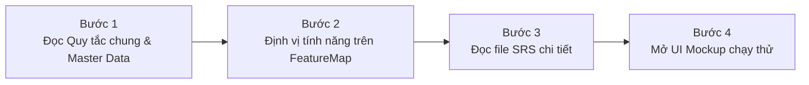

# HƯỚNG DẪN ĐỌC HIỂU & TRA CỨU TÀI LIỆU PHÂN TÍCH YÊU CẦU (SRS)
> **Hệ thống Đăng ký trực tuyến Biện pháp bảo đảm bằng động sản & Quản lý Bồi thường nhà nước**  
> **Dành cho**: Đội ngũ Lập trình viên (Backend, Frontend, Mobile), Kỹ sư Kiểm thử (QA/QC) và Kiến trúc sư hệ thống (SA).

---

## 🌐 ĐƯỜNG DẪN GIAO DIỆN CHẠY THỬ TRỰC TUYẾN (UI MOCKUPS)
Đội ngũ Dev và QA có thể truy cập trực tiếp các đường link dưới đây để trải nghiệm luồng thao tác, giao diện mẫu và animation trước khi lập trình:

- **Hệ thống Public Dành cho Cá nhân, Tổ chức, Cơ quan có thẩm quyền**:  
  👉 [https://uimockups.vercel.app/Website_Khach_hang/HomePage_KH.html](https://uimockups.vercel.app/Website_Khach_hang/HomePage_KH.html)
- **Website Quản trị & Tác nghiệp Cán bộ**:  
  👉 [https://uimockups.vercel.app/Website_Quan_tri/HomePageAdmin.html](https://uimockups.vercel.app/Website_Quan_tri/HomePageAdmin.html)

---

## MỤC LỤC
1. [Giới thiệu tổng quan](#1-giới-thiệu-tổng-quan)
2. [Bản đồ cấu trúc thư mục tài liệu thực tế](#2-bản-đồ-cấu-trúc-thư-mục-tài-liệu-thực-tế)
3. [Quy trình 4 bước đọc tài liệu dành cho Dev](#3-quy-trình-4-bước-đọc-tài-liệu-dành-cho-dev)
4. [Bộ từ điển quy ước mã hóa & Tra cứu chéo (Cross-Reference)](#4-bộ-từ-điển-quy-ước-mã-hóa--tra-cứu-chéo-cross-reference)
5. [Hướng dẫn chi tiết cách đọc đặc tả màn hình (MHxx)](#5-hướng-dẫn-chi-tiết-cách-đọc-đặc-tả-màn-hình-mhxx)
6. [12 Quy chuẩn kỹ thuật bắt buộc khi lập trình (Golden Rules)](#6-12-quy-chuẩn-kỹ-thuật-bắt-buộc-khi-lập-trình-golden-rules)
7. [Mối liên kết giữa SRS và UI Mockup](#7-mối-liên-kết-giữa-srs-và-ui-mockup)

---

## 1. GIỚI THIỆU TỔNG QUAN
Thư mục **`Tai lieu phan tich/`** chứa toàn bộ các tài liệu Phân tích Nghiệp vụ và Đặc tả Yêu cầu Phần mềm (Software Requirements Specification - SRS) thực tế của Dự án.

Tài liệu được thiết kế theo phương pháp module hóa và hướng màn hình, chia tách rành mạch giữa:
- **Data Contract (Cấu trúc dữ liệu)**: Dành cho Backend thiết kế CSDL (Database Schema), Entity, DTO và Frontend xây dựng Form Model / TypeScript Interface.
- **Business Logic (Quy tắc nghiệp vụ & Luồng sự kiện)**: Dành cho Backend cài đặt Service / API Controller và Frontend xử lý Event Handler / State Management.

---

## 2. BẢN ĐỒ CẤU TRÚC THƯ MỤC TÀI LIỆU THỰC TẾ
Dưới đây là danh mục chi tiết **đúng 100% theo các file và thư mục thực tế đang có** trong hệ thống:

```text
Tai lieu phan tich/
│
├── README.md                                    # Bản hướng dẫn đọc tài liệu cho Dev (file này)
├── BPBD_Tai lieu SRS.md                         # File gộp toàn bộ nội dung SRS của dự án
├── merge_srs.ps1                                # Script tự động gộp các file con thành BPBD_Tai lieu SRS.md
├── watch_srs.ps1                                # Script chạy ngầm tự động gộp file khi có chỉnh sửa
│
├── Tai lieu tong hop/                           # TÀI LIỆU QUY CHUẨN DÙNG CHUNG (Bắt buộc đọc trước)
│   ├── 00_Tong_quan_va_Quy_tac_chung.md          # Tổng quan dự án, Master Data [DM_01] -> [DM_53], kiến trúc
│   ├── 04_Danh_muc_va_Phu_luc.md                 # Bộ từ điển: Business Rules [BR], Message List [MSG], Popup [POPUP]
│   ├── FeatureMap.md                            # Bản đồ tính năng, phân rã Use Case (UC) và luồng liên thông
│   └── Quy_tac_kiem_tra_tai_lieu_SRS.md          # Tiêu chuẩn kỹ thuật thẩm định tài liệu phân tích
│
├── 01_Website_Khach_hang/                       # HỆ THỐNG PUBLIC (Cá nhân, Tổ chức, Cơ quan có thẩm quyền)
│   ├── Trang_chu_khach_hang.md                  # Trang chủ cổng dịch vụ công
│   ├── Dang_nhap_khach_hang.md                  # Đăng nhập (VNeID / Tài khoản cấp)
│   ├── Dang_xuat.md                             # Đăng xuất phiên làm việc
│   ├── Doi_mat_khau_khach_hang.md               # Đổi mật khẩu tài khoản
│   ├── Xem_thong_tin_tai_khoan.md               # Xem hồ sơ thông tin tài khoản
│   ├── Cap_nhat_thong_tin_tai_khoan.md          # Cập nhật thông tin tài khoản
│   ├── Quan_ly_tai_khoan_truc_thuoc.md          # Quản lý tài khoản cấp dưới (dành cho Tổ chức)
│   ├── Dang_ky_moi_BPBD.md                      # Đăng ký biện pháp bảo đảm lần đầu
│   ├── Dang_ky_thay_doi_BPBD.md                 # Đăng ký thay đổi nội dung BPBĐ đã đăng ký
│   ├── Xoa_dang_ky_BPBD.md                      # Xóa đăng ký biện pháp bảo đảm
│   ├── Dang_ky_Thay_doi_Xoa_thong_bao_xu_ly_tai_san.md # Thông báo xử lý tài sản bảo đảm
│   ├── SRS_Qly_yeu_cau_da_dky_Phieu dang ky.md  # Quản lý danh sách yêu cầu đăng ký BPBĐ đã nộp
│   ├── SRS yêu cầu cung cấp thông tin.md        # Nộp đơn yêu cầu cung cấp thông tin về BPBĐ
│   ├── SRS_YC_cung_cap_ban_sao_van_ban_chung_nhan.md # Yêu cầu cấp bản sao văn bản chứng nhận
│   ├── SRS_YC_cung_cap_ban_sao_kem_thong_bao.md # Yêu cầu cấp bản sao kèm văn bản thông báo
│   ├── SRS_Qly_yeu_cau_da_dky_YC Cung cap thong tin.md # Quản lý các yêu cầu cung cấp thông tin đã gửi
│   ├── SRS_Qly_yeu_cau_da_dky_YC Ban sao.md     # Quản lý các yêu cầu bản sao đã gửi
│   ├── SRS_Tra cứu theo mã số CSDL.md           # Tra cứu biện pháp bảo đảm bằng mã số CSDL
│   ├── Tra_cuu_ma_ho_so_TTHC.md                 # Tra cứu tiến độ xử lý bằng mã hồ sơ TTHC
│   ├── SRS_Thanh toan truc tuyen.md             # Cổng thanh toán phí, lệ phí trực tuyến (VNPAY/QR)
│   ├── Ho_tro_khach_hang.md                     # Trung tâm trợ giúp người dùng
│   ├── Quan_ly_yeu_cau_ho_tro.md                # Gửi và theo dõi yêu cầu hỗ trợ kỹ thuật
│   ├── FR_Lich_Su_Hoi_Dap_Chatbot.md            # Trợ lý ảo AI Chatbot tư vấn nghiệp vụ
│   └── Thong_tin_lien_ket.md                    # Liên kết dịch vụ công quốc gia & bộ ngành
│
├── 02_Mobile_App_Khach_hang/                    # ỨNG DỤNG DI ĐỘNG (iOS / Android)
│   └── README.md                                # Tổng quan kiến trúc & Use Case của ứng dụng Mobile
│
└── 03_Website_Quan_tri/                         # WEBSITE CÁN BỘ TÁC NGHIỆP & QUẢN TRỊ VIÊN
    │
    ├── 01_Quan_tri_he_thong/                    # Quản trị hệ thống, Tài khoản & Cấu hình
    │   ├── Dang_nhap_can_bo.md                  # Đăng nhập Cán bộ nghiệp vụ / Quản trị
    │   ├── Tai_khoan_can_bo.md                  # Quản lý danh sách tài khoản cán bộ
    │   ├── SRS_Quan_ly_tai_khoan_khach_hang.md  # Duyệt, khóa, kích hoạt tài khoản khách hàng
    │   ├── Nhom_nguoi_dung.md                   # Quản lý nhóm người dùng
    │   ├── Quan_ly_vai_tro.md                   # Phân quyền vai trò (Role-based Access Control)
    │   ├── Quan_ly_quyen.md                     # Danh mục quyền chức năng (Permissions)
    │   ├── Co_cau_to_chuc.md                    # Cây cơ cấu tổ chức đơn vị, phòng ban
    │   ├── Quan_ly_loai_danh_muc.md             # Quản lý nhóm/loại danh mục
    │   ├── Quan_ly_danh_muc.md                  # Quản lý chi tiết dữ liệu danh mục
    │   ├── Quan_ly_bieu_phi.md                  # Cấu hình biểu mức thu phí, lệ phí
    │   ├── Cau_hinh.md                          # Cấu hình tham số hệ thống toàn cục
    │   ├── Quan_ly_doi_soat_thanh_toan.md       # Đối soát giao dịch thanh toán trực tuyến
    │   ├── Job_doi_soat_thanh_toan_tu_dong.md   # Tiến trình tự động (Batch Job) đối soát ngân hàng
    │   ├── Quan_ly_hang_doi_email.md            # Quản lý hàng đợi gửi Email/SMS thông báo
    │   ├── Quan_ly_cau_hinh_slider_trang_chu.md # Cấu hình Banner/Slider cổng Public
    │   └── Quan_ly_noi_dung_ho_tro_nguoi_dung.md # Soạn thảo nội dung hướng dẫn sử dụng
    │
    ├── 02_Can_bo_nghiep_vu/                     # Tác nghiệp Đăng ký BPBĐ & Cung cấp thông tin
    │   ├── Tiep_nhan_ho_so_giay_Can_bo_tiep_nhan.md # Tiếp nhận hồ sơ giấy tại bộ phận một cửa
    │   ├── SRS_Ho_so_cho_nhap_lieu.md           # Hàng đợi hồ sơ giấy chờ số hóa
    │   ├── SRS_Nhap_lieu_ho_so_giay_Phieu_dang_ky_Can_bo.md # Nhập liệu phiếu đăng ký BPBĐ giấy
    │   ├── SRS_Nhap_lieu_ho_so_giay_Yeu_cau_cung_cap_thong_tin_Can_bo.md # Nhập liệu đơn cung cấp thông tin giấy
    │   ├── SRS_Nhap_lieu_ho_so_giay_Yeu_cau_cung_cap_ban_sao_Can_bo.md # Nhập liệu đơn cấp bản sao giấy
    │   ├── Quan_ly_thu_phi_ho_so_giay_Can_bo_ke_toan.md # Kế toán thu tiền mặt hồ sơ nộp trực tiếp
    │   ├── SRS_Xu_ly_Phieu_dang_ky_Can_bo.md    # Chuyên viên thẩm định hồ sơ đăng ký BPBĐ
    │   ├── SRS_Xu_ly_Yeu_cau_cung_cap_thong_tin_Can_bo.md # Chuyên viên xử lý yêu cầu cung cấp thông tin
    │   ├── SRS_Xu_ly_Yeu_cau_cung_cap_ban_sao_Can_bo.md # Chuyên viên xử lý yêu cầu cấp bản sao
    │   ├── Kiem_tra_va_xu_ly_ho_so.md           # Tra soát lịch sử và kiểm tra trùng lặp
    │   ├── SRS_Ky_duyet_Phieu_dang_ky_Lanh_dao.md # Lãnh đạo ký số phê duyệt phiếu đăng ký BPBĐ
    │   ├── SRS_Ky_duyet_Yeu_cau_cung_cap_thong_tin_Lanh_dao.md # Lãnh đạo ký số duyệt cung cấp thông tin
    │   ├── SRS_Ky_duyet_Yeu_cau_cung_cap_ban_sao_Lanh_dao.md # Lãnh đạo ký số duyệt cấp bản sao
    │   ├── Quan_ly_cap_ma_so_CSDL.md            # Cấp mã số sử dụng CSDL thường xuyên/một lần
    │   ├── Xem_lich_su_thay_doi_can_bo.md       # Audit Trail lịch sử tác nghiệp của cán bộ
    │   ├── Quan_ly_tiep_nhan_ho_tro.md          # Tiếp nhận & xử lý ticket hỗ trợ kỹ thuật
    │   ├── Quan_ly_cau_hoi_faq.md               # Biên tập ngân hàng câu hỏi thường gặp FAQ
    │   ├── Quan_ly_tu_lieu_vbqppl.md            # Thư viện văn bản QPPL tra cứu
    │   ├── Quan_ly_tham_muu_VBQPPL_va_ke_hoach_cong_tac.md # Theo dõi xây dựng VBQPPL và kế hoạch
    │   └── Quan_ly_tiep_dan_va_giai_quyet_khieu_nai_to_cao.md # Sổ tiếp công dân và giải quyết KNTC
    │
    ├── 03_Cong_tac_boi_thuong/                  # Quản lý Bồi thường nhà nước (Luật TNBTCNN)
    │   ├── SRS_BTNN_GiaiQuyetBT__Xac định cơ quan GQBT.md # Xác định cơ quan giải quyết bồi thường
    │   ├── SRS_BTNN_GiaiQuyetBT_TiepNhan_YCBT.md # Tiếp nhận yêu cầu bồi thường trực tiếp / DVC
    │   ├── SRS_BTNN_GiaiQuyetBT_GiaiQuyet_YCBT.md # Thụ lý, xác minh thiệt hại, thương lượng BTNN
    │   ├── SRS_BTNN_GiaiQuyetBT_QuyetDinh_GQBT.md # Dự thảo, trình ký Quyết định giải quyết bồi thường
    │   ├── SRS_BTNN_GiaiQuyetBT_KinhPhi_BT.md   # Lập dự toán, cấp phát, chi trả & sung quỹ kinh phí
    │   ├── SRS_BTNN_GiaiQuyetBT_Xem xét Hoàn trả.md # Hội đồng hoàn trả, thu hồi tiền từ công chức có lỗi
    │   ├── SRS_BTNN_GiaiQuyetBT_TraCuu_VuViec.md # Tra cứu toàn diện các vụ việc bồi thường
    │   ├── SRS_BTNN_TraCuuVuViec_PhucHoiDanhDu.md # Theo dõi tổ chức xin lỗi & phục hồi danh dự
    │   ├── SRS_BTNN_Cham_Diem.md                # Chấm điểm đánh giá công tác BTNN theo tiêu chí
    │   ├── SRS_BTNN_BaoCao_QuanLy_BTNN.md       # Báo cáo quản trị công tác BTNN toàn quốc
    │   ├── SRS_BTNN_QuanLyBaoCao_TT08.md        # Quản lý kỳ báo cáo thống kê theo TT 08/2019/TT-BTP
    │   ├── SRS_BaoCao_Mau01_DanhMucVuViec.md    # Biểu mẫu 01/BTNN: Danh mục vụ việc bồi thường
    │   ├── SRS_BaoCao_Mau03_TongHopTinhHinh.md  # Biểu mẫu 03/BTNN: Tổng hợp tình hình BTNN
    │   ├── SRS_BaoCao_Mau04_TinhHinhHoanTra.md  # Biểu mẫu 04/BTNN: Tình hình thực hiện trách nhiệm hoàn trả
    │   ├── SRS_BTNN_STP_KienNghi_XemXet_QDHoanTra.md # Sở Tư pháp kiến nghị xem xét lại QĐ hoàn trả
    │   ├── SRS_BTNN_STP_KienNghi_XuLyViPham_GQBT.md # Sở Tư pháp kiến nghị xử lý vi phạm giải quyết BT
    │   ├── SRS_BTNN_STP_YeuCau_Huy_QuyetDinh_GQBT.md # Sở Tư pháp yêu cầu hủy quyết định GQBT trái luật
    │   ├── SRS_BTNN_STP_KienNghi_KhangNghi_BanAn.md # Sở Tư pháp kiến nghị kháng nghị bản án bồi thường
    │   ├── SRS_BTNN_BTP_CSDL_LienQuan.md        # Bộ Tư pháp liên kết CSDL các cơ quan tiến hành tố tụng
    │   ├── SRS_BTNN_BTP_ChienLuoc_ChinhSach.md  # Xây dựng văn bản chính sách bồi thường nhà nước
    │   ├── SRS_BTNN_BTP_DauMoi_CanBo.md         # Mạng lưới cán bộ đầu mối công tác bồi thường
    │   ├── SRS_BTNN_BTP_GiaiDap_VuongMac.md     # Tiếp nhận và trả lời văn bản hướng dẫn nghiệp vụ
    │   ├── SRS_BTNN_BTP_HopTac_QuocTe.md        # Quản lý hoạt động hợp tác quốc tế về BTNN
    │   ├── SRS_BTNN_BTP_PhoiHop_TAND_VKSND.md   # Cơ chế phối hợp TANDTC, VKSNDTC, Bộ Quốc phòng, Bộ Công an
    │   ├── SRS_BTNN_BTP_VanBan_BieuMau_SoSach.md # Quản lý biểu mẫu nghiệp vụ và sổ sách theo dõi
    │   ├── SRS_BTNN_DungChung_BTP_STP_GiaiQuyet_KhieuNai_ToCao_XuLyViPham.md # Giải quyết KNTC vi phạm BTNN
    │   ├── SRS_BTNN_DungChung_BTP_STP_HoTro_YCBT.md # Hỗ trợ người bị thiệt hại thực hiện thủ tục YCBT
    │   ├── SRS_BTNN_DungChung_BTP_STP_HuongDan_NghiepVu.md # Hướng dẫn nghiệp vụ giải quyết bồi thường
    │   ├── SRS_BTNN_DungChung_BTP_STP_KiemTra_CongTac.md # Kiểm tra định kỳ / đột xuất công tác BTNN
    │   ├── SRS_BTNN_DungChung_BTP_STP_TheoDoi_DonDoc.md # Theo dõi, đôn đốc thi hành quyết định bồi thường
    │   ├── SRS_BTNN_HoTroTuLieu_FAQ.md          # Thư viện hỏi đáp tình huống bồi thường
    │   └── SRS_BTNN_HoTroTuLieu_VBQPPL.md       # Văn bản pháp luật điều chỉnh trách nhiệm bồi thường
    │
    └── 04_Tich_hop_va_chia_se_du_lieu.md        # Kiến trúc API tích hợp LGSP, Cổng DVCQG, CSDL Dân cư VNeID
```

---

## 3. QUY TRÌNH 4 BƯỚC ĐỌC TÀI LIỆU DÀNH CHO DEV

Để bắt đầu phát triển một tính năng bất kỳ, Dev cần thực hiện lần lượt theo 4 bước sau:



- **Bước 1: Nắm quy tắc dùng chung**
  Đọc file `Tai lieu tong hop/00_Tong_quan_va_Quy_tac_chung.md` để hiểu danh mục Master Data `[DM_xx]`, mô hình kiến trúc và phân quyền hệ thống.
- **Bước 2: Định vị tính năng trên FeatureMap**
  Mở file `Tai lieu tong hop/FeatureMap.md`, tìm Use Case (UC) mình phụ trách. Kiểm tra Use Case này nhận dữ liệu đầu vào từ màn hình nào và xuất dữ liệu đầu ra cho màn hình nào.
- **Bước 3: Đọc file SRS chi tiết**
  Mở file đặc tả của module trong thư mục `01_` hoặc `03_`. Đọc kỹ bảng *Mô tả thông tin trên màn hình* (thiết kế CSDL/Form) và bảng *Chức năng trên màn hình* (viết API/Action).
- **Bước 4: Mở UI Mockup chạy thử**
  Mở link Vercel trực tuyến hoặc file HTML tương ứng trong thư mục `UI_Mockups_Git_BPBD_UI/` để trải nghiệm luồng tương tác thực tế.

---

## 4. BỘ TỪ ĐIỂN QUY ƯỚC MÃ HÓA & TRA CỨU CHÉO (CROSS-REFERENCE)

Trong các file SRS, BA sử dụng các mã quy chuẩn đặt trong dấu ngoặc vuông `[...]` để tài liệu ngắn gọn, tránh lặp lại. Dev cần nắm vững cách tra cứu:

| Ký hiệu mã | Ý nghĩa nghiệp vụ | Trách nhiệm của Dev | Nơi định nghĩa chi tiết |
| :--- | :--- | :--- | :--- |
| **`[DM_xx]`** | **Master Data (Danh mục dùng chung)** | - **Backend**: Tạo bảng Enum / Database Master Table.<br>- **Frontend**: Binding dữ liệu vào Combobox / Select. **Không hardcode giá trị**. | Mục 3.2 của `00_Tong_quan_va_Quy_tac_chung.md` |
| **`[BR-xxx]`** | **Business Rule (Quy tắc nghiệp vụ & Validate)** | - **Backend**: Bắt validation tại Controller / Service layer.<br>- **Frontend**: Bắt validation tại Form / Input control. | Mục 5.1 của `04_Danh_muc_va_Phu_luc.md` |
| **`[MSG-xxx]`** | **Message Code (Thông điệp hệ thống)** | Khai báo mã vào file resource i18n / message bundle (tiếng Việt, tiếng Anh). | Mục 5.2 của `04_Danh_muc_va_Phu_luc.md` |
| **`[POPUP-xxx]`** | **Popup Modal dùng chung** | Tái sử dụng Component Modal dùng chung của hệ thống (Modal xác nhận xóa, Modal từ chối, Modal ký số...). | Mục 5.4 của `04_Danh_muc_va_Phu_luc.md` |

### Bảng tra cứu nhanh tiền tố mã:
- `[BR-VAL-xxx]`: Quy tắc kiểm tra tính hợp lệ của dữ liệu (Validation rule: khoảng ngày, độ dài, định dạng số, ký tự đặc biệt...).
- `[BR-FILE-xxx]`: Quy tắc kiểm tra tệp đính kèm (định dạng cho phép, dung lượng tối đa 20MB).
- `[BR-CFM-xxx]`: Quy tắc xác nhận hành động nguy hiểm (xóa dữ liệu, hủy yêu cầu, điều chỉnh nghĩa vụ).
- `[MSG-SUC-xxx]`: Thông báo thực hiện thành công (màu xanh lá, có thể dùng Toast).
- `[MSG-ERR-xxx]`: Cảnh báo lỗi dữ liệu hoặc vi phạm ràng buộc nghiệp vụ.
- `[MSG-CFM-xxx]`: Nội dung câu hỏi trong popup xác nhận.
- `[MSG-INF-xxx]`: Thông tin hướng dẫn, dòng trạng thái rỗng (Empty State) khi bảng không có dữ liệu.

---

## 5. HƯỚNG DẪN CHI TIẾT CÁCH ĐỌC ĐẶC TẢ MÀN HÌNH (MHxx)

Mỗi màn hình trong tài liệu SRS đều được tổ chức chuẩn hóa gồm 3 phần:

### 5.1. Sơ đồ luồng & Ảnh giao diện mẫu (Mockup Image)
- Cung cấp ảnh chụp giao diện hoàn chỉnh (`images/...png`) và sơ đồ luồng Mermaid `flowchart TD`.
- Dev xem phần này để hình dung tổng thể giao diện và trạng thái chuyển dịch của màn hình.

### 5.2. Bảng "Mô tả thông tin trên màn hình" (Data Structure)
Đây là **Hợp đồng dữ liệu (Data Contract)** giữa BA và Dev:

| Cột | Ý nghĩa kỹ thuật | Dev cần làm gì? |
| :--- | :--- | :--- |
| **Trường thông tin** | Tên nhãn hiển thị trên giao diện (Label). | Gán nhãn cho `<label>` hoặc cột bảng `<th>`. |
| **Kiểu dữ liệu** | Kiểu dữ liệu và giới hạn độ dài: `String(50)`, `Text(2000)`, `Decimal(18,0)`, `Date`, `Datetime`, `Enum`, `File`, `List(Object)`. | - BE: Tạo trường trong Entity DB / DTO.<br>- FE: Khai báo type trong TypeScript / Model. |
| **Bắt buộc** | - `Có`: Bắt buộc nhập.<br>- `Không`: Không bắt buộc.<br>- `Tùy điều kiện`: Bắt buộc khi thỏa mãn điều kiện logic ghi ở cột Mô tả. | - BE: Đặt annotation `@NotNull`, `@NotBlank`.<br>- FE: Đặt dấu hoa thị đỏ `*` và validate form. |
| **Mặc định** | Giá trị khởi tạo khi mở form. | Set default value trong state / model. |
| **Mô tả & Control UI** | Quy định component UI (Input text, Combobox, Datepicker, Badge, Action buttons...) và điều kiện ẩn/hiện trường. | Dùng đúng Component UI theo yêu cầu; xử lý render có điều kiện (`v-if`, `ngIf`, `{condition && ...}`). |

### 5.3. Bảng "Chức năng trên màn hình" (Action & Logic Execution)
Đây là **Đặc tả thuật toán / Logic xử lý sự kiện** khi người dùng tương tác:
- Mỗi chức năng (nút bấm, click dòng, upload file...) được phân tách rành mạch thành các kịch bản:
  - **TH1 (Kiểm tra validate / Bỏ trống)**: Liệt kê các trường hợp người dùng nhập thiếu hoặc sai định dạng.
  - **TH2, TH3 (Ràng buộc nghiệp vụ)**: Kiểm tra trạng thái hồ sơ, phân quyền, số liệu logic backend.
  - **TH Hợp lệ (Happy Path)**: Trình tự các bước thực hiện: Lưu DB, chuyển trạng thái, ghi Audit Log, bắn thông báo và điều hướng màn hình.
- **Cách Dev code**: Dev chỉ cần viết code theo tuần tự: Bắt TH1 trước (validate) -> Bắt TH2 (business check) -> Thực thi TH Hợp lệ.

---

## 6. 12 QUY CHUẨN KỸ THUẬT BẮT BUỘC KHI LẬP TRÌNH (GOLDEN RULES)

Đội ngũ Dev bắt buộc phải tuân thủ 12 quy chuẩn dưới đây. Đây là tiêu chí nghiệm thu và đánh giá lỗi (Bug) của đội ngũ QA/QC:

### Rule 1: Sticky Modal Header & Footer (Modal cuộn độc lập)
Đối với tất cả các popup / modal (thêm mới, chỉnh sửa, chi tiết):
- **Header** (chứa tiêu đề) và **Footer** (chứa nút bấm Hủy/Lưu) phải **cố định ở đầu và cuối popup**.
- Chỉ có phần thân modal (`.modal-body`) được phép xuất hiện thanh cuộn dọc khi nội dung vượt quá chiều cao:
```css
.modal-content {
    display: flex;
    flex-direction: column;
    max-height: 90vh; /* Giới hạn trong màn hình */
    overflow: hidden;
}
.modal-body {
    overflow-y: auto; /* Cuộn dọc độc lập */
    flex: 1;
}
```

### Rule 2: Định dạng Ngày tháng chuẩn Việt Nam
- Luôn hiển thị ngày tháng dạng **`dd/mm/yyyy`** (ví dụ: `25/08/2026`).
- Thời điểm có giờ phút hiển thị dạng **`dd/mm/yyyy HH:mm`** (ví dụ: `25/08/2026 14:30`).
- *(Chỉ chuyển sang `mm/dd/yyyy` khi người dùng chủ động chọn ngôn ngữ Tiếng Anh trên Cổng DVC).*

### Rule 3: Định dạng Tiền tệ
- Dấu phân cách hàng nghìn là dấu chấm `.`, dấu phân cách thập phân là dấu phẩy `,`.
- Đơn vị tiền tệ thống nhất là **`VNĐ`** (ví dụ: `150.000.000 VNĐ`).

### Rule 4: Cảnh báo lỗi bỏ trống Form (Validation Rule)
- **Tuyệt đối không dùng thông báo dạng Toast / Alert popup** khi người dùng bỏ trống trường bắt buộc.
- Xử lý bắt buộc:
  1. Highlight viền đỏ ô nhập liệu đầu tiên bị lỗi (class `.is-invalid`).
  2. Hiển thị dòng chữ cảnh báo màu đỏ: **"Đây là trường bắt buộc"** ngay phía dưới ô nhập.
  3. Tự động **focus con trỏ chuột** vào ô nhập lỗi đầu tiên đó.

### Rule 5: Hộp thoại xác nhận xóa (Custom Confirmation Modal)
- Đối với mọi thao tác xóa (xóa hồ sơ nháp, xóa dòng tài liệu, gỡ file đính kèm...):
- **Tuyệt đối không dùng `confirm()` mặc định của trình duyệt**.
- Bắt buộc phải bật Custom Confirmation Modal dùng chung của hệ thống (`[BR-CFM-001]` / `[MSG-CFM-SYS-001]`) có 2 nút `Đồng ý` và `Hủy bỏ`.

### Rule 6: Nút Thao tác trên bảng dữ liệu (Action Column)
- Tại cột "Thao tác" trên bảng danh sách: Các nút không áp dụng cho trạng thái hồ sơ hiện tại thì **ẨN HOÀN TOÀN** (trừ trường hợp đặc tả màn hình yêu cầu dạng khóa mờ Disabled có tooltip giải thích).

### Rule 7: Quy chuẩn Phân trang (Pagination)
Tất cả các bảng danh sách đều phải tích hợp thanh phân trang chuẩn:
- Cho phép chọn số lượng bản ghi hiển thị: `10`, `20`, `50`, `100`.
- Hiển thị dải dữ liệu: *"Hiển thị [từ] - [đến] của [tổng số] bản ghi"* (khi rỗng hiển thị `Hiển thị 0-0 của 0 bản ghi`).
- Cụm nút điều hướng đầy đủ: Đầu (`|<<`), Trước (`<`), danh sách trang cụ thể, Sau (`>`), Cuối (`>>|`).

### Rule 8: Kiểm tra tệp đính kèm (File Upload Rule)
- Tuân thủ quy chuẩn `[BR-FILE-010]`: Dung lượng tối đa **20MB**, định dạng cho phép theo quy định của từng loại hồ sơ.
- Sau khi tải lên thành công: Hiển thị tên file kèm liên kết **"Xem file"** (click mở tab mới) và nút **"Xóa"** (kèm modal xác nhận xóa).

### Rule 9: Xem file trong màn hình Xem chi tiết
- Mọi trường dữ liệu dạng File trong màn hình Xem chi tiết đều phải có liên kết **"Xem file"** hoặc **"Tải xuống"** hiển thị cạnh tên file để người dùng có thể mở xem trực tiếp.

### Rule 10: Đồng nhất nút xóa bộ lọc tìm kiếm
- Nút đặt lại bộ lọc tại các khối tìm kiếm phải sử dụng thống nhất nhãn **"Xóa bộ lọc"** (kèm icon `fa-filter-circle-xmark`), không dùng nhãn "Làm mới" hay "Reset".

### Rule 11: DatePicker tìm kiếm mặc định
- Ô chọn ngày "Từ ngày" và "Đến ngày" tại bộ lọc tìm kiếm hiển thị ô nhập text kèm icon lịch.
- Giá trị mặc định khi vừa mở trang:
  - `Từ ngày`: Ngày đầu tháng hiện tại (hoặc ngày hiện tại trừ 03 tháng tùy nghiệp vụ màn hình).
  - `Đến ngày`: Ngày hiện tại.

### Rule 12: Thống nhất thuật ngữ Xuất Excel
- Sử dụng thống nhất cụm từ **"Kết xuất Excel"** (kèm icon `fa-file-excel`) trên toàn bộ các thanh công cụ có chức năng tải dữ liệu bảng ra file excel.

---

## 7. MỐI LIÊN KẾT GIỮA SRS VÀ UI MOCKUP

- **Bản chạy trực tuyến**:
  - [Website Khách hàng (Hệ thống Public)](https://uimockups.vercel.app/Website_Khach_hang/HomePage_KH.html)
  - [Website Quản trị (Cán bộ)](https://uimockups.vercel.app/Website_Quan_tri/HomePageAdmin.html)
- **Mã nguồn HTML cục bộ**:
  - Website Cán bộ: `UI_Mockups_Git_BPBD_UI/Website_Quan_tri/`
  - Cổng Khách hàng: `UI_Mockups_Git_BPBD_UI/Website_Khach_hang/`
  - Ứng dụng di động: `UI_Mockups_Git_BPBD_UI/Ung_dung_Mobile/`
- **Cách sử dụng**:
  - Dev có thể kế thừa trực tiếp cấu trúc HTML, CSS classes (`.form-control`, `.btn`, `.modal`, `.table-container`, `.badge`...) để tiết kiệm thời gian dựng giao diện.
  - **Lưu ý**: Nếu có điểm khác biệt nhỏ giữa Mockup UI và tài liệu SRS, **tài liệu SRS là căn cứ pháp lý và logic cao nhất**. Dev thông báo cho BA để đồng bộ Mockup.

---
*Mọi câu hỏi thắc mắc hoặc trường hợp nghiệp vụ chưa rõ ràng, Dev vui lòng liên hệ trực tiếp đội ngũ Phân tích Nghiệp vụ (BA) dự án để được giải đáp và cập nhật tài liệu kịp thời.*
